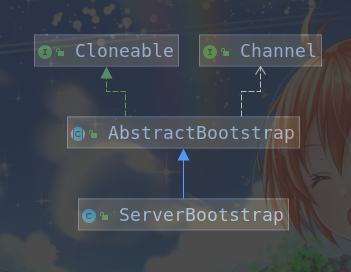

# 2-1. ServerBootStrap

示例代码如下：

```java
private void start() throws Exception {
        initServerConfig();
        if (this.configFileName != null) {
            resetServerSaveParams();
            loadServerConfig(this.configFileName);
        }
        initServer();
        RedisServerEventLoopHolder holder = RedisServerEventLoopHolder.getInstance();
        NioEventLoopGroup group = new NioEventLoopGroup(1);
        holder.setEventLoopGroup(group);
        try {
            ScheduledFuture<?> scheduledFuture = group.scheduleAtFixedRate(
                    () -> {
                        cronLoops++;
                        RedisDb[] db = RedisServerDbHolder.getInstance().getDb();
                        RedisServerStateHolder.getInstance().updateUnixTime();
                        for (int i = 0; i < db.length; i++) {
                            int size = db[i].getDict().getSize();
                            int used = db[i].getDict().getUsed();
                            int vkeys = db[i].getExpires().getUsed();

                            if (cronLoops % 5 == 0 && (used > 0 || vkeys > 0)) {
                                try {
                                    RedisLog.getInstance().log(RedisLog.LOG_LEVEL_VERBOSE, "DB %d: %d keys (%d volatile) in %d slots HT.", i, used, vkeys, size);
                                } catch (IOException e) {
                                    e.printStackTrace();
                                }
                            }
                        }
                        for (int i = 0;i < db.length;i ++) {
                            int expired = 0;
                            Dict<RedisObject,RedisObject> expires = db[i].getExpires();
                            do {
                                int num = expires.getUsed();
                                long time = RedisServerStateHolder.getInstance().getUnixTime();

                                if (num > REDIS_EXPIRELOOKUPS_PER_CRON) {
                                    num = REDIS_EXPIRELOOKUPS_PER_CRON;
                                }
                                while (num -- > 0) {
                                    DictEntry<RedisObject,RedisObject> entry = expires.dictGetRandomKey();
                                    if (entry == null){
                                        break;
                                    } else {
                                        long expireTime = (long)(entry.getValue().getPtr());
                                        if (expireTime < time) {
                                            DictEntry<RedisObject,RedisObject> dataEntry = null;
                                            dataEntry = db[i].getDict().delete(entry.getKey());
                                            dataEntry.getKey().destructor();
                                            dataEntry.getValue().destructor();
                                            dataEntry = expires.delete(entry.getKey());
                                            dataEntry.getKey().destructor();
                                            dataEntry.getValue().destructor();
                                            expired ++;
                                        }
                                    }
                                }
                            } while (expired > REDIS_EXPIRELOOKUPS_PER_CRON / 4);

                        }

                    }, 0, 1, TimeUnit.SECONDS);
            holder.setScheduledFuture(scheduledFuture);
            this.b = new ServerBootstrap();
            b.group(group)
                    .channel(NioServerSocketChannel.class)
                    .localAddress(new InetSocketAddress(this.port))
                    .childHandler(new ChannelInitializer<SocketChannel>() { //7
                        @Override
                        public void initChann如下el(SocketChannel ch) {
                            ch.pipeline()
                                    .addLast(new RedisObjectDecoder(), new RedisObjectEncoder(), new RedisServerHandler(RedisServer.this));
                        }
                    });
            holder.setBootstrap(b);
            ChannelFuture f = b.bind().sync();
            holder.setChannelFuture(f);
            RedisLog.getInstance().log(RedisLog.LOG_LEVEL_VERBOSE,RedisServer.class.getName() + " started and listen on " + f.channel().localAddress());
            f.channel().closeFuture().sync();
        } finally {
            group.shutdownGracefully().sync();
        }
    }

```

主要讨论如下代码：

```java
            this.b = new ServerBootstrap();
            b.group(group)
                    .channel(NioServerSocketChannel.class)
                    .localAddress(new InetSocketAddress(this.port))
                    .childHandler(new ChannelInitializer<SocketChannel>() { //7
                        @Override
                        public void initChannel(SocketChannel ch) {
                            ch.pipeline()
                                    .addLast(new RedisObjectDecoder(), new RedisObjectEncoder(), new RedisServerHandler(RedisServer.this));
                        }
                    });
            ChannelFuture f = b.bind().sync();
            f.channel().closeFuture().sync();
```

NioEventLoogGroup 类图如下：



## 1. 主要流程

首先通过构造器创建`ServerBootstrap`。

```java
this.b = new ServerBootstrap();
```

考察`ServerBootStrap`构造器代码：

```java
public ServerBootstrap() { }
```

发现构造器代码为空，只是一个最简单的无参构造器。

然后通过如下代码进行配置：

```java
            b.group(group)
                    .channel(NioServerSocketChannel.class)
                    .localAddress(new InetSocketAddress(this.port))
                    .childHandler(new ChannelInitializer<SocketChannel>() { //7
                        @Override
                        public void initChannel(SocketChannel ch) {
                            ch.pipeline()
                                    .addLast(new RedisObjectDecoder(), new RedisObjectEncoder(), new RedisServerHandler(RedisServer.this));
                        }
                    });
```
首先使用group()方法进行配置：

```java
    /**
     * Specify the {@link EventLoopGroup} which is used for the parent (acceptor) and the child (client).
     */
    @Override
    public ServerBootstrap group(EventLoopGroup group) {
        return group(group, group);
    }
```
根据注释，`group()`方法指定了作为`acceptor`和`client`的`EventLoopGroup`。该方法调用了`group(EventLoopGroup parentGroup, EventLoopGroup childGroup)`方法：

```java
    /**
     * Set the {@link EventLoopGroup} for the parent (acceptor) and the child (client). These
     * {@link EventLoopGroup}'s are used to handle all the events and IO for {@link ServerChannel} and
     * {@link Channel}'s.
     */
    public ServerBootstrap group(EventLoopGroup parentGroup, EventLoopGroup childGroup) {
        super.group(parentGroup);
        if (childGroup == null) {
            throw new NullPointerException("childGroup");
        }
        if (this.childGroup != null) {
            throw new IllegalStateException("childGroup set already");
        }
        this.childGroup = childGroup;
        return this;
    }
```

注释描述，该方法将为`acceptor`和`client`设置`EventLoopGroup`，这些EventLoopGroup会`被用来处理所有的ServerChannel和Channel的IO事件`。

考察该方法逻辑：

1. 调用父类方法进行配置，`super.group(parentGroup);`该方法代码如下：

    ```java
    /**
     * The {@link EventLoopGroup} which is used to handle all the events for the to-be-creates的
     * {@link Channel}
     */
    @SuppressWarnings("unchecked")
    public B group(EventLoopGroup group) {
        if (group == null) {
            throw new NullPointerException("group");
        }
        if (this.group != null) {
            throw new IllegalStateException("group set already");
        }
        this.group = group;
        return (B) this;
    }
    ```
    配置用来处理所有将被创建的Channel的EventLoopGroup。即所谓的Boss Group。

2. 配置`childrenGroup`作为Worker Group。

紧接着使用`.channel(NioServerSocketChannel.class)`该函数进行配置。

```java
    /**
     * The {@link Class} which is used to create {@link Channel} instances from.
     * You either use this or {@link #channelFactory(io.netty.channel.ChannelFactory)} if your
     * {@link Channel} implementation has no no-args constructor.
     */
    public B channel(Class<? extends C> channelClass) {
        if (channelClass == null) {
            throw new NullPointerException("channelClass");
        }
        return channelFactory(new ReflectiveChannelFactory<C>(channelClass));
    }
```
该方法传入一个Class对象，该对象用于创建Channel实例。如果你的Channel实现没有无参构造器，那么你可以使用`{@link #channelFactory(io.netty.channel.ChannelFactory)}`。

考察channelFactory()函数：

```java
    /**
     * {@link io.netty.channel.ChannelFactory} which is used to create {@link Channel} instances from
     * when calling {@link #bind()}. This method is usually only used if {@link #channel(Class)}
     * is not working for you because of some more complex needs. If your {@link Channel} implementation
     * has a no-args constructor, its highly recommend to just use {@link #channel(Class)} for
     * simplify your code.
     */
    @SuppressWarnings({ "unchecked", "deprecation" })
    public B channelFactory(io.netty.channel.ChannelFactory<? extends C> channelFactory) {
        return channelFactory((ChannelFactory<C>) channelFactory);
    }

```
根据注释可以看到当调用bind()方法时，使用传入的ChannelFactory创建Channel。如果你的Channel实现没有无参构造器，那么该方法可以用作替代，否则不建议直接使用该方法。

然后继续往深层考察：

```java
    /**
     * @deprecated Use {@link #channelFactory(io.netty.channel.ChannelFactory)} instead.
     */
    @Deprecated
    @SuppressWarnings("unchecked")
    public B channelFactory(ChannelFactory<? extends C> channelFactory) {
        if (channelFactory == null) {
            throw new NullPointerException("channelFactory");
        }
        if (this.channelFactory != null) {
            throw new IllegalStateException("channelFactory set already");
        }

        this.channelFactory = channelFactory;
        return (B) this;
    }
```
改方法负责初始化channelFactory属性。

然后是调用`.localAddress(new InetSocketAddress(this.port))`进行配置，`localAddress`函数代码如下：
```java
    /**
     * The {@link SocketAddress} which is used to bind the local "end" to.
     */
    @SuppressWarnings("unchecked")
    public B localAddress(SocketAddress localAddress) {
        this.localAddress = localAddress;
        return (B) this;
    }
```
最后对ChannelHandler进行配置，调用`childHandler`方法，代码如下：

```java
    /**
     * Set the {@link ChannelHandler} which is used to serve the request for the {@link Channel}'s.
     */
    public ServerBootstrap childHandler(ChannelHandler childHandler) {
        if (childHandler == null) {
            throw new NullPointerException("childHandler");
        }
        this.childHandler = childHandler;
        return this;
    }
```

上述4个方法仅仅是对ServerBootStrap的基本配置进行处理。下一部分介绍具体的绑定逻辑。