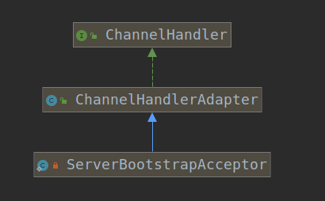

# 4.ServerBootstrapAcceptor

根据`ServerBootStrap的绑定逻辑`，可以看到Boss Group被添加了一个ChannelHandlerAdapter即`ServerBootstrapAcceptor`,代码如下，该方法在绑定逻辑的最后，具体在ServerBootstrap类的第181行左右：

```java
        p.addLast(new ChannelInitializer<Channel>() {
            @Override
            public void initChannel(Channel ch) throws Exception {
                ch.pipeline().addLast(new ServerBootstrapAcceptor(
                        currentChildGroup, currentChildHandler, currentChildOptions, currentChildAttrs));
            }
        });
```
考察该ChannelHandlerAdapter。

ServerBootstrapAcceptor的类继承结构如下：


可以看到该类只是一个简单的`ChannelHandler`。ChannelHandlerAdapter仅为开发者提供了一个具有ChannelHandler默认实现的适配器。考察ServerBootstrapAcceptor源码：

首先考察该类的属性：

```java
    private final EventLoopGroup childGroup;
    private final ChannelHandler childHandler;
    private final Entry<ChannelOption<?>, Object>[] childOptions;
    private final Entry<AttributeKey<?>, Object>[] childAttrs;
```

该类分别有四个属性，接下来分别解析他们：

1. childGroup: `该类中保存了Worker Group中注册的EventLoop`。由于Reactor模式中，Acceptor仅仅做的是接收请求，并将请求的处理操作转交给Worker Group，所以该属性仅仅用于存储worker group。根据之前分析的ServerBootstrap的绑定逻辑可知，绑定时传入的参数为`currentChildGroup`,而该参数即是`ServerBootstrap调用的group()方法配置的EventLoopGroup对象`。
2. childHandler： `该类保存了Worker Group中配置的EventLoopPipeline中注册的各个ChannelHandler`。
3. childOptions: `该类保存了Worker Group中配置的Channel的Option`。
4. childAttrs: `该类保存了Worker Group中配置的Channel的Attrs`。

考察该ChannelHandler的核心方法：`channelRead`

```java
        public void channelRead(ChannelHandlerContext ctx, Object msg) {
            final Channel child = (Channel) msg;

            child.pipeline().addLast(childHandler);

            for (Entry<ChannelOption<?>, Object> e: childOptions) {
                try {
                    if (!child.config().setOption((ChannelOption<Object>) e.getKey(), e.getValue())) {
                        logger.warn("Unknown channel option: " + e);
                    }
                } catch (Throwable t) {
                    logger.warn("Failed to set a channel option: " + child, t);
                }
            }

            for (Entry<AttributeKey<?>, Object> e: childAttrs) {
                child.attr((AttributeKey<Object>) e.getKey()).set(e.getValue());
            }

            try {
                childGroup.register(child).addListener(new ChannelFutureListener() {
                    @Override
                    public void operationComplete(ChannelFuture future) throws Exception {
                        if (!future.isSuccess()) {
                            forceClose(child, future.cause());
                        }
                    }
                });
            } catch (Throwable t) {
                forceClose(child, t);
            }
        }
```

方法逻辑很简单，当用户请求到达服务器后，服务器读取到数据，执行如下操作：

1. 获取ServerSocketChannel。
2. 将为worker group配置的childHandler配置
3. 为Channel配置childOptions。
4. 为Channel配置attr；
5. 将配置好的Channel注册到EventLoopGroup中。
6. 如果注册失败，则强制关闭Channel。