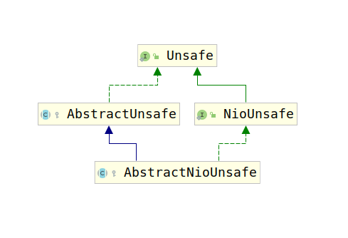

# 5-3 AbstractNioChannel

`AbstractNioChannel`是`AbstractChannel`的子类，该类在`AbstractChannel`的基础上添加了`Java nio`的支持。通过`Java nio`实现`Netty 的 Channel`。

不过需要注意，这里没有提供读写数据的支持，这两个功能的支持在子类中提供。

由于Java nio中，只有`SelectableChannel`才可以注册到`Selector`中，因此，`AbstractNioChannel`包含了如下属性：

```java
    // SelectableChannel
    private final SelectableChannel ch;
    // 感兴趣的事件
    protected final int readInterestOp;
    // 监听到的事件
    volatile SelectionKey selectionKey;
```

可以看到这些属性都与`SelectableChannel`有关。除此之外，`AbstractNioChannel`还提供了几个状态变量，用于表示当前`Channel`的状态：

```java
    private volatile boolean inputShutdown;
    private volatile boolean readPending;
```

最后，由于Netty使用的是基于事件监听的，因此，操作很多都是异步的，为了方便返回结果，提供了如下几个返回结果：

```java
private ChannelPromise connectPromise;
private ScheduledFuture<?> connectTimeoutFuture;
private SocketAddress requestedRemoteAddress;
```

事实上`AbstractNioChannel`仅仅做了适配`Java nio 的SelectableChannel`的工作，该类只有一个构造器：

```java
    protected AbstractNioChannel(Channel parent, SelectableChannel ch, int readInterestOp) {
        super(parent);
        this.ch = ch;
        this.readInterestOp = readInterestOp;
        try {
            ch.configureBlocking(false);
        } catch (IOException e) {
            try {
                ch.close();
            } catch (IOException e2) {
                if (logger.isWarnEnabled()) {
                    logger.warn(
                            "Failed to close a partially initialized socket.", e2);
                }
            }

            throw new ChannelException("Failed to enter non-blocking mode.", e);
        }
    }
```

可以看到构造器仅仅将`java nio`相关的对象进行组合罢了，需要注意，这里有一个比较重要的属性`readInterestOp`。该类中相对重要的有如下三部分：

1. `AbstractChannel`中要求实现的`doXXX()`方法
2. `AbstractNioUnsafe`类
3. 由于数据要读写到内存中才能被应用处理，`AbstractNioChannel`提供了几个用于分配Buffer的方法。

这里我们选择优先介绍`AbstractNioUnsafe`，因为事实上`AbstractNioUnsafe`也要求`AbstractNioChannel`的子类实现几个`doXXX()`方法，为了方便，我们最后介绍`AbstractChannel`中的这些`doXXX()`方法。

## AbstractNioUnsafe

`AbstractNioUnsafe`是`AbstractNioChannel`使用的`Unsafe`类，他提供了除读写数据以外的Channel的所有操作（因为很大一部分操作是继承自`AbstractUnsafe`的），该类的类继承结构图如下：



`AbstractNioUnsafe`继承了`AbstractUnsafe`,`AbstractUnsafe`提供了网络IO绝大多数操作的模板方法，除了负责客户端连接服务端的`connect`方法。除此之外，为了扩展`java nio`的功能，`AbstractNioUnsafe`实现了`NioUnsafe`接口。该接口如下：

```java
    public interface NioUnsafe extends Unsafe {
        /**
         * Return underlying {@link SelectableChannel}
         */
        SelectableChannel ch();

        /**
         * Finish connect
         */
        void finishConnect();

        /**
         * Read from underlying {@link SelectableChannel}
         */
        void read();

        void forceFlush();
    }
```

`AbstractNioUnsafe`实现的方法分为如下2种：

1. `connect`相关操作的模板方法，这里解释一下`AbstractChannel`不提供`connect`该方法默认实现的原因。对于`java nio`或者其他方式来说，`connect`的过程可能和使用其他方式进行`connect`的流程完全不同，对于`java nio`来说，`connect`还需要一个`finishConnect`的过程，其他的方法基本都不用，因此，该方法不在`AbstractUnsafe`中提供默认实现。
2. `AbstractUnsafe`中被覆盖的方法。

接下来我们会对这3类方法进行分析：

### 1. connect相关方法

刚才我们已经知道，使用原生java nio进行Socket套接字开发，会与别的方式有很大的差异。因为Java的Nio通信有两个负责`connect`的方法，分别是`connect()`和`finishConnect()`，这两个方法用法如下：

1. `connect()`：使底层socketChannel建立连接。当SocketChannel处于非阻塞模式的时候，如果立即连接成功，则返回true，否则返回false。程序过会儿需要调用`finishConnect()`完成连接。如果处于阻塞模式，如果立即连接成功返回true，否则进入阻塞状态，直到连接成功，或者出现IO异常。
2. `finishConnect()`：试图完成socketChannel连接操作。非阻塞模式的情况下，如果`finishConnect()`顺利建立连接，或者连接已经建立，那么该方法返回true，否则返回false。在阻塞模式下，如果连接未完成，会进入阻塞状态，知道连接完成或者出现IO异常。

我们首先查看一下`AbstractNioUnsafe`的`connect(...)`方法，该方法同样是一个模板方法：

```java
        public final void connect(
                final SocketAddress remoteAddress, final SocketAddress localAddress, final ChannelPromise promise) {
            ...
            try {
                ...
                boolean wasActive = isActive();
                // 尝试连接远程服务器
                // 连接成功填充返回结果
                // 连接失败则将连接服务器创建成一个任务放入EventLoop中，进行调度，超时时间在config中配置
                if (doConnect(remoteAddress, localAddress)) {
                    fulfillConnectPromise(promise, wasActive);
                } else {
                    connectPromise = promise;
                    requestedRemoteAddress = remoteAddress;

                    // Schedule connect timeout.
                    int connectTimeoutMillis = config().getConnectTimeoutMillis();
                    if (connectTimeoutMillis > 0) {
                        connectTimeoutFuture = eventLoop().schedule(new OneTimeTask() {
                            @Override
                            public void run() {
                                ChannelPromise connectPromise = AbstractNioChannel.this.connectPromise;
                                ConnectTimeoutException cause =
                                        new ConnectTimeoutException("connection timed out: " + remoteAddress);
                                if (connectPromise != null && connectPromise.tryFailure(cause)) {
                                    close(voidPromise());
                                }
                            }
                        }, connectTimeoutMillis, TimeUnit.MILLISECONDS);
                    }

                    promise.addListener(new ChannelFutureListener() {
                        @Override
                        public void operationComplete(ChannelFuture future) throws Exception {
                            if (future.isCancelled()) {
                                if (connectTimeoutFuture != null) {
                                    connectTimeoutFuture.cancel(false);
                                }
                                connectPromise = null;
                                close(voidPromise());
                            }
                        }
                    });
                }
            } catch (Throwable t) {
                promise.tryFailure(annotateConnectException(t, remoteAddress));
                closeIfClosed();
            }
        }
```

事实上，真正的连接逻辑仍然是交给`AbstractNioChannel`的子类进行实现的，查看`AbstractNioChannel.doConnect(SocketAddress remoteAddress, SocketAddress localAddress)`方法：

```java
protected abstract boolean doConnect(SocketAddress remoteAddress, SocketAddress localAddress) throws Exception;
```

这里还需要提到一点，因为在之前的`AbstractChannel`中，模板方法大部分都调用了`pipeline`的对应操作，事实上，这里也有类似的调用，这些调用在`fulfillConnectPromise(ChannelPromise promise, boolean wasActive)`方法中：

```java
        private void fulfillConnectPromise(ChannelPromise promise, boolean wasActive) {
            if (promise == null) {
                return;
            }
            boolean promiseSet = promise.trySuccess();
            if (!wasActive && isActive()) {
                pipeline().fireChannelActive();
            }
            if (!promiseSet) {
                close(voidPromise());
            }
        }
```

在介绍完`connect()`方法后，让我们讨论一下`finishConnect()`方法，该方法相比于`connect()`来说就简单的多，因为`connect()`方法要持续对`连接是否建立`这个状态进行监听，但是`finishConnect()`则不用，所以你在`connect()`方法中看到了定时任务，而`finishConnect()`中并没有：

```java
        public final void finishConnect() {
            assert eventLoop().inEventLoop();
            try {
                boolean wasActive = isActive();
                doFinishConnect();
                fulfillConnectPromise(connectPromise, wasActive);
            } catch (Throwable t) {
                fulfillConnectPromise(connectPromise, annotateConnectException(t, requestedRemoteAddress));
            } finally {
                if (connectTimeoutFuture != null) {
                    connectTimeoutFuture.cancel(false);
                }
                connectPromise = null;
            }
        }
```

同样，该方法也是一个模板方法，真正的处理逻辑在`AbstractNioChannel.doFinishConnect()`中：

```java
protected abstract void doFinishConnect() throws Exception;
```

### 2. XXX0方法

`AbstractNioChannel`中覆盖了`AbstractChannel`的两个方法：

1. flush0()
2. forceFlush()

由于Nio是基于事件监听的编程，因此只有在监听某些事件的情况下，才能做特定操作，刷新数据到网络中就要求监听写事件，为了判断这一条件，`AbstractNioChannel`提供了如下方法：

```java
        private boolean isFlushPending() {
            SelectionKey selectionKey = selectionKey();
            return selectionKey.isValid() && (selectionKey.interestOps() & SelectionKey.OP_WRITE) != 0;
        }
```

刷新相关的方法添加了简单的判断：

```java
        protected final void flush0() {
            if (isFlushPending()) {
                return;
            }
            super.flush0();
        }

        @Override
        public final void forceFlush() {
            super.flush0();
        }
```

## 2. AbstractNioChannel提供的方法

了解了`AbstractNioUnsafe`之后，我们可以知道`AbstractNioChannel`不仅仅要完成`AbstractChannel`中要求实现的`doXXX()`，而且要求实现更多的`doXXX()`，那么让我们首先看一下这些`doXXX()`方法。

首先介绍`AbstractChannel`要求实现的4个方法：

1. doRegister()：

    ```java
    protected void doRegister() throws Exception {
        boolean selected = false;
        for (;;) {
            try {
                selectionKey = javaChannel().register(((NioEventLoop) eventLoop().unwrap()).selector, 0, this);
                return;
            } catch (CancelledKeyException e) {
                if (!selected) {
                    ((NioEventLoop) eventLoop().unwrap()).selectNow();
                    selected = true;
                } else {
                    throw e;
                }
            }
        }
    }
    ```

    该方法负责将channel注册到多路复用API中，这里有必要介绍一下`Java Selectable`中`register(...)`方法的几个参数：

    ```java
    public abstract SelectionKey register(Selector sel, int ops, Object att)
        throws ClosedChannelException;
    ```

    1. Selector sel：选择器，对应的是多路复用API中的多路复用的fd
    2. int ops：注册到多路复用API的Channel感兴趣的事件（`SelectionKey`中声明）
       1. public static final int OP_READ = 1 << 0;
       2. public static final int OP_WRITE = 1 << 2;
       3. public static final int OP_CONNECT = 1 << 3;
       4. public static final int OP_ACCEPT = 1 << 4;
    3. Object att:附加的对象，该对象会在Channel感兴趣的事件发生时一同返回回来，方便开发者使用。

    该方法返回值是`SelectionKey`类型的对象，表示一个Channel已经被注册到`Selector`中，但实际上无论事件监听还是别的操作，都离不开这个`SelectionKey`，但是如果`SelectionKey`被取消了，那么就无法提供多路复用正常的功能了，因此，这里对这种情况做了检测。

    如果该`SelectionKey`被取消了，那么进行一次`select`操作，刷新一下监听fd的记录池，然后再次进行注册，如果仍然注册错误，那么可能是JDK的bug，此时就抛出异常。

    这里有一个问题需要注意，对于Channel进行注册时，可以看到，`ops`这个参数传入的是`0`，这意味着不感兴趣任何事件。那么这里我们就要谈到`EventLoop`说到的`JDK NIO关于EPoll的bug`了。

    在linux 2.6中，多路复用API在监听了某个socket的fd后，如果这个socket连接突然中断了，那么多路复用API会返回`POLLUP`或者`POLLERR`事件。如果JDK的Selector使用者向Selector中注册了一个Channel，这个Channel感兴趣的事件是0（即不属于上面4个事件的任意一个），那么由于操作系统的`eventset`发生变化，因此`select`方法会被唤醒，但是，监听到的事件Channel又不关心，因此，就会导致表示`select`方法的返回值为0。

    我觉得很多人会不理解这件事，为什么有人向Selector中注册一个Channel，这个Channel感兴趣的事件会是0，到这里就有了答案。因为框架代码需要复用，所以很多设计虽然看起来会比较不寻常，但是都是为了复用。也正因为如此，netty才会出现Java NIO的多路复用Bug。

    事实上，对于SelectionKey来说，`0`是一个特殊值，被注册到`Selector`中的Channel，如果感兴趣的ops是`0`，那么`Selector`永远不会监听到该`Channel`的事件。那么`netty`是怎样监控事件的呢？这点我们继续往后看。

2. doDeregister()：
   `doRegister()`负责把Channel注册到`Selector`中，`doDeregister()`负责把`Channel`从`Selector`中注销。代码如下：

   ```java
    protected void doDeregister() throws Exception {
        ((NioEventLoop) eventLoop().unwrap()).cancel(selectionKey());
    }
   ```

   其实就是调用了`SelectionKey.cancel()`方法。
3. doBeginRead()方法：

    根据方法名我们知道，该方法是在读取数据之前进行调用的，但是我们却没有看到`beginWrite()`方法，这是为什么呢？这个问题，我们之后再处理。这里我们首先看一下该方法源码：

    ```java
    protected void doBeginRead() throws Exception {
        // Channel.read() or ChannelHandlerContext.read() was called
        if (inputShutdown) {
            return;
        }

        final SelectionKey selectionKey = this.selectionKey;
        if (!selectionKey.isValid()) {
            return;
        }

        readPending = true;

        final int interestOps = selectionKey.interestOps();
        if ((interestOps & readInterestOp) == 0) {
            selectionKey.interestOps(interestOps | readInterestOp);
        }
    }
    ```

    我们刚才已经看到，注册Channel到Selector时，我们将Channel感兴趣的事件设置为0，那么这样`Selector`事实上根本无法监听`Channel`，那么此时我们想要读取了，因此，需要先将`OP_READ`这个事件注册到`Selector`中，这里就是做的上面描述的事情。这里算是将`注册感兴趣的事件为0，如何读取到数据？`这个问题回答了一半，肯定是有个地方调用了这个`beginRead()`方法，那么哪里调用的呢？我们后面进行分析，而且这里又有一个问题，既然是`beginRead`，为什么如下代码写的是`readInterestOp`呢：

    ```java
    if ((interestOps & readInterestOp) == 0) {
        selectionKey.interestOps(interestOps | readInterestOp);
    }
    ```

    不应该是`OP_READ`么？接下来我们会一一处理这些问题。

除了上面两个已经实现的`doXXX()`方法以外，`AbstracNioChannel`还要求子类实现如下两个方法：

1. protected abstract boolean doConnect(SocketAddress remoteAddress, SocketAddress localAddress) throws Exception;
2. protected abstract void doFinishConnect() throws Exception;

具体在哪里使用，上面已经介绍过了。

最后让我们分析`AbstractNioChannel`提供的最后一部分支持，即`newDirectBuffer(XXX)`支持（分配`DirectBuffer`）。这里我们直接分析`newDirectBuffer(ByteBuf buf)`源码：

```java
    protected final ByteBuf newDirectBuffer(ByteBuf buf) {
        final int readableBytes = buf.readableBytes();
        if (readableBytes == 0) {
            ReferenceCountUtil.safeRelease(buf);
            return Unpooled.EMPTY_BUFFER;
        }

        final ByteBufAllocator alloc = alloc();
        if (alloc.isDirectBufferPooled()) {
            ByteBuf directBuf = alloc.directBuffer(readableBytes);
            directBuf.writeBytes(buf, buf.readerIndex(), readableBytes);
            ReferenceCountUtil.safeRelease(buf);
            return directBuf;
        }

        final ByteBuf directBuf = ByteBufUtil.threadLocalDirectBuffer();
        if (directBuf != null) {
            directBuf.writeBytes(buf, buf.readerIndex(), readableBytes);
            ReferenceCountUtil.safeRelease(buf);
            return directBuf;
        }

        // Allocating and deallocating an unpooled direct buffer is very expensive; give up.
        return buf;
    }
```

可以看到，划分`DirectBuffer`的流程如下：

1. 如果传入的ByteBuf中没有数据，直接返回EMPTY_BUFFER
2. 如果Channel中配置的ByteBufAllocator是池化的`DirectBuffer`池，那么通过该ByteBufAllocator分配。
3. 如果ThreadLocal中有DirectBuffer，那么使用该DirectBuffer
4. 最后如果上述三种方法都无法分配DirectBuffer，那么放弃分配，因为分配和处理非池化的DirectBuffer消耗太大了。

注意，在`newDirectBuffer(XXX)`这个方法中，使用了一个叫做`ReferenceCountUtil`的工具，顾名思义，这是一个处理引用计数的工具，我们将在讲解`ByteBuf`时对其进行讲解。

## 总结

至此我们了解了`AbstractNioChannel`的主要逻辑。该类负责使用Java Nio相关的功能实现`AbstractChannel`提供的功能，实现方式是实现`AbstractChannel`模板方法中要求的方法。值得一提的是，注意该类没有提供所有`读写`操作相关的方法。只提供了如下几个方法的具体实现：

1. register
2. deRegister
3. connect
4. beginRead
5. flush

而且register注册一个Channel到Selector时，Channel感兴趣的事件是0。因此我们提出了如下几个问题：

1. 注册感兴趣的事件是0，那么是再哪儿注册真正的业务事件的（OP_ACCEPT之类的）?
2. 我们发现在beginRead()方法中注册了`OP_READ`事件到Selector中，那么是谁调用的该方法。?
3. 既然有beginRead，为什么没有beginWrite?
4. 为什么读写操作要到子类中提供？
5. 为什么beginRead中注册的事件是`readInterestOp`，而不是具体的`OP_READ`？
