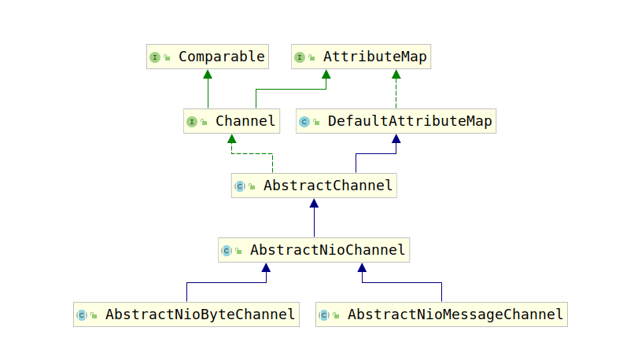

# AbstractNioByteChannel和AbstractNioMessageChannel

`AbstractNioByteChannel`和`AbstractNioMessageChannel`都是`AbstractNioChannel`的子类，两者类图如下：



由于`AbstractNioChannel`并没有提供网络读写的相关方法，`AbstractNioByteChannel`和`AbstractNioMessageChannel`负责网络读写功能的具体实现。

接下来我们将对比分析这两者的异同点。

顾名思义，`AbstractNioByteChannel`负责对`Byte`字节集合进行读写，而`AbstractNioMessageChannel`负责对`Message`集合进行读写。

## 1. 构造器

首先让我们对比一下这两个类的构造器：

1. AbstractNioByteChannel

    ```java
        protected AbstractNioByteChannel(Channel parent, SelectableChannel ch) {
            super(parent, ch, SelectionKey.OP_READ);
        }
    ```

2. AbstractNioMessageChannel

    ```java
        protected AbstractNioMessageChannel(Channel parent, SelectableChannel ch, int readInterestOp) {
            super(parent, ch, readInterestOp);
        }
    ```

上一节我们在讨论`AbstractNioChannel`时，使用到了`readInterestOp`用于在调用`beginRead()`时将`readInterestOp`事件，注册到Channel中，然后进行监听。`AbstractNioByteChannel`的子类默认只能监听`OP_READ`事件，而`AbstractNioMessageChannel`则可以监听`readInterestOp`指定的事件。

## 2. Unsafe类

对于Netty中的Channel来说，每个Channel都提供了自己的Unsafe类用于提供对应的仅供自身调用的不安全方法。`AbstractNioMessageChannel`中提供的是`NioMessageUnsafe`，而`AbstractNioByteChannel`提供的是`NioByteChannel`。这两个类都继承自`AbstractNioUnsafe`。

这两个类都仅仅完成了一个方法（`read()`）的实现，负责实现各自的读取逻辑。这里首先分析`AbstractNioByteChannel`：

```java
        public final void read() {
            final ChannelConfig config = config();
            // 如果不是AutoRead，直接移除OP_READ标志
            if (!config.isAutoRead() && !isReadPending()) {
                removeReadOp();
                return;
            }

            final ChannelPipeline pipeline = pipeline();
            final ByteBufAllocator allocator = config.getAllocator();
            // 最多读取次数
            final int maxMessagesPerRead = config.getMaxMessagesPerRead();
            RecvByteBufAllocator.Handle allocHandle = recvBufAllocHandle();

            ByteBuf byteBuf = null;
            int messages = 0;
            // Channel是否关闭
            boolean close = false;
            try {
                int totalReadAmount = 0;
                boolean readPendingReset = false;
                do {
                    // 通过allocator分配ByteBuf
                    byteBuf = allocHandle.allocate(allocator);
                    // 获取ByteBuf可写的最大字节数，NioServerSocketChannel是1024
                    int writable = byteBuf.writableBytes();
                    // 将Channel中的数据读取到ByteBuf中
                    int localReadAmount = doReadBytes(byteBuf);
                    // 如果读取到的数据<=0，这意味这读取完数据了
                    // 就可以退出读取的循环了
                    if (localReadAmount <= 0) {
                        // 释放ByteBuf
                        byteBuf.release();
                        byteBuf = null;
                        // 如果localReadAmount<0意味着Channel关闭了
                        close = localReadAmount < 0;
                        break;
                    }

                    if (!readPendingReset) {
                        readPendingReset = true;
                        setReadPending(false);
                    }
                    // 将读取到的数据交给Pipeline处理
                    pipeline.fireChannelRead(byteBuf);
                    // 释放byteBuf
                    byteBuf = null;
                    // 如果当前读取数> MAX_VALUE-localReadAmount
                    // 不再继续读取
                    // 为防止下一次读取，总数据爆掉
                    if (totalReadAmount >= Integer.MAX_VALUE - localReadAmount) {
                        // Avoid overflow.
                        totalReadAmount = Integer.MAX_VALUE;
                        break;
                    }
                    // 统计当前共读取字节数
                    totalReadAmount += localReadAmount;

                    // 监控autoRead状态改变
                    if (!config.isAutoRead()) {
                        break;
                    }
                    // 如果缓冲区没有读满，这证明数据读完了，那么跳出读取循环。
                    if (localReadAmount < writable) {
                        break;
                    }
                    // 如果数据没读取完，并且没有终止读取
                    // 那么继续读
                    // 并将++ message
                } while (++ messages < maxMessagesPerRead);

                // 读取完毕。
                pipeline.fireChannelReadComplete();
                // 记录读取总数
                allocHandle.record(totalReadAmount);
                // 如果Channel关闭了
                // 那么关闭Channel的读取功能
                if (close) {
                    closeOnRead(pipeline);
                    close = false;
                }
            } catch (Throwable t) {
                handleReadException(pipeline, byteBuf, t, close);
            } finally {
                // Check if there is a readPending which was not processed yet.
                // This could be for two reasons:
                // * The user called Channel.read() or ChannelHandlerContext.read() in channelRead(...) method
                // * The user called Channel.read() or ChannelHandlerContext.read() in channelReadComplete(...) method
                //
                // See https://github.com/netty/netty/issues/2254
                if (!config.isAutoRead() && !isReadPending()) {
                    removeReadOp();
                }
            }
        }
```

这里我们解释了`AbstractNioByteChannel`进行数据读取的主要流程，对于`AbstractChannel`来说，每个`Channel`都有一个配置属性`config`，这部分主要涉及到了一个配置`AutoRead`。该属性主要功能如下：

1. 在让 channel 在触发某些事件以后(例如 channelActive, channelReadComplete)以后还会自动调用一次 read()（具体在讲述ChannelPipeline时会讲到）
2. 在触发某些事件(例如 socket 关闭)时, 在 NioEventloop 的 OP_READ 位为 1 时,读取Channel中的数据，并且在读取完毕之后将Channel设置为`InputShutdown`。

现在让我们介绍一下Netty开发中务必要处理的一个问题，半包读写问题，当然，现在只解释半包读问题。

如果发送端发送的一个数据报，出现如下两种情况之一：

1. 数据报过大，大于接收端TCP接收缓冲区大小
2. 数据报过大，大于一个MSS（Maximum Segment Size，最大报文长度）

此时就会出现半包读，即粘包问题。因为服务端无法一次将所有数据完全读入，必须要读入两个传输层报文，将其拼接成一个应用层报文进行处理。`AbstractNioByteChannel`的`read`方法处理了这个问题，处理方式如下：

建立一个不断读取数据的循环，每次从缓冲区中读取一定字节（我们的例子中是1024个字节），并传输到业务代码中，然后循环该操作，直到读取不到数据或者到达配置设置的循环最大次数（`maxMessagesPerRead`，默认是16）为止，此时就停止读取，并认为是将一个应用层报文读取完毕了。

因此，如果报文过长就可能出现问题，此时就需要调节服务端配置。

了解了`AbstractNioByteChannel`的`read`方法，再去读取`AbstractNioMessageChannel`的`read`方法，相对就简单的多，处理逻辑极其相似：

```java
        // 半包读（粘包）数据存放处
        private final List<Object> readBuf = new ArrayList<Object>();

        @Override
        public void read() {
            assert eventLoop().inEventLoop();
            final ChannelConfig config = config();
            // autoRead的处理
            if (!config.isAutoRead() && !isReadPending()) {
                // ChannelConfig.setAutoRead(false) was called in the meantime
                removeReadOp();
                return;
            }
            // 最大读取次数
            final int maxMessagesPerRead = config.getMaxMessagesPerRead();
            final ChannelPipeline pipeline = pipeline();
            boolean closed = false;
            Throwable exception = null;
            try {
                try {
                    for (;;) {
                        // 读取数据
                        int localRead = doReadMessages(readBuf);
                        if (localRead == 0) {
                            break;
                        }
                        // 返回值小于0证明Channel关闭
                        if (localRead < 0) {
                            closed = true;
                            break;
                        }

                        // 实时检测Channel配置
                        if (!config.isAutoRead()) {
                            break;
                        }
                        // 检测是否超过了读取最大次数
                        if (readBuf.size() >= maxMessagesPerRead) {
                            break;
                        }
                    }
                } catch (Throwable t) {
                    exception = t;
                }
                setReadPending(false);
                int size = readBuf.size();
                // 将读取到的所有数据传给业务端，触发pipeline事件
                for (int i = 0; i < size; i ++) {
                    pipeline.fireChannelRead(readBuf.get(i));
                }
                // 清空buffer
                readBuf.clear();
                // 触发读取完成事件
                pipeline.fireChannelReadComplete();

                if (exception != null) {
                    if (exception instanceof IOException && !(exception instanceof PortUnreachableException)) {
                        // ServerChannel should not be closed even on IOException because it can often continue
                        // accepting incoming connections. (e.g. too many open files)
                        closed = !(AbstractNioMessageChannel.this instanceof ServerChannel);
                    }

                    pipeline.fireExceptionCaught(exception);
                }
                // 处理关闭Channel
                if (closed) {
                    if (isOpen()) {
                        close(voidPromise());
                    }
                }
            } finally {
                // Check if there is a readPending which was not processed yet.
                // This could be for two reasons:
                // * The user called Channel.read() or ChannelHandlerContext.read() in channelRead(...) method
                // * The user called Channel.read() or ChannelHandlerContext.read() in channelReadComplete(...) method
                //
                // See https://github.com/netty/netty/issues/2254
                if (!config.isAutoRead() && !isReadPending()) {
                    removeReadOp();
                }
            }
        }
    }
```

可以看到`AbstractNioMessageChannel`中的`read()`方法处理流程和`AbstractNioByteChannel`几乎完全相同，仅有如下不同点：

1. 读取数据处理流程不同：
   1. `AbstractNioByteChannel`每次读取到数据，就将数据交给业务端代码（即pipeline）。等到数据读取完毕后，再次通知业务端（`pipeline.fireChannelReadComplete();`）
   2. `AbstractNioMessageChannel`每次读取到数据，就将数据存储到`readBuf`（一个链表）中，直到数据读取完毕，数据读取完毕后，通过一个循环通知业务端代码：

        ```java
        for (int i = 0; i < size; i ++) {
            pipeline.fireChannelRead(readBuf.get(i));
        }
        ```

        等到循环完毕后，触发`pipeline.fireChannelReadComplete()`

2. 处理的数据不同：
   1. `AbstractNioByteChannel`处理的数据是字节数组
   2. `AbstractNioMessageChannel`处理的数据是Object

3. 需要子类实现的方法不同：
   1. `AbstractNioByteChannel`要求子类实现`doReadBytes(ByteBuf buf)`
   2. `AbstractNioMessageChannel`要求子类实现`doReadMessages(List<Object> buf)`

到这里，`Unsafe`类的`read()`方法介绍完了，介绍完`read`理所当然就要介绍`write`方法，但是在介绍`write`之前，需要首先介绍`ChannelOutboundBuffer`。

## ChannelOutboundBuffer

为什么要介绍`ChannelOutboundBuffer`呢？我们都知道，对于网络中的数据，如果需要用户代码处理，需要通过内存做中介，读取时首先从tcp接收缓冲区读取到内存中，然后再进行处理，上面介绍的read方法我们已经看到了这一点。写操作同理，需要先将数据写到内存缓冲区，再由内存缓冲区刷新到`tcp发送缓冲区`。这里的内存缓冲区就是我们要介绍的`ChannelOutboundBuffer`。

每个`Channel`都有自己的`ChannelOutboundBuffer`，介绍`Channel.Unsafe`接口时我们可以看到如下方法：

```java
ChannelOutboundBuffer outboundBuffer();
```

在介绍`ChannelOutboundBuffer`之前，我们先简单的介绍一下它的数据结构。在`ChannelOutboundBuffer`中，实际存储数据的是一个链表，如下：

```shell
     unflushedEntry
           |
 ---      ---      ---
|   | -> |   | -> |   |
 ---      ---      ---
  |                 |
flushedEntry      tailEntry
```

这条链表与普通链表不同，这条链表有三个指针：

1. flushedEntry: 被flush的Entry开始的位置
2. unflushedEntry: 没有被flush的Entry开始的位置
3. tailEntry: 链表尾部节点

flush过的节点保存在`[flushedEntry,unflushedEntry)`之间，等待被flush的节点保存在`[unflushedEntry，tailEntry]`之间。

每次添加新的待刷新节点时就向链表尾部添加一个节点，并更新tailEntry，如果unflushedEntry为null，就将unflushedEntry设置为新添加的节点。刷新节点时就获取当前unflushedEntry的位置，确认是否能flush，然后再检测下一个节点，不断循环该操作，直到没有节点flush为止。

最后考虑一个问题，已经被flush的节点在哪里从链表中删除呢？怎么删除的？实际上，`ChannelOutboundBuffer`具有一个`remove()`方法，该方法负责移除Entry，注意只会移除被flush的Entry。

接下来让我们考察`ChannelOutboundBuffer`源码，观察上面提到部分的具体实现：

`ChannelOutboundBuffer`完成上述功能属性如下：

```java
private Entry flushedEntry;
private Entry unflushedEntry;
private Entry tailEntry;
// flushed用于存储有多少个节点被flushed了，方便获取，否则每次都要循环处理
private int flushed;
```

添加新的需要flushed的节点使用`addMessage(Object msg, int size, ChannelPromise promise)`方法：

```java
    public void addMessage(Object msg, int size, ChannelPromise promise) {
        // 创建一个Entry（不一定是新创建的）
        Entry entry = Entry.newInstance(msg, size, total(msg), promise);
        if (tailEntry == null) {
            flushedEntry = null;
            tailEntry = entry;
        } else {
            Entry tail = tailEntry;
            tail.next = entry;
            tailEntry = entry;
        }
        if (unflushedEntry == null) {
            unflushedEntry = entry;
        }
        incrementPendingOutboundBytes(size, false);
    }
```

添加消息到链表中的过程很简单，但是这里有个问题需要注意，就是添加节点和递增`totalPendingSize`的顺序，这里首先将数据节点添加到链表中，然后更新要刷新的数据字节数，这里我们考察一下`incrementPendingOutboundBytes(long size)`方法：

```java
    void incrementPendingOutboundBytes(long size) {
        incrementPendingOutboundBytes(size, true);
    }

    private void incrementPendingOutboundBytes(long size, boolean invokeLater) {
        if (size == 0) {
            return;
        }

        long newWriteBufferSize = TOTAL_PENDING_SIZE_UPDATER.addAndGet(this, size);
        if (newWriteBufferSize >= channel.config().getWriteBufferHighWaterMark()) {
            setUnwritable(invokeLater);
        }
    }

    private void setUnwritable(boolean invokeLater) {
        for (;;) {
            final int oldValue = unwritable;
            final int newValue = oldValue | 1;
            if (UNWRITABLE_UPDATER.compareAndSet(this, oldValue, newValue)) {
                if (oldValue == 0 && newValue != 0) {
                    fireChannelWritabilityChanged(invokeLater);
                }
                break;
            }
        }
    }
```

由于我们不断向Buffer中写入数据，但是Buffer的大小是由一定限度的，因此Netty允许我们为Channel设置一个低水位线和一个高水位线。如果高于高水位线，那么就会触发`setUnwritable(XXX)`，此时注意会触发`pipeline`的`fireChannelWritabilityChanged()`方法，该方法可能会向`Channel`中写入数据，因此，必须先向`ChannelOutboundBuffer`中加入数据再修改`totalPendingSize`的值。一个空链表中写入数据之后状态如下：

```shell
unflushedEntry
  |
 ----      ----      ----
|data| -> |data| -> |data|
 ----      ----      ----
  |                   |
flushedEntry      tailEntry
```

数据放入到链表中，默认是未被flush的状态，如果要刷新数据需要现将其设置为flush状态，此时就需要调用`addFlush()`方法：

```java
    public void addFlush() {
        Entry entry = unflushedEntry;
        if (entry != null) {
            if (flushedEntry == null) {
                flushedEntry = entry;
            }
            do {
                flushed ++;
                if (!entry.promise.setUncancellable()) {
                    int pending = entry.cancel();
                    decrementPendingOutboundBytes(pending, false);
                }
                entry = entry.next;
            } while (entry != null);
            unflushedEntry = null;
        }
    }

    private void decrementPendingOutboundBytes(long size, boolean invokeLater) {
        if (size == 0) {
            return;
        }

        long newWriteBufferSize = TOTAL_PENDING_SIZE_UPDATER.addAndGet(this, -size);
        if (newWriteBufferSize == 0 || newWriteBufferSize <= channel.config().getWriteBufferLowWaterMark()) {
            setWritable(invokeLater);
        }
    }
```

addFlush()的过程就是将当前unflushed链表中的所有可刷新的数据都加入到flushed链表中，由于`totalPendingSize`属性表示的是当前等待刷新的数据，因此要更新该值。上面图中的链表如果被调用了`addFlush()`方法后状态如下：

```java
unflushedEntry = null

 ----      ----      ----
|data| -> |data| -> |data|
 ----      ----      ----
   |                   |
flushedEntry       tailEntry
```

当数据被真正flush到套接字中后，就可以释放该数据节点，释放操作是由`remove()`方法进行处理的。

```java
    public boolean remove() {
        // 获取当前flushedEntry
        Entry e = flushedEntry;
        if (e == null) {
            return false;
        }
        Object msg = e.msg;
        ChannelPromise promise = e.promise;
        int size = e.pendingSize;
        // 将节点从链表中移除
        removeEntry(e);
        // 如果节点数据被flush了，那么清除该数据
        // 没有被flush，也就是被cancel的数据会在被cancel时，将数据清除，这里不用担心
        if (!e.cancelled) {
            ReferenceCountUtil.safeRelease(msg);
            safeSuccess(promise);
            decrementPendingOutboundBytes(size, false);
        }
        // 回收Entry
        e.recycle();
        return true;
    }

    private void removeEntry(Entry e) {
        // 如果没有刷新出去的数据了，那么flushedEntry设置为null
        // 否则flushedEntry 设置为他的下一个节点
        if (-- flushed == 0) {
            // processed everything
            flushedEntry = null;
            if (e == tailEntry) {
                tailEntry = null;
                unflushedEntry = null;
            }
        } else {
            flushedEntry = e.next;
        }
    }
```

注意`remove()`方法每次只移除一个节点，而且移除的节点会被回收，`addMessage(...)`方法创建节点是通过如下方法创建的：

```java
Entry entry = Entry.newInstance(msg, size, total(msg), promise);
static Entry newInstance(Object msg, int size, long total, ChannelPromise promise) {
            Entry entry = RECYCLER.get();
            entry.msg = msg;
            entry.pendingSize = size;
            entry.total = total;
            entry.promise = promise;
            return entry;
}
```

可以看到是由`RECYCLER`创建的，而节点回收也是通过该对象：

```java
        void recycle() {
            next = null;
            bufs = null;
            buf = null;
            msg = null;
            promise = null;
            progress = 0;
            total = 0;
            pendingSize = 0;
            count = -1;
            cancelled = false;
            RECYCLER.recycle(this, handle);
        }
```

除了上面的功能外，`ChannelOutboundBuffer`还提供了一个特殊的快照功能，他会将当前所有的要刷新的数据映射称为一个`ByteBuffer数组`然后返回给调用端，方便调用端处理。

实现该功能涉及到如下几个属性：

```java
    // 用于存储快照数组的地方
    private static final FastThreadLocal<ByteBuffer[]> NIO_BUFFERS = new FastThreadLocal<ByteBuffer[]>() {
        @Override
        protected ByteBuffer[] initialValue() throws Exception {
            return new ByteBuffer[1024];
        }
    };
    // 快照数组中可用数据数量
    private int nioBufferCount;
    // 快照数组中可用数据字节大小
    private long nioBufferSize;
```

真正创建快照的方法是`nioBuffers()`方法：

```java
    public ByteBuffer[] nioBuffers() {
        long nioBufferSize = 0;
        int nioBufferCount = 0;
        final InternalThreadLocalMap threadLocalMap = InternalThreadLocalMap.get();
        // 获取ByteBuffer数组
        ByteBuffer[] nioBuffers = NIO_BUFFERS.get(threadLocalMap);
        // 获取当前flushedEntry，获取要被刷新的节点的节点头
        Entry entry = flushedEntry;
        // 如果节点要被刷新
        // 那么将ByteBuf中的数据放入到nioBuffers中
        while (isFlushedEntry(entry) && entry.msg instanceof ByteBuf) {
            // 如果数据节点没有被cancel，也就是需要flush，那么开始处理
            if (!entry.cancelled) {
                // 获取Entry中的数据（就是ByteBuf）
                ByteBuf buf = (ByteBuf) entry.msg;
                // 获取需要写入的数据字节数
                final int readerIndex = buf.readerIndex();
                final int readableBytes = buf.writerIndex() - readerIndex;

                if (readableBytes > 0) {
                    // 统计写入数据总字节数
                    nioBufferSize += readableBytes;
                    // 因为有一部分ByteBuf内保存有多个ByteBuffer，因此，这里需要统计一下ByteBuf内ByteBuffer的数量
                    // 然后对这些ByteBuffer进行处理
                    int count = entry.count;
                    if (count == -1) {
                        //noinspection ConstantValueVariableUse
                        entry.count = count =  buf.nioBufferCount();
                    }
                    // 计算处理该ByteBuf需要的空间，如果空间不够，则扩展nioBuffers数组大小
                    int neededSpace = nioBufferCount + count;
                    if (neededSpace > nioBuffers.length) {
                        nioBuffers = expandNioBufferArray(nioBuffers, neededSpace, nioBufferCount);
                        NIO_BUFFERS.set(threadLocalMap, nioBuffers);
                    }
                    // 如果ByteBuf中只有一个ByteBuffer，那么直接将该ByteBuffer放入到nioBuffers中
                    // 如果ByteBuf中有多个ByteBuffer，那么将所有的ByteBuffer通过循环放入到nioBuffers中
                    // 需要注意这里放的都是引用
                    if (count == 1) {
                        ByteBuffer nioBuf = entry.buf;
                        if (nioBuf == null) {
                            entry.buf = nioBuf = buf.internalNioBuffer(readerIndex, readableBytes);
                        }
                        nioBuffers[nioBufferCount ++] = nioBuf;
                    } else {
                        ByteBuffer[] nioBufs = entry.bufs;
                        if (nioBufs == null) {
                            entry.bufs = nioBufs = buf.nioBuffers();
                        }
                        nioBufferCount = fillBufferArray(nioBufs, nioBuffers, nioBufferCount);
                    }
                }
            }
            entry = entry.next;
        }
        this.nioBufferCount = nioBufferCount;
        this.nioBufferSize = nioBufferSize;

        return nioBuffers;
    }
```

至此`ChannelOutboundBuffer`的主要功能就介绍完毕了，接下来开始介绍`AbstractNioChannel`的两个主要子类`AbstractNioByteChannel`和`AbstractNioMessageChannel`的`doWrite()`方法。

## doWrite()方法

刚才我们已经介绍过了，`AbstractNioByteChannel`和`AbstractNioMessageChannel`在读取数据时，前者读取的是`byte数组`，而后者则读取的是`Object`对象，并没有做很大的限制。这里我们首先分析后者，即`AbstractNioMessageChannel`，因为该类写入逻辑相对简单。

这里读者可能会产生疑问，为什么写入一类明确的对象要比写入不明确的对象处理逻辑简单呢？因为不明确对象的具体写入逻辑都交给子类完成。Now， let's talk about the `AbstractNioMessageChannel.doWrite(ChannelOutboundBuffer)`。

```java
    protected void doWrite(ChannelOutboundBuffer in) throws Exception {
        final SelectionKey key = selectionKey();
        final int interestOps = key.interestOps();

        for (;;) {
            // 获取ChannelOutboundBuffer中当前要flush到Socket中的数据
            Object msg = in.current();
            // 如果获取不到数据了，证明数据全部写入完毕，那么请Selector不要再监听Channel的写入事件
            if (msg == null) {
                // Wrote all messages.
                if ((interestOps & SelectionKey.OP_WRITE) != 0) {
                    key.interestOps(interestOps & ~SelectionKey.OP_WRITE);
                }
                break;
            }
            try {
                boolean done = false;
                // 尝试循环WriteSpinCount次写入数据，如果数据写入完毕，则跳出循环，并将done置为true
                for (int i = config().getWriteSpinCount() - 1; i >= 0; i--) {
                    // 具体写数据到Socket
                    // 写入成功则返回true，否则返回false
                    // 那么问题来了，为什么要循环多次呢？
                    if (doWriteMessage(msg, in)) {
                        done = true;
                        break;
                    }
                }
                // 数据写入完毕，ChannelOutboundBuffer中当前的flushedEntry
                if (done) {
                    in.remove();
                } else {
                    // 出现了半包写问题，需要让Selector继续监听Channel的OP_WRITE事件。
                    // Did not write all messages.
                    if ((interestOps & SelectionKey.OP_WRITE) == 0) {
                        key.interestOps(interestOps | SelectionKey.OP_WRITE);
                    }
                    break;
                }
            } catch (IOException e) {
                if (continueOnWriteError()) {
                    in.remove(e);
                } else {
                    throw e;
                }
            }
        }
    }
```

事实上，Netty处理半包写的问题也是通过循环来做的，我们在写入数据时将数据写入到`ChannelOutboundBuffer`中，对于`Channel`来说没有整包或者半包的概念，数据到了就写，没到就不写，事实上我们一个响应的数据都是同时写入的，即都会同时放入到`ChannelOutboundBuffer`中，因此处理半包问题也就是循环发送，发送完毕`ChannelOutboundBuffer`的内容就没有问题，如果发送失败，那么就让调用端再写就好了。

那么这里就又出现了一个问题：为什么要循环多次调用`doWriteMessage(...)`即这段代码的意义：

```java
for (int i = config().getWriteSpinCount() - 1; i >= 0; i--) {
    if (doWriteMessage(msg, in)) {
        done = true;
        break;
    }
}
```

循环调用多次肯定是为了防止数据写到socket失败，但是为什么重试就可以呢？这里防止的是什么失败，这里主要防止的是服务端发送缓冲区写满，而导致发送失败。

介绍完`AbstractNioMessageChannel`之后我们再来看一下`AbstractNioByteChannel.doWrite(ChannelOutboundBuffer)`就好理解很多了。

```java
    protected void doWrite(ChannelOutboundBuffer in) throws Exception {
        // 写入重试次数
        int writeSpinCount = -1;

        for (;;) {
            // 获取当前要刷新到socket的Entry中存储的数据
            Object msg = in.current();
            // 全部写完了，那么不再监控OP_WRITE。
            if (msg == null) {
                // Wrote all messages.
                clearOpWrite();
                break;
            }

            // 处理响应体业务包
            if (msg instanceof ByteBuf) {
                ByteBuf buf = (ByteBuf) msg;
                int readableBytes = buf.readableBytes();
                // 如果msg中没有数据则删除该数据，并开始循环下一个Entry
                if (readableBytes == 0) {
                    in.remove();
                    continue;
                }
                // 表示是否存在半包写，数据出现异常的情况
                boolean setOpWrite = false;
                // 是否发送完毕数据
                boolean done = false;
                // flush出去的数据量
                long flushedAmount = 0;
                if (writeSpinCount == -1) {
                    writeSpinCount = config().getWriteSpinCount();
                }
                // 开始flush数据，循环writeSpinCount次
                for (int i = writeSpinCount - 1; i >= 0; i --) {
                    // flush数据，如果刷新出去的数据=0，说明TCP发送缓冲已满，发送了ZERO_WINDOW
                    // 此时再次发送仍可能出现写入0字节的情况，因此退出循环
                    int localFlushedAmount = doWriteBytes(buf);
                    // 代码点1
                    if (localFlushedAmount == 0) {
                        setOpWrite = true;
                        break;
                    }
                    // 如果刷新数据到Socket成功了就将刷新数据字节数记录下来。
                    flushedAmount += localFlushedAmount;
                    // 如果Buffer已经不可读了，证明数据真的被刷新完了，所以done=true
                    // 代码点2
                    if (!buf.isReadable()) {
                        done = true;
                        break;
                    }
                }
                // 通知ChannelPromise，更新写出进度
                in.progress(flushedAmount);
                // 如果flush完毕，就从ChannelOutboundBuffer删除该节点
                // 代码点3
                if (done) {
                    in.remove();
                } else {
                    // 如果没有发送完成，就说明出现了半包写问题
                    incompleteWrite(setOpWrite);
                    break;
                }
            // 处理响应文件
            } else if (msg instanceof FileRegion) {
                FileRegion region = (FileRegion) msg;
                boolean done = region.transfered() >= region.count();
                boolean setOpWrite = false;

                if (!done) {
                    long flushedAmount = 0;
                    if (writeSpinCount == -1) {
                        writeSpinCount = config().getWriteSpinCount();
                    }

                    for (int i = writeSpinCount - 1; i >= 0; i--) {
                        long localFlushedAmount = doWriteFileRegion(region);
                        if (localFlushedAmount == 0) {
                            setOpWrite = true;
                            break;
                        }

                        flushedAmount += localFlushedAmount;
                        if (region.transfered() >= region.count()) {
                            done = true;
                            break;
                        }
                    }

                    in.progress(flushedAmount);
                }

                if (done) {
                    in.remove();
                } else {
                    incompleteWrite(setOpWrite);
                    break;
                }
            } else {
                // Should not reach here.
                throw new Error();
            }
        }
    }

    protected final void incompleteWrite(boolean setOpWrite) {
        // 如果setOpWrite为true
        // 那么就让Selector监听OP_READ
        if (setOpWrite) {
            setOpWrite();
        } else {
        // 否则创建一个异步事件刷新剩下的数据到Socket中
            // Schedule flush again later so other tasks can be picked up in the meantime
            Runnable flushTask = this.flushTask;
            if (flushTask == null) {
                flushTask = this.flushTask = new Runnable() {
                    @Override
                    public void run() {
                        flush();
                    }
                };
            }
            eventLoop().execute(flushTask);
        }
    }
```

事实上，`AbstractNioByteChannel`和`AbstractNioMessageChannel`的`doWrite()`相比，处理逻辑极其相似，`AbstractNioByteChannel`的`doWrite()`方法主要处理两类消息：

1. ByteBuf：一般的响应数据
2. FileRegion：静态文件

但是两者的处理逻辑都差不多，大致逻辑如下：

1. 创建无限循环不断刷出数据，直到ChannelOutboundBuffer中数据被刷新完毕，或者写出出现异常为止，循环内容如下：
   1. 获取当前ChannelOutboundBuffer的待刷出头结点信息
   2. 如果信息是null，证明全部信息都被刷新出去了，则清除OP_WRITE，跳出循环
   3. 循环writeSpinCount次
      1. 写出数据，如果没有写入成功（出现ZERO_WINDOW），那么将setOpWrite设置为true，然后跳出循环
      2. 写入成功则将记录总写入byte数
      3. 如果ByteBuf不可读证明写入完全了，不是半包，则done为true，跳出循环
      4. 否则done为false
   4. 更新ChannelPromise写出进度
   5. 判断是否写出完成
      1. 如果完成，则删除Buffer中当前节点数据
      2. 否则，如果setOpWrite为true，那么继续监听OP_WRITE事件，否则创建一个异步任务刷新数据。

出现半包写问题有多种情况：

1. 发送缓冲区发送了一部分数据出去，Buffer里面仍然有数据没有发送：
    这种情况下，代码点1返回的数据不为0，代码点2处仍有可读数据，代码点3处：done=false,setOpWrite=false，此时会创建一个异步任务刷新数据到Socket
2. 发送缓冲区并没有发送数据出去，出现了ZERO_WINDOWS
   这种情况下，代码点1返回的数据为0，代码点2处仍有可读数据，代码点3处：done=false,setOpWrite=true，此时会继续监听OP_WRITE事件。那么什么时候OP_WRITE会被触发呢？OP_WRITE的就绪条件是发送缓冲区有空闲空间就会就绪，因此，我们可以通过这一点来解决半包写的问题。

虽然这里我们不想对文件的写操作进行详细的解释了，但是这里还是要交代一下`AbstractNioByteChannel`要求子类实现的两个抽象方法：

```java
protected abstract long doWriteFileRegion(FileRegion region) throws Exception;
protected abstract int doWriteBytes(ByteBuf buf) throws Exception;
```

接下来我们会对这些方法进行详细的介绍。

## 总结

