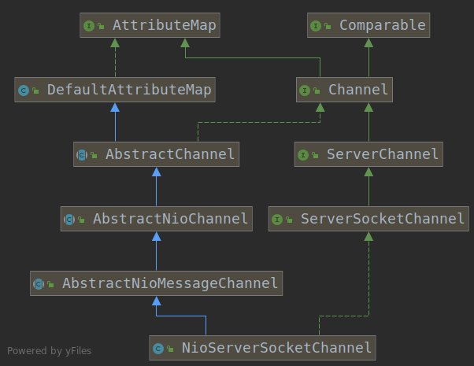

# 5.NioServerSocketChannel

在ServerBootstrap的配置过程中，配置如下：

```java
    b.group(group)
        .channel(NioServerSocketChannel.class)
```

考察channel()方法：

```java
    public B channel(Class<? extends C> channelClass) {
        if (channelClass == null) {
            throw new NullPointerException("channelClass");
        }
        return channelFactory(new ReflectiveChannelFactory<C>(channelClass));
    }

    @SuppressWarnings({ "unchecked", "deprecation" })
    public B channelFactory(io.netty.channel.ChannelFactory<? extends C> channelFactory) {
        return channelFactory((ChannelFactory<C>) channelFactory);
    }

    public B channelFactory(ChannelFactory<? extends C> channelFactory) {
        if (channelFactory == null) {
            throw new NullPointerException("channelFactory");
        }
        if (this.channelFactory != null) {
            throw new IllegalStateException("channelFactory set already");
        }

        this.channelFactory = channelFactory;
        return (B) this;
    }
```

该方法将ServerBootstrap的channelFactory属性配置为指定Channel类型的无参反射构造器。我们考虑NioServerSocketChannel，其类继承结构如下：



首先考察最底层的Channel接口，netty实现了自己的Channel接口，而不是使用nio提供的Channel接口，理由如下（借鉴自 [netty channel详解](https://krisjin.github.io/2015/02/16/channel-detail/)）：

1. JDK的SocketChannel和ServerSocketChannel没有提供统一的Channel接口供业务开发者使用，对于用户而言，没有统一的操作视图，使用起来并方便。
2. JDK的SocketChannel和ServerSocketChannel的主要职责就是网络操作，由于它们是SPI类接口，由具体的虚拟机厂家来提供，所以通过继承SPI功能类来扩展其功能的难度很大。直接实现ServerSocketChannle和SocketChannel抽象类，其工作量和重新开发一个新的Channeld的功能类差不多的。
3. Netty的channel需要能跟Netty整体框架融合在一起，例如IO模型、基于ChannelPipie的定制模型，以及基于元数据描述配置化的TCP参数等，这些JDK的SocketChannel和ServerSocketChannel都没有提供，需要重新封装。
4. 自定义的Channel，功能实现更加灵活。

基于以上的4个原因，Netty重新设计了Channel接口，并且给予了很多不同的实现，它的设计原理很简单，但是功能却比较复杂，主要的设计理念如下：

1. 在Channel接口层，采用Facade模式进行统一封装，将网络IO操作，及相关联的的其它操作封装起来，统一对外提供。
2. Channel接口的定义尽量大而全，为SocketChannel和ServerSocketChannel提供统一的视图，由不同的子类实现不同的功能，公共功能在抽象父类实现，最大限度上实现功能和接口的重用。
3. 具体实现采用聚合而非包含的方式，将相关的功能类聚合在Channel中，由Channel统一负责分配和调度，功能实现更加灵活。
