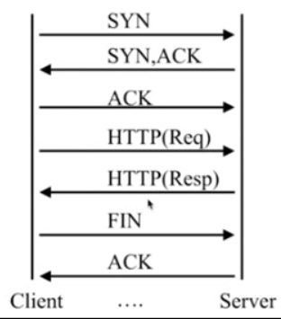

HTTP请求

request-包括请求行、请求头部、请求数据
reponse-包括状态行、消息报头、响应正文

Nginx日志类型

error_log、access_log

log_format

    Syntax:log_format name [escape = default|json] string ...;
    Default:log_format combined "..."
    Context:http

对于log_format只能配置在http命名空间下。

    error_log /var/log/nginx/error.log warn;

这里指出错误日志的位置，后面的warn指的是错误日志的级别，可以自行调节。

    access_log  /var/log/nginx/access.log  main;

这里指出access.log的位置，后面的main与log_format的格式一致：

    log_format  main  '$remote_addr - $remote_user [$time_local] "$request" '

意思就是，这里我们使用main形式的日志格式记录access_log，日志类似下面的情况：

    198.108.66.176 - - [22/Jan/2019:13:31:14 +0800] "GET / HTTP/1.1" 502 173 "http://193.112.2.150:80/" "Mozilla/5.0 zgrab/0.x" "-"
    47.244.143.203 - - [22/Jan/2019:13:59:15 +0800] "GET / HTTP/1.1" 502 575 "-" "Mozilla/4.0 (compatible;MSIE 6.1; Windows XP)" "-"

Nginx变量

HTTP请求变量-arg_PARAMETER、http_HEADER、send_http_HEWADER，http_HEADER是客户端给服务器的request中的头参数，sent_http_HEADER是服务端返回给客户端中的头参数。需要注意的是，HEADER这类信息要把大写变小写，“-”变成“_”，并且注意加上美元符号。

内置变量-[nginx内置变量链接](http://nginx.org/en/docs/http/ngx_http_log_module.html#log_format)，这里给出几个实例：

变量名|含义
---|---
remote_addr|用户的地址
remote_user|这次请求的用户名
time_local|这次日志的时间
request|request头的请求行
status|状态码
body_bytes_sent|从服务端返回客户端的body的大小
http_referer|访问本页面的上一级页面是哪个
http_user_agent|客户端信息
http_x_forwarded_for|请求里面对所携带的HTTP信息

自定义变量-自己定义的

Nginx模块

Nginx官方模块

第三方模块

--with-XXX 就是Nginx编译了的模块

--with-http_stub_status_module nginx的客户端状态，用于展示nginx当前处理连接的状态，用于监控nginx当前连接的信息。

配置语法如下：

Syntax:stub_status
Default:——(默认是没有配置的)
Context:server,location

配置方式：在server命名空间中指定location，然后在location命名空间中加入stub_status，示例如下：

    location /mystatus{
        stub_status;
    }

然后访问服务器的/mystatus的路径，得到信息如下：

    Active connections: 2  # nginx当前活跃连接数 
    server accepts handled requests
    167 167 791 
    # nginx处理的握手的总次数
    # nginx所处理的连接数
    # nginx所处理的请求数 
    Reading: 0 Writing: 1 Waiting: 1 
    # nginx正在读的个数
    # nginx正在写的个数
    # nginx正在等待的个数，一般是nginx打开长连接，然后客户端与服务器端没有读没有写的状态

--with-http_random_index_module 目录中选择一个随机主页。

配置语法：

    Syntax:random_index on|off
    Default:random_index off
    Context:location

配置方式：

    location /index{
        random_index on;
    }

--with-http_sub_module HTTP内容替换 用于nginx客户端在返回给客户端内容时对HTTP页面内容进行替换。

配置语法：

    Syntax:sub_filter string replacement
    Default:——
    Context:http,server,location

    (判断是否有更新，缓存)
    Syntax:sub_filter_last_modified on|off
    Default:sub_filter_last_modified off;
    Context:http,server,location

    (判断是否只匹配第一个符合要求的字符串)
    Syntax:sub_filter_once on|off
    Default:sub_filter_once on;
    Context:http,server,location

配置示例

    location / {
        root /var/www/jllsq.com;
        index index.html index.htm;
        sub_filter 'FanYan' 'My Lover';
        sub_filter_once off;
    }

/var/www/jllsq.com/index.html文件代码如下：

    <html>
    <h2>1</h2>

    <h1>I Love FanYan</h1>
    </html>

经过配置后，访问页面如下：

Nginx的请求限制

HTTP协议的连接与请求

HTTP协议版本|连接关系
---|---
HTTP1.0|TCP不能复用
HTTP1.1|顺序性TCP复用
HTTP2.0|多路复用TCP请求

HTTP请求建立在一次TCP连接基础上，一次TCP请求至少产生一次HTTP请求。

连接频率限制-limit_conn_module

    Syntax:limit_conn_zone key zone=name:size;
    Default:——
    Context:http

由于我们要根据连接对流量进行限制，因此我们需要保存每个连接的状态信息，就需要申请一部分的资源用于保存每个连接的状态信息，而这部分的资源就是limit_conn_zone，key是用来进行限制的条件，例如对ip进行限制，那么key就可以放置ip信息，最后的name是被分配的那部分资源的名字，用来方便进行调用，而size就是这块空间的大小。

    Syntax:limit_conn zone number;
    Default:——
    Context:http,server,location

这里的zone指的是上个配置中配置的name，而number则指的是允许并发的数量。

请求频率限制-limit_req_module

    Syntax:limit_req_zone key zone=name:size rate=rate;
    Default:——
    Context:http

rate是指对于请求的限制，通常以秒为单位，表示1s允许多少请求。

    Syntax:limit_req_zone=name [brust=number][nodelay];
    Default:——
    Context:http,server,location

配置示例：

    limit_conn_zone $binary_remote_addr zone=conn_zone:1m;
    limit_req_zone $binary_remote_addr zone=req_zone:1m rate=1r/s;

    location / {
        root /var/www/jllsq.com;
        limit_conn conn_zone 1;           #limit_req zone=req_zone;
        index  index.html index.htm;
    }

访问控制

基于IP的访问控制-http_access_module

    Syntax:allow address|CIDR|unix:|all;
    Default:——
    Context:http,server,location,limit_except

    Syntax:deny address|CIDR|unix:|all;
    Default:——
    Context:http,server,location,limit_except

基于用户的信任登录-http_auth_basic_module
