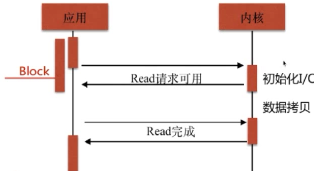

# 2-1~11

Nginx简述

Nginx是一个开源且高性能、可靠的HTTP中间件、代理服务

常见的 HTTP服务

HTTPD - Apache基金会
IIS - 微软
GWS - Google

为什么选择Nginx

原因一：IO多路复用epoll

IO复用：运用多线程的方式处理多个请求，形式如下：

一个socket用来复用完成整个IO流的请求。

什么是IO多路复用？
多个描述符的I/O操作都能在一个线程内并发交替地顺序完成，这就叫做I/O多路复用，这里的“复用”指的是复用同一个线程。也就是当多个请求完成操作之后主动上报给socket自己已经完成任务，而不是socket去主动轮询各个请求。

IO多路复用的方式select、poll、epoll。

select方式：

IO多路复用就是内核态对IO请求主动发送文件对象就绪时，主动发送文件可用信息给应用端。而在应用端接收到文件可用信息之前会进行阻塞，并且应用端会保存一个fd列表，然后不断轮询这个fd列表中的资源，是否其对应的文件可用信息已经到达。如果到达了就进行数据拷贝操作。

select方式的缺点：

1. 能够监视文件描述符的数量存在最大限制
2. 线性扫描fd列表导致效率低下

epoll模型

1. 当FD就绪时，就采用系统的回调函数之间将fd放入，效率更高。
2. 最大连接无限制

原因二：轻量级，功能模块少，代码模块化。

原因三：CPU亲和

为什么需要CPU亲和？

CPU亲和是一种把CPU核心和Nginx工作进程绑定的方式，把每个worker进程固定在一个cpu上执行，减少切换cpu的cache miss，从而获得更好的性能。

原因四：sendfile

HTTP Server传统的文件传输方式：

传统的传输方式要将文件通过内核空间和用户空间两层进行传输，要发生多次切换。而文件没有必要经过用户空间进行过多的逻辑处理，直接就可以通过内核空间进行传输，所以sendfile是如下模式：

所有的文件传输只通过内核空间，而不通过用户空间。因此Nginx的性能会比较高。

安装目录

/etc 核心配置

路径|类型|作用
---|---|---
/etc/logrotate.d/nginx|配置文件|Nginx日志轮转，用于logrotate服务的日志切割
/etc/nginx&&/etc/nginx/nginx.conf&&/etc/nginx/conf.d&&/etc/nginx/conf.d/default.conf|目录、配置文件|Nginx主配置文件(nginx.conf是主要配置文件，default.conf是安装后默认加载的配置文件)
/etc/nginx/fastcgi_params&&/etc/nginx/uwsgi_params&&/etc/nginx/scgi_params|配置文件|cgi配置相关，fastcgi配置
/etc/nginx/koi-utf&&/etc/nginx/koi-win&&/etc/nginx/win-utf|配置文件|编码转换映射转化文件
/etc/nginx/mime.types|配置文件|设置http协议的Content-Type与扩展名对应关系
/usr/lib/systemd/system/nginx-debug.service&&/usr/lib/systemd/system/nginx.service&&/etc/sysconfig/nginx&&/etc/sysconfig/nginx-debug|配置文件|用于配置出系统守护进程管理器管理方式
/usr/lib64/nginx/modules&&/etc/nginx/modules|目录|Nginx模块目录
/usr/sbin/nginx&&/usr/sbin/nginx-debug|命令|Nginx服务的启动管理的终端命令
/usr/share/doc/nginx-1.12.0&&/usr/share/doc/nginx-1.12.0/COPYRIGHT&&/usr/share/man/man8/nginx.8.gz|文件、目录|Nginx的手册和帮助文件
/var/cache/nginx|目录|Nginx的缓存目录
/var/log/nginx|目录|Nginx的日志目录

编译参数

查询命令：nginx -V

查询结果:

    nginx version: nginx/1.12.2
    built by gcc 4.8.5 20150623 (Red Hat 4.8.5-16) (GCC)
    built with OpenSSL 1.0.2k-fips  26 Jan 2017
    TLS SNI support enabled
    configure arguments:
    --prefix=/usr/share/nginx 
    --sbin-path=/usr/sbin/nginx 
    --modules-path=/usr/lib64/nginx/modules 
    --conf-path=/etc/nginx/nginx.conf 
    --error-log-path=/var/log/nginx/error.log 
    --http-log-path=/var/log/nginx/access.log 
    --http-client-body-temp-path=/var/lib/nginx/tmp/client_body 
    --http-proxy-temp-path=/var/lib/nginx/tmp/proxy 
    --http-fastcgi-temp-path=/var/lib/nginx/tmp/fastcgi 
    --http-uwsgi-temp-path=/var/lib/nginx/tmp/uwsgi 
    --http-scgi-temp-path=/var/lib/nginx/tmp/scgi 
    --pid-path=/run/nginx.pid 
    --lock-path=/run/lock/subsys/nginx 
    --user=nginx 
    --group=nginx 
    --with-file-aio 
    --with-ipv6 
    --with-http_auth_request_module 
    --with-http_ssl_module 
    --with-http_v2_module 
    --with-http_realip_module 
    --with-http_addition_module 
    --with-http_xslt_module=dynamic 
    --with-http_image_filter_module=dynamic 
    --with-http_geoip_module=dynamic 
    --with-http_sub_module 
    --with-http_dav_module 
    --with-http_flv_module 
    --with-http_mp4_module 
    --with-http_gunzip_module 
    --with-http_gzip_static_module 
    --with-http_random_index_module 
    --with-http_secure_link_module 
    --with-http_degradation_module 
    --with-http_slice_module 
    --with-http_stub_status_module 
    --with-http_perl_module=dynamic 
    --with-mail=dynamic 
    --with-mail_ssl_module 
    --with-pcre 
    --with-pcre-jit 
    --with-stream=dynamic 
    --with-stream_ssl_module 
    --with-google_perftools_module 
    --with-debug 
    --with-cc-opt='-O2 -g -pipe -Wall -Wp,-D_FORTIFY_SOURCE=2 -fexceptions -fstack-protector-strong --param=ssp-buffer-size=4 -grecord-gcc-switches -specs=/usr/lib/rpm/redhat/redhat-hardened-cc1 -m64 -mtune=generic' --with-ld-opt='-Wl,-z,relro -specs=/usr/lib/rpm/redhat/redhat-hardened-ld -Wl,-E'

编译参数细节：

第一部分：nginx的安装目录或路径

编译选项|作用
---|---
--prefix=/etc/nginx|nginx的主目录
--sbin-path=/usr/sbin/nginx|nginx的执行命令
--modules-path=/usr/lib64/nginx/modules|nginx的模块
--conf-path=/etc/nginx/nginx.conf|nginx的配置文件
--error-log-path=/var/log/nginx/error.log|nginx的错误日志目录
--http-log-path=/var/log/nginx/access.log|nginx的访问日志
--pid-path=/var/run/nginx.pid|nginx的pid文件
--lock-path=/var/run/nginx.lock|nginx的锁

第二部分：nginx执行对应模块时，Nginx所保留的临时性文件

编译选项|作用
---|---
--http-client-body-temp-path=/var/lib/nginx/tmp/client_body |  
--http-proxy-temp-path=/var/lib/nginx/tmp/proxy |
--http-fastcgi-temp-path=/var/lib/nginx/tmp/fastcgi| 
--http-uwsgi-temp-path=/var/lib/nginx/tmp/uwsgi| 
--http-scgi-temp-path=/var/lib/nginx/tmp/scgi |

第三部分：nginx用户部分
编译选项|作用
--user=nginx|指定执行nginx的worker的用户
--group=nginx|指定执行nginx的worker的用户组

虽然nginx是使用其他用户启动的，但是真正的工作进程，也就是worker是通过nginx的用户运行的，这是在编译时指定好的

第四部分：指定CFLAGS变量

编译选项|作用
---|---
--with-cc-opt=parameters|设置额外的参数将被添加到CFLAGS变量中

第五部分：附加的参数

编译选项|作用
---|---
--with-ld-opt|设置附加的参数，链接系统库

进行C语言编译时，可能会依赖各种库，这些库的路径由此指定。

nginx.conf的配置

http中的配置：

参数名称|意义
---|---
include| 设置ContentType配置
log_format|定义日志类型
sendfile|是否使用sendfile
keepalive_timeout|设置客户端与服务端超时时间
listen|nginx监听的端口
location|访问路径
root|location返回页面的路径
index|默认首页
error_page|错误返回页面

基本配置语法