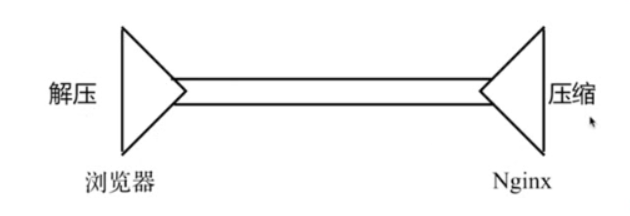
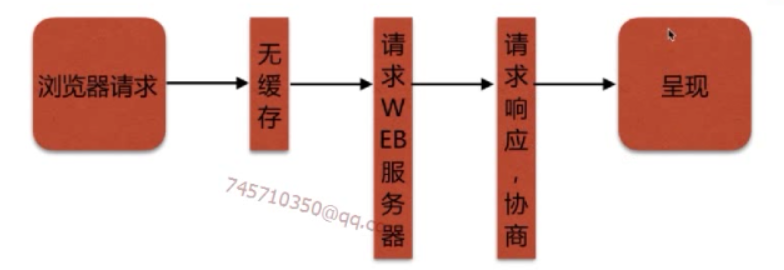
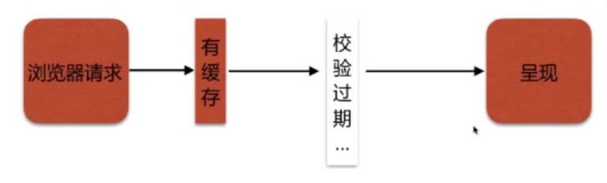
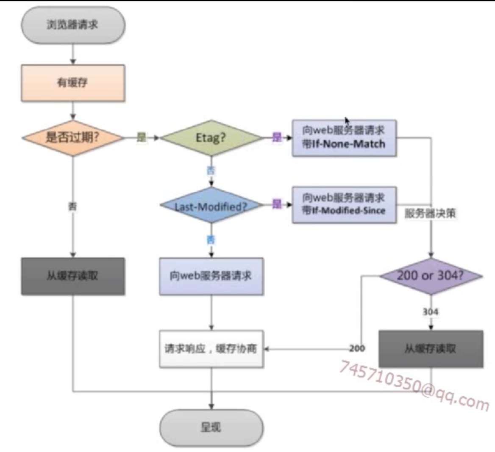
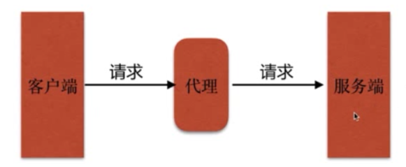
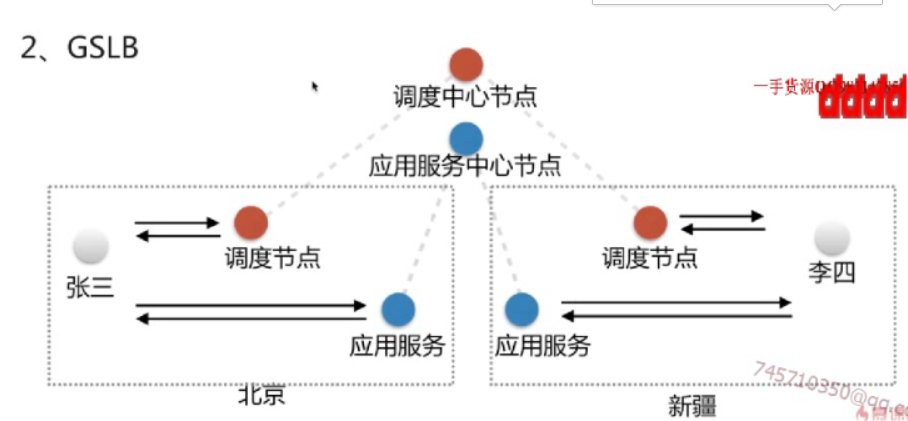
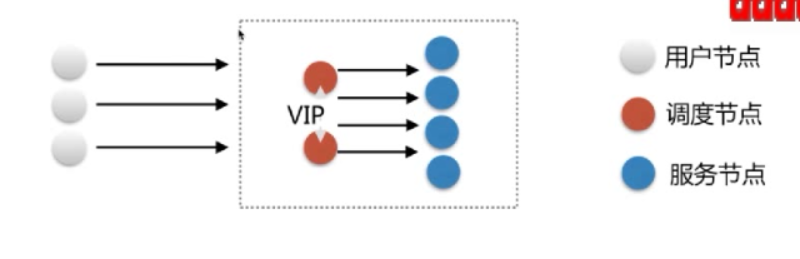
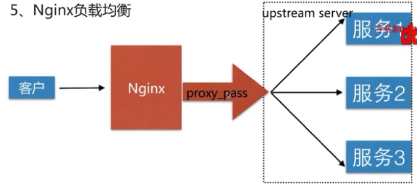
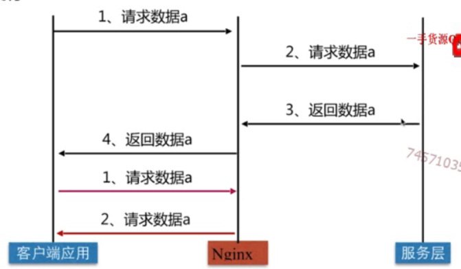

# 3-1~9

静态资源Web服务

代理服务

负载均衡调度器SLB

动态缓存

静态资源Web服务

1. 静态资源类型

非服务器动态生成的文件。

类型|种类
--- | ---
浏览器端渲染|HTML、CSS、JS
图片|JPEG、GIF、PNG
视频|FLV、MPEG
文件|TXT、等任意下载文件

2. 静态资源服务场景-CDN

3. 配置语法

文件读取

    Syntax:sendfile on | off;
    Default:sendfile off;
    Context:http,server,location,if in location

引读：--with-file-aio 异步文件读取

tcp_nopush

    Syntax:tcp_nopush on | off;
    Default:tcp_nopush off;
    Context:http,server,location

作用：sendfile开启的情况下，提高网络包的传输效率，把多个包的首体进行整合，然后一次发送。

tcp_nodelay

    Syntax:tcp_nodelay on | off;
    Default:tcp_nodelay on;
    Context:http,server,location;

作用：keepalive连接下，提高网络包的传输实时性。对要发送的包尽可能的立即发送。

压缩（减少传输时间，节省资源带宽，提高实时性）

    Syntax:gzip on | off;
    Default:gzip off;
    Context:http,server,location,if in location

作用：压缩传输

示意图如下：

文件由nginx服务器端进行压缩，然后到达浏览器进行解压，现在的浏览器几乎都支持通用的压缩协议。

压缩比：

    Syntax:gzip_comp_level level;
    Default:gzip_comp_level 1;
    Context:http,server,location;

文件压缩等级越高，压缩比率越大，传输文件越小，但是越耗费服务器性能。

    Syntax:gzip_http_version 1.0 | 1.1
    Default:gzip_http_version 1.1
    Context:http,server,location

压缩协议版本，主流都是1.1版本。

http_gzip_static_module - 预读gzip功能

http_gunzip_module - 应用支持gunzip的压缩方式（解决浏览器不支持gzip的压缩方式）
 
配置示例：

    location  ~ ^/favicon\.ico$ {
        root /var/www/jllsq.com/ico;
    }
    location ~ ^/download {
        gzip_static on;
        tcp_nopush on;
        root /var/www/jllsq.com;
    }
    location ~.*\.(jpg|gif|png)$ {
        root /var/www/jllsq.com/images;
        # gzip on;
        # gizp_http_version 1.1;
        # gzip_comp_level 2;
        # gzip_types text/plain application/javascript application/x-javascript text/css application/xml text/javascript application/x-httpd-php image/gif image/png;
        index  index.html index.htm;
    }
    location ~.*\.(txt|xml)$ {
                gzip on;
        gzip_http_version 1.1;
        gzip_comp_level 1;
        gzip_types text/plain application/javascript application/x-javascript text/css application/xml text/javascript application/x-httpd-php image/jpeg image/gif image/png;
        root /var/www/jllsq.com/doc;
    }

二、浏览器缓存

HTTP协议定义的缓存机制(如:Expires，Cache-Control等)

无缓存请求过程：

当浏览器向服务端发送请求请求资源时，如果浏览器缓存中没有该资源，就请求web服务器，服务器响应请求，最后浏览器呈现。

有缓存请求过程：

当浏览器向服务端发送请求请求资源时，如果缓存中存在该资源，判断缓存中的资源是否过期，如果没有，则直接呈现，否则浏览器返回最新资源，然后呈现。

校验缓存过期机制

描述        |           头信息
---         |       ---
检验是否过期 | Expires、Cache-Control(max-age)
协议中Etag头信息校验 | Etag
Last-Modified头信息校验 | Last-Modified

首先通过Expires、Cache-Control两个头进行校验，区别就是Expires是在HTTP 1.0中使用的，Cache-Control是在HTTP 1.1中使用的。以Cache-Control为例，该头通过max-age进行校验，定义了一个周期，即缓存文件在多久以后就是过期了，所以客户端会优先检查Cache-Control这个属性，如果验证过期了，那么就进行接下来的Etag和Last-Modified的验证。

首先考虑Last-Modified的验证，因为比较简单，Last-Modified头信息指定了一个时间，如果这个时间与服务器中的本地文件的更新时间进行对比，如果这两个时间不一致，服务器就将新的文件传递给客户端。

Etag与Last-Modified不同，由于Last-Modified只能精确到秒，但是Etag就可以精确到更细的粒度。是一串字符串作为标识，缓存中优先校验Etag。

校验过程如下：

配置语法-expires

添加Cache-Control、Expires头

    Syntax:expires[modified] time;
           expires epoch | max | off;
    Default:expires off;
    Context:http,server,location,if in location.

该配置可以用来设置Response Message的Cache-Control的max-age属性为服务器设置的值。

跨域访问

防盗链

目的：防止资源被盗用

防盗链设置思路

首要方式：区别哪些请求是非正常的用户请求

基于http_refer防盗链配置模块

    Syntax:valid_referers none（允许没有代理信息的）|blocked（允许没有带协议信息的请求） | server_names | string ...;
    Default:——
    Context:server,location

http_refer是记录本次请求是由哪个链接发出的，我们可以选择只允许特定的地址对网站进行访问。

配置示例：

      location ~.*\.(txt|xml)$ {
                gzip on;
                gzip_http_version 1.1;
                gzip_comp_level 1;
                gzip_types text/plain application/javascript application/x-javascript text/css application/xml text/javascript application/x-httpd-php image/jpeg image/gif image/png;
                root /var/www/jllsq.com/doc;
                #允许http_referer为空的进行访问，允许未指定协议的进行访问，允许IP为 193.112.2.150 进行访问，运行域名为baidu的进行访问。
                valid_referers none blocked 193.112.2.150 ~/baidu\./;
                # 如果不符合上述要求，返回403
                if ($invalid_referer) {
                        return 403;
                }
        }

代理服务

代理——代为办理。

工作模式：

Nginx的代理模式如下：

HTTP代理：正向代理、反向代理

区别在于代理的对象不一样

正向代理代理的对象是客户端，反向代理代理的对象是服务端。

正向代理图示：

正向代理是，客户端通过代理服务器对服务端进行访问，例如我们自己租的国外服务器，然后通过这个服务器作为代理，访问国外网站。

反向代理图示：

反向代理是，客户端访问网站时，不知道服务器端的集群有多少台服务器，不知道访问哪台，而通过代理做到正确访问。

语法：

    Syntax:proxy_pass URL
    Default:——
    Context:location,if in location,limit_except

反向配置示例：

     location / {
                        proxy_set_header Host $host;
                        proxy_set_header X-Forwarded-For $proxy_add_x_forwarded_for;
                        proxy_pass http://127.0.0.1:8080/ ;
                }

正向代理示例：

    location / {
        proxy_pass http://$http_host$request_uri;
    }

代理更多配置：

缓冲区：

    Syntax:proxy_buffering on | off;
    Default:proxy_buffering on;
    Context:http,server,location

    扩展：proxy_buffer_size、proxy_buffers、proxy_busy_buffers_size

由nginx代理向后端代理请求时，可能获得到的只有小部分头信息，那么nginx如果打开这个配置项，nginx会尽可能地将响应信息收集完，转化为配置项。减少了频繁io的损耗，但是打开这个配置，默认情况下是存在内存中的，如果内存不够会存在硬盘中。

跳转重定向：

    Syntax:proxy_redirect default;
    proxy_redirect off;proxy_redirct redirect replacement;
    Default:proxy_redirect default;
    Context:http,server,location

当我们代理的后端服务返回的是一个重定向的地址时，会把我们的请求重定向到另外的一个地址返回到客户端。如果后端返回的地址是前端无法访问到的，或者返回的地址需要做重写时，就需要这个配置。

头信息：

    Syntax:proxy_set_header field value;
    Default:proxy_set_header Host $proxy_host
    proxy_set_header Connection close;
    Context:http,server,location

    扩展：proxy_hide_header、proxy_set_body

TCP请求连接超时（nginx到后端服务器的超时）：

    Syntax:proxy_connect_timeout time;
    Default:proxy_connect_timeout 60s;
    Context:http,server,location

    扩展：proxy_read_timeout（服务器建立连接后，接收这个请求，处理的时间）、proxy_send_timeout（服务端发送给客户端的时间）

常用配置头信息：

    proxy_set_header Host $http_host;
    proxy_set_header X-Real-IP $remote_addr（真实IP）;、

代理服务补充：

    proxy_next_upstream error timeout invalid_header http_500 http_502 http_503 http_504；

如果后端出现了错误、超时、500、502、503、504的时候跳过这个服务器，去访问下一台。

负载均衡

GSLB（全局负载均衡）

例如张三在北京，访问到本地的调度节点，然后通过调度节点访问本地服务节点。

LSB

四层负载均衡和七层负载均衡

四层负载均衡就是在传输层进行负载均衡，只需要进行包转发，性能比较好。

七层负载均衡是在应用层进行负载均衡，可以实现更细节的功能。

nginx负载均衡的原理：

nginx采用proxy_pass进行负载均衡，与代理不同的是，proxy_pass指向的不再是单一的一个服务器节点或者url，而是一个upstream server，在其中存放了一组相同服务的服务节点信息，然后供nginx进行轮询。 

配置语法：

    Syntax:upstream name{...}
    Default:——
    Context:http

配置示例：

    upstream immoc{
        server 116.62.103.228:8001;
        server 116.62.103.228:8002;
        server 116.62.103.228:8003;
    }

   proxy_pass http://imooc; 

负载均衡默认是轮询的。

upstream配置项

    upstream 名字{
        server 域名：端口 weight=5(轮询权重);
        server 域名：端口 down;
    }

后端服务器在负载均衡调度中的状态

标志|描述
---|---
down |当前的server暂时不参与负载均衡
backup|预留的备份服务器
max_fails|允许请求失败的次数
fail_timeout|经过max_fails失败后，服务暂时的时间
max_conns|限制最大的接收的连接数

调度算法

调度算法|描述
轮询|按时间顺序逐一分配到不同的后端服务器
加权轮询|weight值越大，分配到的访问几率越高
ip_hash|每个请求按访问IP的hash结果分配，这样来自同一个IP的固定访问一个后端服务器
least_conn|最少链接数，那个机器连接数少就分发
url_hash|按照访问的URL的hash结果来分配请求，是每个URL定向到同一个后端服务器
hash关键数值|hash自定义的key

配置ip_hash:
    
    upstream immoc{
        ip_hash;
        server 116.62.103.228:8001;
        server 116.62.103.228:8002;
        server 116.62.103.228:8003;
    }

配置url_hash:

    Syntax: hash key [consistent];
    Default:——
    Context:upstream 

配置示例

     upstream immoc{
        hash $request_uri;
        server 116.62.103.228:8001;
        server 116.62.103.228:8002;
        server 116.62.103.228:8003;
    }

缓存服务

缓存类型

服务端缓存（redis、mimercache）、代理缓存、客户端缓存（浏览器缓存）

代理缓存工作流程：

客户端在首次请求服务端的时候，nginx会将结果进行缓存，而在第二次再次请求时，就直接从nginx中取，而没必要再请求服务器。

proxy_cache配置语法

    (path 保存缓存的路径)
    Syntax:proxy_cache_path path[levels=levels]（1：2按照两层目录方式分级缓存）
    [use_temp_path=on|off] key_zone=name:size [inactive=time]（time分钟内没有被访问过，则被清除） [max_size=size] [manager_files=number] [manager_sleep=time] [manager_threshold=time] [loader_files=number] [loader_sleep=time] [loader_threshold=time] [purger=on|off] [purger_files=number] [purger_sleep=time] [purger_threshold=time];
    Default:——
    Context:http;

    Syntax:proxy_cache zone | off;
    Default:proxy_cache off;
    Context:http,server,location

缓存过期周期配置

    (code一般代表缓存状态码)
    Syntax:proxy_cache_valid [code ...] time;
    Default:——；
    Context:http,server,location;

缓存的维度

    Syntax:proxy_cache_key string;
    Default:proxy_cache_key$scheme$proxy_host$request_uri;
    Context:http,server,location。

如何清理指定缓存？

方式一：rm -rf 缓存目录内容

方式二：第三方扩展模块ngx_cache_purge

如何让页面不缓存?

    Syntax:proxy_no_cache string ...;
    Default: ——
    Context:http,server,location

配置示例：

    if ($request_uri ~ ^/(url3|login|reginster|password\/reset)) {
        set $cookie_nocache 1;
    }

    proxy_no_cache $cookienocache $arg_nocache $arg_comment;

大文件分片请求

    (表示对一个大文件要切分成size个小部分进行请求)
    Syntax:slice:size;
    Default:slice 0;
    Context:http,server,location

前端请求过来，第一次请求文件大小和silce，然后进行切片分割成多个小的请求然后分别请求后端。

优势：每个自请求收到的数据都会形成一个独立文件，一个请求断了，其他请求不受影响。

缺点：
当文件很大或者slice很小的时候，可能会导致文件描述符耗尽等情况。