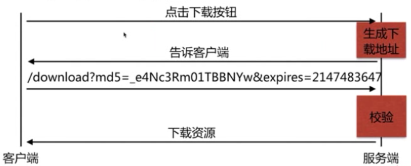
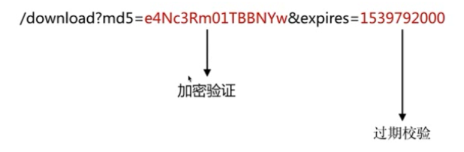

# nginx高级模块

## secure_link_module模块

一、指定并允许检查请求的链接的真实性以及保护资源免遭未经授权的访问。

二、 限制链接生效周期。

配置语法：

    Syntax:secure_link expression;
    Default:——
    Context:http,server,location

    Syntax:secure_link_md5 expression;
    Default:——
    Context:http,server,location

secure_link_module验证图示

下载链接的生成

md5是经过加密算法生成的最终返回给用户的md5生成字符串，可以指定响应的内容进行加密，例如ip、url、cookie等。验证的服务端是nginx，使用secure_link_module进行验证，如果验证通过后，再进行expires的验证，只有两项都验证通过了，才会返回指定资源。

配置示例：

    location / {
        secure_link $arg_md5,$arg_expires;
        secure_link_md5 "$secure_link_expres$uri imooc";

        if ($secure_link = "") {
            return 403;
        }

        if ($secure_link = "0") {
            return 410;
        }
    }

geoip_module模块

基于IP地址匹配MaxMind GeoIP二进制文件，读取IP所在地域信息。

    yum install nginx-module-geoip

适用场景：

1. 区别国内外作HTTP访问规则
2. 区别国内城市地域作HTTP访问规则

HTTPS服务

为什么需要HTTPS？

原因：HTTP不安全

1. 传输数据被中间人盗用、信息泄露
2. 数据内容劫持、篡改

HTTPS协议的实现

对传输内容进行加密以及身份验证。

HTTPS服务优化

1. 激活keepalive长连接  keepalive_timeout 100
2. 设置ssl的session缓存 ssl_session_cache shared:SSL:10m