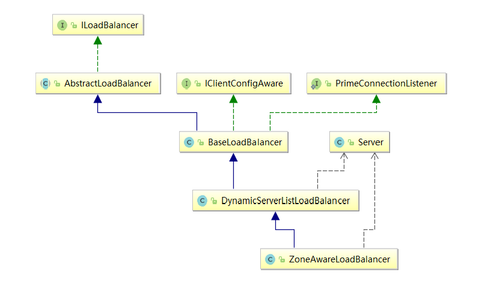
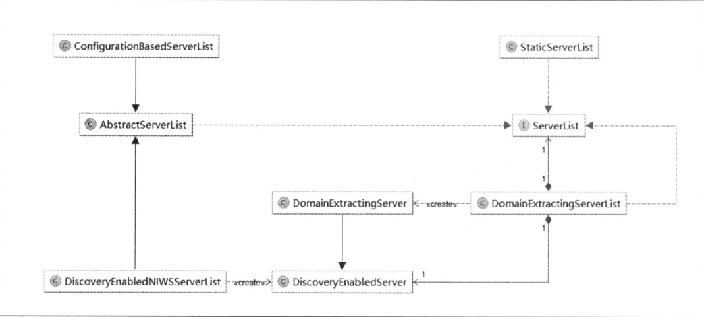
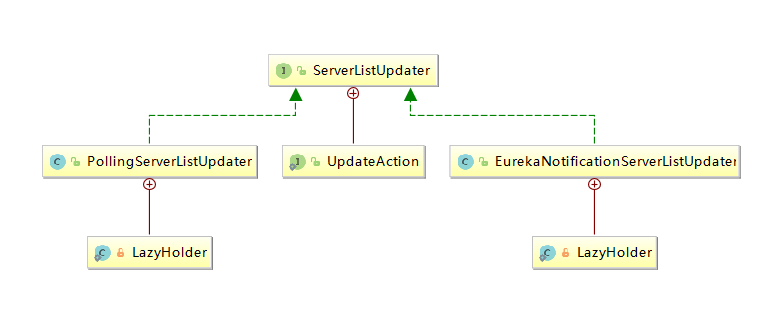
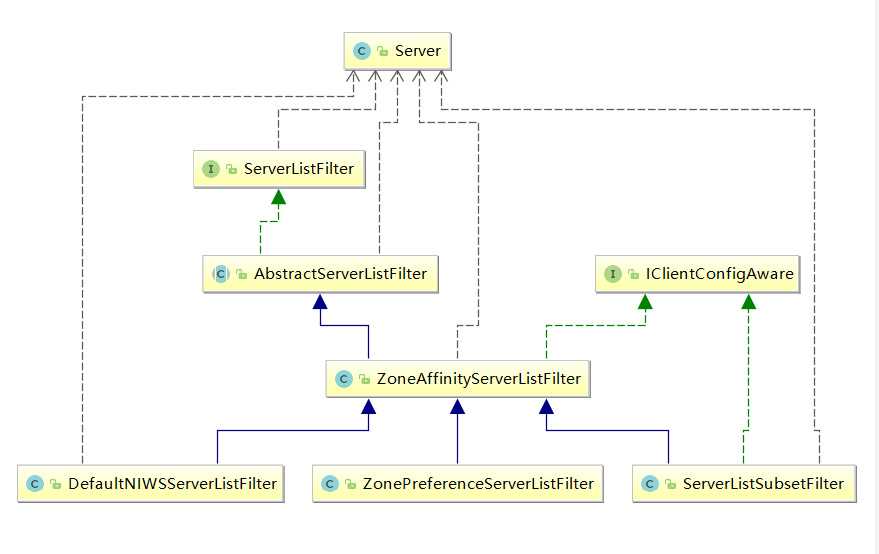

# LoadBalancer

上一篇文章我们知道，Ribbon客户端接收到请求后，先通过`getLoadBalancer()`请求一个负载均衡器。

下面我们对负载均衡器做一个介绍，根据如下类图：

## ILoadBalancer

为了保证文章的完整性，我们再次查看ILoadBalancer的源码：

    /**
    * Interface that defines the operations for a software loadbalancer. A typical
    * loadbalancer minimally need a set of servers to loadbalance for, a method to
    * mark a particular server to be out of rotation and a call that will choose a
    * server from the existing list of server.
    * 
    * @author stonse
    * 
    */
    public interface ILoadBalancer {

	/**
	 * Initial list of servers.
	 * This API also serves to add additional ones at a later time
	 * The same logical server (host:port) could essentially be added multiple times
	 * (helpful in cases where you want to give more "weightage" perhaps ..)
	 * 
	 * @param newServers new servers to add
	 */
	public void addServers(List<Server> newServers);
	
	/**
	 * Choose a server from load balancer.
	 * 
	 * @param key An object that the load balancer may use to determine which server to return. null if 
	 *         the load balancer does not use this parameter.
	 * @return server chosen
	 */
	public Server chooseServer(Object key);
	
	/**
	 * To be called by the clients of the load balancer to notify that a Server is down
	 * else, the LB will think its still Alive until the next Ping cycle - potentially
	 * (assuming that the LB Impl does a ping)
	 * 
	 * @param server Server to mark as down
	 */
	public void markServerDown(Server server);
	
	/**
	 * @deprecated 2016-01-20 This method is deprecated in favor of the
	 * cleaner {@link #getReachableServers} (equivalent to availableOnly=true)
	 * and {@link #getAllServers} API (equivalent to availableOnly=false).
	 *
	 * Get the current list of servers.
	 *
	 * @param availableOnly if true, only live and available servers should be returned
	 */
	@Deprecated
	public List<Server> getServerList(boolean availableOnly);

	/**
	 * @return Only the servers that are up and reachable.
     */
    public List<Server> getReachableServers();

    /**
     * @return All known servers, both reachable and unreachable.
     */
	public List<Server> getAllServers();
    }

`该接口定义了一个软件负载均衡器的操作，典型的负载均衡器最低限度地需要一组服务器来进行负载均衡,一个标记服务器不可用的方法和从已知服务器中选择一个可用的服务器的调用`。该接口要求实现6个方法，其中一个已经不推荐了，分别如下：

1. addServers(List<Server> newServers):初始化服务器列表，这个API也可以在之后添加一个额外的服务器，相同逻辑的服务实例可以被添加多次。
2. chooseServer(Object key):从负载均衡器中选择一个服务器。
3. markServerDown(Server server):该方法由负载均衡器的客户端调用，标记改服务器实例已经down掉了。但是这个负载均衡器在下一个Ping周期之前已经会认为这个服务器是活着的。
4. getServerList(boolean availableOnly):获取现在的服务器列表。
5. getReachableServers():获取启动的并且可达的服务器列表。
6. getAllServers(): 获取所有的已知的服务器，既包括可达的，也包括不可达的。

## AbstractLoadBalancer

而直接实现该接口的是`AbstractLoadBalancer`类，该类源码如下：

    /**
    * AbstractLoadBalancer contains features required for most loadbalancing
    * implementations.
    * 
    * An anatomy of a typical LoadBalancer consists of 1. A List of Servers (nodes)
    * that are potentially bucketed based on a specific criteria. 2. A Class that
    * defines and implements a LoadBalacing Strategy via <code>IRule</code> 3. A
    * Class that defines and implements a mechanism to determine the
    * suitability/availability of the nodes/servers in the List.
    * 
    * 
    * @author stonse
    * 
    */
    public abstract class AbstractLoadBalancer implements ILoadBalancer {
    
    public enum ServerGroup{
        ALL,
        STATUS_UP,
        STATUS_NOT_UP        
    }
        
    /**
     * delegate to {@link #chooseServer(Object)} with parameter null.
     */
    public Server chooseServer() {
    	return chooseServer(null);
    }
    
    /**
     * List of servers that this Loadbalancer knows about
     * 
     * @param serverGroup Servers grouped by status, e.g., {@link ServerGroup#STATUS_UP}
     */
    public abstract List<Server> getServerList(ServerGroup serverGroup);
    
    /**
     * Obtain LoadBalancer related Statistics
     */
    public abstract LoadBalancerStats getLoadBalancerStats();    
    }

该类包含了大多数负载均衡器所实现的功能，典型的LoadBalancer包括
1. 基于特定标准可能被分块的服务器（节点）列表。
2. 通过`IRule`定义并且实现一个负载均衡算法的类。
3. 定义和实现机制的类，用于确定List中节点/服务器的适用性/可用性。

该类中定义了一个枚举类ServerGroup，包含三种不同类型：
1. ALL:所有服务类型
2. STATUS_UP:正常服务的实例
3. STATUS_NOT_UP:停止服务的实例

函数：
1. chooseServer()，该函数将实现委托给`ILoadBalancer`接口的`chooseServer(Object key)`方法，调用方式为`chooseServer(null)`。
2. getServerList(ServerGroup serverGroup)，该函数通过传入的分组类型来获取不同的服务实例的列表。
3. getLoadBalancerStats()，定义了获取`LoadBalancerStats`对象的方法。

`LoadBalancerStats`类型的对象存储了LoadBalancer中每个节点或者服务器的操作特性和统计信息。这些信息可以用来去观察和理解负载均衡器的行为，更重要的是它是制定负载均衡策略的基础。

## BaseLoadBalancer

沿着类图继续向下是`BaseLoadBalancer`，由于该类的代码太长，这里就不贴了。注释意义如下：

    负载均衡器的基本实现，可以将任意服务器列表设置为服务器池。通过设置Ping来确定服务器的活跃度。该类维护了两个列表，分别表示所有的服务器列表和启动的服务器列表，通过这两个列表决定调用者请求的是哪个服务器。

查看源码我们可以看到：

### 1. 定义两个服务器列表

    @Monitor(name = PREFIX + "AllServerList", type = DataSourceType.INFORMATIONAL)
    protected volatile List<Server> allServerList = Collections
            .synchronizedList(new ArrayList<Server>());
    @Monitor(name = PREFIX + "UpServerList", type = DataSourceType.INFORMATIONAL)
    protected volatile List<Server> upServerList = Collections
            .synchronizedList(new ArrayList<Server>());
第一个列表用于存储所有服务器实例，第二个用于存储正常运行的服务器。

### 2. 定义了LoadBalancerStats对象

    protected LoadBalancerStats lbStats;

该对象存储了LoadBalancer中每个节点或者服务器的操作特性和统计信息。这些信息可以用来去观察和理解负载均衡器的行为，更重要的是它是制定负载均衡策略的基础。

### 3. 定义了IPing对象

    protected IPing ping = null;

IPing对象用于检查服务实例是否正常服务。默认情况下为null，需要在构造器中注入其具体实现。

### 4. 定义了IPingStrategy对象

    private final static SerialPingStrategy DEFAULT_PING_STRATEGY = new SerialPingStrategy();
    protected IPingStrategy pingStrategy = DEFAULT_PING_STRATEGY;

该对象用于规定检查服务实例正常服务的检查规则。

    private static class SerialPingStrategy implements IPingStrategy {

        @Override
        public boolean[] pingServers(IPing ping, Server[] servers) {
            int numCandidates = servers.length;
            boolean[] results = new boolean[numCandidates];

            if (logger.isDebugEnabled()) {
                logger.debug("LoadBalancer:  PingTask executing ["
                             + numCandidates + "] servers configured");
            }

            for (int i = 0; i < numCandidates; i++) {
                results[i] = false; /* Default answer is DEAD. */
                try {
                    // NOTE: IFF we were doing a real ping
                    // assuming we had a large set of servers (say 15)
                    // the logic below will run them serially
                    // hence taking 15 times the amount of time it takes
                    // to ping each server
                    // A better method would be to put this in an executor
                    // pool
                    // But, at the time of this writing, we dont REALLY
                    // use a Real Ping (its mostly in memory eureka call)
                    // hence we can afford to simplify this design and run
                    // this
                    // serially
                    if (ping != null) {
                        results[i] = ping.isAlive(servers[i]);
                    }
                } catch (Throwable t) {
                    logger.error("Exception while pinging Server:"
                                 + servers[i], t);
                }
            }
            return results;
        }
    }

查看上述代码我们发现，这个函数的实现逻辑相当简单，其实就是首先获取服务器列表长度，建造一个同样长度的数组用于存储ping后的结果。然后遍历服务器数组，依次执行ping操作，并将结果填充到数组中，遍历完毕后返回结果数组。

上面的注释告诉我们：

    注意：IFF我们正在做一个真正的ping，假设我们有一大组服务器（比如15），下面的逻辑将连续运行它们，因此需要花费15倍的时间来ping每台服务器。 一个更好的方法是将它放在执行程序池中。 但是，在撰写本文时，我们并不真正使用Real Ping（它主要用于内存eureka调用），因此我们可以负担得起简化此设计并按顺序运行。

这告诉我们，当Server列表过大时，该策略的IPing的实现速度并不理想，这时我们需要去通过实现IPingStrategy接口，并重写pingServers(IPing ping,Server[] servers)函数去扩展ping的执行策略。

### 5. 定义了负载均衡的处理规则IRule对象

    protected IRule rule = DEFAULT_RULE;
    private final static IRule DEFAULT_RULE = new RoundRobinRule();

默认情况下是`RoundRobinRule`类的对象。既然是负载均衡的处理规则IRule对象，那么必定会被负载均衡的方法所调用，我们查看`chooseServer()`方法源码：

    /*
     * Get the alive server dedicated to key
     * 
     * @return the dedicated server
     */
    public Server chooseServer(Object key) {
        if (counter == null) {
            counter = createCounter();
        }
        counter.increment();
        if (rule == null) {
            return null;
        } else {
            try {
                return rule.choose(key);
            } catch (Throwable t) {
                return null;
            }
        }
    }

该方法根据给定的Key选择特定的服务器。具体实现委托给了IRule对象的`choose(Object)`方法。

### 6. 启动Ping任务

在BaseLoadBalancer的默认构造器中，会默认启动一个用于定时检查Server是否健康的Ping任务。任务执行间隔为10s。源码如下：

    public BaseLoadBalancer() {
        this.name = DEFAULT_NAME;
        this.ping = null;
        setRule(DEFAULT_RULE);
        setupPingTask();
        lbStats = new LoadBalancerStats(DEFAULT_NAME);
    }

我们可以看到，这里对IPing对象，进行了初始化，并调用了`setupPingTask()`方法。

考察`setupPingTask()`方法源码：

    void setupPingTask() {
        if (canSkipPing()) {
            return;
        }
        if (lbTimer != null) {
            lbTimer.cancel();
        }
        lbTimer = new ShutdownEnabledTimer("NFLoadBalancer-PingTimer-" + name,
                true);
        lbTimer.schedule(new PingTask(), 0, pingIntervalSeconds * 1000);
        forceQuickPing();
    }

实现如下：如果能跳过Ping，则直接返回，如果lbTimer不为空，就一直执行`PingTask`的`run`操作，时间间隔为10*1000ms。

PingTask的源码如下：

    class PingTask extends TimerTask {
        public void run() {
            Pinger ping = new Pinger(pingStrategy);
            try {
                ping.runPinger();
            } catch (Throwable t) {
                logger.error("Throwable caught while running extends for "
                        + name, t);
            }
        }
    }

将`pingStrategy`传入`Pinger`，然后执行`Pinger`对象的`runPinger()`操作。

### 实现了ILoadBalancer接口实现的操作

#### addServers(List newServers):

    /**
     * Add a list of servers to the 'allServer' list; does not verify
     * uniqueness, so you could give a server a greater share by adding it more
     * than once
     */
    @Override
    public void addServers(List<Server> newServers) {
        if (newServers != null && newServers.size() > 0) {
            try {
                ArrayList<Server> newList = new ArrayList<Server>();
                newList.addAll(allServerList);
                newList.addAll(newServers);
                setServersList(newList);
            } catch (Exception e) {
                logger.error("Exception while adding Servers", e);
            }
        }
    }

注释告诉我们，这个方法将方法传入的参数添加到allServer列表中，并且不进行独特性验证，所以如果想要让一个服务器获取到更高的可能性，我们可以将其添加多次。代码实现逻辑也很简单，创建一个新的ArrayList<Servers>，并且将原来所有的服务器实例添加到这个新的列表中，然后再将传入的参数添加到新的列表中，并执行set操作。

#### chooseServer(Object key):

我们已经分析过chooseServer(Object key)的源码，这里不再赘述。

#### markServerDown(Server server):

    public void markServerDown(Server server) {
        if (server == null) {
            return;
        }

        if (!server.isAlive()) {
            return;
        }

        logger.error("LoadBalancer:  markServerDown called on ["
                + server.getId() + "]");
        server.setAlive(false);
        // forceQuickPing();

        notifyServerStatusChangeListener(singleton(server));
    }

考察上述代码我们看到，如果要标记的Server是空，或者本来就是down掉的，那么就直接返回。否则将server的alive属性设置为false，并通知已经更新了ServerStatus。

#### getReachableServers():

    public List<Server> getReachableServers() {
        return Collections.unmodifiableList(upServerList);
    }

这段代码就很简单，因为存储了这个列表，直接拿就行了。

#### getAllServers():

    public List<Server> getAllServers() {
        return Collections.unmodifiableList(allServerList);
    }

这段代码也是直接取数据就好了。

## DynamicServerListLoadBalancer

`DynamicServerListLoadBalancer`类继承于`BaseLoadBalancer`类，它是对基础负载均衡器的扩展。在该负载均衡器中，实现了服务实例清单在运行期的动态更新能力。同时还具备对服务实力清单的过滤功能。

查看源码：

    // to keep track of modification of server lists
    protected AtomicBoolean serverListUpdateInProgress = new AtomicBoolean(false);

该属性用于跟踪服务器列表的修改。

    volatile ServerList<T> serverListImpl;

这里维护了一个ServerList<T> 的泛型列表，根据类上的DynamicServerListLoadBalancer<T extends Server>我们知道这个泛型列表是Server的子类。查看ServerList类的源码：

    /**
     * Interface that defines the methods sed to obtain the List of Servers
    * @author stonse
    *
    * @param <T>
    */
    public interface ServerList<T extends Server> {

        public List<T> getInitialListOfServers();
    
        /**
        * Return updated list of servers. This is called say every 30 secs
        * (configurable) by the Loadbalancer's Ping cycle
        * 
        */
        public List<T> getUpdatedListOfServers();   

    }

getInitialListOfServers用于获取初始化的服务实例清单，getUpdatedListOfServers用于获取更新的服务实例清单。类图如下：

这么多的实现类，我们这里使用的是哪个呢？考察EurekaRibbonClientConfiguration类：

    @Bean
    @ConditionalOnMissingBean
    public ServerList<?> ribbonServerList(IClientConfig config) {
        DiscoveryEnabledNIWSServerList discoveryServerList = new DiscoveryEnabledNIWSServerList(config);
        DomainExtractingServerList serverList = new DomainExtractingServerList(discoveryServerList, config, this.approximateZoneFromHostname);
        return serverList;
    }

我们看到，这里装入的bean是`DomainExtractingServerList`。而构建这个Bean传入了`DiscoveryEnabledNIWSServerList`实例。考察`DomainExtractingServerList`类源码：

    public class DomainExtractingServerList implements  ServerList<DiscoveryEnabledServer> {

    	private ServerList<DiscoveryEnabledServer> list;

    	private IClientConfig clientConfig;

    	private boolean approximateZoneFromHostname;

    	public DomainExtractingServerList(ServerList<DiscoveryEnabledServer>    list,
    			IClientConfig clientConfig, boolean     approximateZoneFromHostname) {
    		this.list = list;
    		this.clientConfig = clientConfig;
    		this.approximateZoneFromHostname = approximateZoneFromHostname;
    	}

    	@Override
    	public List<DiscoveryEnabledServer> getInitialListOfServers() {
    		List<DiscoveryEnabledServer> servers = setZones(this.list
    				.getInitialListOfServers());
    		return servers;
    	}

    	@Override
    	public List<DiscoveryEnabledServer> getUpdatedListOfServers() {
    		List<DiscoveryEnabledServer> servers = setZones(this.list
    				.getUpdatedListOfServers());
    		return servers;
    	}

    	private List<DiscoveryEnabledServer> setZones   (List<DiscoveryEnabledServer> servers) {
    		List<DiscoveryEnabledServer> result = new ArrayList<>();
    		boolean isSecure = this.clientConfig.getPropertyAsBoolean(
    				CommonClientConfigKey.IsSecure, Boolean.TRUE);
    		boolean shouldUseIpAddr = this.clientConfig.getPropertyAsBoolean(
    				CommonClientConfigKey.UseIPAddrForServer, Boolean.FALSE);
    		for (DiscoveryEnabledServer server : servers) {
    			result.add(new DomainExtractingServer(server, isSecure,     shouldUseIpAddr,
    					this.approximateZoneFromHostname));
    		}
    		return result;
    	}

    }

可以看到getInitialListOfServers()和getUpdatedListOfServers()方法，是通过list的对应方法实现的。由于这里传入的是`DiscoveryEnabledNIWSServerList`类型的对象，我们考察这个类的源码：

    @Override
    public List<DiscoveryEnabledServer> getInitialListOfServers(){
        return obtainServersViaDiscovery();
    }

    @Override
    public List<DiscoveryEnabledServer> getUpdatedListOfServers(){
        return obtainServersViaDiscovery();
    }

我们看到这两个方法是通过调用一个`obtainServersViaDiscovery()`方法，该方法源码如下：

    private List<DiscoveryEnabledServer> obtainServersViaDiscovery() {
        List<DiscoveryEnabledServer> serverList = new ArrayList<DiscoveryEnabledServer>();

        if (eurekaClientProvider == null || eurekaClientProvider.get() == null) {
            logger.warn("EurekaClient has not been initialized yet, returning an empty list");
            return new ArrayList<DiscoveryEnabledServer>();
        }

        EurekaClient eurekaClient = eurekaClientProvider.get();
        if (vipAddresses!=null){
            for (String vipAddress : vipAddresses.split(",")) {
                // if targetRegion is null, it will be interpreted as the same region of client
                List<InstanceInfo> listOfInstanceInfo = eurekaClient.getInstancesByVipAddress(vipAddress, isSecure, targetRegion);
                for (InstanceInfo ii : listOfInstanceInfo) {
                    if (ii.getStatus().equals(InstanceStatus.UP)) {

                        if(shouldUseOverridePort){
                            if(logger.isDebugEnabled()){
                                logger.debug("Overriding port on client name: " + clientName + " to " + overridePort);
                            }

                            // copy is necessary since the InstanceInfo builder just uses the original reference,
                            // and we don't want to corrupt the global eureka copy of the object which may be
                            // used by other clients in our system
                            InstanceInfo copy = new InstanceInfo(ii);

                            if(isSecure){
                                ii = new InstanceInfo.Builder(copy).setSecurePort(overridePort).build();
                            }else{
                                ii = new InstanceInfo.Builder(copy).setPort(overridePort).build();
                            }
                        }

                        DiscoveryEnabledServer des = new DiscoveryEnabledServer(ii, isSecure, shouldUseIpAddr);
                        des.setZone(DiscoveryClient.getZone(ii));
                        serverList.add(des);
                    }
                }
                if (serverList.size()>0 && prioritizeVipAddressBasedServers){
                    break; // if the current vipAddress has servers, we dont use subsequent vipAddress based servers
                }
            }
        }
        return serverList;
    }

obtainServersViaDiscovery()的实现逻辑如下：首先判断获取到的`eurekaClient`是否为空，如果不为空，那么就依靠其从服务注册中心获取到具体的服务实例`InstanceInfo`列表，这里的vipAddress可以理解为逻辑上的服务名，那么根据获取到的列表对其进行遍历，将状态为UP的进行简单处理，并且包装为DiscoveryEnabledServer，然后将这些实例组成列表返回。

我们看到`DomainExtractingServerList`类的`getInitialListOfServers()`和`getUpdatedListOfServers()`方法除了依赖`DiscoveryEnabledNIWSServerList`类的`getInitialListOfServers()`方法和`getUpdatedListOfServers()`方法，还加了一层`setZones(XX)`，现在我们考察`setZones(XX)`的逻辑，源码如下：

    private List<DiscoveryEnabledServer> setZones(List<DiscoveryEnabledServer> servers) {
		List<DiscoveryEnabledServer> result = new ArrayList<>();
		boolean isSecure = this.clientConfig.getPropertyAsBoolean(
				CommonClientConfigKey.IsSecure, Boolean.TRUE);
		boolean shouldUseIpAddr = this.clientConfig.getPropertyAsBoolean(
				CommonClientConfigKey.UseIPAddrForServer, Boolean.FALSE);
		for (DiscoveryEnabledServer server : servers) {
			result.add(new DomainExtractingServer(server, isSecure, shouldUseIpAddr,
					this.approximateZoneFromHostname));
		}
		return result;
	}

这个函数负责将`DiscoveryEnabledNIWSServerList`返回的List列表中的元素，转换成内部定义的`DomainExtractingServer`类型的对象，并封装一些特定的属性。

现在我们仅仅获取到了服务注册中心中的实例，那么，如何触发向Eureka Server去获取服务实例清单以及如何获取到实例服务清单并更新到本地呢？我们继续考察`DynamicServerListLoadBalancer`类的源码：

     protected final ServerListUpdater.UpdateAction updateAction = new ServerListUpdater.UpdateAction() {
        @Override
        public void doUpdate() {
            updateListOfServers();
        }
    };

    protected volatile ServerListUpdater serverListUpdater;

查看上述代码，第一行自定义了一个`UpdateAction`对象，显而易见，这就是更新操作，真正的操作由`doUpdate()`方法指定，这里操作制定了，就需要一个对象来调用它，这个对象就是`ServerListUpdater`类型的对象。继续查看源码，发现下面两个方法：

    public void enableAndInitLearnNewServersFeature() {
        LOGGER.info("Using serverListUpdater {}", serverListUpdater.getClass().getSimpleName());
        serverListUpdater.start(updateAction);
    }

    public void stopServerListRefreshing() {
        if (serverListUpdater != null) {
            serverListUpdater.stop();
        }
    }

这里我们考察下ServerListUpdater的源码：

    /**
     * strategy for {@link com.netflix.loadbalancer.DynamicServerListLoadBalancer} to use for different ways
     * of doing dynamic server list updates.
     *
     * @author David Liu
     */
    public interface ServerListUpdater {

        /**
         * an interface for the updateAction that actually executes a server list update
         */
        public interface UpdateAction {
            void doUpdate();
        }

        /**
         * start the serverList updater with the given update action
         * This call should be idempotent.
         *
         * @param updateAction
         */
        void start(UpdateAction updateAction);

        /**
         * stop the serverList updater. This call should be idempotent
         */
        void stop();

        /**
         * @return the last update timestamp as a {@link java.util.Date} string
         */
        String getLastUpdate();

        /**
         * @return the number of ms that has elapsed since last update
         */
        long getDurationSinceLastUpdateMs();

        /**
         * @return the number of update cycles missed, if valid
         */
        int getNumberMissedCycles();

        /**
         * @return the number of threads used, if vaid
         */
        int getCoreThreads();
    }

`DynamicServerListLoadBalancer`的策略，用于执行动态服务器列表更新的不同方法。`UpdateAction`指定更新列表操作的实际执行策略。其中`DynamicServerListLoadBalancer`指定了很多方法，如下：
1. void start(UpdateAction updateAction)：启动服务更新器，传入的`UpdateAction`对象为更新操作的具体实现。
2. void stop()：停止服务更新器
3. String getLastUpdate()：获取最近更新时间戳
4. long getDurationSinceLastUpdateMs()：获取上一次更新到现在的时间间隔，单位为毫秒。
5. int getNumberMissedCycles()：获取错过的更新周期数
6. int getCoreThreads()：获取核心线程数

实现`ServerListUpdater`接口的类图如下：

我们可以看到实现该接口的类只有`PollingServerListUpdater`和`EurekaNotificationServerListUpdater`两个，通过他们的注释，我们看到：
1. PollingServerListUpdater：动态服务列表更新的默认策略，DynamicServerListLoadBalancer负载均衡器中默认实现就是这个
2. EurekaNotificationServerListUpdater：该更新器也可服务于DynamicServerListLoadBalancer，它的触发机制与PollingServerListUpdater不同，它需要利用Eureka的事件监听器来驱动服务列表的更新操作。

其中`enableAndInitLearnNewServersFeature()`方法负责启动更新操作，而`stopServerListRefreshing()`方法负责停止更新操作。那么这个更新的进程又在哪里开启呢？

    void restOfInit(IClientConfig clientConfig) {
        boolean primeConnection = this.isEnablePrimingConnections();
        // turn this off to avoid duplicated asynchronous priming done in BaseLoadBalancer.setServerList()
        this.setEnablePrimingConnections(false);
        enableAndInitLearnNewServersFeature();

        updateListOfServers();
        if (primeConnection && this.getPrimeConnections() != null) {
            this.getPrimeConnections()
                    .primeConnections(getReachableServers());
        }
        this.setEnablePrimingConnections(primeConnection);
        LOGGER.info("DynamicServerListLoadBalancer for client {} initialized: {}", clientConfig.getClientName(), this.toString());
    }
    
查看`restOfInit(IClientConfig clientConfig)`方法告诉我`enableAndInitLearnNewServersFeature()`方法是在这里调用的;

    public DynamicServerListLoadBalancer(IClientConfig clientConfig, IRule rule, IPing ping,
                                         ServerList<T> serverList, ServerListFilter<T> filter,
                                         ServerListUpdater serverListUpdater) {
        super(clientConfig, rule, ping);
        this.serverListImpl = serverList;
        this.filter = filter;
        this.serverListUpdater = serverListUpdater;
        if (filter instanceof AbstractServerListFilter) {
            ((AbstractServerListFilter) filter).setLoadBalancerStats(getLoadBalancerStats());
        }
        restOfInit(clientConfig);
    }

而`restOfInit(clientConfig)`方法会在构造器或者初始化函数中调用。那么有个问题，我们看到只有更新操作没有初始化操作啊，这里只有`updateListOfServers()`,没有init操作啊，查看上文我们讨论`DiscoveryEnabledNIWSServerList`对象时

    
    @Override
    public List<DiscoveryEnabledServer> getInitialListOfServers(){
        return obtainServersViaDiscovery();
    }

    @Override
    public List<DiscoveryEnabledServer> getUpdatedListOfServers(){
        return obtainServersViaDiscovery();
    }

这两个方法逻辑相同，因此，只有更新没有初始化。现在启动更新操作成功进行了，那么更新操作是如何完成的呢？继续考察`DynamicServerListLoadBalancer`的源码，由于更新操作是调用的`updateListOfServers()`方法，考察该方法的源码：

    public void updateListOfServers() {
        List<T> servers = new ArrayList<T>();
        if (serverListImpl != null) {
            servers = serverListImpl.getUpdatedListOfServers();
            LOGGER.debug("List of Servers for {} obtained from Discovery client: {}",
                    getIdentifier(), servers);

            if (filter != null) {
                servers = filter.getFilteredListOfServers(servers);
                LOGGER.debug("Filtered List of Servers for {} obtained from Discovery client: {}",
                        getIdentifier(), servers);
            }
        }
        updateAllServerList(servers);
    }

上述源码逻辑比较清晰，创建一个`ArrayList<T extends Server>()`，如果`serverListImpl`不为空就调用其`getUpdatedListOfServers()`方法获取更新后的List<T extends Server>，如果过滤器不为空，那么就进行过滤操作。

我们现在已经知道，DynamicServerListLoadBalancer，在初始化过程中，直接或间接的调用了restOfInit()方法，这个方法中调用了enableAndInitLearnNewServersFeature()方法，该方法开启了对ServerrList的实时更新操作，那么这个操作到底是怎么运行的呢？我们现在考察ServerListUpdater接口的两个实现类的源码，我们之前说过ServerListUpdater的实现类由如下两个：
1. PollingServerListUpdater：动态服务列表更新的默认策略，DynamicServerListLoadBalancer负载均衡器中默认实现就是这个
2. EurekaNotificationServerListUpdater：该更新器也可服务于DynamicServerListLoadBalancer，它的触发机制与PollingServerListUpdater不同，它需要利用Eureka的事件监听器来驱动服务列表的更新操作。

首先查看PollingServerListLoadBalancer的源码，其实现的start方法如下：

    @Override
    public synchronized void start(final UpdateAction updateAction) {
        if (isActive.compareAndSet(false, true)) {
            final Runnable wrapperRunnable = new Runnable() {
                @Override
                public void run() {
                    if (!isActive.get()) {
                        if (scheduledFuture != null) {
                            scheduledFuture.cancel(true);
                        }
                        return;
                    }
                    try {
                        updateAction.doUpdate();
                        lastUpdated = System.currentTimeMillis();
                    } catch (Exception e) {
                        logger.warn("Failed one update cycle", e);
                    }
                }
            };

            scheduledFuture = getRefreshExecutor().scheduleWithFixedDelay(
                    wrapperRunnable,
                    initialDelayMs,
                    refreshIntervalMs,
                    TimeUnit.MILLISECONDS
            );
        } else {
            logger.info("Already active, no-op");
        }
    }

我们看到这里定义了一个Runnable类型的对象，名为warppperRunnable，这个Runnable定义了更新操作的方法，并更新了最后一次更新的时间，并且将其作为一个重复执行的任务进行执行，查看上述代码的最后几行：

    scheduledFuture = getRefreshExecutor().scheduleWithFixedDelay(
                    wrapperRunnable,
                    initialDelayMs,
                    refreshIntervalMs,
                    TimeUnit.MILLISECONDS
            );

这里说明更新操作将在初始化后initialDelayMs 毫秒后进行，并且每refreshIntervalMs 毫秒执行一次，执行的操作就是wrapperRunnable。这里的initialDelayMs和refreshIntervalMs的默认值是1000和30*1000。

下面查看EurekaNotificationServerListUpdater的start方法：

     @Override
    public synchronized void start(final UpdateAction updateAction) {
        if (isActive.compareAndSet(false, true)) {
            this.updateListener = new EurekaEventListener() {
                @Override
                public void onEvent(EurekaEvent event) {
                    if (event instanceof CacheRefreshedEvent) {
                        refreshExecutor.submit(new Runnable() {
                            @Override
                            public void run() {
                                try {
                                    updateAction.doUpdate();
                                    lastUpdated.set(System.currentTimeMillis());
                                } catch (Exception e) {
                                    logger.warn("Failed to update serverList", e);
                                }
                            }
                        });  // fire and forget
                    }
                }
            };
            if (eurekaClient == null) {
                eurekaClient = eurekaClientProvider.get();
            }
            if (eurekaClient != null) {
                eurekaClient.registerEventListener(updateListener);
            }
        } else {
            logger.info("Update listener already registered, no-op");
        }
    }

与PollingServerListUpdater不同的是，这里建立了一个EurekaEventListener监听CacheRefreshedEvent事件，当事件发生时就执行更新操作。查看CacheRefreshedEvent的注释发现，该类：

    每当它使用从Eureka服务器收到的信息刷新其本地缓存时，此事件由{@link EurekaClient发送。

这里监听该事件也就变的理所应当。

最后我们说一下ServerListFilter，在之前分析updateListOfServers()时我们看到如下下代码：

    public void updateListOfServers() {
        List<T> servers = new ArrayList<T>();
        if (serverListImpl != null) {
            servers = serverListImpl.getUpdatedListOfServers();
            LOGGER.debug("List of Servers for {} obtained from Discovery client: {}",
                    getIdentifier(), servers);

            if (filter != null) {
                servers = filter.getFilteredListOfServers(servers);
                LOGGER.debug("Filtered List of Servers for {} obtained from Discovery client: {}",
                        getIdentifier(), servers);
            }
        }
        updateAllServerList(servers);
    }

注意中间的几行：

    if (filter != null) {
                servers = filter.getFilteredListOfServers(servers);
                LOGGER.debug("Filtered List of Servers for {} obtained from Discovery client: {}",
                    getIdentifier(), servers);
    }

这里采用了`filter`变量进行过滤，查看`DynamicServerListLoadBalancer`源码：

    volatile ServerListFilter<T> filter;

`filter`是`ServerListFilter`类型的变量，查看其源码：

    /**
     * This interface allows for filtering the configured or    dynamically obtained
     * List of candidate servers with desirable characteristics.
     * 
     * @author stonse
     * 
     * @param <T>
     */
    public interface ServerListFilter<T extends Server> {

        public List<T> getFilteredListOfServers(List<T> servers);

    }

注释告诉我们该接口允许过滤配置的或动态获得的具有所需特征的候选服务器列表。即允许我们传入一个Server列表，经过处理后返回一个过滤后的列表。

下面我们查看该接口的实现类：

可以看到该接口有5个实现类，下面我们由上至下考察这5个实现类。

### AbstractServerListFilter

该类源码如下：

    /**
     * Class that is responsible to Filter out list of servers  from the ones 
     * currently available in the Load Balancer
     * @author stonse
     *
     * @param <T>
     */
    public abstract class AbstractServerListFilter<T extends    Server> implements ServerListFilter<T> {

        private volatile LoadBalancerStats stats;

        public void setLoadBalancerStats(LoadBalancerStats stats) {
            this.stats = stats;
        }

        public LoadBalancerStats getLoadBalancerStats() {
            return stats;
        }

    }

该类在原来接口的基础上，封装了一个`LoadBalancerStats`类型的对象，这个对象存储了关于负载均衡器的一些属性和统计信息。具体的过滤方法交给其子类去实现。

### ZoneAffinityServerListFilter

该过滤器基于区域感知的方式实现服务器的过滤，会根据服务器和消费者所在的所处的区域进行比较，过滤掉那些不是同一区域的实例。

查看该类的源码注释：

    /**
     * This server list filter deals with filtering out servers     based on the Zone affinity. 
     * This filtering will be turned on if either {@link    CommonClientConfigKey#EnableZoneAffinity} 
     * or {@link CommonClientConfigKey#EnableZoneExclusivity} is    set to true in {@link IClientConfig} object
     * passed into this class during initialization. When turned    on, servers outside the same zone (as 
     * indicated by {@link Server#getZone()}) will be filtered  out. By default, zone affinity 
     * and exclusivity are turned off and nothing is filtered out.
     * 
     * @author stonse
     *
     */

翻译过来就是：

    这个服务器列表过滤器基于区域感知对过滤器进行过滤，如果被传输到该类中进行初始化的{@link IClientConfig}对象中{@link    CommonClientConfigKey#EnableZoneAffinity} 或者 {@link CommonClientConfigKey#EnableZoneExclusivity} 被设置为真，那么该过滤功能将会启动。当该功能启动的时候，同一区域外部的服务器将会被过滤掉。默认情况下，区域关联性和排他性被关闭，任何东西都不会被过滤掉。

下面我们考察该类的过滤方法：

    @Override
    public List<T> getFilteredListOfServers(List<T> servers) {
        if (zone != null && (zoneAffinity || zoneExclusive) && servers !=null && servers.size() > 0){
            List<T> filteredServers = Lists.newArrayList(Iterables.filter(
                    servers, this.zoneAffinityPredicate.getServerOnlyPredicate()));
            if (shouldEnableZoneAffinity(filteredServers)) {
                return filteredServers;
            } else if (zoneAffinity) {
                overrideCounter.increment();
            }
        }
        return servers;
    }

查看源码我们看到该方法先进行了一些必要性的按段，然后使用

    List<T> filteredServers = Lists.newArrayList(Iterables.filter(
                    servers, this.zoneAffinityPredicate.getServerOnlyPredicate()));
    
这行代码完成过滤操作，通过this.zoneAffinityPredicate.getServerOnlyPredicate())进行过滤。考察zoneAffinityPredicate对象，我们发现它是ZoneAffinityPredicate类型的，这时我们查看ZoneAffinityPredicate类的源码，我们看到：

    public class ZoneAffinityPredicate extends AbstractServerPredicate {

    private final String zone = ConfigurationManager.getDeploymentContext().getValue(ContextKey.zone);
    
    public ZoneAffinityPredicate() {        
    }

    @Override
    public boolean apply(PredicateKey input) {
        Server s = input.getServer();
        String az = s.getZone();
        if (az != null && zone != null && az.toLowerCase().equals(zone.toLowerCase())) {
            return true;
        } else {
            return false;
        }
    }
    }

这个类的apply(PredicateKey input)方法很明显，就是获取server的Zone然后进行忽略大小写的比较，相同为true，不同为false。更多的细节我们就不在说了，这里我们就通过过滤得到了一个过滤后的服务器列表。但是 查看源码我们发现他并不是直接传出去结果，而是执行了如下代码：

    if (shouldEnableZoneAffinity(filteredServers)) {
                return filteredServers;
            } else if (zoneAffinity) {
                overrideCounter.increment();
            }

考察shouldEnableZoneAffinity(List<T> filtered)方法，源码如下：

     private boolean shouldEnableZoneAffinity(List<T> filtered) {    
        if (!zoneAffinity && !zoneExclusive) {
            return false;
        }
        if (zoneExclusive) {
            return true;
        }
        LoadBalancerStats stats = getLoadBalancerStats();
        if (stats == null) {
            return zoneAffinity;
        } else {
            logger.debug("Determining if zone affinity should be enabled with given server list: {}", filtered);
            ZoneSnapshot snapshot = stats.getZoneSnapshot(filtered);
            double loadPerServer = snapshot.getLoadPerServer();
            int instanceCount = snapshot.getInstanceCount();            
            int circuitBreakerTrippedCount = snapshot.getCircuitTrippedCount();
            if (((double) circuitBreakerTrippedCount) / instanceCount >= blackOutServerPercentageThreshold.get() 
                    || loadPerServer >= activeReqeustsPerServerThreshold.get()
                    || (instanceCount - circuitBreakerTrippedCount) < availableServersThreshold.get()) {
                logger.debug("zoneAffinity is overriden. blackOutServerPercentage: {}, activeReqeustsPerServer: {}, availableServers: {}", 
                        new Object[] {(double) circuitBreakerTrippedCount / instanceCount,  loadPerServer, instanceCount - circuitBreakerTrippedCount});
                return false;
            } else {
                return true;
            }
            
        }
    }

首先再次确认了区域关联性和排他性的开启，接着获取LoadBalancerStats，使用其getZoneSnapshot()方法获取这些过滤后的同区域实例的基础指标(包括实例数量、断路器断开数、活动请求数、实例平衡负载等等)。根据一系列算法求出下面几个评价值并与设置的阈值进行对比，如果有一项符合条件就不用开启区域感知。这几个参数的计算都是在

    ZoneSnapshot snapshot = stats.getZoneSnapshot(filtered);

完成的。

几个参数的标准：
-  blackOutServerPercentage: 故障实例百分比（断路器断开数/实例数量）>= 0.8；
-  activeRequestsPerServer: 实例平均负载 >= 0.6
-  availableServers: 可用实例数（实例数量-断路器断开数） < 2

### DefaultNIWSServerListFilter

该过滤器完全继承自ZoneAffinityServerListFilter，是默认的NIWS（Netflix Internal Web Service）过滤器。

源码贼变态，如下：

    public class DefaultNIWSServerListFilter<T extends Server> extends ZoneAffinityServerListFilter<T> {
    }

### ServerListSubsetFilter

该过滤器继承自ZoneAffinityServerListFilter，非常适用于拥有大规模服务器集群的系统。因为它可以产生一个”区域感知“结果的子集列表，同时还能比较服务实例的通信失败数量和并发连接数来判定该服务是否健康来选择性地从服务实例列表中剔除那些相对不够健康的实例。过滤器实现主要分3步：
1. 获取”区域感知“的过滤结果，作为候选的服务实例清单。
2. 从当前消费者维护的服务实例子集中剔除那些相对不够健康的实例（同时页将这些实例从候选清单中剔除，防止第三步的时候又被选入），不够健康的标准如下所示：
- 服务实例的并发连接数超过客户端配置的值，默认为0，配置参数为   

        <clientName>.<nameSpace>.ServerListSubsetFilter.eliminationConnectionThresold

- 服务实例的失败数超过客户端配置的值，默认为0，配置参数为

        <clientName>.<nameSpace>.ServerListSubsetFilter.eliminationFailureThresold
    
- 如果按照符合上面的任一规则的服务实例剔除后，剔除比例小于客户端默认配置的百分比，默认为0.1（10%）。配置参数为

        <clientName>.<nameSpace>.ServerListSubsetFilter.forceEliminatePercent
  那么就先对剩下的实例列表进行健康排序，再从不健康的实例中进行剔除，直到达到配置的剔除百分比。
         
3. 在完成剔除后，清单已经少了至少10%（默认值）的服务实例，最后通过随机的方式从候选清单中选出一批实例加入到清单中，以保持服务实例子集与原来数量一致，而默认的实例子集数量为20，其配置参数为

        <clientName>.<nameSpace>.ServerListSubsetFilter.size

源码如下：

    /**
     * Given all the servers, keep only a stable subset of servers to use. This method
     * keeps the current list of subset in use and keep returning the same list, with exceptions
     * to relatively unhealthy servers, which are defined as the following:
     * 

     * <ul>
     * <li>Servers with their concurrent connection count exceeding the client configuration for 
     *  {@code <clientName>.<nameSpace>.ServerListSubsetFilter.eliminationConnectionThresold} (default is 0)
     * <li>Servers with their failure count exceeding the client configuration for 
     *  {@code <clientName>.<nameSpace>.ServerListSubsetFilter.eliminationFailureThresold}  (default is 0)
     *  <li>If the servers evicted above is less than the forced eviction percentage as defined by client configuration
     *   {@code <clientName>.<nameSpace>.ServerListSubsetFilter.forceEliminatePercent} (default is 10%, or 0.1), the
     *   remaining servers will be sorted by their health status and servers will worst health status will be
     *   forced evicted.
     * </ul>
     * 

     * After the elimination, new servers will be randomly chosen from all servers pool to keep the
     * number of the subset unchanged. 
     * 
     */
    @Override
    public List<T> getFilteredListOfServers(List<T> servers) {
        List<T> zoneAffinityFiltered = super.getFilteredListOfServers(servers);
        Set<T> candidates = Sets.newHashSet(zoneAffinityFiltered);
        Set<T> newSubSet = Sets.newHashSet(currentSubset);
        LoadBalancerStats lbStats = getLoadBalancerStats();
        for (T server: currentSubset) {
            // this server is either down or out of service
            if (!candidates.contains(server)) {
                newSubSet.remove(server);
            } else {
                ServerStats stats = lbStats.getSingleServerStat(server);
                // remove the servers that do not meet health criteria
                if (stats.getActiveRequestsCount() > eliminationConnectionCountThreshold.get()
                        || stats.getFailureCount() > eliminationFailureCountThreshold.get()) {
                    newSubSet.remove(server);
                    // also remove from the general pool to avoid selecting them again
                    candidates.remove(server);
                }
            }
        }
        int targetedListSize = sizeProp.get();
        int numEliminated = currentSubset.size() - newSubSet.size();
        int minElimination = (int) (targetedListSize * eliminationPercent.get());
        int numToForceEliminate = 0;
        if (targetedListSize < newSubSet.size()) {
            // size is shrinking
            numToForceEliminate = newSubSet.size() - targetedListSize;
        } else if (minElimination > numEliminated) {
            numToForceEliminate = minElimination - numEliminated; 
        }
        
        if (numToForceEliminate > newSubSet.size()) {
            numToForceEliminate = newSubSet.size();
        }

        if (numToForceEliminate > 0) {
            List<T> sortedSubSet = Lists.newArrayList(newSubSet);           
            Collections.sort(sortedSubSet, this);
            List<T> forceEliminated = sortedSubSet.subList(0, numToForceEliminate);
            newSubSet.removeAll(forceEliminated);
            candidates.removeAll(forceEliminated);
        }
        
        // after forced elimination or elimination of unhealthy instances,
        // the size of the set may be less than the targeted size,
        // then we just randomly add servers from the big pool
        if (newSubSet.size() < targetedListSize) {
            int numToChoose = targetedListSize - newSubSet.size();
            candidates.removeAll(newSubSet);
            if (numToChoose > candidates.size()) {
                // Not enough healthy instances to choose, fallback to use the
                // total server pool
                candidates = Sets.newHashSet(zoneAffinityFiltered);
                candidates.removeAll(newSubSet);
            }
            List<T> chosen = randomChoose(Lists.newArrayList(candidates), numToChoose);
            for (T server: chosen) {
                newSubSet.add(server);
            }
        }
        currentSubset = newSubSet;       
        return Lists.newArrayList(newSubSet);            
    }

### ZonePreferenceServerListFilter

Spring cloud整合时新增的过滤器，Spring cloud整合Eureka和Ribbon时，默认使用该过滤器，实现非常简单，源码如下：

    @Override
	public List<Server> getFilteredListOfServers(List<Server> servers) {
		List<Server> output = super.getFilteredListOfServers(servers);
		if (this.zone != null && output.size() == servers.size()) {
			List<Server> local = new ArrayList<Server>();
			for (Server server : output) {
				if (this.zone.equalsIgnoreCase(server.getZone())) {
					local.add(server);
				}
			}
			if (!local.isEmpty()) {
				return local;
			}
		}
		return output;
	}

获取”区域感知“的过滤结果，遍历该结果，根据消费者配置的Zone进行过滤，如果结果不为空返回过滤后的结果，否则返回父类结果。

## ZoneAwareLoadBalancer

ZoneAwareLoadBalancer负载均衡器是DynamicServerListLoadBalancer的扩展。在ZoneAwareLoadBalancer中我们没用重写chooseServer函数，依旧使用BaseLoadBalancer的chooseServer()函数，即默认使用RoundRobinRule规则，以线性轮询的方式来选择调用服务实例。由于该算法没有区域（Zone）的概念，因此会把任何实例都视为一个Zone来处理，那么就会出现跨区域出现高延迟的问题。但是该负载均衡器可以处理这个问题。

我们先考察其chooseServer()方法：

    @Override
    public Server chooseServer(Object key) {
        if (!ENABLED.get() || getLoadBalancerStats().getAvailableZones().size() <= 1) {
            logger.debug("Zone aware logic disabled or there is only one zone");
            return super.chooseServer(key);
        }
        Server server = null;
        try {
            LoadBalancerStats lbStats = getLoadBalancerStats();
            Map<String, ZoneSnapshot> zoneSnapshot = ZoneAvoidanceRule.createSnapshot(lbStats);
            logger.debug("Zone snapshots: {}", zoneSnapshot);
            if (triggeringLoad == null) {
                triggeringLoad = DynamicPropertyFactory.getInstance().getDoubleProperty(
                        "ZoneAwareNIWSDiscoveryLoadBalancer." + this.getName() + ".triggeringLoadPerServerThreshold", 0.2d);
            }

            if (triggeringBlackoutPercentage == null) {
                triggeringBlackoutPercentage = DynamicPropertyFactory.getInstance().getDoubleProperty(
                        "ZoneAwareNIWSDiscoveryLoadBalancer." + this.getName() + ".avoidZoneWithBlackoutPercetage", 0.99999d);
            }
            Set<String> availableZones = ZoneAvoidanceRule.getAvailableZones(zoneSnapshot, triggeringLoad.get(), triggeringBlackoutPercentage.get());
            logger.debug("Available zones: {}", availableZones);
            if (availableZones != null &&  availableZones.size() < zoneSnapshot.keySet().size()) {
                String zone = ZoneAvoidanceRule.randomChooseZone(zoneSnapshot, availableZones);
                logger.debug("Zone chosen: {}", zone);
                if (zone != null) {
                    BaseLoadBalancer zoneLoadBalancer = getLoadBalancer(zone);
                    server = zoneLoadBalancer.chooseServer(key);
                }
            }
        } catch (Throwable e) {
            logger.error("Unexpected exception when choosing server using zone aware logic", e);
        }
        if (server != null) {
            return server;
        } else {
            logger.debug("Zone avoidance logic is not invoked.");
            return super.chooseServer(key);
        }
    }

我们看到，在选择Server时，
1. 如果`ZoneAwareNIWSDiscoveryLoadBalancer.enabled`属性为`false`，或者LoadBalancerStatus()能获取到的可用的Zone的数量小于等于1，那么就调用父类的chooseServer(key)方法；
2. 否则，获取LoadBalancerStats类型的对象，然后使用ZoneAvoidanceRule创建快照，并获取availableZones，在创建快照的过程中，首先会剔除实例数为0的Zone以及Zone内实例的平均负载小于0，或者实例故障率（断路器断开次数/实例数）大于等于阈值（默认为0.99999）。然后根据Zone区域的实例平均负载计算出最差的Zone区域，这里的最差指的是实例平均负载最高的Zone。如果上面的过程中没有符合剔除要求的区域，同时实例最大平均负载小于阈值（默认为20%），就直接返回所有Zone为可用区域。否则，从最坏的Zone中随机选择一个，将它从可用Zone区域集合中剔除。
3. 如果availableZones不为空并且可用的Zone小于快照中的，那么就使用ZoneAvoidanceRule来选择合适的Zone，然后使用Zone选择合适的BaseLoadBalancer，再由新的BaseLoadBalancer进行chooseServer(key)操作。

由于我们要的快照是由LoadBalancerStats形成的，因此，我们对LoadBalancerStats进行处理，即重写了setServerListForZones(Map<String,List<Server>> zoneServersMap)方法。

查看其父类即DynamicServerListLoadBalancer的源码：

    @Override
    public void setServersList(List lsrv) {
        super.setServersList(lsrv);
        List<T> serverList = (List<T>) lsrv;
        Map<String, List<Server>> serversInZones = new HashMap<String, List<Server>>();
        for (Server server : serverList) {
            // make sure ServerStats is created to avoid creating them on hot
            // path
            getLoadBalancerStats().getSingleServerStat(server);
            String zone = server.getZone();
            if (zone != null) {
                zone = zone.toLowerCase();
                List<Server> servers = serversInZones.get(zone);
                if (servers == null) {
                    servers = new ArrayList<Server>();
                    serversInZones.put(zone, servers);
                }
                servers.add(server);
            }
        }
        setServerListForZones(serversInZones);
    }

    protected void setServerListForZones(
            Map<String, List<Server>> zoneServersMap) {
        LOGGER.debug("Setting server list for zones: {}", zoneServersMap);
        getLoadBalancerStats().updateZoneServerMapping(zoneServersMap);
    }

这里的serServerListForZone没有太大意义，我们重写后的ZoneAwareLoadBalancer中的setServerListForZones()函数如下：

    @Override
    protected void setServerListForZones(Map<String, List<Server>> zoneServersMap) {
        super.setServerListForZones(zoneServersMap);
        if (balancers == null) {
            balancers = new ConcurrentHashMap<String, BaseLoadBalancer>();
        }
        for (Map.Entry<String, List<Server>> entry: zoneServersMap.entrySet()) {
        	String zone = entry.getKey().toLowerCase();
            getLoadBalancer(zone).setServersList(entry.getValue());
        }
        // check if there is any zone that no longer has a server
        // and set the list to empty so that the zone related metrics does not
        // contain stale data
        for (Map.Entry<String, BaseLoadBalancer> existingLBEntry: balancers.entrySet()) {
            if (!zoneServersMap.keySet().contains(existingLBEntry.getKey())) {
                existingLBEntry.getValue().setServersList(Collections.emptyList());
            }
        }
    }    

它首先创建了一个ConcurrentHanshMap用于存放Zone和其对应的负载均衡器，第一个for循环负责填充该Map，第二个for循环负责把空的Zone清除。

至此，LoadBalancer有关代码分析完毕。