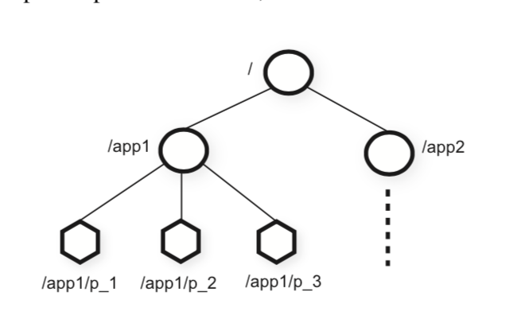

# Zookeeper论文翻译

Zookeeper论文原文详见[如下链接](./zookeeper.pdf)

## 原文翻译

### 摘要

本篇文章将介绍一个名为zookeeper的分布式协调服务。在服务的分层架构中，由于zookeeper的功能定位，它担当一个基础服务。类似于下图：

```shell

|  业务系统1  |  |  业务系统2  |  |  业务系统3  |

|                zookeeper                  |

```

zookeeper将一系列协调服务的功能（例如群组消息、注册管理、分布式锁等）抽象化成一组wait-free的、事件驱动的API整合在了一个多副本、统一的服务中。

由于zookeeper是一个基础服务，为了避免它成为系统的瓶颈，zookeeper提供的接口都是比较高效的。除了对数据操作是wait-free的这个特点外，zookeeper还为客户端命令顺序提供了一定的保证。对于同一客户端的请求，zk保证请求以FIFO的顺序进行处理，而对于不同客户端的更改Zk状态的请求，也提供了串行化支持。ZK通过高性能的管道处理来完成上述功能的实现。在后面，我们会提供在不同读写压力下，zk的处理性能状况。数据证明，这种性能表现使ZooKeeper可以被客户端应用程序广泛使用。

### 1. 介绍

对于大规模的分布式系统来说，多系统协作有很多种形式：

1. 配置管理，事实上配置管理是多系统协作最基本的一个问题。简单的讲，配置管理实际上就是维护一个参数列表，不过这个列表中的参数很多都可能是动态的。
2. 组成员管理和Leader选举。在一个集群中，我们通常要了解节点的存活情况以及节点的管理状况。
3. 锁。对于多个系统存在互斥操作时，锁通常是一个很有效的协调工具。

事实上除了上述这些，还有很多多系统协调的问题需要解决。常见的解决方式就是，一个问题开发一套协调系统。例如亚马逊的`Simple Queue Service`就用来专注于解决与队列相关的问题。对于配置管理、Leader选举等也分别创建了其他服务。但是实际上还可以通过实现一些功能更强大的基础原句去实现分布式系统的协调功能。例如谷歌的Chubby是一个具有强大的同步保证的锁服务，使用它可以实现Leader选举和服务治理等功能。

当设计我们自己当协作服务时，我们不再去考虑针对某个特定的协作功能实现一个单独的协作系统，而是通过提供一组特定的API，让开发人员使用这组API提供他们自己的原句操作来实现分布式系统的协作。但是这需要我们去实现一个提供业务无关的原句的协作内核。这种设计可以给开发人员更大的灵活性，通过这些原句实现更多的协作功能，而不是将开发人员限制在一组固定的原句中。

当设计Zookeeper的API时，我们避免使用锁这类阻塞原句。因为对于协作服务来说，阻塞原句可能会带来很多的问题，例如处理速度慢、客户端错误等，甚至会由于这个原因导致对客户端处理的影响（成为瓶颈）。如果客户端的业务处理强依赖于响应，或者请求失败，那么客户端本身的实现就会很复杂（因为要考虑更多失败情况的处理）。因此，Zookeeper在实现API时操作的是一组wait-free的树状数据结构，该结构类似于我们的文件系统。事实上，Zookeeper提供的API从方法标签上看，都很像一个常见的文件系统。Zk看起来很像`不提供lock\open\close方法`的Chubby，但是，实现了wait-free的zookeeper与基于阻塞的系统完全不同。

虽然wait-free这个特性对于效率和容错性来说相当重要，但是这对于多系统之间的协作管理来说仍是不够的。我们还需要一定的操作顺序性保证的支持。尤其是，我们发现保证同一客户端的所有操作的FIFO顺序和所有客户端的线性写操作对于客户端服务的实现大有裨益，这样的设计也足以完成我们感兴趣的应用之间的协作。根据Herlihy提出的继承结构[14]，Zookeeper实现了一种通用的对象结构，事实上，这种结构可以保证任意多个使用ZK提供的API的客户端达到自己想要的效果（达成共识）。

Zookeeper通过使用多副本来保证集群的高可用与高性能。高性能的特性使得大量的客户端或者应用进程可以通过zk提供的协作内核对协作数据进行管理。为了保证Zookeeper能够处理大量请求，以及保证请求的低延时，Zk使用流水线架构。流水线保证了同一客户端的所有请求的有序执行，保证客户端操作的有序性，可以让客户端放心进行异步提交操作。使用异步操作，客户端可以同时执行多个未完成的操作。这个特性是很有必要的，例如当一个新的Client成为Leader时，那么此时，集群内需要同步元数据，如果没有这个特性，那么调用端服务就会阻塞等待。

为了保证多客户端的写操作满足线性处理规则，，Zk实现了一个基于Leader的原子广播协议，该协议名为Zab。但是对于Zookeeper来说，其实更多的应该是读操作，因此需要针对这一点进行扩展以提高吞吐量。为了达到这一点，Zookeeper做了如下设计：对于读操作来说，ZK不使用Zab协议去保证它的有序性。

然而，事实上，尽管ZK的很多特点使其读取时吞吐量很大，但是我们仍不应该每次需要配置时都去读取它。将数据缓存到本地是一个提高读取配置效率的很好的方法。例如对于一个Follower来说，缓存其Leader的标示就很有效果，它不应该每次需要这个标示时都去查询。为了保证数据的准确性，Zookeeper提供了监听机制，当客户端监听的某些数据被更改时，客户端就会被通知，使用这种机制，客户端就可以及时更新本地缓存数据。而Chubby采用了另外一种机制：Chubby直接修改Client端的缓冲数据。因此在Chubby中会出现如下问题，当某个Client处理速度变慢或者出现了故障，那么更新操作就会被delay。Chubby通过使用租约来预防一个故障节点长期对Chubby进行阻塞。然而，租约只能限制慢速机器和故障机器的影响，而zk的监听机制则给到了更大的灵活性（原文是避免了这个问题）。

在这篇文章中，我们主要讨论ZK的设计与实现。我们可以通过Zookeeper提供的线性写的原句实现我们应用需要的功能。我们在后面会演示如何通过ZK实现分布式协调原句。

总结一下，在本篇文章中，我们会讨论如下内容：

1. `Coordination kernel`：我们提出了一种免等待的协调服务，该服务具有宽松的一致性保证，可用于分布式系统。实际上，我们已经在很多关键应用中使用了我们现在描述并实现的`Coordination kernel`，用于实现协调服务。
2. `Coordination recipes`：我们将介绍如何使用ZK实现一些高级协调原句，这部分原句甚至需要阻塞或者实现强一致性，但是他们是我们在分布式系统中经常使用的。
3. `Experience with Coordination`：我们会分享一些使用ZK并评估其性能的方式。

### 2. Zookeeper服务

Zookeeper的调用方（应用系统）通过Zookeeper的Client包调用一组API来向Zk服务端发送请求。另外，Zk的Client包除了提供API与服务器之间进行交互外，还管理客户端与Zookeeper服务器之间的网络连接。

在本节，我们先对Zookeeper的大体设计有个概览，然后接下来对客户端与服务端交互对API进行讨论。

术语：在本文中，我们使用`客户端(Client)`来表示一个Zookeeper服务的使用者。`服务端(Server)`来表示Zookeeper服务的提供者。`ZNode`表示Zookeeper的一个数据结构，Zookeeper内存中维护了一颗内存树，`ZNode`代表其中的一个节点。我们还使用术语“更新和写入”来指代任何修改数据树状态的操作。当Zookeeper客户端连接到服务端时，客户端建立一个Session，并且长期持有这个session，通过这个session与服务端交互。

#### 2.1 Service 概览

Zookeeper提供给客户端一组根据层次命名空间组织的数据节点（ZNode）。Zookeeper可以通过客户端API对这组API进行操作。这种层次命名空间通常被文件系统所使用。由于用户对这种抽象相当熟悉，因此使用这种结构组织数据就成为了一种相当友善的方法。因此我们用一个标准的UNIX文件系统描述符来表示一个znode。例如，我们使用`/A/B/C`来表示一个C节点，C节点的父节点是B节点，B节点的父节点是A节点。与文件系统节点不同的是，所有的znode都可以存储数据，并且除了临时节点，所有的节点都可以拥有子节点。



ZK的客户端可以创建两类节点：

1. 普通节点：客户端可以通过显式的创建和删除操作来对该类节点进行处理
2. 临时节点：客户端同样可以显示的创建和删除临时节点，不过除此之外，当创建临时节点的Session中断时，临时节点会自动的删除自己。

另外，znode在创建时还可以被设置成sequential的。这类节点在被创建时会在其名字后面添加一个递增的计数器的值。如果n是新创建的节点，p是n节点的父节点，那么当创建n节点时，n节点名字后的数字后缀会大于p节点下所有的子节点的后缀。

为了使客户端在不持续拉取服务端数据的基础上，当服务端数据发生变更时，客户端得到实时的通知，Zk实现了一个监听机制。当一个标示着需要监听的读请求发送到服务端时，服务端会正常执行读请求的操作，并且承诺，在读取的数据发生变化时主动通知客户端。不过需要注意，zk的监听机制是基于Session的一次性的监听，这意味着只有被监听的节点第一次修改时会通知到客户端，并且一旦Session关闭，监听机制便无法正常运行，而且，监听机制仅仅说明数据已经发生更改，并不会给出数据变成了什么（这样做是有好处的，如果数据频繁更新，那么如果告知数据改变，那么客户端获取到的数据很有可能是过期的数据）。例如，如果客户端发起了一个`getData("/foo", true)`的读请求，请求`"/foo"`节点下的数据，并且在这之后发生了两次对`"/foo"`节点的修改操作，然而，客户端也仅仅只会收到一个事件通知。而且除了对于节点的事件通知外，ZK还提供了`Session事件通知`，由于基于节点的事件通知是基于Session来做的，为了保证当Session断开时，客户端可以作出响应，因此也会通知客户端。

`数据结构`。Zookeeper使用的数据结构本质上说是是一个具有简化API并且可以进行完整数据读写的文件系统，并且它又是一个具有层级结构的键值表。具有层次结构的命名空间允许我们针对不同应用，为其分配不同的子树，并且根据子树限制访问权限。我们将在2.4节中给出使用这种层次命名空间结构创建高级协调原句的例子。

与传统文件系统不同的是，Znode并不适用于存储常规数据。一般来说，Znode会讲将客户端应用进行抽象，存储到ZK的树形结构中，并使用这种结构来完成分布式系统协调的目的。（为了方便，这里再次把论文中上面的图给一次）以下图为例：


现在Zk的根节点有两颗子树，其路径分别为`/app1`和`/app2`，这两颗子树分别代表两个客户端应用，其中`app1`实现了一个简单的组成员管理协议，即组成员服务启动时，在`/app1`下注册一个临时有序节点，只要组成员服务存活，该节点就会存在。

虽然ZK不会存储常规的业务数据，但是允许存储客户端应用中用于分布式协调的配置或者元数据信息。例如，对于一个Leader-based的应用，客户端应用需要了解当前哪个服务器是Leader，因此，我们可以将Leader的信息写入到ZK的一个znode中。事实上，Znode本身还提供了时间戳和版本计数器相关的支持，因此这允许客户端执行基于Znode版本的更新以及查询操作。

`Session`。客户端连接到ZK服务端时，服务端会为其创建一个具有超时时间的Session。Zookeeper通过超时机制来解决客户端断开连接的问题，以此来保证自己的容错性。Session会在如下两种情况断开：

1. 客户端主动关闭Session
2. ZK监测到客户端故障

通过Session机制，当客户端的操作执行成功时，客户端可以得到及时的响应。

#### 2.2 客户端API

下面给出ZK提供的API，并讨论每个原句的语义：

1. `create(path, data, flags)`：使用路径名`path`创建一个znode，并且将`data[]`中的数据放入到其中。`flags`用于设置临时节点、序列节点，这两个特点。
2. `delete(path, version)`：如果znode与调用方指出的version相同，则删除
3. `exists(path, watch)`：如果指定路径的znode存在的话，那么返回true，否则返回false。watch标志标示是否要监听该node。
4. `getData(path, watch)`：返回znode中存储的数据以及znode自身的元数据，例如版本信息。watch标志与exists()方法中含义相同，如果节点不存在了，则不会监听该节点。
5. `setData(path, data, version)`：如果指定的version与服务器中version相同，那么将数据写入到path标示的znode中
6. `getChildren(path, watch)`：返回path对应的znode的子节点的名称集合。
7. `sync(path)`：等待该命令开始时，所有未定的更新传播到服务器，此处的path参数可以忽略

上述所有的API都有同步和异步两个版本。当ZK客户端执行单个的原子操作，没有并发任务执行时，可以选择使用同步API，但是这会使zk进行必要的阻塞和同步。