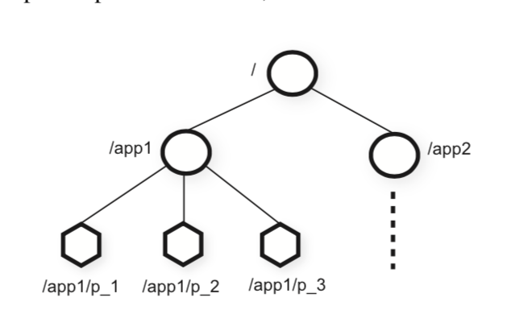

# Zookeeper论文翻译

Zookeeper论文原文详见[如下链接](./zookeeper.pdf)

## 原文翻译

### 摘要

本篇文章将介绍一个名为zookeeper的分布式协调服务。在服务的分层架构中，由于zookeeper的功能定位，它担当一个基础服务。类似于下图：

```shell

|  业务系统1  |  |  业务系统2  |  |  业务系统3  |

|                zookeeper                  |

```

zookeeper将一系列协调服务的功能（例如群组消息、注册管理、分布式锁等）抽象化成一组wait-free的、事件驱动的API整合在了一个多副本、统一的服务中。

由于zookeeper是一个基础服务，为了避免它成为系统的瓶颈，zookeeper提供的接口都是比较高效的。除了对数据操作是wait-free的这个特点外，zookeeper还为客户端命令顺序提供了一定的保证。对于同一客户端的请求，zk保证请求以FIFO的顺序进行处理，而对于不同客户端的更改Zk状态的请求，也提供了串行化支持。ZK通过高性能的管道处理来完成上述功能的实现。在后面，我们会提供在不同读写压力下，zk的处理性能状况。数据证明，这种性能表现使ZooKeeper可以被客户端应用程序广泛使用。

### 1. 介绍

对于大规模的分布式系统来说，多系统协作有很多种形式：

1. 配置管理，事实上配置管理是多系统协作最基本的一个问题。简单的讲，配置管理实际上就是维护一个参数列表，不过这个列表中的参数很多都可能是动态的。
2. 组成员管理和Leader选举。在一个集群中，我们通常要了解节点的存活情况以及节点的管理状况。
3. 锁。对于多个系统存在互斥操作时，锁通常是一个很有效的协调工具。

事实上除了上述这些，还有很多多系统协调的问题需要解决。常见的解决方式就是，一个问题开发一套协调系统。例如亚马逊的`Simple Queue Service`就用来专注于解决与队列相关的问题。对于配置管理、Leader选举等也分别创建了其他服务。但是实际上还可以通过实现一些功能更强大的基础原句去实现分布式系统的协调功能。例如谷歌的Chubby是一个具有强大的同步保证的锁服务，使用它可以实现Leader选举和服务治理等功能。

当设计我们自己当协作服务时，我们不再去考虑针对某个特定的协作功能实现一个单独的协作系统，而是通过提供一组特定的API，让开发人员使用这组API提供他们自己的原句操作来实现分布式系统的协作。但是这需要我们去实现一个提供业务无关的原句的协作内核。这种设计可以给开发人员更大的灵活性，通过这些原句实现更多的协作功能，而不是将开发人员限制在一组固定的原句中。

当设计Zookeeper的API时，我们避免使用锁这类阻塞原句。因为对于协作服务来说，阻塞原句可能会带来很多的问题，例如处理速度慢、客户端错误等，甚至会由于这个原因导致对客户端处理的影响（成为瓶颈）。如果客户端的业务处理强依赖于响应，或者请求失败，那么客户端本身的实现就会很复杂（因为要考虑更多失败情况的处理）。因此，Zookeeper在实现API时操作的是一组wait-free的树状数据结构，该结构类似于我们的文件系统。事实上，Zookeeper提供的API从方法标签上看，都很像一个常见的文件系统。Zk看起来很像`不提供lock\open\close方法`的Chubby，但是，实现了wait-free的zookeeper与基于阻塞的系统完全不同。

虽然wait-free这个特性对于效率和容错性来说相当重要，但是这对于多系统之间的协作管理来说仍是不够的。我们还需要一定的操作顺序性保证的支持。尤其是，我们发现保证同一客户端的所有操作的FIFO顺序和所有客户端的线性写操作对于客户端服务的实现大有裨益，这样的设计也足以完成我们感兴趣的应用之间的协作。根据Herlihy提出的继承结构[14]，Zookeeper实现了一种通用的对象结构，事实上，这种结构可以保证任意多个使用ZK提供的API的客户端达到自己想要的效果（达成共识）。

Zookeeper通过使用多副本来保证集群的高可用与高性能。高性能的特性使得大量的客户端或者应用进程可以通过zk提供的协作内核对协作数据进行管理。为了保证Zookeeper能够处理大量请求，以及保证请求的低延时，Zk使用流水线架构。流水线保证了同一客户端的所有请求的有序执行，保证客户端操作的有序性，可以让客户端放心进行异步提交操作。使用异步操作，客户端可以同时执行多个未完成的操作。这个特性是很有必要的，例如当一个新的Client成为Leader时，那么此时，集群内需要同步元数据，如果没有这个特性，那么调用端服务就会阻塞等待。

为了保证多客户端的写操作满足线性处理规则，，Zk实现了一个基于Leader的原子广播协议，该协议名为Zab。但是对于Zookeeper来说，其实更多的应该是读操作，因此需要针对这一点进行扩展以提高吞吐量。为了达到这一点，Zookeeper做了如下设计：对于读操作来说，ZK不使用Zab协议去保证它的有序性。

然而，事实上，尽管ZK的很多特点使其读取时吞吐量很大，但是我们仍不应该每次需要配置时都去读取它。将数据缓存到本地是一个提高读取配置效率的很好的方法。例如对于一个Follower来说，缓存其Leader的标示就很有效果，它不应该每次需要这个标示时都去查询。为了保证数据的准确性，Zookeeper提供了监听机制，当客户端监听的某些数据被更改时，客户端就会被通知，使用这种机制，客户端就可以及时更新本地缓存数据。而Chubby采用了另外一种机制：Chubby直接修改Client端的缓冲数据。因此在Chubby中会出现如下问题，当某个Client处理速度变慢或者出现了故障，那么更新操作就会被delay。Chubby通过使用租约来预防一个故障节点长期对Chubby进行阻塞。然而，租约只能限制慢速机器和故障机器的影响，而zk的监听机制则给到了更大的灵活性（原文是避免了这个问题）。

在这篇文章中，我们主要讨论ZK的设计与实现。我们可以通过Zookeeper提供的线性写的原句实现我们应用需要的功能。我们在后面会演示如何通过ZK实现分布式协调原句。

总结一下，在本篇文章中，我们会讨论如下内容：

1. `Coordination kernel`：我们提出了一种免等待的协调服务，该服务具有宽松的一致性保证，可用于分布式系统。实际上，我们已经在很多关键应用中使用了我们现在描述并实现的`Coordination kernel`，用于实现协调服务。
2. `Coordination recipes`：我们将介绍如何使用ZK实现一些高级协调原句，这部分原句甚至需要阻塞或者实现强一致性，但是他们是我们在分布式系统中经常使用的。
3. `Experience with Coordination`：我们会分享一些使用ZK并评估其性能的方式。

### 2. Zookeeper服务

Zookeeper的调用方（应用系统）通过Zookeeper的Client包调用一组API来向Zk服务端发送请求。另外，Zk的Client包除了提供API与服务器之间进行交互外，还管理客户端与Zookeeper服务器之间的网络连接。

在本节，我们先对Zookeeper的大体设计有个概览，然后接下来对客户端与服务端交互对API进行讨论。

术语：在本文中，我们使用`客户端(Client)`来表示一个Zookeeper服务的使用者。`服务端(Server)`来表示Zookeeper服务的提供者。`ZNode`表示Zookeeper的一个数据结构，Zookeeper内存中维护了一颗内存树，`ZNode`代表其中的一个节点。我们还使用术语“更新和写入”来指代任何修改数据树状态的操作。当Zookeeper客户端连接到服务端时，客户端建立一个Session，并且长期持有这个session，通过这个session与服务端交互。

#### 2.1 Service 概览

Zookeeper提供给客户端一组根据层次命名空间组织的数据节点（ZNode）。Zookeeper可以通过客户端API对这组API进行操作。这种层次命名空间通常被文件系统所使用。由于用户对这种抽象相当熟悉，因此使用这种结构组织数据就成为了一种相当友善的方法。因此我们用一个标准的UNIX文件系统描述符来表示一个znode。例如，我们使用`/A/B/C`来表示一个C节点，C节点的父节点是B节点，B节点的父节点是A节点。与文件系统节点不同的是，所有的znode都可以存储数据，并且除了临时节点，所有的节点都可以拥有子节点。



ZK的客户端可以创建两类节点：

1. 普通节点：客户端可以通过显式的创建和删除操作来对该类节点进行处理
2. 临时节点：客户端同样可以显示的创建和删除临时节点，不过除此之外，当创建临时节点的Session中断时，临时节点会自动的删除自己。

另外，znode在创建时还可以被设置成sequential的。这类节点在被创建时会在其名字后面添加一个递增的计数器的值。如果n是新创建的节点，p是n节点的父节点，那么当创建n节点时，n节点名字后的数字后缀会大于p节点下所有的子节点的后缀。

为了使客户端在不持续拉取服务端数据的基础上，当服务端数据发生变更时，客户端得到实时的通知，Zk实现了一个监听机制。当一个标示着需要监听的读请求发送到服务端时，服务端会正常执行读请求的操作，并且承诺，在读取的数据发生变化时主动通知客户端。不过需要注意，zk的监听机制是基于Session的一次性的监听，这意味着只有被监听的节点第一次修改时会通知到客户端，并且一旦Session关闭，监听机制便无法正常运行，而且，监听机制仅仅说明数据已经发生更改，并不会给出数据变成了什么（这样做是有好处的，如果数据频繁更新，那么如果告知数据改变，那么客户端获取到的数据很有可能是过期的数据）。例如，如果客户端发起了一个`getData("/foo", true)`的读请求，请求`"/foo"`节点下的数据，并且在这之后发生了两次对`"/foo"`节点的修改操作，然而，客户端也仅仅只会收到一个事件通知。而且除了对于节点的事件通知外，ZK还提供了`Session事件通知`，由于基于节点的事件通知是基于Session来做的，为了保证当Session断开时，客户端可以作出响应，因此也会通知客户端。

`数据结构`。Zookeeper使用的数据结构本质上说是是一个具有简化API并且可以进行完整数据读写的文件系统，并且它又是一个具有层级结构的键值表。具有层次结构的命名空间允许我们针对不同应用，为其分配不同的子树，并且根据子树限制访问权限。我们将在2.4节中给出使用这种层次命名空间结构创建高级协调原句的例子。

与传统文件系统不同的是，Znode并不适用于存储常规数据。一般来说，Znode会讲将客户端应用进行抽象，存储到ZK的树形结构中，并使用这种结构来完成分布式系统协调的目的。（为了方便，这里再次把论文中上面的图给一次）以下图为例：


现在Zk的根节点有两颗子树，其路径分别为`/app1`和`/app2`，这两颗子树分别代表两个客户端应用，其中`app1`实现了一个简单的组成员管理协议，即组成员服务启动时，在`/app1`下注册一个临时有序节点，只要组成员服务存活，该节点就会存在。

虽然ZK不会存储常规的业务数据，但是允许存储客户端应用中用于分布式协调的配置或者元数据信息。例如，对于一个Leader-based的应用，客户端应用需要了解当前哪个服务器是Leader，因此，我们可以将Leader的信息写入到ZK的一个znode中。事实上，Znode本身还提供了时间戳和版本计数器相关的支持，因此这允许客户端执行基于Znode版本的更新以及查询操作。

`Session`。客户端连接到ZK服务端时，服务端会为其创建一个具有超时时间的Session。Zookeeper通过超时机制来解决客户端断开连接的问题，以此来保证自己的容错性。Session会在如下两种情况断开：

1. 客户端主动关闭Session
2. ZK监测到客户端故障

通过Session机制，当客户端的操作执行成功时，客户端可以得到及时的响应。

#### 2.2 客户端API

下面给出ZK提供的API，并讨论每个原句的语义：

1. `create(path, data, flags)`：使用路径名`path`创建一个znode，并且将`data[]`中的数据放入到其中。`flags`用于设置临时节点、序列节点，这两个特点。
2. `delete(path, version)`：如果znode与调用方指出的version相同，则删除
3. `exists(path, watch)`：如果指定路径的znode存在的话，那么返回true，否则返回false。watch标志标示是否要监听该node。
4. `getData(path, watch)`：返回znode中存储的数据以及znode自身的元数据，例如版本信息。watch标志与exists()方法中含义相同，如果节点不存在了，则不会监听该节点。
5. `setData(path, data, version)`：如果指定的version与服务器中version相同，那么将数据写入到path标示的znode中
6. `getChildren(path, watch)`：返回path对应的znode的子节点的名称集合。
7. `sync(path)`：等待该命令开始时，所有未定的更新传播到服务器，此处的path参数可以忽略

上述所有的API都有同步和异步两个版本。当ZK客户端执行单个的原子操作，没有并发任务执行时，可以选择使用同步API，但是这会使zk进行必要的阻塞和同步。异步API接口可以让应用程序执行多个Zookeeper操作，并且同时可以执行自己的业务逻辑。Zookeeper保证按照异步操作的顺序接收回调响应。

注意Zookeeper不能通过相对路径来访问Znode，每个操作都需要提供完整的znode路径。这种设计不仅仅简化了API（不需要open()和close()），同时使服务器端没必要去维护额外的客户端状态。

Zookeeper的每个更新操作都需要提供一个版本号，这一设计实现了一种基于条件的更新，如果服务器在进行更新操作时，发现当前版本号与API传过来的版本号不匹配，那么就会因为版本号不匹配而失败。如果你希望自己的更新操作绕过这一层版本号检查，可以将版本号设置为-1。

#### 2.3 Zookeeper所提供的支持

Zookeeper提供了如下两个特点保证顺序性：

1. 线性化写入： 所有更新Zookeeper服务端状态的请求都会被序列化，并且保证其顺序执行
2. 同一客户端请求保证FIFO：相同客户端的请求都会按照其发送顺序执行

注意，这里我们说的线性化与Herlihy所提到的线性化不同，我们将它称为A-linearizability（异步线性化）。根据Herlihy所提到的传统线性化理念，一个客户端只允许同时执行一条操作流。然而在Zookeeper中，一个客户端可能同时对Zookeeper有多个操作，因此这时候我们可以对操作执行的顺序性保证或者不保证其实都是可以的。但是最终，我们还是选择保证操作的顺序性。需要注意的是，一个系统如果满足异步线性化那么他也满足线性化，因此线性化对象的操作结果也适用于异步线性化对象。事实上，只有对于zk的更新操作才需要线性化，因此zk的读取操作也分布在各个副本上。这使得ZK集群可以得到线性扩展。

为了更好的了解上面的两个特性是怎么组合完成各项工作的，让我们思考如下情况。一个系统要选举一个Leader来指挥其他的Worker工作。当选出一个Leader时，它务必会对原有的配置参数进行更改，并且在更改完成之后通知其他的worker。那么这里有两个问题需要注意。

1. 新的Leader开始对数据进行更改时，我们不希望worker工作。因为worker持有的数据是过期的数据。
2. 如果新的Leader在更新完毕配置之前宕机了，那么我们不希望这部分配置被worker使用。

这里我们考虑一种解决方案：分布式锁。分布式锁实际上只能帮我们解决第一个问题（Leader更新数据时获取锁，更新完毕释放锁），而并不能处理第二个问题。但是使用ZK，我们可以采用如下方案解决上述两个问题：新的Leader节点可以使用一个名为ready的znode，只有当该节点存在时，ZK的配置项才可以使用，否则，ZK的配置项不可以使用。在新节点开始更新配置之前，首先删除ready节点，然后再进行更新配置操作，更新完毕后创建ready节点。虽然对于ZK的一个更新操作可能只需要2ms左右，但是事实上，一个新的Leader可能会更新5000个不同的节点，甚至更多，如果请求是串行的，那么这批操作将会花费10s左右，使用异步API可能也需要1s。但是由于ZK的顺序性保证，只要Worker节点观察到了ready节点，那么新的Leader一定是完成了更新操作。如果出现情况2，及新Leader在更新完毕配置前宕机了，那么Worker将不会看到ready节点。

那么这里又有一个问题，如果新的Leader在更新数据之前，被一个worker观察到存在ready节点，然后开始读取数据，此时Leader开始更新数据，这种情况怎么办。对于这个问题，ZK通过保证的顺序性并且使用监听机制解决这个问题。如果一个worker对某个特定的Znode进行了监听，那么该Znode被更改时，该worker会得到通知。因此，如果一个客户端在配置更改之前读取到了ready节点，那么当节点数据更改的时候，该客户端会被通知，告知它对应的节点数据已经被更改，那么客户端就可以去读取新的配置。

除了上述的问题外，还有一种特殊情况。如果ZK的两个客户端不是通过同一个zk节点共享配置，而是通过自定义实现的协议进行沟通，那么可能会出现如下问题。考虑A客户端和B客户端共享一个ZK集群中的一个配置项。当A客户端更改了共享的配置项时，此时通过自定义协议通知客户端B，那么此时，B客户端希望获取到新的配置信息。但是如果B客户端读的是集群中的一个Follower节点，那么它的数据可能没有被及时同步，导致B客户端读取到的数据仍是旧数据，此时就出现了问题。如果能使节点B在配置项写后再进行一次配置重读，就可以解决这个问题。为了解决上述问题，ZK提供了sync方法。sync请求常常配合read请求使用，先进性sync再进行read操作。sync使服务器在处理读取之前应用所有挂起的写入请求，而不会产生完全写入的开销。sync原句与ISIS的flush原句十分相似。

除了上面的特性外，ZK还支持如下两个特性：

1. 保活性，如果ZK集群的大部分节点是可用的，并且可以进行通信，那么整个集群就是可用的。
2. 持久性，对于更新请求，如果ZK集群响应成功，那么尽管服务器宕机了，但是只要能够恢复一定数量的服务器，数据就会持久存在，不会丢失。

#### 2.4  原句实现的例子

在本节，将会介绍如何使用ZK提供的API来实现功能更强大的原句。注意，ZK服务端对这些相对功能更强力的原句是无感知的，因为这些原句的都是由客户端调用API实现的。对于部分原句实现，它们也会是wait-free的，例如成员管理、配置管理相关的原句。但是有一些原句则需要阻塞来等待一些事件的完成。即使ZK是wait-free的，我们也可以用它来实现一些高效的阻塞的原句。ZK的顺序性保证了系统状态的正确更改，监听机制保证在配置发生更改时能够及时进行通知。

配置管理。ZK可以为分布式系统提供动态配置管理。使用ZK实现配置管理的最简单的方式就是将配置存储在一个ZNode中，例如这个node是zc。那么当客户端启动时，就通过zc的全路径从ZK中读取配置，并监听该节点。如果zc中存储的配置被更新了，那么客户端就会被通知，然后客户端读取新的配置，并再次监听zc节点。

在这种场景中，监听机制是相当重要的，我们使用这种机制来确保客户端获取到的配置是最新的。例如，如果一个客户端监听了zc节点，此时节点被更改了，客户端就会被通知，如果第三次更改发生了，此时客户端才去读取zc节点的数据，虽然客户端只被通知了一次，但是这种情况是没有影响的，因为无论如何，客户端取到的都是最新数据。

Rendezvous，在分布式系统中，并不是每个客户端都要优先获取集群配置的，其实还有如下情况。例如集群中一个客户端想要启动一个主进程以及多个工作进程，主进程主要负责对工作进程进行调度。传统情况下，工作进程需要等主进程创建完毕之后再进行创建。但是如果工作进程的初始化操作相对耗时，这样工作进程和主进程可以同时启动，此时就出现一个问题。工作进程无法了解主进程的元数据信息，无法与主进程进行交互。ZK为我们提供了一个方案解决该问题：主进程和工作进程可以共享一个配置节点zr，工作进程从该节点获取主进程的配置信息。当主进程初始化完毕时，将自身的元数据填充到zr节点中。工作进程启动时，优先处理其他初始化操作，最后处理获取主节点元数据的操作，而获取就是从zr节点中获取。当获取不到master元数据时，工作节点可以为zr节点添加监听器，这样也避免了阻塞。如果创建的zr节点是临时节点，那么主节点和工作节点都可以在节点被更新和删除时得到通知。

Group Membership。ZK临时节点的特性为我们实现组成员管理提供了很大的帮助。当创建一个组时，我们会在ZK中创建一个节点zg，当一个客户端成为组成员的一员时，就在zg下创建一个临时节点。如果客户端拥有自己的唯一ID，那么临时节点名可以为这个唯一ID，否则可以将创建的子节点设置为一个序列节点，该节点用于存储客户端数据。

当代表客户端的zg子节点创建后,客户端才正常启动.这种方式简化了客户端实现难度,客户端无需太多的关心自身在集群中的状态.如果客户端宕机了,那么zg下对应的子节点就会被ZK自动移除.

ZK客户端可以通过获取zg节点列表来获取组成员信息.如果一个客户端向监听组成员的改变,那么只需监听zg节点,此时一旦组成员状态发生改变,客户端就会被通知.

Simple Locks.虽然ZK不是一个锁服务,但是他却能用来实现锁.就像上面展示的一样,应用程序通常使用ZK提供的API自定义实现符合自己业务需求的定制化同步原句.下面我们将展示一种最简单通用的同步原句.

最简单的锁实现是使用"锁文件",即通过一个ZNode实现锁.当客户端获取锁时,会创建一个ZNode临时节点.如果创建成功,那么就获取到了锁.而释放锁就是删除创建的ZNode.其余竞争锁的客户端,可以尝试去监听该ZNode.当之前获取到锁的客户端释放了锁,那么其余的竞争锁的客户端就会收到通知,此时,他们就可以再次竞争锁.

然而这种简单锁协议是由一定问题的:

1. 这种锁有一定的集群效应.如果有很多客户端在等待锁,那么一旦锁释放之后,所有的节点都会同时竞争锁.锁竞争会非常强烈.
2. 这种方式仅仅能实现互斥锁.

下面将介绍的两种原句会解决上述的两个问题.

Simple Locks without Herd Effect 我们通过定义znode l来实现这种功能的锁.为了解决上面锁竞争激烈的问题,我们线性化所有客户端获取锁的请求,并使这些客户端按照请求到达顺序来获取锁.因此客户端为了获取锁,需要实现如下伪代码:

```
Lock
1 n=create(1+"/lock",EPHEMERAL|SEQUENTAL)
2 c=getChildren(l,false)
3 if n is lowest znode in c,exit
4 p = znode in c ordered just before n
5 if exists(p, true) wait for watch event
6 goto 2

Unlock
1 delete(n)
```

需要竞争锁的节点都在l节点下创建一个前缀是lock的临时顺序节点，然后尝试获取l节点下的所有子节点。如果当前客户端创建的节点正好是l子节点列表下最小的，那么该客户端就获取到了锁，否则，监听当前获取锁的节点，等待监听事件发生，锁被释放时，客户端会得到通知，继续尝试获取l节点下所有子节点。而客户端释放锁，仅仅是删除l节点下对应的子节点罢了。

这种方式，通过使用临时节点来处理客户端宕机。这样，当客户端宕机时，临时节点会自动删除，就不会参加锁竞争了。

总之，这种方式实现的锁有如下优势：

1. 减少锁竞争，每次获取锁时，永远只有一个客户端会被真正的唤醒，而不会导致多客户端同时竞争锁，因此没有所谓的集群效应。（其实也是公平锁的优点）
2. 不需要通过轮训实现锁，而且没有超时限制，如果你需要，其实也可以实现。
3. 因为我们使用ZK实现的锁，而且存储了各个客户端获取锁的状态，因此可以通过ZK的状态来排查锁相关的问题。


Read/Write Lock。为了实现读写锁，我们需要简单的修改一下刚才的锁程序，并且将读锁和写锁分开处理。

```
Write Lock
1 n=create(l+"/write-",EPHEMERAL|SEQUENTAL)
2 C=getChildren(l,false)
3 if n is lowest znode in c,exit
4 p = znode in c ordered just before n
5 if exists(p, true) wait for watch event
6 goto 2

Read Lock
1 n = create(l + “/read-”, EPHEMERAL|SEQUENTIAL)
2 C = getChildren(l, false)
3 if no write znodes lower than n in C, exit
4 p = write znode in C ordered just before n
5 if exists(p, true) wait for event
6 goto 3
```

这里，我们将刚才的锁程序做了一个简单的修改，写锁的程序只是简单的换了个名字。读锁的处理逻辑变动相对比较大，这里简单描述一下。因为读锁其实就是共享锁，我们查看第3-4行处理逻辑：

```
3 如果C中，没有比n更小的节点，证明获取到了读锁
4 如果不满足3的条件，那么写入节点，并开始监听获取到写锁的节点。
```

但是，读写锁会带来之前说的集群效应，也就是锁竞争问题，只要多个读锁和一个写锁在同时等待一个写锁的释放，那么当锁释放时，锁竞争就会出现。