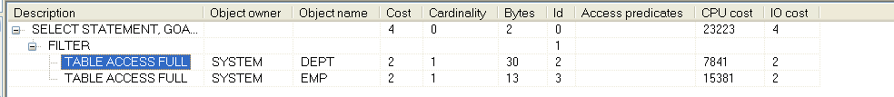
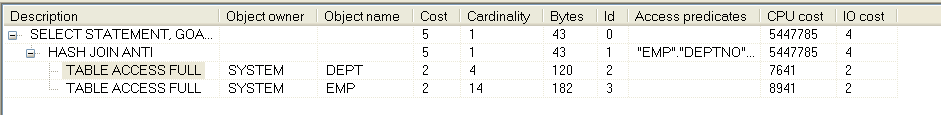
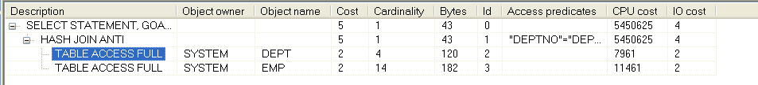
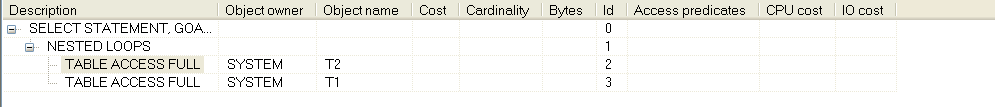
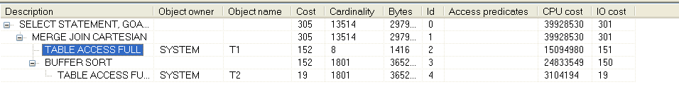
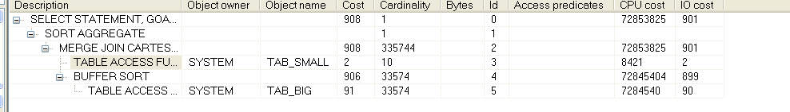
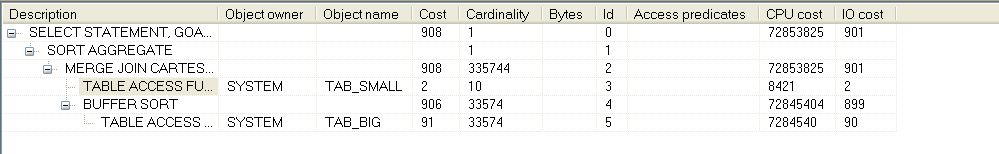

# 一、从案例中推导SQL优化的总体思路与误区

## 1. 缺乏对讹传的辨识力

下面我们总结几个常见的讹传，用以辟谣。

### 1. count(*)与count(列)的快慢问题

    讹传：只用count(列)不用count(*)；

在Oracle中，对于普通的表，无索引，无主键的表，count(*)与count(列)同样快。考察下面的例子：

    create table t as select * from dba_objects;
    update t set object_id =rownum ;

数据库表由上述条件构建，未指定主键，未添加索引，我们先执行count(*)。

    select count(*) from t;

查看得到的执行计划：

与count(列)比较执行计划0.png)

可见，上述指令对整个表进行了一次全表扫描。现在我们使用count(列)：

    select count(object_id) from t;

查看得到的执行计划：

与count(列)比较执行计划1.png)

可见，后者也是对整个表做了一次全表扫描，并且两者COST值相同。是不是代表两者效率相同呢？

我们给object_id添加索引在进行尝试：

    create index idx_object_id on t(object_id);

然后执行`select count(*) from t`，执行计划如下：

与count(列)比较执行计划2.png)

可以看到索引对`count(*)`好似没有什么作用，那么我们再执行`select count(object_id) from t;`，查看执行计划：

与count(列)比较执行计划3.png)

可以发现COST明显变少了，而且这次使用的是索引扫描。

`那么count(列)走索引，count(*)不走索引么?`

我们在上述指定的只是一个简单索引，而不是非空索引，下面我们将上述列指定为非空：

    alter table T modify object_id  not  null;

现在再执行上述两条查询，执行计划如下：

count(*):

与count(列)比较执行计划4.png)

count(object_id):

与count(列)比较执行计划5.png)

可以看到这次两者都是走索引的，所以我们得出结论：

`count(*)在有非空的索引的情况下，走索引，否则，走全表扫描，count(列)有索引就走索引，没有就走全表扫描。`

那是不是`count(列)`就比`count(*)`好呢？

我们考察下面的例子：

下面我们构建一个脚本:(大佬写的)

    DROP TABLE t;
    DECLARE
    l_sql VARCHAR2(32767);
    BEGIN
    l_sql := 'CREATE TABLE t (';
    FOR i IN 1..25 
    LOOP
        l_sql := l_sql || 'n' || i || ' NUMBER,';
    END LOOP;
    l_sql := l_sql || 'pad VARCHAR2(1000)) PCTFREE 10';
    EXECUTE IMMEDIATE l_sql;
    END;

上述脚本生成了一个t表，总共有25列。

    DECLARE
    l_sql VARCHAR2(32767);
    BEGIN
    l_sql := 'INSERT INTO t SELECT ';
    FOR i IN 1..25
    LOOP
    l_sql := l_sql || '0,';
    END LOOP;
    l_sql := l_sql || 'NULL FROM dual CONNECT BY level <= 10000';
    EXECUTE IMMEDIATE l_sql;
    COMMIT;
    END;

这个脚本用于插入数据。

    DECLARE
    l_dummy PLS_INTEGER;
    l_start PLS_INTEGER;
    l_stop PLS_INTEGER;
    l_sql VARCHAR2(100);
    BEGIN
    l_start := dbms_utility.get_time;
    FOR j IN 1..1000
    LOOP
        EXECUTE IMMEDIATE 'SELECT count(*) FROM t' INTO l_dummy;
    END LOOP;
    l_stop := dbms_utility.get_time;
    dbms_output.put_line((l_stop-l_start)/100);

    FOR i IN 1..25
    LOOP
        l_sql := 'SELECT count(n' || i || ') FROM t';
        l_start := dbms_utility.get_time;
        FOR j IN 1..1000
        LOOP
        EXECUTE IMMEDIATE l_sql INTO l_dummy;
        END LOOP;
        l_stop := dbms_utility.get_time;
        dbms_output.put_line((l_stop-l_start)/100);
    END LOOP;
    END;

最后的脚本用于测试`count(*)`和分别`count(各个列)`的时间，结果如下：

    .26
    .45
    .47
    .46
    .46
    .49
    .5
    .51
    .54
    .57
    .63
    .61
    .65
    .69
    .74
    .76
    .85
    .81
    .81
    .86
    .97
    .92
    .92
    .96
    1.03
    1.01

可以发现`count(*)`的时间是最短的。而且随着列的偏移量越大，访问时间越长。

结论如下：

`列的偏移量决定性能，列越靠后，访问的开销越大。由于count(*)的算法与列偏移量无关，所以count(*)最快。`

2. NOT IN 和 NOT EXISTS 哪个更好

    讹传：NOT EXISTS 比 NOT IN 效率高。

我们考察下面的例子，建表语句如下：

    drop table emp purge;
    drop table dept purge;
    create table emp as select * from scott.emp;
    create table dept as select * from scott.dept;

这里创建了两张表，没有任何索引等信息，那么现在首先使用NOT IN语法：

    select * from dept where deptno NOT IN ( select deptno from emp ) ;

这里查找了不在emp表但是在dept表中的所有dept信息。

执行计划如图：

可以看到这里使用的是`FILTER`的过滤方法。我们考虑使用NOT EXISTS语法：

    select * from dept where not exists ( select deptno from emp where emp.deptno=dept.deptno) ;

执行计划如图：

根据执行计划我们看到，这里使用的是`HASH JOIN ANTI`的过滤方法。

大佬说`HASH JOIN ANTI`的方法要比`FILTER`效率高，看来NOT EXISTS确实比`NOT IN`效率高，我们考察下面例子：

    select * from dept where deptno NOT IN ( select deptno from emp where deptno is not null) and deptno is not null;

执行计划如图：

当我们把`NOT IN`中的数据设置为非空，就使用`HASH JOIN ANTI`了。而且COST值还和使用`NOT EXISTS`一样。

现在我们给出结论：

`在Oracle 10g的情况下，我们使用NOT IN时，只有当IN中的数据都显示指定非空才会使用HASH JOIN ANTI否则会使用FILTER，然而NOT EXISTS则不会。`

`然而上述的限制在Oracle 11g中已经取消了，在此就不再做演示。`

### 3. 表的条件顺序与效率有关

    讹传：表的where过滤是从后往前来的，因此要把能尽量过滤多的数据的条件放在后面。

我们模拟这种情况，创建如下数据库：

    drop table t1 purge;
    drop table t2 purge;
    create table t1 as select * from dba_objects;
    create table t2 as select rownum id ,dbms_random.string('b', 50) n ,data_object_id data_id from dba_objects where rownum<=10000;

我们首先将数据筛选条件不等条件放在后面，等于条件放在左边：

    select  * from t1,t2 where t1.object_id=29 and t2.data_id>8

执行计划如下：

下面我们将条件调换位置：

    select  * from t1,t2 where t2.data_id>8 and t1.object_id=29 

执行计划如下：

看见没，就没nei事儿，其实以前是有的，但是被SQL优化器优化了，就没这事了。

结论：

`并没有什么条件顺序不同就就会导致效率不同的事情`

#### 4. 表的连接顺序与效率有关

    讹传：表的连接顺序与查询效率有关，小表放后面，大表放前面。

我们考虑如下情况：

    drop table tab_big;
    drop table tab_small;
    create table tab_big  as select * from dba_objects where rownum<=30000;
    create table tab_small  as select * from dba_objects where rownum<=10;

然后我们对这两个表，按照特定顺序进行连接：

    select count(*) from tab_big,tab_small   ;  
    select count(*) from tab_small,tab_big   ;

执行计划如下：

没错，就是两个一模一样，所以，没必要考虑那么多啦，SQL优化器已经给你优化好了。

## 2. 不具备少做事的意识

### 1. 分区

#### 1.分区删除

#### 2.分区查询