## 第一章 分布式系统介绍

### 1.1 初识分布式系统

#### 1.1.1 分布式系统的定义

引用`Distributed Systems Concepts and Design(Third Edition)`中的定义：

`A distributed system one in which components located at networked computers communicate and coordinate their actions only by passing messages.`

这句话指明：
1. 组件分布在网络计算机上；
2. 组件之间仅仅通过消息传递来通信并协调行动。

分布式系统示意图如下：

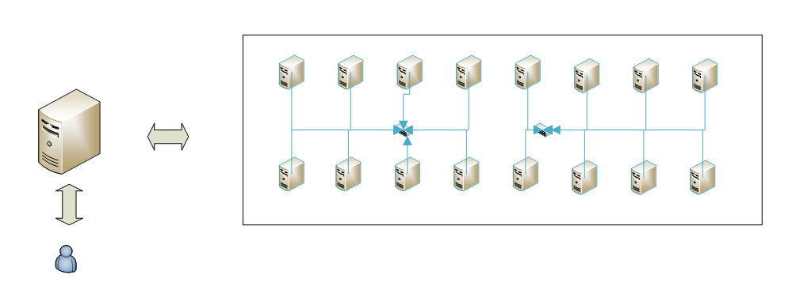

由上图我们可以看出，对于用户来说，其只面对单一服务器，而背后的集群对于用户来说是完全透明的。分布式系统相当于一个超级计算机一样。

对于分布式系统的定义，有如下理解：
- 分布式系统一定是由多个节点组成的系统，一般来说一个节点就是一台计算机。
- 各个节点之间不是孤立的，而是相互连通的。
- 节点上部署了我们的组件，相互之间的操作有协同。

#### 1.1.2 分布式系统的意义

分布式系统的意义：
1. 升级单机处理能力的性价比越来越低。
2. 单机处理能力存在瓶颈。
3. 出于稳定性和可用性考虑。

原因：
1. 摩尔定律告诉我们：当价格不变时，每隔18个月，集成电路上可容纳的晶体管数据会增加一倍，性能也将提升一倍。这意味着，随着时间的推移，单位成本的支出所能购买的计算能力在提升，但是在同一时间内，购买的处理器性能越高，付出的成本越高，性价比越低。
2. 同样固定时间点，单颗处理器有自己的性能瓶颈。
3. 单机系统一旦出现问题，系统就不可用了，而分布式系统可以解决这个问题。

### 1.2 分布式系统的基础知识

#### 1.2.1 组成计算机的5要素

组成计算机的基本元素包括`输入设备`、`输出设备`、`运算器`、`控制器`、`存储器`。如下图：

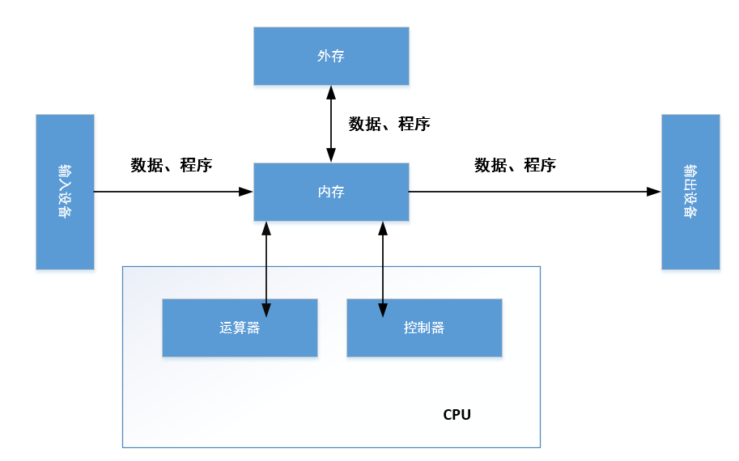

#### 1.2.2 线程与进程的执行模式

##### 1.2.2.1 阿姆达尔定律

多线程程序不容易写，但是其带来的好处却是显而易见的。单核时代，程序随着CPU的更换而变快，而多核年代，程序的并发和并行就显得很重要。通过阿姆达尔定律可以很好的看到程序中的并行部分对于增加CPU核心来提升速度存在限制。

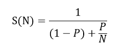

其中
- P指的是程序中可并行部分的程序在单核上执行时间的占比。
- N表示处理器的个数（总核心数）。
- S(N)是指程序在N个处理器（总核心数）相对在单个处理器（单核）中的速度提升比。

阿姆达尔定律变形得

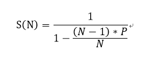

当N趋近于无穷时，分母趋近于`1-P`，此时获得`S(N)`的最大值。因此，也就是说，程序中的可并行代码的比例决定你增加处理器（总核心数）所能带来的速度提升上限。

##### 1.2.2.2 互不通信的多线程模式

在多线程程序中，多个线程会在系统中并发执行。如果线程之间不需要处理共享数据，也不需要进行动作协调，那么将会按照如下模式进行。

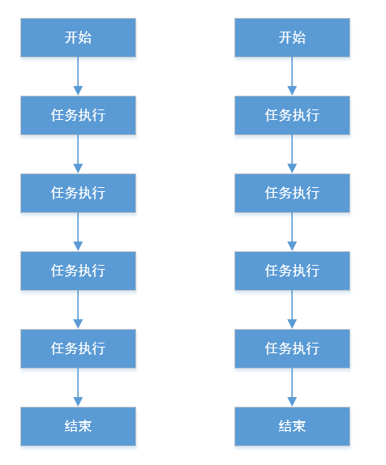

##### 1.2.2.3 基于共享容器协同的多线程模式

一些场景中我们需要多个线程之间对共享的数据进行处理。例如经典的生产者和消费者的例子，如下图

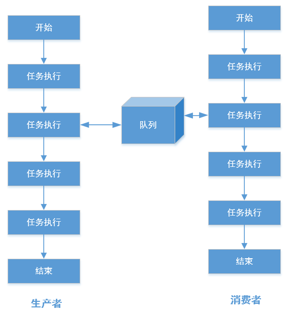

对于这种在多线程环境下对同一数据的访问，我们需要保证访问的正确性。对于存储数据的容器或者对象，有线程安全和不安全之分，而对于线程不安全的容器或对象，一般可以通过加锁或者通过Copy On Write的方式控制并发访问。使用加锁方式时，如果数据在多线程中的读写比例很高，则一般采用读写锁而非简单的互斥锁。

##### 1.2.2.4 通过事件协同的多线程模式

即所谓的同步互斥。

##### 1.2.2.5 多进程模式

关于多进程与单进程多线程的异同，请查看操作系统相关知识。

单线程和单线程多进程的程序在遇到机器故障、OS问题或者自身进程问题时，会导致整个功能不可用。

对于多进程的系统，如果遇到机器故障或者OS问题，也会导致整个功能不可用，但是如果只是一个进程有问题，那么有可能保持系统的部分功能正常执行。

多级系统同，如果遇到某些机器故障、OS问题或者某些机器的进程问题，那么可能部分功能失效，但是有机会保证整体功能可用。

#### 1.2.3 网络通信基础知识

##### 1.2.3.1 OSI与TCP/IP网络模型

详见计算机网络知识。

##### 1.2.3.2 网络IO实现方式

BIO、NIO、AIO

###### 1.BIO方式

BIO即Blocking IO，采用阻塞的方式实现。一个Socket套接字需要使用一个线程来进行处理。发生建立连接、读数据、写数据的操作时，都可能发生阻塞。

优点：简单

缺点：一个线程只能处理一个Socket。

工作方式如下图：

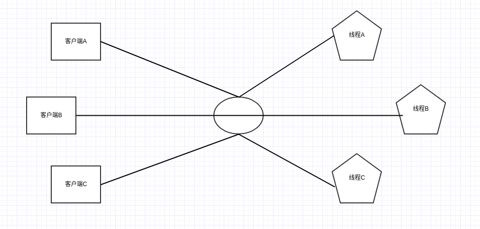

###### 2.NIO方式

NIO即Nonblocking IO，即基于事件驱动思想，用的是Reactor模式。

优点：不需要为每个Socket套接字分配一个线程，而可以在一个线程中处理多个Socket套接字相关的工作。

工作方式如下图：

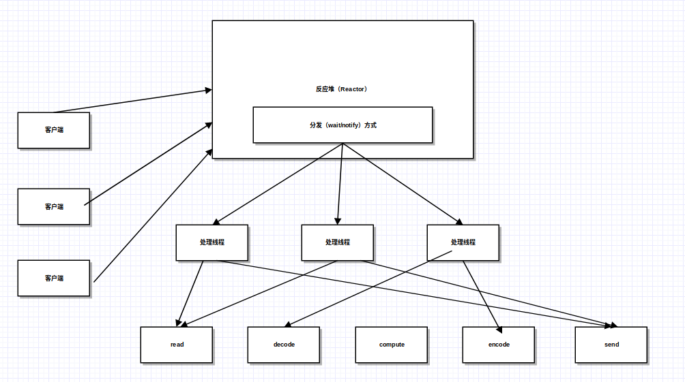

Reactor模式即Reactor会管理所有的handler，并且把出现的事件交给相应的Handler去处理。例如，上图中，所有的客户机的请求都会由Reactor去处理，Reactor将这些请求分发给各个处理线程即（Handler），处理线程又将其对应给多个更底层的处理线程。

###### 3.AIO方式

AIO方式即AsynchronousIO，即为异步IO。AIO采用Proactor模式，工作方式如下图：

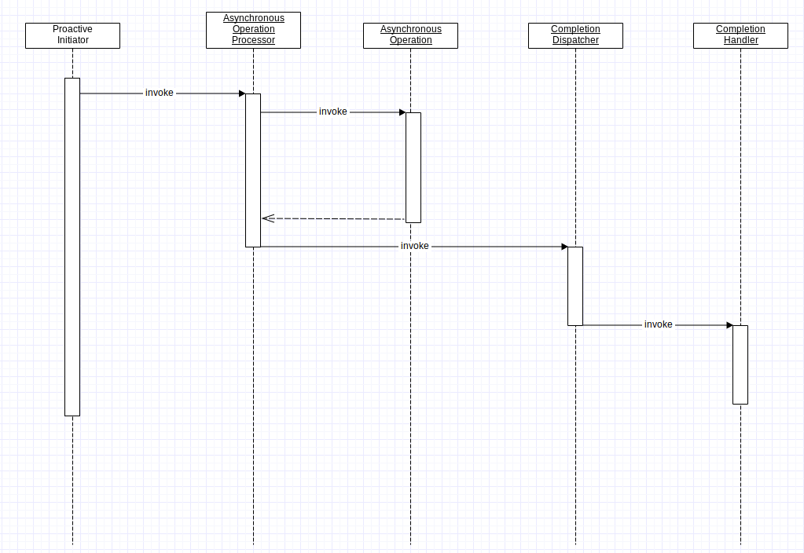

即当请求传入后，请求的操作会被异步执行，当操作执行完毕后，会调用`CompletionHandler`(动作完成的处理器)。NIO的通知是发生在动作之前，而AIO的通知是发生在动作之后。

#### 1.2.4 如何把应用从单机扩展到多机

##### 1.2.4.1 输入设备的变化

输入设备分为两类：

1. 互相连接的多个节点，即一个集群作为输入。
2. 传统意义上的人机交互的输入设备。

##### 1.2.4.2 输出设备的变化

输出设备分为两类：

1. 系统节点在向其他节点投递信息时，该结点就是输出节点。
2. 传统意义上的输出设备。

##### 1.2.4.3 控制器的变化

分布式系统中空孩子气的作用就是协调或控制节点之间的动作和行为。类似MVC中的控制器。

工作情况如下面几种情况所示：

1. 使用硬件的负载均衡的请求调用。

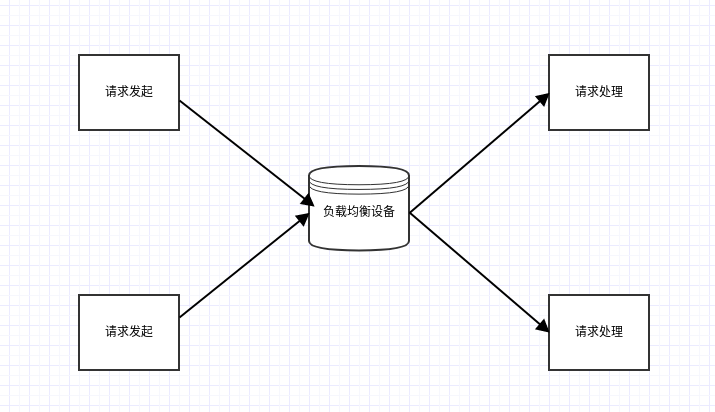

所有的请求要经过硬件负载均衡设备完成请求的转发控制。

2. 使用LVS的请求调用。

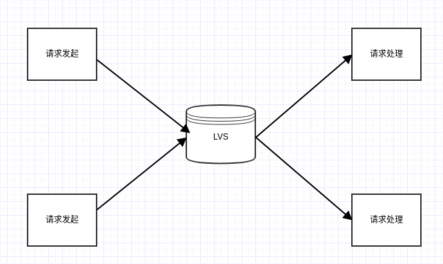

与上一个方法的不同就是将硬件负载均衡设备转换成了LVS等负载均衡软件。这种方式主要的特点是代价低，可控性强，可以相对自由的按照需要去增加负载均衡的策略。

我们称上面的方式为透明代理。对于请求发起方和请求处理方来说，都是透明的。但是这种方式存在着两个不足：

- 增加网络的开销，这个开销一方面是流量，另一方面是延迟。流量方面，由于请求的数据包在过程中经历了多一次的转发，如果数据包较小，则不会产生很大影响，但是如果数据包过大，流量增加就会很明显。延迟方面，由于这个结构的转发原因，会产生延迟，但是，实际影响较小。
- 透明代理处于请求的必经路径上，因此，如果代理出现问题，那么所有的请求都会受到影响。

3. 采用名称服务的直连方式的请求调用

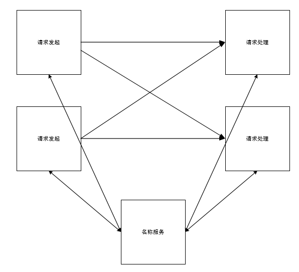

这种方式中请求发起放和请求处理方这两个集群之间是直接连接的，这样就避免了上述两种方式存在的问题。除此之外，相应增加了一个“名称服务”的角色，它的作用主要是如下两个：
- 收集提供请求处理的服务器的地址信息；
- 提供这些地址信息给请求发起方。

当然名称服务只是起到了个地址交换的作用，再发起请求的机器上，需要根据从名称服务得到的地址进行负载均衡的工作。

但是这个名称服务不在请求的毕竟路径上，也就是说如果名称服务出现问题，我们仍可以保证其正常运行，例如建立缓存。其次，发起请求的一方和提供请求的一方是直连的，因此减少了中间路径以及额外的带宽消耗。

不方便的地方是代码升级比较困难。

4. 采用规则服务器控制路由的请求直连调用

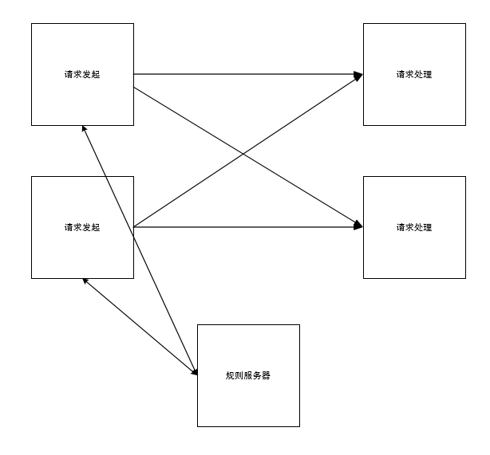

