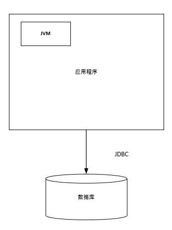
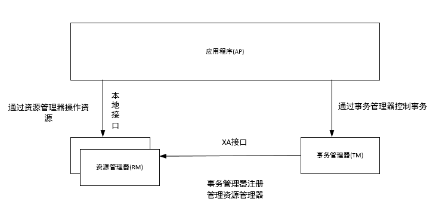
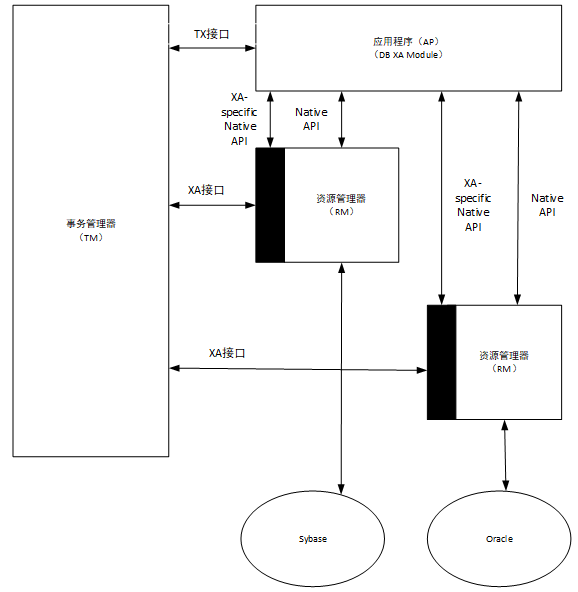
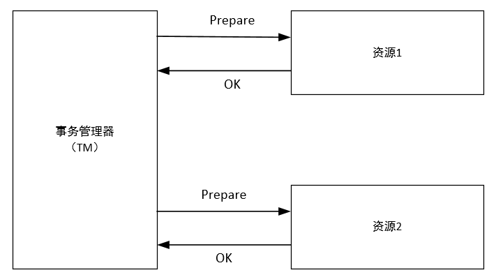
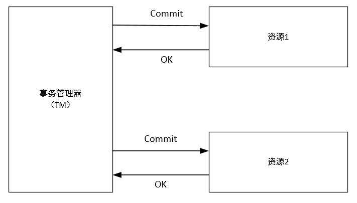
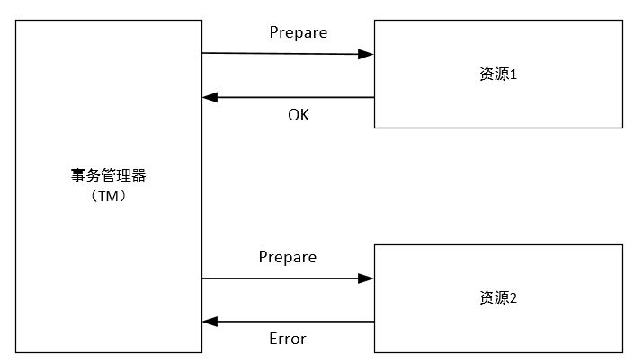
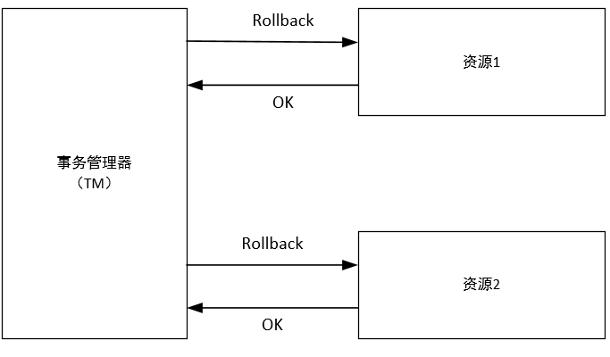
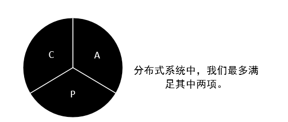
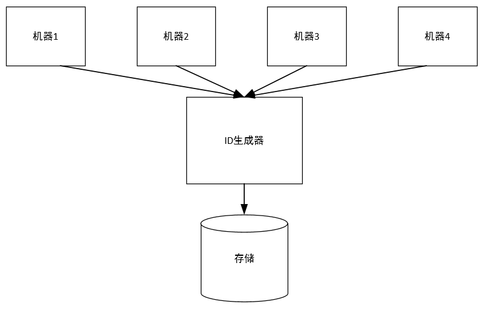
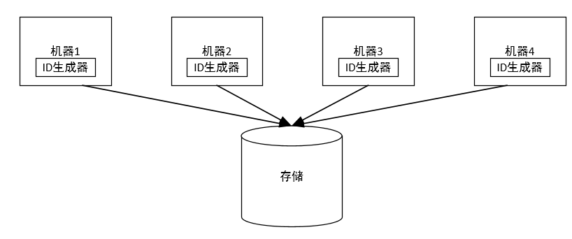

## 第五章 数据访问层

传统的网站基本都是采用以下的方式进行实现：

但是随着数据量不断增加，单数据库无法满足我们的欲望，我们要对其进行合理的整改。

### 1.垂直拆分和水平拆分

随着网站的快速发展，数据量和访问量不断上升，数据压力越来越大，我们在硬件不变的基础上就需要给现有数据库减压，减压的思路有3种：

1. 优化应用，查看是否有不必要的压力给了数据库（应用优化）；
2. 看看有没有其他方法可以降低对数据库的压力，例如引入缓存、加搜索引擎等；
3. 把数据库的数据和访问分到多态数据库上，分开支持，这也是我们的核心思路和逻辑。

数据库拆分有两种方式：垂直拆分和水平拆分，需要注意的是，无论是这两种方式中的哪种，都是将一个数据库中的数据拆分到多个数据库，所以可能会造成一些影响。

#### 1.垂直拆分

垂直拆分是将一个数据库中不同业务单元的数据拆分到不同的数据库里面，简单的说，就是把单表属性进行拆分，然后构成多表，两表连接后还是原来的数据表。

影响：
- 单机的ACID被打破，数据库到了多机，原来在单机通过事务来进行处理逻辑会受到很大的影响。我们采用的解决办法是，放弃原来的单机事务，修改实现，或者引入分布式事务。
- 一些Join操作会变的比较困难。
- 靠外键进行约束的场景会受到影响。

#### 2.水平拆分

水平拆分是根据一定规则吧统一义务单元的数据拆分到多个数据库，简单的说，就是一个数据库中的数据太多，将其分到几个数据库进行存储。

影响：
- 同样可能有ACID被打破的情况。
- 同样可能有Join操作被影响的情况。
- 靠外键进行约束的场景会有影响。
- 依赖单裤的自增序列生成唯一ID会受影响
- 针对单个逻辑意义上的标的查询要跨库了。

#### 3.问题解决

针对上述的影响，我们对其一一提出解决方案：

##### 1.分布式事务

###### 1.分布式事务基础

分布式事务是指事务的参与者、支持事务的服务器、资源服务器以及事务管理器分别位于分布式系统的不同节点上。X/Open组织提出了一个分布式事务的规范——XA。在看XA之前，我们首先了解一下X/Open组织定义的分布式事务处理模型——X/Open DTP模型。

X/Open DTP 模型中定义了3个组件：
1. Application Program(AP)，即应用程序，可以理解为使用DTP模型的程序，它定义了事务的边界，并定义了构成该事物的应用程序的特定操作。
2. Resource Manager(RM)，即资源管理器，可以理解为一个DBMS系统，注意是对管理资源的DBMS系统，或者消息服务器管理系统。应用程序通过资源管理器对资源进行控制，资源必须实现XA定义的接口。资源管理器提供了存储共享资源的支持。
3. Transaction Manager(TM)，即事务管理器，负责协调和管理实务，提供给AP应用程序编程接口并管理资源管理器。事务管理器向事务指定标识，监视他们的进程，并负责处理事务的完成与失败。事务分支标识(XID)由TM指定，以标识一个RM内的全局事务和特定分支事务。它是TM中日志与RM日志之间的相关标记。两阶段提交或回滚都需要XID，以便在系统启动时执行再同步操作（resync），或在需要时允许管理员执行试探操作。

上述3者的通讯关系如下图：

其中AP和RM是必要的，而TM是我们额外引入的。至于为什么我们将在下文中介绍。

DTP中还定义了其他几个概念：
1. 事务：一个事务是一个完整的工作单元，由多个独立的计算任务组成，这多个任务在逻辑上是原子的。
2. 全局事务：一次性操作多个资源管理器的事务就是全局事务。
3. 分支事务：在全局事务中，每个资源管理器有自己的独立任务，这些任务的集合是资源管理器的分支任务。
4. 控制线程：用来表示一个工作线程，主要是关联AP、TM和RM三者的线程，也就是事务上下文环境。简单地说，就是用来标识全局事务和分支事务关系的线程。

整体的DTP模型如下：

- AP与RM之间，可以直接使用RM自身提供的native API进行交互，这种方式就和我们使用DBMS的方式一致，不受TM管理。当AP和RM之间需要进行分布式事务的时候，AP需要得到对RM的连接（此链接由TM管理），然后使用XA的native API 进行交互。
- AP和TM之间，该例子中使用的是TX接口，也是由X/Open所规范的。它用于对事务进行控制，包括启动事务、提交事务和回滚事务。
- TM和RM之间是通过XA接口进行交互的。TM管理了到RM的连接，并实现了`两阶段提交`。

###### 2.两阶段提交

那么何为两阶段提交?对于单库来说，我们完成事务后，只有两种结果，提交和回滚。然而在分布式系统中，在提交之前增加了准备阶段，为了防止一个数据库提交了，而其他数据库没有提交的问题出现，因此成为两阶段提交。具体情况如下：

两阶段提交的正常情况图如下：

1. 第一阶段

2. 第二阶段

两阶段提交失败情况：

1. 出现问题的第一阶段

2.第一阶段出现后的第二阶段

网络上交互次数的增多以及引入事务管理器的开销，是使用两阶段提交协议使分布式事务开销增大的两个方面。因此，在进行垂直拆分或者水平拆分后，要想清楚是否一定要引入两阶段的分布式事务。

单机事务存在ACID的性质，分布式事务虽然不能做到和单机事务一样，但是也应保存一定特性，在这里我们了解一下CAP理论和BASE模型。

###### 3.CAP理论

- Consistency：所有的节点在同一时间读到同样的数据，即数据上的一致性（用C表示），也就是当数据写入成功后，所有的节点会同时看到这个新的数据。
- Availability：保证无论成功还是失败，每个请求都能收到一个反馈，即数据的可用性（用A表示），这里的重点是系统一定要有响应。
- Partition-Tolerance:系统中有部分问题或有消息的丢失，但系统仍能够运行，即分区容忍性（用P表示）。

然而分布式系统并不能同时满足上面3项，我们可以选择上面两个来提升，而另外一个会受到损失。那么我们在系统设计和权衡时，就是在选择CA、AP或CP。

CAP理论用图示表示如下：

- 选择CA，放弃分区容忍性，加强一致性和可用性。这其实就是传统的单机数据库的选择。
- 选择AP，放弃一致性，追求分区容忍性和可用性。这是很多分布式系统在设计时的选择。
- 选择CP，放弃可用性，追求一致性和分区容忍性。这种选择下的可用性会比较低，网络的问题会直接让整个系统不可用。

综上所述，`我们选择AP，而放弃C，采用这种方式设计分布式系统`。

###### 4.BASE模型

- Basically Available：基本可用，允许分区失败；
- Soft state：软状态，接受一段时间的状态不同步；
- Eventually consistent：最终一致，保证最终数据的状态是一致的。

###### 5.Paxos协议、Quorum和Vector Clock算法

虽然我们无法保证数据的强一致性，但是我们可以保证数据的最终一致性。Paxos协议是一个相对于两阶段提交更简单的策略，而Quorum和Vector Clock算法也用来提供一致性，下面我们对其进行介绍。
##### 2.多机的Sequence问题与处理

转变为水平分库时，原来单库中的Sequence以及自增ID的做法需要改变。因为同一张数据表被分在不同的数据库中，因此，自增ID无法保证唯一性、连续性了，我们需要考虑处理办法。

关于唯一性，我们可以使用UUID生成方式，但是这种生成方式生成的ID不具备良好的连续性。

对于连续性，我们可以将所有ID集中放在一个地方进行管理，对每个ID序列独立管理，每台机器使用ID时就从这个ID生成器上取。然而这种方案有几个关键问题要解决：

- 性能问题。每次取ID都会有资源消耗。这个问题的改进方案是每次取多个ID，然后缓存到本地，但是如果应用取了一段ID，然后机器突然宕机，那么这部分ID就浪费了。
- 生成器的稳定性问题。ID生成器作为一个无状态的集群存在，其可用性要靠整个集群来支持。
- 存储的问题。底层存储的选择空间较大，需要根据不同类型进行对应的容灾方案。

在此提出两种方式：

1. 独立ID生成器方式

2. 生成器嵌入到应用的方式

这种方式由于没有中心的控制节点，并且我们还不希望生成器之间进行通信，否则会是系统非常复杂，因此数据的ID并不是严格按照进入数据库的顺序而增大的，在管理上也要有额外的功能。

##### 3.应对多机的数据查询

###### 1.跨库Join

对于进行分库后，Join的数据还在一个数据库中就不会出现问题。但是，如果需要的业务数据被分在多个库中，那么就会出现问题。解决思路有如下方式：
1. 将原来数据库中的Join操作分为多次数据库操作。即将Join操作手动进行。
2. 数据冗余，采用这种方式将Join操作变为单表查询。
3. 借助外部系统（例如搜索引擎）解决一些跨库的问题。

###### 2.外键约束

如果分库后每个单库数据都是内聚的，即每个库内进行外键约束的数据也在该库内，那么就没有问题，否则就只能靠应用层保证外键约束了。

###### 3.跨库查询问题及其解决方案

