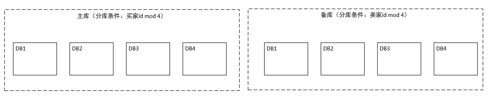

## 第五章 数据访问层

传统的网站基本都是采用以下的方式进行实现：

但是随着数据量不断增加，单数据库无法满足我们的欲望，我们要对其进行合理的整改。

### 1.垂直拆分和水平拆分

随着网站的快速发展，数据量和访问量不断上升，数据压力越来越大，我们在硬件不变的基础上就需要给现有数据库减压，减压的思路有3种：

1. 优化应用，查看是否有不必要的压力给了数据库（应用优化）；
2. 看看有没有其他方法可以降低对数据库的压力，例如引入缓存、加搜索引擎等；
3. 把数据库的数据和访问分到多态数据库上，分开支持，这也是我们的核心思路和逻辑。

数据库拆分有两种方式：垂直拆分和水平拆分，需要注意的是，无论是这两种方式中的哪种，都是将一个数据库中的数据拆分到多个数据库，所以可能会造成一些影响。

#### 1.垂直拆分

垂直拆分是将一个数据库中不同业务单元的数据拆分到不同的数据库里面，简单的说，就是把单表属性进行拆分，然后构成多表，两表连接后还是原来的数据表。

影响：
- 单机的ACID被打破，数据库到了多机，原来在单机通过事务来进行处理逻辑会受到很大的影响。我们采用的解决办法是，放弃原来的单机事务，修改实现，或者引入分布式事务。
- 一些Join操作会变的比较困难。
- 靠外键进行约束的场景会受到影响。

#### 2.水平拆分

水平拆分是根据一定规则吧统一义务单元的数据拆分到多个数据库，简单的说，就是一个数据库中的数据太多，将其分到几个数据库进行存储。

影响：
- 同样可能有ACID被打破的情况。
- 同样可能有Join操作被影响的情况。
- 靠外键进行约束的场景会有影响。
- 依赖单裤的自增序列生成唯一ID会受影响
- 针对单个逻辑意义上的标的查询要跨库了。

#### 3.问题解决

针对上述的影响，我们对其一一提出解决方案：

##### 1.分布式事务

###### 1.分布式事务基础

分布式事务是指事务的参与者、支持事务的服务器、资源服务器以及事务管理器分别位于分布式系统的不同节点上。X/Open组织提出了一个分布式事务的规范——XA。在看XA之前，我们首先了解一下X/Open组织定义的分布式事务处理模型——X/Open DTP模型。

X/Open DTP 模型中定义了3个组件：
1. Application Program(AP)，即应用程序，可以理解为使用DTP模型的程序，它定义了事务的边界，并定义了构成该事物的应用程序的特定操作。
2. Resource Manager(RM)，即资源管理器，可以理解为一个DBMS系统，注意是对管理资源的DBMS系统，或者消息服务器管理系统。应用程序通过资源管理器对资源进行控制，资源必须实现XA定义的接口。资源管理器提供了存储共享资源的支持。
3. Transaction Manager(TM)，即事务管理器，负责协调和管理实务，提供给AP应用程序编程接口并管理资源管理器。事务管理器向事务指定标识，监视他们的进程，并负责处理事务的完成与失败。事务分支标识(XID)由TM指定，以标识一个RM内的全局事务和特定分支事务。它是TM中日志与RM日志之间的相关标记。两阶段提交或回滚都需要XID，以便在系统启动时执行再同步操作（resync），或在需要时允许管理员执行试探操作。

上述3者的通讯关系如下图：

其中AP和RM是必要的，而TM是我们额外引入的。至于为什么我们将在下文中介绍。

DTP中还定义了其他几个概念：
1. 事务：一个事务是一个完整的工作单元，由多个独立的计算任务组成，这多个任务在逻辑上是原子的。
2. 全局事务：一次性操作多个资源管理器的事务就是全局事务。
3. 分支事务：在全局事务中，每个资源管理器有自己的独立任务，这些任务的集合是资源管理器的分支任务。
4. 控制线程：用来表示一个工作线程，主要是关联AP、TM和RM三者的线程，也就是事务上下文环境。简单地说，就是用来标识全局事务和分支事务关系的线程。

整体的DTP模型如下：

- AP与RM之间，可以直接使用RM自身提供的native API进行交互，这种方式就和我们使用DBMS的方式一致，不受TM管理。当AP和RM之间需要进行分布式事务的时候，AP需要得到对RM的连接（此链接由TM管理），然后使用XA的native API 进行交互。
- AP和TM之间，该例子中使用的是TX接口，也是由X/Open所规范的。它用于对事务进行控制，包括启动事务、提交事务和回滚事务。
- TM和RM之间是通过XA接口进行交互的。TM管理了到RM的连接，并实现了`两阶段提交`。

###### 2.两阶段提交

那么何为两阶段提交?对于单库来说，我们完成事务后，只有两种结果，提交和回滚。然而在分布式系统中，在提交之前增加了准备阶段，为了防止一个数据库提交了，而其他数据库没有提交的问题出现，因此成为两阶段提交。具体情况如下：

两阶段提交的正常情况图如下：

1. 第一阶段

2. 第二阶段

两阶段提交失败情况：

1. 出现问题的第一阶段

2.第一阶段出现后的第二阶段

网络上交互次数的增多以及引入事务管理器的开销，是使用两阶段提交协议使分布式事务开销增大的两个方面。因此，在进行垂直拆分或者水平拆分后，要想清楚是否一定要引入两阶段的分布式事务。

单机事务存在ACID的性质，分布式事务虽然不能做到和单机事务一样，但是也应保存一定特性，在这里我们了解一下CAP理论和BASE模型。

###### 3.CAP理论

- Consistency：所有的节点在同一时间读到同样的数据，即数据上的一致性（用C表示），也就是当数据写入成功后，所有的节点会同时看到这个新的数据。
- Availability：保证无论成功还是失败，每个请求都能收到一个反馈，即数据的可用性（用A表示），这里的重点是系统一定要有响应。
- Partition-Tolerance:系统中有部分问题或有消息的丢失，但系统仍能够运行，即分区容忍性（用P表示）。

然而分布式系统并不能同时满足上面3项，我们可以选择上面两个来提升，而另外一个会受到损失。那么我们在系统设计和权衡时，就是在选择CA、AP或CP。

CAP理论用图示表示如下：

- 选择CA，放弃分区容忍性，加强一致性和可用性。这其实就是传统的单机数据库的选择。
- 选择AP，放弃一致性，追求分区容忍性和可用性。这是很多分布式系统在设计时的选择。
- 选择CP，放弃可用性，追求一致性和分区容忍性。这种选择下的可用性会比较低，网络的问题会直接让整个系统不可用。

综上所述，`我们选择AP，而放弃C，采用这种方式设计分布式系统`。

###### 4.BASE模型

- Basically Available：基本可用，允许分区失败；
- Soft state：软状态，接受一段时间的状态不同步；
- Eventually consistent：最终一致，保证最终数据的状态是一致的。

###### 5.Paxos协议、Quorum和Vector Clock算法

虽然我们无法保证数据的强一致性，但是我们可以保证数据的最终一致性。Paxos协议是一个相对于两阶段提交更简单的策略，而Quorum和Vector Clock算法也用来提供一致性，下面我们对其进行介绍。
##### 2.多机的Sequence问题与处理

转变为水平分库时，原来单库中的Sequence以及自增ID的做法需要改变。因为同一张数据表被分在不同的数据库中，因此，自增ID无法保证唯一性、连续性了，我们需要考虑处理办法。

关于唯一性，我们可以使用UUID生成方式，但是这种生成方式生成的ID不具备良好的连续性。

对于连续性，我们可以将所有ID集中放在一个地方进行管理，对每个ID序列独立管理，每台机器使用ID时就从这个ID生成器上取。然而这种方案有几个关键问题要解决：

- 性能问题。每次取ID都会有资源消耗。这个问题的改进方案是每次取多个ID，然后缓存到本地，但是如果应用取了一段ID，然后机器突然宕机，那么这部分ID就浪费了。
- 生成器的稳定性问题。ID生成器作为一个无状态的集群存在，其可用性要靠整个集群来支持。
- 存储的问题。底层存储的选择空间较大，需要根据不同类型进行对应的容灾方案。

在此提出两种方式：

1. 独立ID生成器方式

2. 生成器嵌入到应用的方式

这种方式由于没有中心的控制节点，并且我们还不希望生成器之间进行通信，否则会是系统非常复杂，因此数据的ID并不是严格按照进入数据库的顺序而增大的，在管理上也要有额外的功能。

##### 3.应对多机的数据查询

###### 1.跨库Join

对于进行分库后，Join的数据还在一个数据库中就不会出现问题。但是，如果需要的业务数据被分在多个库中，那么就会出现问题。解决思路有如下方式：
1. 将原来数据库中的Join操作分为多次数据库操作。即将Join操作手动进行。
2. 数据冗余，采用这种方式将Join操作变为单表查询。
3. 借助外部系统（例如搜索引擎）解决一些跨库的问题。

###### 2.外键约束

如果分库后每个单库数据都是内聚的，即每个库内进行外键约束的数据也在该库内，那么就没有问题，否则就只能靠应用层保证外键约束了。

###### 3.跨库查询问题及其解决方案

对于数据被分为多库多表的情况，我们对数据库的操作也会相应进行转变。查询操作一般会出现如下的情况。

1. 排序。对多个来源的数据查询出来后，在应用层进行排序操作，如果查询出的数据是有序的，则进行归并排序，否则进行全排序。
2. 函数处理。使用Max、Min、Sum、Count等函数对多个数据来源的值进行相应的函数处理，并在应用层进行再处理。
3. 非排序分页。这分为同等步长地在多个数据源上分页处理和同等比例地分页处理。同等步长的意思是，分页的每页中，来自不同数据源的记录数是一样的；同等比例的意思是，分页的每页中，来自不通过数据源的数据数占这个数据源符合条件的数据总数的比例是一样的。
4. 排序后分页。对于已经排序的多个数据源的数据，需要从每个数据源取出`页号*页大小`的数据后，进行排序，然后选出恰当的数据进行传输。

### 2.数据访问层

数据访问层就是方便应用进行数据读/写访问的抽象层，我们在这个层上解决各个应用通用的访问数据库的问题。

#### 1.对外提供数据访问层的功能

数据层负责解决应用访问数据库的各种共性问题，数据层的以怎样的方式呈现给应用呢？

1. 为用户提供专有API。这种方式通用性极差，甚至没有通用性。
2. 通用的方式。在Java应用中一般通过JDBC访问数据库，数据层自身可以作为一个JDBC实现，暴露出JDBC接口。
3. 基于ORM或者类ORM的方式。

下面的图示展示了以上三种方式的结构：

通过JDBC方式使用的数据层是兼容性和扩展性最好的，实现成本也是最高的。底层封装了某个ORM框架或者类ORM框架的方式具备一定的通用性（不能提供给另外的ORM/类ORM框架用），实现成本相对JDBC接口方式的要低。而专有API的方式是在特定场景下的选择。

专有API的方式和对外提供JDBC接口的方式都直接使用了下层数据库提供的JDBC驱动，因此更加灵活，而基于ORM/类ORM框架的方式则在数据层和JDBC驱动之间隔了一个第三方的ORM/类ORM框架，这在有些场景下会造成一些影响。

上述的数据访问方式，对于查询方面的实现也有很大影响，我们以`排序后分页`为例。数据形式如下：

基于ORM或者类ORM的方式，由于框架的封装，导致很多东西会很麻烦，这种情况下，我们就需要把足够多的数据加载到内存中，再找出正确数据进行显示，例如上述数据源，查询第10页的数据，就要从数据源1和数据源2分别取出200条数据，总共400条，然后进行归并排序后筛选，丢弃不必要的数据。

对于采用JDBC的方式访问，我们需要取出对应数据，JDBC驱动中有fetch size这一设置，其用来控制数据库返回的记录数。我们直接使用的JDBC可以直接控制数据的取出，然后使用两个有序链表记性合并排序，而只会浪费一个对象。在页数很大时，直接使用JDBC是有很大优势的。

#### 2.由数据层流程的顺序看数据库设计

##### 1. SQL解析阶段处理

SQL解析主要考虑的问题有如下两个：

1. 对SQL支持的程度，是否需要支持所有SQL，这需要根据具体场景来决定。
2. 支持多少SQL的语言，对于不同厂商超多标准SQL的部分要支持多少。

在进行SQL解析时，对于解析的缓存可以提升缓存速度，但仍要注意控制缓存的容量限制。

通过解析SQL，我们可以得到SQL中的关键信息，例如表名、字段、where条件等。这些信息可以通过提示的方式实现，该方式会把一些要素直接传进来，而不用解析整个SQL语句，使用这种方式的一般情况是：

- SQL解析并不完备。
- SQL中不带有分库条件，但实际上是可以明确指定分库的。

##### 2. 规则处理阶段

###### 1.采用固定哈希作为规则

固定哈希的方式为，根据某个字段取模，然后将数据分散到不同的数据库和表中。例如我们通过id取模进行分库，那么形式如下：

除了根据id取模进行分库，我们还可以采用此方法进行分表，示意图如下：

###### 2.一致性哈希算法带来的好处

一致性哈希是MIT的Karger及其合作者在1997年发表的学术论文中提出的。

一致性哈希所带来的最大变化是节点对应的哈希值变成了一个范围，而不再是离散的。在一致性哈希中，我们会把整个哈希值的范围定义的很大，然后把这个范围分配给现有节点。如果有新节点加入，那么这个新节点会从原有的某个节点上分管一部分范围的哈希值；如果有节点退出，如果这个节点原来管理的哈希值会给它的下一个节点来管理。

下面给出一个例子，如果哈希值的范围为0到100,共有4个节点，那么他们管理的范围分别为[0,25)，[25,50)，[50,75)，[75,100]。如果第二个系欸但那退出，那么剩下的节点管理范围变为[0,25)，[25,75)，[75,100]。如果从第二个和第三个节点之间增加一个节点，那么管理范围就变成[0,25)，[25,50)，[50,63)，[63,75)，[75,100]。

然而上述方法是有一定问题的，因为，新增一个节点后，新生成的节点和受影响的节点的范围明显小于其他的，减少一个节点，则合并成的节点范围会明显大于其他的。这样的话，压力就会导致很不平衡。

为了解决这个问题产生了虚拟节点。一个物理节点可能对应多个虚拟节点，虚拟节点平均分布在整个哈希环上，这样就可以尽量解决负载均衡问题。

###### 3.映射表

映射表是根据分库分表字段的值的查表法来确定数据源的方法，一般用于对热点数据的特殊处理，或者再一些场景下对不完全符合规律的规则进行补充。常见的情况是以前面的方式为基础，配合映射表来执行。

###### 4.自定义计算方式

自定义计算方式是最灵活的方式，它已经不算是以配置的方式来做规则了，而是通过比较复杂的函数来解决数据访问的规则问题。

例如下面根据id取模分成了4个库，可以使用下面的方式：

    if(id in hotset)
    {
        return 4;
    }
    return id % 4;

##### 3. 改写SQL

为何要改写SQL呢？因为我们现在要解决的问题已经从单库单表变为了多库多表问题，那么在同一数据库中，表的名字由于不能重复，所以就会出现了改写SQL的问题。例如User表在分库分表后表明可能为User_1,User_2等。

除了修改表名外，有时还要修改索引名。

当然，还有一种情况，还记得我们对表的查询操作么？求最大值，最小值，平均值，这些我们都是采用间接的方式求的，那么就要改写SQL用来获取源数据。

##### 4. 数据源选择

在进行了分库分表后，我们通常都会给库提供备库，如下图：

这样数据库就从单一的一个节点，变为了一个数据库矩阵，我们要决定访问分组后的哪个库。这些苦一般都是一写多读的（有些是多写多读的），根据当前要执行的SQL特点（读、写），是否在事务中以及各个库的权重规则，计算得到这次SQL请求要访问的数据库。

##### 5. 执行SQL和结果处理

这也就是最后两部了，只需要注意异常处理，其余的也没啥。

#### 3.数据访问层设计

三层数据源整体视图：

#### 4.独立部署的数据访问层实现方式

从数据层的物理部署上来看，可以分为jar包方式和Proxy方式。

如果采用Proxy方式的话，客户端与Proxy之间的协议有两种选择：数据库协议和私有协议，这两种方式各有优势。

- 采用数据库协议时，应用就会把Proxy看做一个数据库，然后使用数据库本身提供的JDBC的实现就可以连接Proxy。因为应用到Proxy、Proxy到DB采用的都是数据库协议，所以如果使用的是同样的协议，在一些场景下就可以减少一次数据库协议到对象然后再从对象到数据库协议的转换。不过采用这种方式Proxy要完全实现一套相关数据库的协议。
- 采用私有协议时，Proxy对外提供的通信协议是我们自己设计的，并且需要一个独立的数据层客户端，好处就是可以得到复用。

我们提供了一个基础的Proxy的结构：

#### 5.读写分离

读写分离结构：

##### 1.主库从库非对称场景

多从库数据和为一主库的情况,即如下情况：

我们可以采用如下方案进行复制：

应用通过数据层访问数据库，通过消息系统就数据库的更新送出消息通知，数据同步服务器获得消息通知后会进行数据的复制工作。分库规则配置则负责在读数据及数据同步服务器更新分库时让数据层知道分库规则。

##### 2.主/备库分库方式不同的数据复制

数据库的不对称复制，即源数据和目标数据不是镜像关系，也指源数据库和目标数据库不是相同实现，下面给出一个例子：

完成这个非对称复制，需要控制数据的分发，而不是简单地进行镜像复制。

##### 3.引入数据变更平台

数据变更平台示意图：

其中Extractor负责把数据源变更的信息加入到数据分发平台中，而Applier的作用是把这些变更应用到相应的目标上，中间的数据分发平台由多个管道组成。

##### 4.数据的平滑迁移

对于数据库来说，扩容、缩容都会关系到数据迁移，当然，如果接受完全停机后进行数据迁移，就会很容易处理。但是，长时间停机是不太现实的，所以我们需要一种新的方法。

对于数据库来说，最大的挑战是，在迁移的过程中又会有数据的变化。可以考虑的方案是在开始进行数据迁移时，记录增量的日志，在迁移结束后，再对其进行处理。最后，可以把要被迁移的数据的写暂停，保证增量日志都处理完毕后，再切换规则，放开所有写，完成操作。

这里给出一个例子，来做本章笔记的结束。

查看一种简单情况，这里有一张数据表：

我们希望根据id取模把这个表划分在两个数据库中，即id mod 2为0的还在原来数据库，id mod 2为1的在新的数据库，那么详细做法如下：

1. 首先我们确定开始扩容，并且开始记录数据库变更的增量日志。

其中v表示版本号。

2. 数据开始复制到新库表，在增量日志中记录变更。

要注意，这里，新库表中的数据有的是新数据有的是旧数据。

3. 迁移结束之后，我们把增量日志中的数据也进行迁移。然而，不得不说的是，由于这种迁移也是不进行停机的，所以在更新新库表的过程中，增量日志也会增加。
4. 然后我们进行数据对比，可能有新库数据和源库数据不同的情况，把它们记录下来。
5. 接着我们停止源数据库中对于迁移走的数据的写操作，然后进行增量日志的处理，使得新库表数据是新的。
6. 最后更新路由规则。