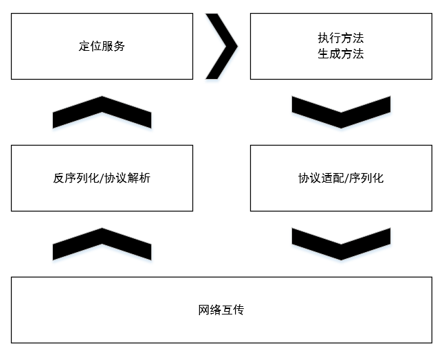

## 服务框架的设计和实现

现在我们已经知道服务化方案可以解决应用臃肿的问题，那么，如何进行实现呢？

服务化会是原来的一些本地调用变为远程调用，压法人员着重提高易用性和降低性能损失。

下图给出了服务框架要解决的问题：

类比单机单进程模式，在单机单进程的程序中，方法调用就是简单的将程序计数器指向相应的入口地址，而在多机之间，调用端要指定特定服务提供端提供服务，并向其发出请求，等待回应，这种方式就好似程序的入口地址变成了特定的服务提供者（其实是服务提供者上的特定实例的特定函数）。

这里我们将服务调用者和服务提供者分开画，但是实际上，服务框架应该是既包含调用端逻辑又包含服务端逻辑的一个实现，因为，服务框架可能会调用其他服务。

我们从两个部分来考察一个服务框架如何实现：调用端和服务端。

### 1.调用端实现思路

假如我们实现一个简单的接口，代码如下：

    public interface Calculator
    {
        int add(int a,int b);

        int minus(int a,int b);

    }

单机模式下，我们如此实现这个接口：

    public class CalculatorImpl implements Calculator
    {
        public int add(int a,int b)
        {
            return a + b;
        }

        public int minus(int a,int b)
        {
            return a - b;
        }
    }

那么对于远程调用来说，我们应该如下实现该接口：

    public int add(int a,int b)
    {
        //获取可用服务地址列表；
        List<String> l = getAvailableServiceAddresses("Calculator.add");
        //选择合适的目标机器；
        String address = chooseTarget(l);
        //建立连接
        Socket s = new Socket(address);
        //请求的序列化
        byte[] request = getRequest(a,b);
        //发送请求
        s.getOutputStream().write(request);
        //接受结果
        byte[] response = new byte[1024];
        s.getInputStream().read(response);
        //解析结果
        int result = getResult(response);

        return result;
    }

和上述图中的流程类似，我们对接口调用首先进行寻址路由，`getAvailableServiceAddresses(String)`方法返回所有包含该可用服务的目标机器列表。这里就和我们当初讲过的分布式系统模拟控制器的几种方式有关。

对于透明代理方式，上述方法返回的就是LVS或者负载均衡的地址和端口。如果是名称服务的方式，返回的就是用`"Calculator.add"`进行定位的服务地址列表。但是，值得一提的是，虽然这里我们使用的是方法名作为的定位标准，但是我们一般采用`"全限定名+版本号"`的形式作为查找的标准。因为，不同的版本服务实现可能不同，为了保证合理的管理，我们需要使用`版本号`，至于为何要用全限定名，主要还是为了防止不同包的类重名。规则服务器和名称服务很相似，但是一般规则服务器的方式更多运用在有状态的场景。

获取了服务列表后，我们需要选择一个合理的具体目标，而`chooseTarget(List<String> list)`方法为我们完成了这个工作，也就是负载均衡工作。

然而，接口调用的信息要通过网络进行发送，所以必须要先进行序列化，接收到的结果要进行反序列化。

最后将反序列化后的数据解析出结果，这样，一个服务框架的请求端也就完成了。

综上，我们给出服务调用端的具体工作流程：

然而，实现服务框架还存在两个问题：

1. 服务框架自身的部署方式问题。
2. 实现自己的服务框架所以来的一些外部jar包与应用自身依赖的jar包之间的冲突问题。

针对第一个问题，我们考虑3种方案：

1. 把服务框架作为应用的一个依赖包并与应用一起打包。形如如下方式：

这种方式使服务框架变为应用的一个库，并随应用启动。但是如果要升级服务框架，就要更新应用本身，因为服务框架是与应用打包放在一起的。并且服务框架没有办法接管classloader，也就不能做一些隔离以及包的实现替换工作。

2. 把服务框架作为容器的一部分。示意图如下：

这时我们就要遵循各个容器所支持的方法，把框架作为容器的一部分，例如，针对JBoss，我们可以通过MBean实现服务框架的启动，将其部署为一个sar包来为应用提供服务。

3. 服务框架自身变为一个容器提供远程调用和远程服务功能。示例图如下：

有些情况不需要容器（不是Web应用，或者不使用现有容器）。

针对第二个问题，我们可以采用ClassLoader技术进行解决，在此就不详述了。

### 2.服务端的实现思路

下面给出一份伪代码：

    public class EventHandler
    {
        public static class Request
        {
            public Socket socket;
            public String serviceName;
            public String serviceVersion;
            public String methodName;
            public Object[] args;
        }

        public static void eventHandler()
        {
            while(true)
            {
                byte[] requestData = receiveRequest();
                Request request = getRequest();

                Object service = getServiceByNameAndVersion(request,serviceName,request.serviceVersion);

                Object Result = callService(service,request.methodName,request.args);

                byte[] data = genResult(result);
                request.socket.getOutputStream().write(data);
            }
        }
    }

服务提供者需要实时监测是否有请求传入，其中的`while(true)`就是在执行这项工作。`receiveRequest()`将请求传入的数据进行接收，并使用`getRequest()`方法进行反序列化。而`getServiceByNameAndVersion()`方法通过传入的`serviceName`和`serviceVersion`查找指定的服务，并将其交给`callService()`方法进行调用，然后产生结果。后来将其序列化并传给服务调用者。

#### 1.服务提供端的设计和实现

示意图如下：

当服务调用端数据传来时，首先进行反序列化和协议解析，然后通过这些数据进行定位服务，然后执行方法，然后将结果进行协议适配和序列化，最后交由网络传输。

#### 2.执行不同服务的线程池隔离

我们可以根据服务名称、方法、参数来确定具体执行服务调用的线程池是哪个，线程池之间不相互干涉。示意图如下：

### 3.服务调用者和服务提供者之间的通信方式的选择

我们已经了解了服务调用者和服务提供者的基本逻辑，那么现在让我们从头开始看其实现方式。

这个问题的实现和我们已知的`1对1`的端口交换信息不同，而是`一个集群和另一个集群`进行信息交互，形如下图：

由图可以看出，这已经是一个集群与集群交互信息的问题，那么就存在调用者集群中的一台主机到底和服务提供者集群中的哪个主机交互信息的问题。

#### 1. 采用透明代理与调用者、服务提供者直连的解决方案

##### 1.采用透明代理进行远程服务调用

采用硬件的负载均衡或者LVS进行负载均衡，示意图如下：

##### 2.调用者与服务提供者直连

其中，服务注册查找中心并不处在调用者和服务提供者之间，对于调用者来说，只是提供可用的服务提供者列表。不过，由于效率，并不是在每次调用远程服务前都通过这个服务注册查找中心来查找可用地址，而是把地址缓存在调用者本地，当有变化时，主动从服务注册中心发起通知，告诉调用者可用的服务提者列表发生变化。

当客户端拿到可用的服务提供者的地址列表后，由路由选择合适的服务提供者进行调用。这里我们要考虑集群的负载均衡，实现方式常见的有随机、轮询、权重3中，在服务提供者机器能力对等的情况下，采取随机和轮询这两种方式比较容易实现，而机器能力不对等时，一般采用权重的方式进行路由。具体的负载均衡策略可以参考硬件负载均衡设备以及LVS、HAProxy等所支持的策略。

#### 2.引入基于接口、方法、参数的路由

我们在最初的例子中使用的便是基于方法的路由，那为何要使用这种路由方式呢？仅仅基于接口的路由方式有什么缺点么？

考虑如下情况，服务提供者提供了两个接口，为接口A、B，每个接口中存在两个方法，分别为1、2。服务提供者部分采用5个工作线程，假如接口A的1方法处理时间特别慢，要10s才能处理完一个请求，而其余的3个方法只需要1ms就能处理完应用。那么当包含多个A接口1方法调用的大量请求发送来时，由于A接口的1方法处理太慢，所有的工作线程可能都会被A接口的1方法所占用，导致后续的所有方法受到拖延。

那么如何处理这个问题呢？我们可以采用两种方式：
1. 增加线程数量，明显不太经济，而且线程数量到达最大了怎么办。
2. 隔离调用接口A的1方法的资源。

这里我们也就引入了基于方法的路由，如果是采用基于接口的路由，我们无法对A接口的1方法进行单一分隔出来，因为，分隔的最小单位是接口。引入了基于方法的路由，我们将A接口的1方法分隔开来，那么剩下的三个方法就不会被阻塞了。然而由于重载的出现，上述类似的情形依旧可能发生，因此，我们还有基于参数的路由。

#### 3.多机房场景

每个机房都有自己的容量上限，如果网站的规模非常大，就需要多个机房了，机房之间的距离和分工决定了我们应该采用什么样的策略和架构，现在我们讲解近距离的同城机房的情况，状况如下图：

我们都知道在同一机房中的调用与被调用延迟是小于不同机房的，因此，我们需要去识别机房，以保证调用者最好能调用到与其同一机房的服务提供者。

有两种方案可以实现这个想法：
1. 在服务注册中心做一些工作，通过它来甄别不同机房的调用者集群，给它们不同服务提供者的地址。
2. 通过路由完成这个功能，即服务注册查找中心给不同机房的调用者相同的服务提供者列表，我们在服务框架内部进行地址过滤，根据过滤原则达到上述目的。

当机房很多时，我们可以采用虚拟机房进行管理。

#### 4.服务调用端的流控处理

服务调用端流控处理的方式一般有两种：
1. 0-1开关，完全打开不进行流控。
2. 设定一个固定值，表示每秒可以进行的请求次数，超过这个请求数就拒绝对远程的请求。那些被拒绝的请求可以直接返回给调用者，也可以进行排队。

我们一般基于以下两个维度进行考虑：
1. 根据服务端自身的接口、方法做控制，也就是针对不同的方法、接口设定不同的阈值，这是为了使服务端的不同接口、方法之间的负载不受影响。
2. 根据来源做控制，也就是对于同样的接口、方法，根据不同来源设置不同的限制，这一般用在比较基础的服务上，也就是在多个集群使用同样的服务时，根据请求来源的不同级别等进行不同的流控。

#### 5.序列化和反序列化

序列化其实就是将对象变为二进制数据方便发送的过程，而反序列化是其的逆过程。

对于这个问题，Java本身就提供了方式解决。但是我们仍要考虑几个问题：
1. Java序列化或反序列化时自身的性能问题以及跨语言问题。我们要允许使用不同的语言进行接口调用。
2. 序列化和反序列化的性能开销，以及不同方式的性能比较。
3. 注意序列化后的长度。

#### 6.网络通信实现选择

了解了上述问题，我们就可以确定要请求的目的服务提供端，并将调用数据进行了合理的打包，就等待通过网络发送了，现在我们来考虑网络通信部分。我们在前面讲解过BIO、NIO、AIO三种方式，由于BIO采用的是阻塞IO的方式，一个连接要消耗一个线程，消耗过大，因此，NIO相对比较合适，那么我们看一下NIO方式的示意图：

通过上图我们可以看出，NIO方式也包含两端：调用者和提供者，下面我们介绍一下调用者部分的远程调用方式：

1. 同步方式进行远程调用：

上图中，当数据要被传输时，首先要进行数据入队，将其打包好放入到数据队列中，然后为这些数据生成通信对象，并将生成的通信对象放入到通信对象队列。数据队列头的数据与通信对象队列头的通信对象一一对应，我们通过IO线程处理队列头的数据与SOCKET连接进行交互，当数据发送时，使用IO线程进行发送数据，接收时也是用IO线程，当从Socket接口中接收到结果，这些结果被返回到IO线程，并告知通信对象，此时通信对象将数据返回给等待的线程，告诉其结果已经收到，促使其处理结果。定时任务模块用来判断是否超时，如果在一定时间内还没有得到结果，那么定时任务就通知通信对象，通信对象同时返回给等待的线程，告诉其通信超时。

2. Oneway方式：

Oneway方式只管发送请求而不管结果，当数据需要发送时，Oneway方式仅仅将数据打包放入数据队列，等待发送，然后由IO线程取出并发送就行了。完全不关心对方是否收到数据，也不关心收到数据后做什么。

3. Callback方式：

  

  当产生对服务的调用时，首先生成回调对象，然后根据回调对象将数据入队，然后就继续进行处理。回调对象和数据仍然是一一对应的，IO线程只处理队列头的数据，与此同时回调对象也在回调队列头，当数据发送时，数据通过IO线程与Socket对象进行交互，然后发送数据，接收到结果时通过Socket队形与IO线程进行交流，并把收到的二进制数据传给回调对象，回调对象收到结果时，就执行回调。在这里，回调对象仍然受定时任务控制，用来标识是否超时，如果超时，则回调对象会被定时任务通知，再进行回调。

  当然回调执行最好新开一个线程来做，为了防止影响到其他线程。

  4. Future方式：

  

  使用Future方式时，当产生对服务的调用时，首先生成一个Future放入到Future对象队列中，然后将数据提取出并放入到数据队列中，然后即可继续进行处理，直到收到结果后进行Future获取。注意这里没有超时检测，因为Future会自动生成一个线程处理这些东西。

  5. 可靠异步。使用中间件完成。

  #### 7. 使用Future方式对远程服务调用的优化

  考虑如下情况，一个请求中调用多个远程服务，情况如下：

  

  上面的情况如果按照串行化的方法，总共会使用80ms的传输时间，而且还有服务处理时间，假如每个服务时间为10ms，加在一起就会是110ms。如果我们采用并行化的方式，如图：

  

  上述的方式表示，我们按照顺序把请求的服务的请求发送给服务A、服务B、服务C，但是我们不等待结果，而是等到数据处理阶段才等待返回结果。