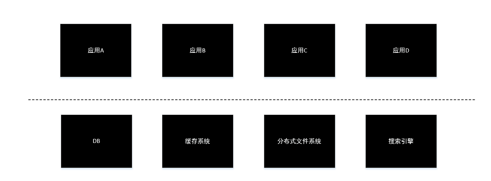
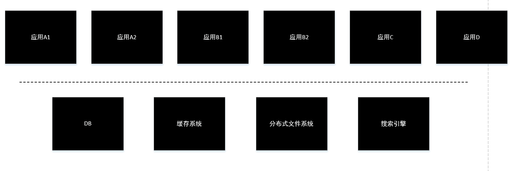
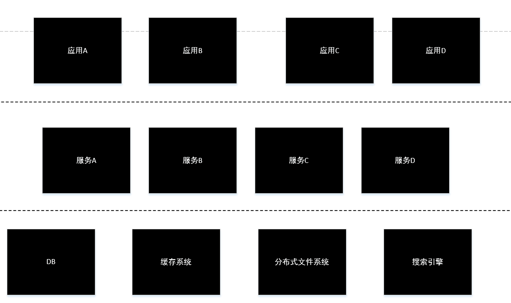

## 网站架构更改方案

传统架构如下图：

然而当网站规模扩大，开发人员增多，网站的应用变得复杂、臃肿，我们需对其进行重新设计，解决这个问题。

这里存在两种实现方案，首先第一种，直接拆分应用，由于网站的应用变得复杂臃肿，我们将其进行拆分，使应用变小，示意图如下：

优点：能够相对较快地完成。

缺点：数据库的连接数压力还在，这些系统之间会存在一些重复代码。

方案二就是服务化方案，示意图如下：

优点：
1. 从结构上看，更加清晰了。
2. 从稳定性上看，一些散落在多个应用系统的代码也变为了服务，由专门的团队进行统一维护，可以提高代码质量。
3. 由于核心的相对稳定，修改和发布次数会减少，这也会提高稳定性。
4. 更加底层的资源统一由服务层管理，结构更加清晰，也利于提高效率。

缺点：应用之间有了直接访问，在应用和应用访问方面有很大问题。