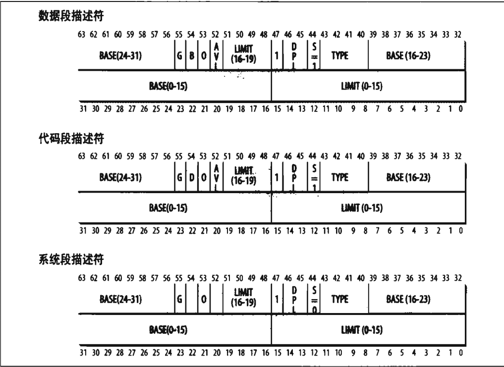

# 2.3 硬件中的分段

从80286开始，Intel处理器采用两种模式进行地址转换：实模式和保护模式。其中实模式的存在是为了维持处理器与早期模型的兼容，并让操作系统自举。下面主要介绍保护模式下的地址转换。

## 1. 段选择符和段寄存器

一个逻辑地址由两部分组成：

1. 段标识符：一个长为16位长的字段，又叫段选择符。
2. 指定段内相对地址的偏移量：一个长为32位长的字段。

为了方便的找到段选择符，处理器提供了段寄存器，段寄存器的唯一目的是存放段选择符。这些段寄存器分别为cs、ds、ss、es、fs、gs。其中

1. cs 为代码段寄存器，指向包含指令序列的段。
2. ss 为栈段寄存器，指向包含当前程序栈的段。
3. ds 为数据段寄存器，指向包含静态数据或者全局数据段。

其他3个作一般用途，可以指向任意数据段。

cs寄存器还有一个很重要的功能：它含有一个两位的字段，用以指明CPU的当前特权级(GPL)。值为0代表最高优先级，而值为3代表最低优先级。Linux只用0级和3级，分别称为内核态和用户态。

## 2. 段描述符

每个段由一个8字节的段描述符表示，它描述了段的特征。段描述符放在全局描述符表（GDT）或者局部描述符表里（LDT）中。通常只定义一个GDT，而每个进程除了存放在GDT中的段之外如果还需要创建附加段，就会创建自己的LDT。GDT在主存中的地址和大小存放在gdtr控制寄存器中，当前正被使用的LDT地址和大小存放在ldtr寄存器中。

有几种不同类型的段以及和它们对应的段描述符，分别如下：

1. 代码段描述符：表示这个段描述符代表一个代码段，它可以放在GDT或LDT中。该描述符置S标志位1（非系统段）
2. 数据段描述符：表示这个段描述符代表一个数据段，它可以放在GDT或LDT中。该描述符置S标志为1。栈段是通过一般的数据段实现的。
3. 任务状态段描述符（TSSD）：表示这个段描述符代表一个任务状态段（Task State Segment, TSS），也就是说这个段用于保存处理器寄存器的内容。它只能出现在GDT中。根据相应的进程是否正在CPU上运行，其Type字段的值分别为11或9。这个描述符的S标志置为0。
4. 局部描述符表描述符（LDTD）：表示这个段描述符代表一个包含LDT的段，它只出现在GDT中。相应的Type字段的值为2，s标志置为0。

段描述符格式如下:

各个字段含义如下表：

| 字段表  | 描述                                                                                                                                                                                                                       |
| ------- | -------------------------------------------------------------------------------------------------------------------------------------------------------------------------------------------------------------------------- |
| Base    | 包含段的首字节的线性地址交情                                                                                                                                                                                                   |
| G       | 力度标志：如果该位清0，则段大小以字节为单位，否则以4096的倍数计                                                                                                                                                            |
| Limit   | 存放段中最后一个内存单元的偏移量，从而决定段的长度。如果G被置为0，则一个段的大小在1个字节到1MB之间变化；否则，则在4KB到4GB之间变化。                                                                                       |
| S       | 系统标志：如果它被清0，则这是一个系统段，存储诸如LDT这种关键的数据结构，否则它是一个普通的代码段或者数据段。                                                                                                               |
| Type    | 描述了段的类型特征和他的存取权限                                                                                                                                                                                           |
| DPL     | 描述符特权级（Descriptor Privilege Level）字段：用于限制对这个段的存取。它表示为访问这个段而要求的CPU最小的优先级。因此，DPL设为0的段只能当CPL为0时（即在内核态）才是可以访问的，而DPL设为3的段对任何CPL值都是可以访问的。 |
| P       | Segment-Present标志：等于0表示段当前不在主存中。Linux总是把这个标志（第47位）设为1，因为它从来不把整个段交换到磁盘上去。                                                                                                   |
| D或B    | 成为D或B的标志，取决于是代码段还是数据段。D或B的含义在两种情况下稍微有区别，但是如果段偏移量的地址是32位长，就基本上把它置为1，如果这个偏移量是16位长，它被清0。                                                           |
| AVL标志 | 可以由操作系统使用，但是被Linux忽略                                                                                                                                                                                        |

## 3. 快速访问段描述符

逻辑地址由16位的段描述符和32位偏移量组成，段寄存器仅仅存放段选择符。

为了加速逻辑地址到线性地址的转换，80x86处理器提供一种附加的非编程的寄存器（一个不能被程序员所设置的寄存器），供6个可编程的段寄存器使用。每一个非编程的寄存器含有8个字节的段描述符，由相应的段寄存器中段选择符来指定。每当一个段选择符被装入段寄存器时，相应的段描述符就由内存装入到对应的非编程CPU寄存器。从那时起，针对那个段的逻辑地址转换就可以部访问主存中的GDT或LDT，处理器只需直接引用存放段描述符的CPU寄存器即可。仅当段寄存器的内容改变时，才有必要访问GDT或LDT。

段选择符字段如下：

字段名  |  描述
---|---
index | 指定了放在GDT或者LDT中相应的段描述符的入口
TI    | TI（Table Indicator）标志：指明段描述符是在GDT中（TI = 0）或在LDT中（TI=1）
RPL   | 请求者特权级：当相应的段选择符装入到cs寄存器中时指示出CPU当前的特权级；它还可以用于在访问数据段时有选择地削弱处理器的特权级。

由于一个段描述符是8字节长，因此它在GDT或LDT内的相对地址是由段选择符的最高13位的值乘以8得到的。

GDT的第一项总是设置为0。这就确保空段选择符的逻辑地址会被认为是无效的，因此引起一个处理器异常。能够保存在GDT中的段描述符的最大数目是8191，即2^13-1。

## 4. 分段单元

一个逻辑地址经过如下过程转化为相应的线性地址：

1. 先检查段选择符的TI字段，以确定段描述符保存在哪一个描述符表中。
2. 从段选择符的index字段计算段描述符的地址，index字段值乘以8（一个段描述符大小），这个结果与gdtr或ldtr寄存器中的内容相加
3. 把逻辑地址的偏移量与段描述符的Base字段的值相加就得到了线性地址。

有了与段寄存器相关的不可编程寄存器，只有当段寄存器的内容被改变时才需要执行前两个操作。

