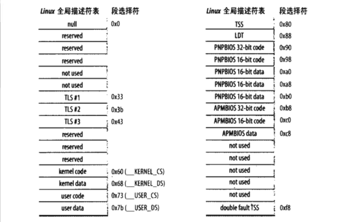

# 2.4 Linux中的分段

80x86微处理器中的分段鼓励程序员把程序划分成逻辑上相关的实体，例如子程序或者全剧与局部数据区。然而,Linux以非常有限的方式使用分段。实际上分段和分页在某种程度上有点多余，因为它们都可以划分进程的物理地址空间：分段可以给每一个进程分配不同的线性地址空间，而分页可以把同一线性地址空间映射到不同的物理空间。与分段相比，Linux更喜欢使用分页方式，原因如下：

1. 当所有进程使用相同的段寄存器时，内存管理变得更简单，也就是说他们能共享同样的一组线性地址。
2. Linux设计目标之一时可以把它移植到绝大多数的处理器平台上。然而，RISC体系结构对分段的支持很有限。

2.6版本的linux只有在80x86结构下才需要使用分段。

运行在用户态的所有Linux进程都使用一对相同的段来对指令和数据寻址。这两个段就是所谓的用户代码段和用户数据段。类似的运行在内核态的所有Linux进程都使用一对相同的段对指令和数据寻址：他们分别是内核代码段和内核数据段。下表显示了这四个重要段的段描述符字段的值。

| 段         | Base       | G   | Limit   | S   | Type | DPL | D/B | P   |
| ---------- | ---------- | --- | ------- | --- | ---- | --- | --- | --- |
| 用户代码段 | 0x00000000 | 1   | 0xfffff | 1   | 10   | 3   | 1   | 1   |
| 用户数据段 | 0x00000000 | 1   | 0xfffff | 1   | 2    | 3   | 1   | 1   |
| 内核代码段 | 0x00000000 | 1   | 0xfffff | 1   | 10   | 0   | 1   | 1   |
| 内核数据段 | 0x00000000 | 1   | 0xfffff | 1   | 2    | 0   | 1   | 1   |

相应的段选择符由__USER_CS，__USER_DS，__KERNEL_CS和__KERNEL_DS分别定义。例如，为了对内核代码段寻址，内核只需要把__KERNEL_CS宏产生的值装进cs段寄存器即可。

注意，与段相关的线性地址从0开始，达到2^32-1的寻址限长。这就意味着在用户太或者内核态下所有的进程可以使用相同的逻辑地址。

所有段都从0x00000000开始，表示Linux下逻辑地址和线性地址是一致的，即逻辑地址的偏移量字段的值与相应的线性地址的值总是一致的。

如前所述，CPU的当前特权级（CPL）反映了进程是在用户态还是内核态，并由存放在cs寄存器中的段选择符的RPL字段指定。只要当前特权级被改变，一些段寄存器必须相应地更新。例如，当CPL=3时（用户态），ds寄存器必须含有用户数据段的段选择符，而当CPL=0时，ds寄存器必须含有内核数据段的段选择符。

当对指向指令或数据结构的指针进行保存时，内核根本不需要为其设置逻辑地址的段选择符，因为cs寄存器就含有当前的段选择符。例如，当内核调用一个函数时，它执行一条call汇编语言指令，该指令仅仅指定其逻辑地址的偏移量部分，而段选择符不用设置，它已经隐藏在cs寄存器了。因为在内核态执行的段只有一种，叫做代码段，由宏__KERNEL_CS定义，所以只要当CPU切换到内核态时将__KERNEL_CS装载进cs就足够了。同样的道理也适用于之乡内核数据结构的指针（隐含地使用ds寄存器）以及指向用户数据结构的指针（内核显示地使用es寄存器）。

除了刚才描述的4个段以外，Linux还使用了其他几个专门的段。

## 2.4.1 Linux GDT

在但处理器系统只有一个GDT，而在多处理器系统中每个CPU对应一个GDT。所有的GDT都存放在cpu_gdt_table数组中。而所有GDT的地址和它们的大小（当初始化gdtr寄存器时使用）被存放在cpu_gdt_descr数组中。GDT的布局时意图如下：

)

每个GDT包含18个段描述符和14个空的、未使用的或保留的项。插入未使用的项的目的是为了使经常一起访问的描述符能够处于同一个32字节的硬件告诉缓存行中。

每一个GDT中包含18个段描述符指向下列的段：

1. 用户态和内核态下的代码段和数据段共4个。
2. 任务状态段（TSS），每个处理器有1个。每个TSS相应的线性地址空间都是内核数据段相应线性地址空间的一个小子集。所有的人物状态段都顺序地存放在init_tss数组中。值得特别说明的是，第n个CPU的TSS描述符的Base字段指向init_tss数组的第n个元素。G（粒度）标志被清0，而Limit字段设置为0xeb，因为TSS段是236字节长。Type字段置为9或11(可用的32位TSS)，而DPL设置为0，因为不允许用户态下的进程访问TSS段。
3. 1个包括缺省局部描述符表的段，这个段通常是被所有进程共享的段。
4. 3个局部线程存储（Thread-Local Storage, TLS）段：这种机制允许多线程应用使用最多3个局部于线程的数据段。系统调用set_thread_area()和get_thread_area()分别为正在执行的进程创建或撤销一个TLS段。
5. 与高级电源管理（AMP）相关的3个段：由于BIOS代码使用段，所以当Linux APM驱动程序调用BIOS函数来获取或者设置APM设备的状态时，就可以使用自定义的代码段和数据段。
6. 与支持即插即用(PnP)功能的BIOS服务程序相关的5个段：在前一种情况下，就像前述与AMP相关的3个段的情况一样，由于BIOS历程使用段，所以当Linux的Pnp设备驱动程序调用BIOS韩寒苏来检测PnP设备使用的资源时，就可以使用自定义的代码段和数据段。
7. 被内核用来处理双重错误异常的特殊TSS段（处理一个异常时可能会引发另一个异常，这种情况下产生双重错误）。

系统中每个处理器都有一个GDT副本。除了少数几种情况以外，所有的GDT副本都存放相同的表象。首先，每个处理器都有自己的TSS段，因此其对应的GDT项不同。其次GDT中只有少数项可能依赖于CPU正在执行的进程（LDT和TLS段描述符）。最后，在某些情况下，处理器可能临时修改GDT副本李的某个项。

## 2.4.2 Linux LDT

大多数用户态下的Linux程序不使用局部描述符表，因此内核就定义了一个缺省的LDT供大多数进程共享。缺省的局部描述符表存放在default_ldt数组中。它包含5个项，但内核仅仅有效地使用了其中的两个项：用于iBCS执行文件的调用门。调用门是80x86微处理器提供的一种机制，用于在调用预定义函数时改变CPU的特权级。

在某些情况下，进程仍然需要创建自己的局部描述符表。modify_ldt()系统调用允许进程创建自己的局部描述符表。

任何被modify_ldt()创建的自定义局部描述符表仍然需要它自己的段。当处理器开始执行拥有自定义局部描述符表的进程时，该CPU的GDT副本中的LDT表项相应地就被修改了。

用户态下的程序同样也利用modify_ldt()来分配新的段，但内核却从不使用这些段，它也不需要了解相应的段描述符，因为这些段描述符被包含在进程自定义的局部描述符表中了。
