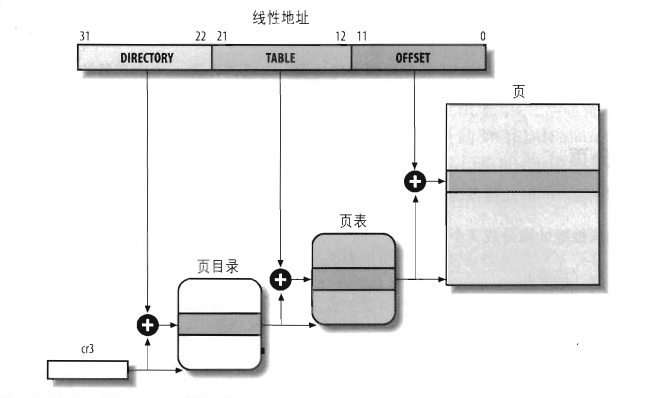

# 2.5 硬件中的分页

分页单元（paging unit）把线性地址转换成物理地址。其中的一个关键任务是把所请求的访问类型与线性地址的访问权限项比较，如果这次内存访问是无效的，就产生一个缺页异常。

为了效率起见，线性地址被分成以固定长度为单位的组，称为页（page）。页内部连续的线性地址被映射到连续的物理地址中。这样，内核可以指定一个页的物理地址和其存储权限，而不用指定页所包含的全部线性地址的存取权限。

分页单元把所有的RAM分成固定长度的页框（有时叫做物理页）。每一个页框包含一个页（page），也就是说一个页框的长度与一个页的长度一致。页框是主存的一部分，因此也是一个存储区域。

把线性地址映射到物理地址的数据结构称为页表。页表存放在主存中，并在启动分页单元之前必须由内核对页表进行适当的初始化。

从80386开始，所有的80x86处理器都支持分页，它通过设置cr0寄存器的PG标志启用。当PG=0时，线性地址就被解释成物理地址。

## 2.5.1 常规分页

从80386起，Intel处理器的分页单元处理4KB的页。

32位的线性地址被分为3个域：

- Directory(目录):最高10位。
- Table(页表)：中间10位。
- Offset(偏移量)：最低12位。

线性地址的转换分两步完成，每一步都基于一种转换表，第一种转换表称为页目录表，第二种转换表称为页表。

使用这种二级模式的目的在于减少每个进程页表所需RAM的数量。如果使用简单的一级页表，那将需要高达2^20个表项（也就是，在每项4哥字节时，需要4MB RAM）来表示每个进程的页表（如果进程使用全部4GB线性地址空间），即使一个进程并不使用那个范围内的所有地址。二级模式通过只为进程实际使用的那些虚拟内存区请求页表来减少内存容量。

每个活动进程必须有一个分配给它的页目录，不过没有必要马上为进程的所有页表都分配RAM。

正在使用的页目录的物理地址存放在控制寄存器cr3中。线性地址内的Dirrectory字段决定页目录中的目录项，而目录项指向适当的页表。地址的Table字段依次又决定页表中的表项，而表项含有页所在页框的物理地址。Offset字段决定页框内的相对位置，由于它是12位长，故每一页含有4096字节的数据。

Directory字段和Table字段都是10位长，因此页目录和页表都可以多达1024项。那么一个页目录可以寻址到高达1024*1024*4096=2^32个存储单元。

页目录和页表项有同样的结构，每项都包含如下字段：

1. Present标志：如果被置为1，所指的页（或页表）就在主存中。如果