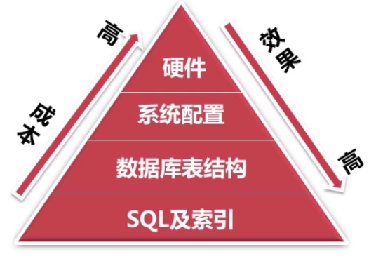

# 1-1 MySQL优化简介

## 1. 数据库优化的目的

1. 避免出现页面访问错误（由于数据库连接timeout产生页面5XX错误，由于慢查询造成页面无法加载，由于阻塞造成数据无法提交）
2. 增加数据库的稳定性
3. 优化用户体验

## 2. 数据库优化方面

数据库的优化在成本与代价方面主要表现如下：

索引过多会影响写入效率与查询效率，索引应该有效并且适量。

优化方式|描述
---|---
SQL及索引|写结构化的SQL，建有效而适量的索引
数据库表结构|利用范式化和反范式化，对数据库进行合理设计，尽量减少开发时查询的开销
系统配置|一般服务器是搭建在Linux系统上，一些例如TCP/IP连接数会影响数据库效率
硬件方面|选择更适合数据库的CPU，更快的IO以及更多的内存，数据库中的数据是放到内存中才进行修改的，所以内存越大效果越好。但是并不是CPU核数越多效果越好。