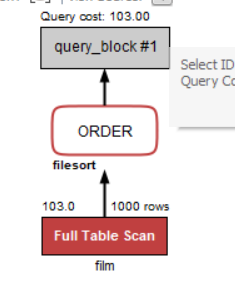
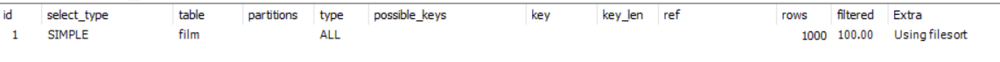
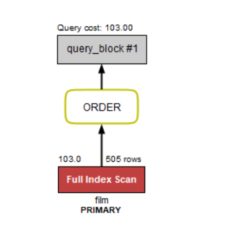
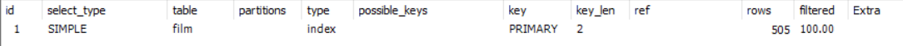
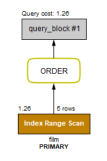
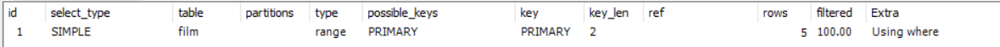

# LIMIT优化

## 示例1：

考虑下面的SQL：

    SELECT 
        film_id, description
    FROM
        film
    ORDER BY title
    LIMIT 50 , 5;

上述的SQL查询了按照title排序的第50页，每页5个数据。

执行计划如下：

通过执行计划可以看到，SQL对整个表进行了查询排序（filesort），扫描了1000行数据，可见是非常缓慢的。

那么有什么方式可以把它去掉呢？假如我们在title列加上索引，你会发现，并没有什么变化，但是如果我们再在description上加上索引就不一样了。然而description列是TEXT，无法加索引。

### 1. 改变排序方式

新的SQL：

    SELECT 
        film_id, description
    FROM
        film
    ORDER BY film_id
    LIMIT 50 , 5;

这里我们只是将排序方式变成了film_id，下面我们查看一下执行计划：

查看执行计划可以发现已经成功的使用了索引列，而不是全表查询了，但是title也是索引列啊，就很迷，但是两个都是索引列就会使用order by指定的索引列。

### 2. 提供数据减少查询

新的SQL:

    SELECT 
        film_id, description
    FROM
        film
	where film_id > 600 and film_id <= 605
    ORDER BY film_id
    limit 1,5

执行计划列一下，一会儿我再吐槽这种神奇的写法：

这种写法的目的就是为了分页查询更快点，因为他确实只查了5条数据，而且用的索引，但是，你这么查就别用limit了吧，图个啥，查的就一页，当然，你可以查的多点再用limit，反正就是很尬。