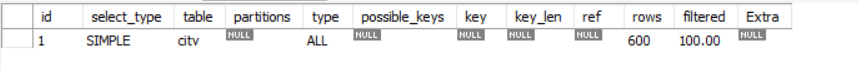

# 通过explain查询和分析SQL的执行计划

使用方法：

    explain + SQL语句

例如：

    explain	SELECT * FROM sakila.city;

分析结果如下：

其中每列的含义如下：

列名|描述
---|---
table|显示这一行是关于哪张表的
type|这是重要的列，显示连接使用了哪种类型，从最好到最差依次是const（成熟查找，对于主键或者唯一索引的查找）、eq_reg（范围查找，唯一索引查找或者是范围查找）、ref、range（连接的查询中，对于索引的范围查找）、index（对于索引的扫描）和ALL（表扫描）
possible_keys|显示可以应用在这张表中的索引，如果为NULL，证明没有索引
key|实际使用的索引，如果为NULL，证明没有使用索引。
key_len|使用的索引的长度。在不损失精确性的情况下，长度越短越好
ref|显示索引的哪一列被使用了，如果可能的话，是一个常数
rows|MYSQL认为必须检查的用来返回请求数据的行数
extra|需要注意的返回值：1.Using filesort:用到文件排序的方式进行优化，一般出现在Order By里。2.Using temporary:查询用到了临时表，通常出现在group by或者order by中。