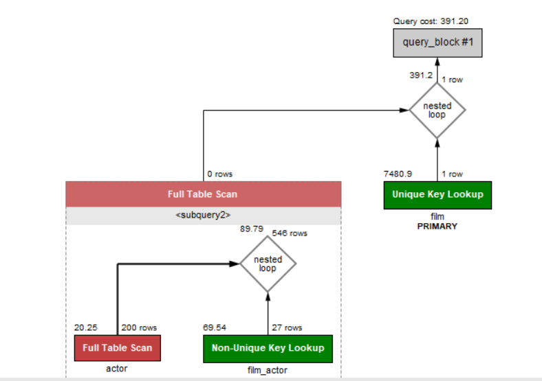
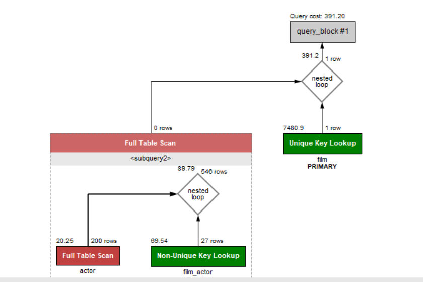
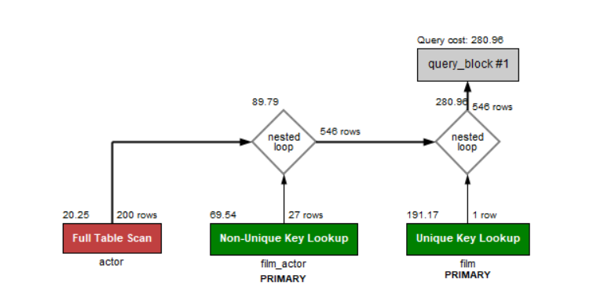
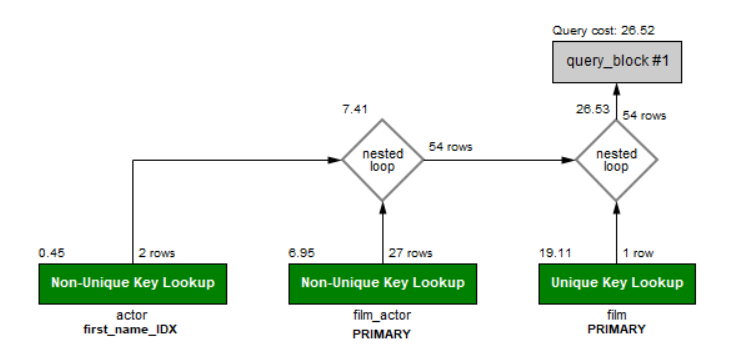

# 子查询的优化

通常把子查询优化为Join查询，但在优化时要注意关联键是否存在一对多的关系，要注意重复数据。

## 示例1：

    SELECT 
        title, release_year, LENGTH
    FROM
        film
    WHERE
        film_id IN (SELECT 
                film_id
            FROM
                film_actor
            WHERE
                actor_id IN (SELECT   
                        actor_id
                    FROM
                        actor
                    WHERE
                        first_name = 'sandra'))

这条SQL的逻辑就是先使用子查询从`actor`表中查出`first_name`为`'sandra'`的，然后再从film_actor中查出`film_actor`表中该类actor所出演的film的`film_id`，最后再取出这些film所对应的title,release_year以及LENGTH。

其执行计划如图：

由图可知，在对actor表的查询阶段，使用的是全表查询，在对film_id IN(XXX)这一阶段使用的也是全表查询，也就是每个film_id都去XXX集合中进行一一匹配，这样是很慢的。针对此，我们进行以下优化。

对于actor的全表查询我们可以建立索引，但是这一索引可能不常用，我们在后面考虑，对于子查询造成的多级分部查询，我们对其使用连接查询优化。

### 1. 连接查询优化

连接查询优化我们可以只优化where内的子查询或者将子查询全部优化，这里我们都进行尝试。

1. 只优化where内的子查询

SQL如下：

    SELECT 
        title, release_year, LENGTH
    FROM
        film
    WHERE
        film_id IN (SELECT 
                film_id
            FROM
                 actor
                    INNER JOIN
                film_actor 
                USING (actor_id)
            WHERE
                first_name = 'sandra')

执行计划如下：

我们发现，这种优化方式并没有任何用处，为什么呢？全表查询出现在对actor表和film_id IN(XXX)这两个操作中，所以我们要对这两个操作进行优化才有作用，因此，才会出现上述情况。那么考虑第二种情况。

2. 全部使用连接

SQL如下：

    SELECT 
        title, release_year, LENGTH
    FROM
        actor
            INNER JOIN
        film_actor USING (actor_id)
            INNER JOIN
        film USING (film_id)
    WHERE
        first_name = 'sandra';

执行计划如下：

这里我们使用外连接消除了film_id IN(XXX)的操作，取而代之的是使用连接操作，由于连接操作有索引支持，所以会变得快很多，至此，子查询优化问题已经解决。

### 2. 添加索引

对于针对actor的first_name列的查询，我们可以采用索引来优化，创建索引如下：

    create index first_name_IDX on actor(first_name);

然后再次执行我们优化后的SQL，执行计划如下：

不得不说，索引就是爸爸一般的存在。

而且还有一个更好玩的事情，我们考虑如下两个SQL：

1. 

    SELECT 
        title, release_year, LENGTH
    FROM
        (SELECT 
            actor_id
        FROM
            actor
        WHERE
            first_name = 'sandra') ac
            INNER JOIN
        film_actor USING (actor_id)
            INNER JOIN
        film USING (film_id)
2. 

    SELECT 
        title, release_year, LENGTH
    FROM
        actor
            INNER JOIN
        film_actor USING (actor_id)
            INNER JOIN
        film USING (film_id)
    WHERE
        first_name = 'sandra';

你会发现他们两个的执行计划都是第一个的执行计划，Mysql将数据先进行where筛选然后再进行的连接操作。

