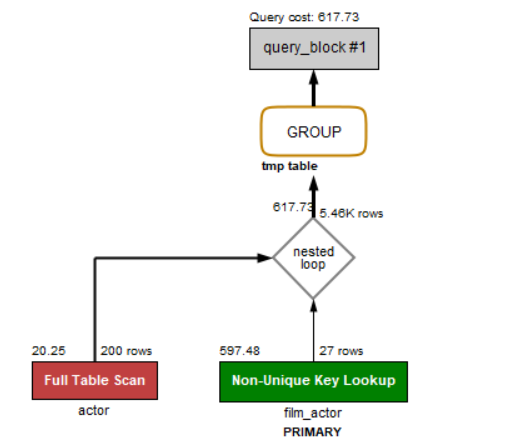
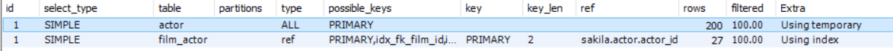
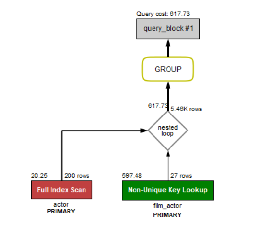
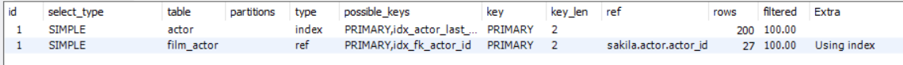
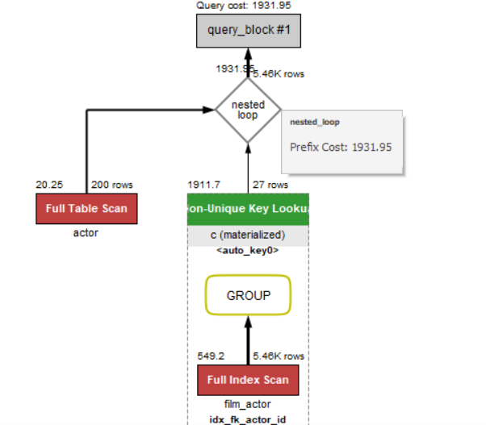
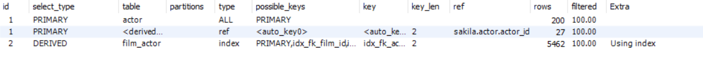

# Group by优化

## 示例1：

考虑如下SQL:

    SELECT 
        actor.first_name, actor.last_name, COUNT(*)
    FROM
        film_actor
            INNER JOIN
        actor USING (actor_id)
    GROUP BY actor_id;

执行计划如图：

该SQL完成了如下操作：查询每个`actor`拍摄了多少部电影。查询思路为：将film_actor与actor表通过actor_id进行连接，然后对其进行count(*)达到该目的。

我们可以从两方面对其进行优化：
1. 消除临时表
2. 剪短中间表宽度

### 1. 消除临时表

参考(https://www.cnblogs.com/jevo/p/3262227.html)得知，mysql中临时表的创建条件如下：
1. group by 和 order by中的列不相同
2. order by的列不是引用from 表列表中 的第一表
3. group by的列不是引用from 表列表中 的第一表
4. 使用了sql_small_result选项
5. 含有distinct 的 order by语句

初始创建内部myisam临时表的条件：
1. 表中存在text、blob列
2. 在group by中的 列 有超过512字节
3. 在distinct查询中的 列 有超过512字节
4. 在union、union all联合查询中，select 列 列表中的 列 有超过512字节的。

根据上述资料，我们改写SQL如下：

    SELECT 
        actor.first_name, actor.last_name, COUNT(*)
    FROM
        actor
            INNER JOIN
        film_actor USING (actor_id)
    GROUP BY actor_id;

其执行计划如图：

所以说，FROM里的表的摆放顺序真的很重要，顺序稍微改下，临时表就没了。

### 2. 剪短中间表宽度

SQL如下：

    SELECT 
        actor.first_name, actor.last_name, c.cnt
    FROM
        actor
            INNER JOIN
        (SELECT 
            actor_id, COUNT(1) AS cnt
        FROM
            film_actor
        GROUP BY actor_id) AS c USING (actor_id);

执行计划如下：

下面我们分析一下上述SQL的执行过程：根据ID越大越先执行，同等ID从上往下执行的原则，优先执行对于film_actor的分组操作，这样将本来要连接的film_actor表的属性缩减到了两个，并且也求出了要求的count值，然后,在进行对于actor表的遍历与连接操作，这样大大缩减了中间表的长度，但是由于film_actor表内容较多，导致Cost明显增加。