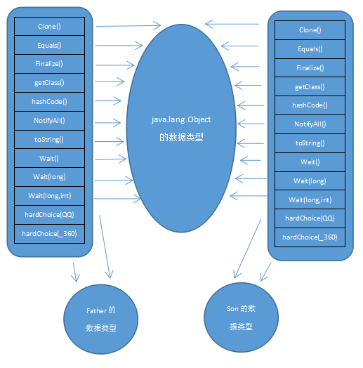

## 第8章 虚拟机字节码执行引擎

### 8.1 概述

执行引擎是Java虚拟机最核心的组成部分之一，虚拟机的执行引擎是由自己实现的，因此可以自行制定指令集与执行引擎的结构体系，并且能够执行那些不被硬件直接支持的指令集格式。

Java执行代码时可能会有==解释执行==和==编译执==行两种选择，但是，==输入的都是字节码文件，处理过程是字节码解析的等效过程，输出的是执行结果==。

### 8.2 运行时栈帧结构

栈帧是用于支持虚拟机进行方法调用和方法执行的数据结构，它是虚拟机运行时数据区中的虚拟机栈的栈元素。栈帧存储了==方法的局部变量表、操作数栈、动态连接和方法返回地址==等信息。每一个方法从调用开始至执行完成的过程，都对应着一个栈帧在虚拟机栈里面从入栈到出栈的过程。

在编译代码时，栈帧中需要多大的局部变量表，多深的操作数栈都已经完全确定了，并且写入到方法表的Code属性之中，因此，一个栈帧需要分配多少内存，不会受到程序运行期变量数据的影响，而仅仅取决于具体的虚拟机实现。

对于执行引擎来说，在活动线程中，只有位于栈顶的栈帧才是有效的，称为当前栈帧，与这个栈帧相关联的方法称为当前方法。执行引擎运行的所有字节码指令都只针对当前栈帧进行操作。

#### 8.2.1 局部变量表

局部变量表是一组变量值存储空间，用于==存放方法参数和方法内部定义的局部变量==。在Java程序编译为Class文件时，就在==方法的Code属性的max_locals数据项中确定了该方法所需要分配的局部变量表的最大容量==。

==局部变量表的容量以变量槽（Slot）为最小单位，每个Slot都应该能存放一个boolean、byte、char、short、int、float、reference或returnAddress类型的数据==。并且Slot的长度可以随着处理器、操作系统或虚拟机的不同而发生变化。

reference表示对一个对象实例的引用，虚拟机规范没有规定reference的长度，但至少能做到如下两点：
1. 从此引用中直接或间接地查找到对象在Java堆中的数据存放的起始地址索引。
2. 此引用中直接或间接地查找到对象所属数据类型在方法区中存储的类型信息。

==对于64位的数据类型，虚拟机会以高位对其的方式为其分配两个连续的Slot空间==。虚拟机通过索引定位的方式使用局部变量表，索引值的范围是从0开始至局部变量表最大的Slot数量。如果访问的是32位数据类型的变量，索引n就代表了使用第n个Slot，如果是64位数据类型的变量，则说明会同时使用n和n+1两个Slot，对于两个相邻的共同存放一个64位数据的两个Slot，不允许采用任何方式单独访问其中的某一个，如果执行了这种操作，虚拟机应该在类加载的校验阶段抛出异常。

虚拟机是使用局部变量表完成参数值到参数变量列表的传递过程的，如果执行的是实例方法（非static方法），局部变量表中第0位索引的Slot默认是用于传递方法所属对象实例的引用，即this。其余参数按照参数列表顺序排序。

==为了尽可能节省栈帧空间，局部变量表中的Slot是可以重用的==。方法体中定义的变量，其作用域并不一定会覆盖整个方法体，==如果当前字节码PC计数器的值已经超出了某个变量的作用域，那这个变量对应的Slot就可以交给其他变量使用==。

局部变量表Slot的重用是需要等到下一次局部变量表的读写操作的，并非是超出作用域就进行空间清理。不使用的对象设置为null，也正是因为这个原因。

除此之外，局部变量表不存在准备阶段，即类加载中的第一次初始化，因此，在Java语法中，局部变量不会被赋予默认值。

#### 8.2.2 操作数栈

操作数栈也称为操作栈，它是一个后入先出的栈。同局部变量表一样，==操作数栈的最大深度也在编译的时候写入到Code属性的max_stacks数据项中==。==操作数栈的每一个元素可以是任意的Java数据类型，包括long和double==。==32位数据类型所占的栈容量为1，64位数据类型所占的栈容量为2。方法执行的任何时候操作数栈的深度都不会超过max_stacks数据项中设定的最大值==。

在概念模型中，两个栈帧作为虚拟机栈的元素，是完全相互独立的。但在==大多数虚拟机的实现里都会做一些优化处理，令两个栈帧出现一部分重叠==。让下面的栈帧的部分操作数栈与上面栈帧的部分局部变量表重叠在一起，达到==公用数据==的目的。

Java虚拟机解释执行引擎称为“基于栈的执行引擎”，其中所指的栈就是指操作数栈。

#### 8.2.3 动态连接

每个栈帧都包含一个指向运行时常量池中该栈帧所属方法的引用，为了支持方法调用过程中的动态连接。我们知道Class文件的常量池中存有大量的符号引用，字节码中的方法调用指令就以常量池中指向方法的符号引用作为参数。这些符号引用一部分会在类加载阶段或者第一次使用的时候就转化为直接引用，这种转化称为静态解析。另外一部分将在每一次运行期间转化为直接引用，这部分称为动态连接。

#### 8.2.4 方法返回地址

当一个方法开始执行后，有两种方式可以退出这个方法。第一种方式是执行引擎遇到任意一个方法返回字节码指令，这时候可能会有返回值传递给上层的方法调用者，称为正常完成出口。另一种退出方式是方法执行过程中遇到了异常，并且这个异常没有在方法体内得到处理，这种退出方式称为异常完成出口。

方法正常退出时，调用者的PC计数器的值可以作为返回地址，栈帧中很可能会保存这个计数器值。方法异常退出时，返回地址是要通过异常处理器表来确定的，栈帧中一般不会保存这部分信息。

方法退出时实际上就等同于把当前栈帧出栈，因此退出时可能执行的操作有：恢复上层方法的局部变量表和操作数栈，把返回值亚茹调用者栈帧的操作数栈中，调整PC计数器的值以指向方法调用指令后面的一条指令。

#### 8.2.5 附加信息

虚拟机规范允许具体的虚拟机实现增加一些规范里没有描述信息到栈帧之中，一般会把动态连接、方法返回地址与其他附加信息全部归为一类，称为栈帧信息。

### 8.3 方法调用

方法调用并不等同于方法执行，方法调用阶段唯一的任务就是确定被调用方法的版本，暂时不涉及方法内部的具体运行过程。

#### 8.3.1 解析

调用目标在程序代码写好、编译器进行编译时就必须确定下来。这类方法的调用称为解析。在Java中符合“编译期可知，运行期不可变”这个要求的方法，主要包括静态方法和私有方法两大类，前者与类型直接关联，后者在外部不可被访问，这两种方法各自的特点决定了它们都不可能通过继承或别的方式重写其他版本，因此它们都适合在类加载阶段进行解析。

与之相对应的是，Java虚拟机里提供了5条方法调用字节码指令：
1. invokestatic:调用静态方法
2. invokespecial：调用实例构造器< init >方法、私有方法和父类方法
3. invokevirtual：调用所有的虚方法
4. invokeinterface：调用接口方法，会在运行时再确定一个实现此接口的对象
5. invokedynamic：先在运行时动态解析出调用点限定符所引用的方法，然后再执行该方法，在之前的4条调用命令，分派逻辑是固化在Java虚拟机内部的，而invokedynamic指令的分派逻辑是由用户所设定的引导方法决定的。

只要能被invokestatic和invokespecial指令调用的方法，都可以在解析阶段中确定唯一的调用版本，符合这个条件的有静态方法、私有方法、实例构造器、父类方法4类。它们在类加载的时候就会把符号引用解析为该方法的直接引用。这类方法称为非虚方法，与之相反，其他方法称为虚方法（除去final方法，后文会提到）。

被final修饰的方法虽然使用invokevirtual调用，但是它没有其他版本。Java语言规范中明确说明了final方法是一种虚方法。

#### 8.3.2 分派调用

##### 1.静态分派

    Human man = new Man();
    
上述代码中，Human称为变量的静态类型，或者叫做外观类型，后面的Man称为变量的实际类型，静态类型和实际类型再程序中都可能发生一些变化，静态类型的变化仅仅在使用时发生（强制转换类型），变量本身的静态类型不会被改变，并且最终的静态类型是在编译期可知的。实际类型变化的结果在运行期才可以确定，编译器在编译程序的时候并不知道一个对象的实际类型是什么。

静态分派的例子如下：

    public class StaticDispatch{

        static abstract class Human{

        }

        static class Man extends Human{

        }

        static class Woman extends Human{

        }

        public void sayHello(Human guy){
            System.out.println("Hello,guy!");
        }

        public void sayHello(Man guy){
            System.out.println("Hello,guy!");
        }

        public void sayHello(Woman guy){
            System.out.println("Hello,guy!");
        }

        public static void main(String[] args){
            Human man = new Man();
            Human woman = new Woman();
            StaticDispatch sr = new StaticDispatch();
            sr.sayHello(man);
            sr.sayHello(woman);
        }
    }

上述代码的输出是：

    hello,guy!
    hello,guy!

重载的分派是依赖于静态类型的。由于我们声明的实例类型均为Human类型，因此调用的方法都是sayHello(Human guy)方法。

所有依赖静态类型来定位方法执行版本的分派动作称为静态分派。静态分派的典型应用是方法重载。静态分派发生在编译阶段，因此确定静态分派的动作实际上不是由虚拟机执行的。

编译器虽然能确定出方法的重载版本，但是在很多情况下这个重载版本并不是唯一的，往往只能确定一个“更加合适的”版本。

例如：

    public class Overload{
        
        public static void sayHello(Object arg){
            System.out.println("Hello object!");
        } 

        public static void sayHello(int arg){
            System.out.println("Hello int!");
        } 

        public static void sayHello(long arg){
            System.out.println("Hello long!");
        } 

        public static void sayHello(Character arg){
            System.out.println("Hello Character!");
        } 

        public static void sayHello(char arg){
            System.out.println("Hello char!");
        } 

        public static void sayHello(char... arg){
            System.out.println("Hello char ...!");
        } 

        public static void sayHello(Serializeable arg){
            System.out.println("Hello Serializeable!");
        } 

        public static void main(String[] args){
            sayHello('a');
        }
    }

执行上面的代码，会调用sayHello(char arg);如果将其注释则调用sayHello(int arg);继续注释则调用sayHello(long arg)；以此类推就会依次调用sayHello(Character arg)，sayHello(Serializable)，sayHello(Object arg)，sayHello(char... arg)；

除此之外，解析和分派这两者之间的关系并不是二选一的排他关系，例如静态方法在类加载时就进行解析，但是静态方法也可以进行重载，那么选择重载版本的过程也是通过静态分派完成的。

#####  2.动态分派

动态分派实现的是重写。查看下面的例子：

    public class DynamicDispatch{

        static abstract class Human{
            protected abstract void sayHello();
        }

        static class Man extends Human{
            @Override
            protected void sayHello(){
                System.out.println("Man say hello!");
            }
        }

        static class Woman extends Human{
            @Override
            protected void sayHellp(){
                System.out.println("Woman say hello");
            }
        }

        public static void main(String[] args){
            Human man = new Man();
            Human woman = new Woman();
            man.sayHello();
            woman.sayHello();
            man = new Woman();
            man.sayHello();
        }
    }

运行结果为：

    Man say hello!
    Woman say hello!
    Woman say hello!

查看反编译class字节码如下：

    javap -verbose DynamicDispatch
    Classfile /C:/Users/ShaoYanli/eclipse-workspace/Test/src/DynamicDispatch.class
        Last modified 2018-10-29; size 514 bytes
        MD5 checksum 5c9aac198ba7068095a85dde0e796dc3
        Compiled from "DynamicDispatch.java"
    public class DynamicDispatch
        minor version: 0
        major version: 52
        flags: ACC_PUBLIC, ACC_SUPER
    Constant pool:
        #1 = Methodref          #8.#22         // java/lang/Object."<init>":()V
        #2 = Class              #23            // DynamicDispatch$Man
        #3 = Methodref          #2.#22         // DynamicDispatch$Man."<init>":()V
        #4 = Class              #24            // DynamicDispatch$Woman
        #5 = Methodref          #4.#22         // DynamicDispatch$Woman."<init>":()V
        #6 = Methodref          #12.#25        // DynamicDispatch$Human.sayHello:()V
        #7 = Class              #26            // DynamicDispatch
        #8 = Class              #27            // java/lang/Object
        #9 = Utf8               Woman
        #10 = Utf8               InnerClasses
        #11 = Utf8               Man
        #12 = Class              #28            // DynamicDispatch$Human
        #13 = Utf8               Human
        #14 = Utf8               <init>
        #15 = Utf8               ()V
        #16 = Utf8               Code
        #17 = Utf8               LineNumberTable
        #18 = Utf8               main
        #19 = Utf8               ([Ljava/lang/String;)V
        #20 = Utf8               SourceFile
        #21 = Utf8               DynamicDispatch.java
        #22 = NameAndType        #14:#15        // "<init>":()V
        #23 = Utf8               DynamicDispatch$Man
        #24 = Utf8               DynamicDispatch$Woman
        #25 = NameAndType        #29:#15        // sayHello:()V
        #26 = Utf8               DynamicDispatch
        #27 = Utf8               java/lang/Object
        #28 = Utf8               DynamicDispatch$Human
        #29 = Utf8               sayHello
    {   
        public DynamicDispatch();
            descriptor: ()V
            flags: ACC_PUBLIC
        Code:
        stack=1, locals=1, args_size=1
            0: aload_0
            1: invokespecial #1                  // Method java/lang/Object."<init>":()V
            4: return
        LineNumberTable:
            line 2: 0

        public static void main(java.lang.String[]);
            descriptor: ([Ljava/lang/String;)V
            flags: ACC_PUBLIC, ACC_STATIC
        Code:
            stack=2, locals=3, args_size=1
            0: new           #2                  // class DynamicDispatch$Man
            3: dup
            4: invokespecial #3                  // Method DynamicDispatch$Man."<init>":()V
            7: astore_1
            8: new           #4                  // class DynamicDispatch$Woman
            11: dup
            12: invokespecial #5                  // Method DynamicDispatch$Woman."<init>":()V
            15: astore_2
            16: aload_1
            17: invokevirtual #6                  // Method DynamicDispatch$Human.sayHello:()V
            20: aload_2
            21: invokevirtual #6                  // Method DynamicDispatch$Human.sayHello:()V
            24: new           #4                  // class DynamicDispatch$Woman
            27: dup
            28: invokespecial #5                  // Method DynamicDispatch$Woman."<init>":()V
            31: astore_1
            32: aload_1
            33: invokevirtual #6                  // Method DynamicDispatch$Human.sayHello:()V
            36: return
        LineNumberTable:
            line 23: 0
            line 24: 8
            line 25: 16
            line 26: 20
            line 27: 24
            line 28: 32
            line 29: 36
    }
    SourceFile: "DynamicDispatch.java"
    InnerClasses:
        static #9= #4 of #7; //Woman=class  DynamicDispatch$Woman of class DynamicDispatch
        static #11= #2 of #7; //Man=class DynamicDispatch$Man of class DynamicDispatch
        static abstract #13= #12 of #7; //Human=class DynamicDispatch$Human of class DynamicDispatch

考察main函数字节码：

    0: new           #2                  // class DynamicDispatch$Man
    3: dup
    4: invokespecial #3                  // Method DynamicDispatch$Man."<init>":()V
    7: astore_1

Java字节码指令用这样的方式初始化生成了3个对象实例，然后通过invokevirtual指令对sayHello()方法进行调用。

invokevirtual指令的运行时解析过程大致分为如下步骤：

1. 找到操作数栈顶的第一个元素所指向的对象的实际类型，记作C。
2. 如果在类型C中找到与常量中的描述符和简单名称都相符的方法，则进行访问权限校验，如果通过则返回这个方法的直接引用，查找过程结束；如果不通过，则返回java.lang.IllegalAccessError异常。
3. 否则，按照继承关系从下往上一次对C的各个父类进行第2步的搜索和验证过程。
4. 如果始终没有找到合适的方法，则抛出java.lang.AbstractMethodError异常。

invokevirtual指令的第一步就是在运行期确定接收者的实际类型。我们把这种在运行期根据实际类型确定方法执行版本的分派过程称为动态分派。

##### 3.单分派和多分派

方法的接收者和方法的参数统称为方法的宗量。根据方法宗量的多少，可以将分派划分为单分派和多分派。单分派是根据一个宗量对目标方法进行选择，多分派则是根据多于一个宗量对目标方法进行选择。

静态分派根据调用方法的对象类型和方法参数类型两者进行分派，因此是多分派的，动态分派由于实现的是重写，不关心参数类型，只关心调用对象类型，因此是单分派的。

Java是个静态多分派，动态单分派的语言。

##### 4.虚拟机动态分派的实现

动态分派是非常频繁的操作，而且动态分派的方法版本选择过程需要运行时在类的方法元数据中搜索合适的目标方法。最常用的“稳定优化”手段就是为类在方法区中建立一个虚方法表（Virtual Method Table)，与之对应的，在invokeinterface执行时也会用到接口方法表——Inteface Method Table，使用虚方法表索引来代替元数据查找提高性能。

方法表结构如下：

虚方法表中存放着各个方法的实际入口地址。如果某个方法在子类中没有重写，那子类的虚方法表里面的入口和父类相同方法的地址入口是一致的，都指向父类的实现入口。如果子类中重写了这个方法，子类方法表中的地址将会替换为指向子类实现版本的入口地址。

为了程序实现上的方便，具有相同签名的方法，在父类、子类的虚方法表中都应当具有一样的索引序号，这样当类型变换时，仅需要变更查找的方法表，就可以从不同的虚方法表中按索引转换出所需的入口地址。

方法表一般在类加载的连接阶段进行初始化，准备了类的变量初始值后，虚拟机会把该类的方法表也初始化完毕。

除了该种稳定优化手段外，在条件允许的情况下，还会使用内敛缓存和基于“类型继承关系分析”技术的守护内联。

#### 8.3.3 动态类型语言支持

动态类型语言：动态类型语言的关键特征是它的类型检查主题过程是在运行期而不是编译期。

静态类型语言：编译期就进行类型检查过程的语言。

根据上文我们分析动态分派的例子我们知道Java语言在编译期已经将完整的符号引用生成出来（上面例子的invokevirtual #6，上面例子中是CONSTANT_Methodref_info常量）。

这个符号引用包含了此方法定义在哪个具体类型之中、方法的名字以及参数顺序、参数类型和方法返回值等信息，通过这个符号引用，虚拟机可以翻译除这个方法的直接引用。

JDK 1.7以前的字节码指令集中，4个方法调用指令（invokevirtual、invokespecial、invokestatic、invokeinterface）的第一个参数都是被调用方法的符号引用（CONSTANT_Methodref_info或者CONTANT_InterfaceMethodref_info常量），前面提到方法的符号引用在编译期产生，而动态类型语言只有在运行期才能确定接收者类型，因此在这之前，Java实现动态语言就必须使用其他方式。JDK 1.7的invokedynamic指令以及java.lang.invoke包也因此出现。

这个包的主要目的是在之前单纯依靠符号引用来确定调用点目标方法这种方式之外，提供一种新的动态确定目标方法的机制，称为MethodHandle。

下面是一个对MethodHandle的演示：

    public class MethodHandleTest{

        static class ClassA{
            public void println(String s){
                System.out.println(s);
            }
        }

        public static void main(String[] args) throws Throwable{
            Object obj = System.currentTimeMillis() % 2 == 0 ? System.out : new ClassA();

            getPrintlnMH(obj).invokeExact("icyfenix);
        }

        private static MethodHandle getPrintMH(Object receiver) throws Throwable{
            MethodType mt = MethodType.methodType(void.class, String.class);
            return lookup().findVirtual(receiver.getClass(), "println" ,mt).bindTo(receiver);
        }

    }

上述任务可以使用反射实现，两者之间的区别如下：

- 从本质上讲，Reflection和MethodHandle机制都是在模拟方法调用，但Reflection是在模拟Java代码层次的方法调用，而MethodHandle是在模拟字节码层次的方法调用。而MethodHandles.lookup中的三个方法——findStatic()、findVirtual()、findSpecial()对应invokestatic、invokevirtual、invokespecial这几条字节码指令的执行权限校验行为，而这些底层细节在使用Reflection API时是不需要关心的。
- Reflection中的java.lang.reflect.Method对象远比MethodHandle机制中的java.lang.invoke.MethodHandle对象所包含的信息多。前者是方法在Java一端的全面映像，包含了方法的签名、描述符以及方法属性表中各种属性的Java一端的全面映像，包含了方法的签名、描述符以及方法属性表中各种属性的Java端表示方式，还包含执行权限等运行期信息。而后者仅仅包含与执行该方法相关的信息。Reflection是重量级，而MethodHandle是轻量级。
- 由于MethodHandle是对字节码的方法指令调用的模拟，所以理论上虚拟机在这方面做的各种优化，在MethodHandle上也应当可以采用类似思路取支持，而通过反射机制调用则不行。
- Reflection API的设计目标是只为Java语言服务的，而MethodHandle则设计成可服务于所有Java虚拟机之上的语言，其中也包括Java语言。

invokedynamic指令与MethodHandle机制相同，都是用来解决invoke*指令方法分派规则固化在虚拟机之中的问题的，把如何查找目标方法的决定权从虚拟机转嫁到具体用户代码之中，让用户有更高的自由度。两者一个使用上层Java代码和API来实现，另一个用字节码和Class中其他属性、常量来完成。

每一处含有invokedynamic指令的位置都称作“动态调用点”（Dynamic Call Site），这条指令的第一参数变为JDK 1.7 新加入的CONSTANT_InvokeDynamic_info常量，从这个新常量中可以得到3项信息：引导方法（Bootstrap Method，此方法存放在新增的BootstrapMethods属性中）、方法类型（MethodType）和名称。引导方法是固定的参数，并且返回值为java.lang.invoke.CallSite对象，这个代表真正要执行的目标方法调用。

最后给定一段代码来解释上述过程：

    public class InvokeDynamicTest{

        public static void main(String[] args) throws Throwable{
            INDY_BootstrapMethod().invokeExact("icyfenix");
        }

        public static void testMethod(String s){
            System.out.println("hello String: "+s);
        }

        public static CallSite BootstrapMethod(MethodHandles.Lookup lookup，String name, MethodType mt) throws Throwable{
            return ConstantCallSite(lookup.findStatic(InvokeDynamicTest.class,name,mt));
        }

        private static MethodType MT_BootstrapMethod(){
            return MethodType.fromMethodDescriptorString("(Ljava/lang/invoke/MethodHandles$Lookup;Ljava/lang/String;Ljava/lang/MethodType;)Ljava/lang/invoke/CallSite;"，null);
        }

        private static MethodHandle MH_BootstrapMethod() throws Throwable{
            return lookup().findStatic(InvokeDynamicTest.class, "BootstrapMethod",MT_BootstrapMethod());
        }

        private static MethodHandle INDY_BootstrapMethod() throws Throwable {
            CallSite cs = (CallSite) MH_BootstrapMethod().invokeWithArguments(lookup(),"testMethod",MethodType.fromMethodDescriptorString("(Ljava/lang/String;)V",null));
            return cs.dynamicInvoker();
        }
    }

## 需要了解的问题

1. 运行时栈帧结构。
2. 方法调用具体步骤，分派类型以及注意事项。
3. 动态语言支持，以及使用。
