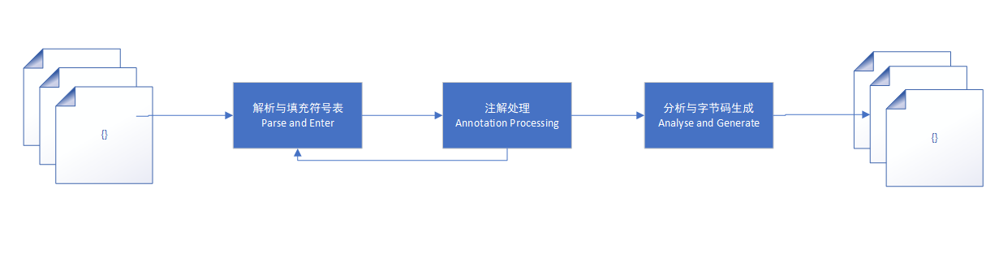

# 第10章 早期（编译期）优化

## 10.1 概述

Java语言的“编译期”其实是一段“不确定”的操作过程，因为它可能是指一个前端编译器把*.java文件转变成*.class文件的过程；也可能是指虚拟机的后端运行期编译器（JIT编译器，Just In Time Compiler）把字节码转变成机器码的过程；还可能是指使用静态提前编译器（AOT编译器，Ahead Of Time Compiler）直接把*.java文件编译成本地机器代码的过程。

下面列举了三类编译过程中一些比较有代表性的编译器：

- 前端编译器：Sun的Javac、Eclipse JDT中的增量式编译器（ECJ）。
- JIT编译器：Hotpot VM的C1、C2编译器。
- AOT编译器：GNU Compiler for the Java（GCJ）、Excelsior JET。

## 10.2 Javac编译器

Javac编译器本身就是一个由Java语言编写的程序。

### 10.2.1 Javac的源码与调试

从Sun Javac的代码来看，编译过程大致可以分为3个过程：

- 解析与填充符号表过程
- 插入式注解处理器的注解处理过程
- 分析与字节码生成过程

这三个步骤之间的关系和交互顺序如图：

Javac编译动作的入口是com.sun.tools.main.JavaCompiler类。

### 10.2.2 解析与填充符号表

解析步骤有parseFiles()方法完成，解析步骤包括了编译原理中的词法分析和语法分析两个过程。

#### 1. 词法、语法分析

词法分析是将源代码的字符流转变为标记（Token）集合，单个字符是程序编写过程的最小元素，而标记则是编译过程的最小元素，关键字、变量名、字面量、运算符都可以称为标记。词法分析过程由com.sun.tools.javac.parser.Scanner类来实现。

语法分析是根据Token序列构造抽象语法树的过程。这个阶段产出的抽象语法树由com.sun.tools.javac.tree.JCTree类表示，经过这个步骤之后，编译器就基本不会再对源码文件进行操作了，后续的操作都建立在抽象语法树之上。

#### 2. 填充符号表

填充符号表的过程由enterTrees()方法进行。

符号表是由一组符号地址和符号信息构成的表格。符号表中所登记的信息在编译的不同阶段都要用到。在语义分析中，符号表所登记的内容将用于语义检查和产生中间代码。在目标代码生成阶段，当对符号名进行地址分配时，符号表时地址分配的依据。

在Javac源代码中，填充符号表的过程由com.sun.tools.javac.comp.Enter类实现。