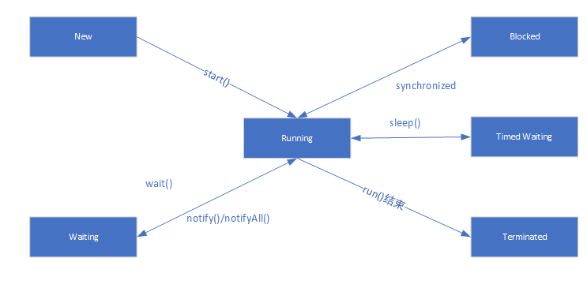

# 第12章 Java内存模型与线程

并发的广泛应用是使得Amdahl定律代替摩尔定律成为计算机性能发展源动力的根本原因，也是人类压榨计算机运算能力的最有力武器。

让计算机同时去做几件事情的原因是计算机的运算能力太强大，运算速度与它的存储和通信子系统速度的差距太大，大量的时间都花费在磁盘I/O、网络通信或者数据库访问上。

## 12.2 硬件的效率与一致性

物理机对并发的处理方案对于虚拟机的实现有相当大的意义。下面我们考虑物理机对于并发的处理方案。

绝大多数运算任务都不可能只靠处理器“计算”就能完成，处理器至少要与内存交互。由于计算机的存储设备与处理器的运算速度有几个数量级差距，所以现代计算机系统不得不加入一层读写速度尽可能接近处理器运算速度的告诉缓存来作为内存与处理器之间的缓冲：将运算需要使用到的数据复制到缓存中，让运算能快速运行，当运算结束后再从缓存同步回缓存之中，这样处理器就无须等待缓慢的内存读写了。

基于高速缓存的存储交互很好地解决了处理器与内存的速度矛盾，但也引入缓存一致性的问题：在多处理器系统中，每个处理器都有自己的高速缓存，而它们又共享同一主内存。多个高速缓存中的内容产生冲突到底如何解决。为了解决一致性问题，需要各个处理器访问缓存时就遵循一些协议，在读写时要根据协议来进行操作，这类协议有MSI、MESI、MOSI、Synapse、Firefly、Dragon Protocol等。

处理器、高速缓存、主内存之间的交互关系如图：

除了增加高速缓存之外，为了使得处理器内部的运算单元能尽量被充分利用，处理器可能会对输入代码进行乱序执行（Out-Of-Order Execution）优化，处理器会在计算之后将乱序执行的结果重组，保证该结果与顺序执行的结果是一致的，但并不保证程序中各个语句计算的先后顺序与输入代码中的顺序一致，如果存在一个计算任务依赖另一个计算任务的中间结果，那么其顺序行并不能依靠代码的先后顺序来保证。

## 12.3 Java内存模型

Java虚拟机规范中试图定义一种Java内存模型（Java Memory Model，JMM）来屏蔽掉各种硬件和操作系统的内存访问差异，以实现让Java程序在各种平台下都能达到一致的内存访问效果。

### 12.3.1 主内存与运行内存

Java内存模型的主要目标是定义程序中各个变量的访问规则，即在虚拟机中将变量存储到内存和从内存中去除变量这样的底层细节。此处的变量包括了实例变量、静态字段、构成数组对象的元素，但不包括局部变量与方法参数，因为这些是线程私有的，不会被共享。

Java的内存模型并没有限制执行引擎使用处理器的特定寄存器或缓存来和主内存进行交互，也没有限制即时编译器进行调整代码执行顺序这类优化措施。

Java内存模型规定了所有的变量都存储在主内存中。每条线程还有自己的工作内存，线程的工作内存中保存了被该线程使用到的变量的主内存副本拷贝，线程对变量的所有操作都必须在工作内存中进行，而不能直接读写主内存中的变量。不同的线程之间也无法直接访问对方工作内存中的变量，线程间变量值的传递均需要通过主内存来完成，线程、主内存、工作内存三者的交互关系如下：

### 12.3.2 内存间的交互操作

上图中的Save和Load操作所描述的就是本部分所做的操作。虚拟机实现时必须保证下面提及的每一种操作都是原子的、不可再分的（对于double和long类型的变量来说，load、store、read和write操作在某些平台上允许有例外）。Java内存模型中定义了以下8种操作来完成：

- lock（锁定）：作用于主内存的变量，它把一个变量标识为一条线程独占的状态。
- unlock（解锁）：作用于主内存的变量，它把一个处于锁定状态的变量释放出来，释放后的变量才可以被其他线程锁定。
- read（读取）：作用于主内存的变量，它把一个变量的值从主内存传输到线程的工作内存中，以便随后的load动作使用。
- load（载入）：作用于工作内存的变量，它把read操作从主内存中得到的变量值放入工作内存的变量副本中。
- use（使用）：作用于工作内存的变量，它把工作内存中的一个变量的值传递给执行引擎，每当虚拟机遇到一个需要使用到变量的值的字节码指令时将会执行这个操作。
- assign（赋值）：作用于工作内存的变量，它把一个从执行引擎接收到的值赋给工作内存的变量，每当虚拟机遇到一个给变量赋值的字节码指令时执行这个操作。
- store（存储）：作用于工作内存的变量，它把工作内存中的一个变量的值传送到主内存中，以便随后的write操作。
- write（写入）：作用于主内存的变量，它把store操作从工作内存中得到的变量的值放入到主内存的变量中。

如果要把一个变量从主内存复制到工作内存，就要顺序的执行read和load操作，如果要把变量从工作内存同步回主内存，就要顺序地执行store和write操作。Java内存模型只要求上述两个操作必须按顺序执行，而没有保证时连续执行，也就是说，read和store之间、store与write之间时可插入其他指令的。除了上述8种操作之外，Java内存模型还规定了在执行上述8种基本操作时必须满足如下规则：

- 不允许read和load、store和write操作之一单独出现，不允许一个变量从主内存种读取了但工作内存不接受，或者从工作内存发起回写了但主内存不接受的情况出现。
- 不允许一个线程丢弃它的最近的assign操作，变量在工作内存种改变了之后必须把该变化同步回主内存。
- 不允许一个线程无原因地（没有发生过任何assign操作）把数据从线程的工作内存同步回主内存。
- 一个新的变量只能从主内存中“诞生”，不允许在工作内存中直接使用一个未被初始化（load或assign）的变量，换句话说，就是对一个变量实施use、store操作之前，必须先执行过了assign和load操作。
- 一个变量在同一时刻只允许一条线程对其进行lock操作，但lock操作可以被同一条线程重复执行多次，多次执行lock操作后，只有执行相同次数的unlock操作，变量才会被解锁。
- 如果对一个变量执行lock操作，那将会清空工作内存中此变量的值，在执行引擎使用这个变量前，需要重新执行load或assign操作初始化变量的值。
- 如果一个变量事先没有被lock操作锁定，那就不允许对它执行unlock操作，也不允许去unlock一个被其他线程锁定住的变量。
- 当一个变量执行unlock操作执行之前，必须先把此变量同步回主内存中（执行store、write操作）。

这8种内存访问操作以及上述规则限定，再加上稍后介绍的对volatile的一些特殊规定，就已经完全确定了Java程序种哪些内存访问操作在并发下是安全的。

### 12.3.3. 对于volatile型变量的特殊规则

当一个变量定义为volatile之后，它将具备两种特性，第一是保证此变量对所有线程的可见性，这里的“可见性”是指当一条线程修改了这个变量的值，新值对于其他线程来说是立即可知的。而普通变量不能做到这一点，普通变量的值在线程间传递均需要通过主内存来完成。

volatile变量对所有线程是立即可见的，对volatile变量所有的写操作都能立刻反应到其他线程种，volatile变量在各个线程中是一致的，但是不能说基于volatile变量的运算在并发下是安全的。

volatile变量在各个线程的工作内存中不存在一致性问题（在各个线程的工作内存中，volatile变量也可以存在不一致的情况，但由于每次使用之前都要先刷新，执行引擎看不到不一致的情况，因此可以认为不存在不一致的问题），但是这种一致只保证了初始值一致。查看下面代码：

    public class Test {

	    public static volatile int race = 0;
	
	    public static void increase() {
		
		    race ++;
	    }
	
	    private static final int THREADS_COUNT = 20;
	
	    public static void main(String[] args) 
    	{
		    Thread[] threads = new Thread[THREADS_COUNT];
		    for(int i = 0;i < THREADS_COUNT;i ++) {
			    threads[i] = new Thread(new Runnable() {
				    public void run() {
					    for(int i = 0;i < 10000;i ++) 
					    {
						
						    increase();
					    }
				    }
			    });
			    threads[i].start();
		    }
		    while(Thread.activeCount() > 1) {
			    Thread.yield();
		    }
		    System.out.println(race);
	    }
    }

该段代码的main函数使用for循环产生了20个线程，然后每个线程中都执行10000次对race变量的自增操作。理论上结果是200000，但是实际上，每次都不到200000，我们已经将race变量添加了volatile修饰符了，应该没有问题啊。上面我说这里的一致性是指初始一致性，意思是可能同时有多个线程执行自增方法时同时获取到了race变量进行自增操作，在获取到race变量时，它们是一致的，在执行运算过程中，有些线程获取race变量进行自增操作，这样获取到的就是过期的变量，导致产生上述情况。

由于volatile变量只能保证可见性，在不符合以下两条规则的运算场景中，我们仍然要通过加锁来保证原子性。
- 运算结果并不依赖变量的当前值，或者能够确保只有单一的线程修改变量的值。
- 变量不需要和其他的状态变量共同参与不变约束。

使用volatile变量的第二个语义是禁止重排序优化，普通的变量仅仅会保证在该方法的执行过程中所有依赖赋值结果的地方都能获取到正确的结果，而不能保证变量赋值操作的顺序与程序代码中执行顺序一致。因为在一个线程的方法执行过程中，无法感知到这点，这也就是Java内存模型中描述的所谓的“线程内表现为串行的语义”。

例如下面的代码：

    Map configOptions;
    char[] configText;
    //此变量必须定义为volatile
    volatile boolean initialized = false;

    //假设一下代码在线程A中执行
    //模拟读取配置文件信息，当读取完成后将initialized设置为true以通知其他线程配置可用
    configOptions = new HashMap();
    configText = readConfigFile(filename);
    processConfigOptions(configText,configOptions);
    initialized = true;

    //假设以下代码在线程B中执行
    //等待initialized为true，代表线程A已经把配置信息初始化完成
    while(!initialized){
        sleep();
    }
    //使用线程A中初始化好的配置信息
    doSomethingWithConfig();

如果不使用volatile禁止代码重排序，那么代码重排序可能将initialized=true放置到初始化配置操作的前面，这样就会导致逻辑错误。

那么volatile是如何保证自己的可视性和禁止重排序的作用的呢？

- 保证可视性：在于有volatile修饰的变量，赋值后多执行了一个“lock addl $0x0,(%esp)”操作，这个操作就相当于一个内存屏障（），这句指令中的“addl $0x0,($esp)”（把ESP寄存器的值加0）显然是一个空操作（采用这个空操作而不是空操作指令nop是因为IA32手册规定lock前缀不允许配合nop指令使用），查询IA32手册，发现lock前缀的作用是使得本CPU的Cache写入了内存，该写入动作也会引起别的CPU或者别的内核无效化其Cache，这种操作相当于对Cache中的变量做了一次store和write操作。
- 禁止重排序：从硬件架构上讲，指令重排序是指CPU采用了允许将多条指令不按规定的顺序分开发送给各相应的电路元件处理。但并不是说指令任意重排，CPU需要能正确处理指令依赖情况以保障程序能得出正确的执行结果。lock addl $0x0,(%esp)指令把修改同步到内存时，意味着所有之前的操作都已经执行完成，这样便使“指令重排序无法越过内存屏障”。

Java内存模型对volatile变量定义的特殊规则：

- 只有当线程T对变量V执行的前一个操作是load的时候，线程T才能对变量V执行use操作；并且只有当线程T对变量V执行的后一个操作是use的时候，线程T才能对变量V执行load操作。线程T对变量V的use动作可以认为是和线程T对变量V的load、read动作相关联，必须连续一起出现（这条规则要求在工作内存中，每次使用V前都必须先从主内存刷新最新的值，用于保证能看见其他线程对变量V所做的修改后的值）。
- 只有当线程T对变量V执行的前一个动作是assign的时候，线程T才能对变量V执行store操作；并且，只有当线程T对变量V执行的后一个动作是store的时候，线程T才能对变量V执行assign操作。线程T对变量V的assign操作可以认为是和线程T对变量V的store、write动作相关联，必须连续出现在一起（这条规则要求在工作内存中，每次修改V后都必须立刻同步回主内存中，用于保证其他线程可以看到自己对变量V所做的修改）。
- 假定动作A是线程T对变量V实施的use或assign动作，嘉定动作F是和动作A相关联的load或store操作，假定动作P是和动作F相对应的对变量V的read或write动作；类似的，嘉定动作B是线程T对变量W实施的use或assign操作，假定动作G是和动作B相关联的load或store操作，假定动作Q是和动作G相对应的对变量W的read或write操作。如果A先于B，那么P先于Q（这条规则要求volatile修饰的变量不会被指令重排序优化，保证代码的执行顺序和程序的顺序相同）。
  
### 12.3.4 对于long和double型变量的特殊规则

Java内存模型要求lock、unlock、read、load、assign、use、store、write这8个操作都具有原子性，但是对于64位的数据类型（long和double），在模型中特别定义了一条相对宽松的规定：允许虚拟机将没有被volatile修饰的64位数据类型的读写操作划分为两次32位的操作来进行，即允许虚拟机实现选择可以不保证64位数据类型的load、store、read和write这4个操作的原子性，这就是所谓的long和double的非原子性协定。但当下商用的虚拟机平台几乎都选择把64位的数据的读写操作作为原子操作来实现。

### 12.3.5 原子性、可见性和有序性

- 原子性：由Java内存模型来直接保证的原子性变量操作包括read、load、assign、use、store和write。我们大致可以认为基本数据类型的访问读写是具备原子性的。如果应用场景需要一个更大范围的原子性保证，Java内存模型还提供了lock和unlock操作来满足这种需求，提供了字节码指令monitorenter和monitorexit来隐式地使用这两个操作，这两个字节码指令反映到Java代码中就是同步块——synchronized关键字，因此在synchronized块之间的操作也具备原子性。
- 可见性：当一个线程修改了共享变量的值，其他线程能够立刻得到这个值的修改。除了volatile之外，synchronized和final也可以实现可见性。同步块的可见性是因为“对一个变量执行unlock操作之前，必须先把此变量同步会主内存”这条规则获得的。而final关键字的可见性是指：被final修饰的字段在构造器中一旦初始化完成，并且构造器没有把“this”的引用传递出去，那在其他线程中就能看到final字段的值。
- 有序型：如果在本线程内观察，所有操作都是有序的，在一个线程中观察另一个线程，所有操作都是无序的。前半句指“线程内表现为串行的语义”，后半句是指“指令重排序现象”和“工作内存与主内存同步延迟”现象。
  
### 12.3.6 先行发生原则

先行发生原则是判断数据是否存在竞争、线程是否安全的主要依据，依靠这个原则，我们可以通过几条规则一揽子地解决并发环境下两个操作之间是否可能存在冲突的所有问题。

先行发生原则是Java内存模型中定义的两项操作之间的偏序关系，如果说操作A先行发生于操作B，其实就是说发生在操作B之前，操作A产生的影响能够被操作B观察到，“影响”包括修改了内存中共享变量的值、发送了消息、调用了方法等。

下面是Java内存模型下一些“天然的”先行发生关系：

- 程序次序规则：在一个线程内，按照程序代码顺序，书写在前面的操作先行发生于书写在后面的操作。准确的说，应该是控制流顺序而不是程序代码顺序，因为要考虑分支、循环等情况。
- 管程锁定规则：一个unlock操作先行发生与后面对同一个锁的lock操作。这里必须强调的是同一个锁，而“后面”是指时间上的先后顺序。
- volatile变量规则：对一个volatile变量的写操作先行发生于后面对这个变量的读操作，这里的“后面”同样是指时间上的先后顺序。
- 线程启动规则：Thread对象的start()方法先行发生于此线程的每一个动作。
- 线程终止规则：线程中的所有操作都先行发生于对此线程的终止检测，我们可以通过Thread.join()方法结束、Thread.isAlive()的返回值等手段检测到线程已经终止。
- 线程中断规则：对线程interrupt()方法的调用先行发生于被中断线程的代码检测到中断事件的发生，可以通过Thread.interrupted()方法检测到是否有中断发生。
- 对象终结规则：一个对象的初始化完成（构造函数执行结束）先行发生于它的finalize()方法的开始。
- 传递性：如果操作A先行发生于操作B，操作B先行发生于操纵C，那就可以得出操作A先行发生于操作C的结论。

时间先后顺序于先行发生原则之间基本没有太大的关系，衡量并发安全问题的时候不要受到时间顺序的干扰，一切必须以先行发生的原则为准。一个操作“时间上的先发生”不代表这个操作会“先行发生”，反之亦然。

## 12.4 Java与线程

### 12.4.1 线程的实现

线程是比进程更轻量级的调度执行单位，线程的引入，可以把一个进行的资源分配和执行调度分开，各个线程既可以共享进程资源（内存地址，文件I/O等），又可以独立调度（线程是CPU调度的基本单位）。

主流从操作系统都提供了线程实现，Java语言则提供了在不同硬件和操作系统平台下对线程操作统一处理，每个已执行start()且还未结束的java.lang.Thread类的实例就代表了一个线程。我们注意到Thread类与大部分的Java API有显著的差别，它的所有关键方法都声明为Native的。在Java API中，一个Native方法往往意味着这个方法没有使用或无法使用平台无关的手段来实现。

实现线程主要有3种方式：使用内核线程实现、使用用户线程实现、使用用户线程加轻量级进程混合实现。

#### 1. 使用内核线程实现

内核线程（Kernel-Level Thread，KLT）就是直接由操作系统内核（Kernel，下称内核）支持的线程，这种线程由内核来完成线程切换，内核通过操纵调度器（Scheduler）对线程进行调度，并负责将线程的任务映射到各个处理器上。每个内核线程可以视为内核的一个分身，这样的操作系统就有能力同时处理多件事情，支持多线程的内核就叫做多线程内核。

程序一般不会直接去使用内核线程，而是去使用内核线程的一种高级接口——轻量级进程（Light Weight Process，LWP），轻量级进程就是我们通常意义上所讲的线程，由于每个轻量级进程都由一个内核线程支持，因此只有先支持内核线程，才能有轻量级进程这种轻量级进程与内核线程之间的1：1关系称为一对一线程模型，如下图：

由于内核线程的支持，每个轻量级进程都成为一个独立的调度单元，即使有一个轻量级进程在系统调用种阻塞了，也不会影响整个进程继续工作，但是局限性如下：
1. 由于是基于内核级线程实现的，所以各种线程操作都需要进行系统调用，而系统调用的代价较高。
2. 每个轻量级进程需要有一个内核线程的支持，要消耗一定的内核资源，因此一个系统支持轻量级进程的数量是有限的。

#### 2. 使用用户线程来实现

从广义上讲，一个线程只要不是内核线程，就可以认为是用户线程，从这个意义上讲，轻量级进程也属于用户线程，但轻量级进程的实现始终是建立在内核之上的，许多操作都要进行系统调用，效率会受到限制。

狭义上的用户线程指的是完全建立在用户空间的线程库上，系统内核不能感知线程存在的实现。用户线程的建立、同步、销毁和调度完全在用户态中完成，不需要内核的帮助。这种进程与用户线程之间1：N的关系称为一对多的线程模型，模型如图所示：

使用用户线程的优势在于不需要系统内核的支援，劣势在于没有系统内核的支援，所有线程操作都需要用户程序自己处理。

#### 3. 使用用户线程加轻量级进程混合实现

将内核线程与用户县城一起使用的混合实现方式，这种方式下，既存在用户进程，也存在轻量级进程。用户线程还是完全建立在用户空间中，因此用户线程的创建、切换、析构等操作依然廉价，并可以支持大规模的并发。而操作系统提供指出的轻量级进程则作为用户线程和内核线程的桥梁，让使用内核提供的线程调度功能及处理器映射，并且用户线程的系统调用要通过轻量级线程来完成，大大降低了整个进程被完全阻塞的风险。在这种混合模式中，用户线程和轻量级进程的数量比是不定的，即为N:M的关系。

#### 4. Java线程的实现

Java线程JDK 1.2之前，是基于称为“绿色线程”的用户线程实现的，而在JDK 1.2中，线程模型替换为基于操作系统原生线程模型来实现。因此在现在的JDK版本中，操作系统支持怎样的线程模型，很大程度上决定了Java虚拟机的线程是怎样映射的。

### 12.4.2 Java线程调度

线程调度是指系统位线程分配处理器使用权的过程，主要调度方式有两种，分别是协同式线程调度和抢占式线程调度。

如果使用协同式线程调度的多线程系统，线程的执行时间由线程本身来控制，线程把自己的工作执行完了之后，主动通知系统切换到另外一个线程上。协同式多线程的最大好处是实现简单，而且由于线程要把自己的事情干完之后才会进行线程切换，切换操作对线程自己是可知的，所以没有什么线程同步的问题。这种方式的坏处也很明显：线程执行时间不可控制，甚至如果一个线程编写有问题，一直不告知系统进行线程切换，那么程序就会一直阻塞在那里。

抢占式调度的多线程系统，每个线程将由系统来分配执行时间，线程的切换不由线程本身来决定。在这种实现线程调度的方式下，线程的执行时间是程序可控的，也不会有一个线程导致整个进程阻塞的情况，Java使用的线程调度方式就是抢占式调度方式。

虽然Java线程调度是系统自动完成的，但是我们还是可以通过设置线程的优先级“建议”系统给某些线程分配多一点执行时间。Java语言一共设置了10个级别的线程优先级。但是很多操作系统的线程优先级与Java的不是一一对应，因此可能会出现合并的现象，甚至有的操作系统会改变优先级。

### 12.4.3 状态转换

Java语言定义了5种线程状态，在一个线程只能有且只有其中的一种状态：

1. 新建（New）:创建后尚未启动的线程处于这种状态。
2. 运行（Runnable）：Runnable包括了操作系统线程状态中的Running和Ready，也就是处于此状态的线程有可能正在执行，也有可能郑子啊等待着CPU为它分配执行时间。
3. 无限期等待（Waiting）:处于这种状态的线程不会被分配CPU时间，它们要等待被其他线程显示唤醒，以下方法将会让进程陷入无限期等待的状态。
- 没有设置Timeout参数的Object.wait()方法；
- 没有设置Timeout参数的Thread.join()方法；
- LockSupport.park()方法；
4. 限期等待（Timed Waiting）:处于这种状态的线程也不会被分配CPU执行时间，不过无需等待被其他进程显示唤醒，在一定时间后它们会自动唤醒。以下方法会让线程进入限期等待状态：
- Thread.sleep()方法；
- 设置了Timeout参数的Object.wait()方法
- 设置了Timeout参数的Thread.join()方法
- LockSupport.parkNanos()方法
- LockSupport.parkUtil()方法
5. 阻塞（Blocked）:线程被阻塞了。
6. 结束（Terminated）:已终止线程的线程状态，线程已经结束执行。

线程状态转换图如下：

## 需要了解的问题

1. Java内存模型。
2. volatile关键字的实现原理。
3. 原子性、有序型、可见性的含义。
4. Java线程的实现机制。
5. Java线程的状态以及状态转化。