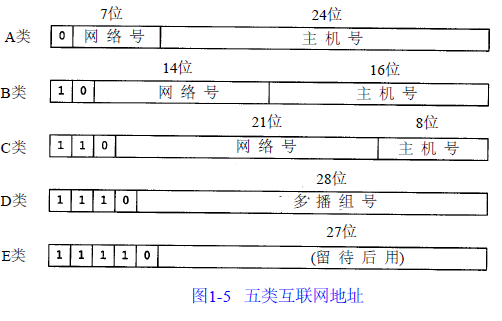

# 第一章 概述

`TCP/IP协议族`是一组不同的协议组成的协议族，又称为`Internet 协议族`,跨越4层协议，`应用层、传输层、网络层、链路层`。

IP地址的五类地址：

这五类地址范围如下：

类型|范围
---|---
A|0.0.0.0到127.255.255.255
B|128.0.0.0到191.255.255.255
C|192.0.0.0到223.255.255.255
D|224.0.0.0到239.255.255.255
E|240.0.0.0到255.255.255.255

IP地址有三类：单播地址、广播地址、多播地址。
