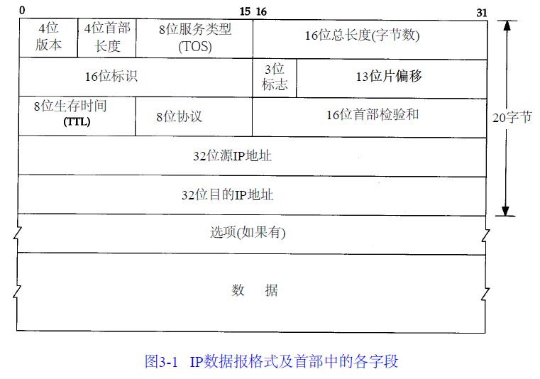

# IP：国际协议

IP是TCP/IP中最核心的协议。

特点：

1. 不可靠。IP仅仅提供最好的数据报传输服务，不能保证数据报能成功的到达目的地，但是具有一个简单的错误处理算法，就是丢弃源数据报，发送ICMP消息给信源端。
2. 无连接。这意味着IP不维护关于任何后续数据报的状态信息，这意味着有序的数据报可能会被无序的接收。每个数据报之间是相互独立的。

## IP首部

IP数据报的报文格式如下：

1. IP数据报首部字段长为20字节。
2. 4位版本号指定了IP协议的版本，即IPv4和IPv6。
3. 4位首部长度