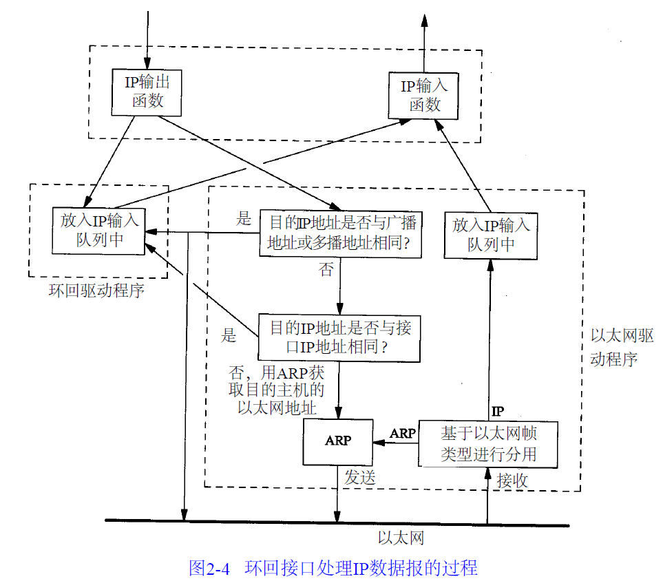

# 第二章 链路层

链路层主要有三个目的：
1. 为IP模块发送和接收数据报。
2. 为ARP模块发送ARP请求和接收ARP应答。
3. 为RARP模块发送RARP请求和接受RARP应答。

## 帧

以太网采用CSMA/CD的媒体接入方法，其意思是带冲突检测的载波侦听多路接入。速率有10Mb/s，地址长度为48bit。

由于一些历史原因，对于帧数据包，以太网的帧数据包与802委员会制定的帧数据包格式不同，出现了差异。为此，主机需求RFC要求每台Internet主机都与一个10Mb/s的以太网电缆相连：

1. 必须能发送和接收采用RFC 894（以太网）封装格式的分组。
2. 应该能接收与RFC 894混合的RFC 1042（IEEE 802）封装格式的分组
3. 也许能够发送采用RFC 1042格式封装的分组。如果主机能同时发送两种数据类型的分组数据，那么发送的分组必定是可以设置的，并且默认条件下是RFC 894分组。

给出两种规范的数据报格式：

上面的是802委员会提出的，下面的是以太网的帧数据报。考察两者的异同：

相同点：
1. 源地址与目的地址长度相同，都是6字节，48比特。
2. 都含有类型字段，并且类型字段在数据字段之前。
3. 结尾都是CRC字段，并且长度都为4字节。

不同点：
1. 802委员会规范的报文中包含长度字段，该字段是指长度字段之后所有字段的长度，不包含CRC字段。但是以太网的规范中并没有该字段。并且在802委员会提出的规范中，长度字段后包含3字节的802.2LLC和5字节的802.2SNAP，但是目的服务访问点和源服务访问点的值都为0xAA，cntl的值设置为3。随后3个字节org code都设置为0。
2. 帧最小长度不同，802委员会定义的最小长度为38字节，以太网的最小长度为46字节。为了保证这一点必须在不足的空间插入填充字节。

## SLIP：串行线路IP

SLIP的全称是Serial Line IP。它是一种在串行线路上对IP数据报进行封装的简单形式。

下面的规则描述了SLIP协议定义的帧格式：
1. IP数据报以一个END（0xc0）的特殊字符结束。同时，为了防止数据报到来之前的线路噪声被当成数据报内容，大多在数据报的开始也传一个END字符（如有线路噪声，那么END字符将结束这份错误的报文，这样，当前报文得以正确的传输，而前一个错误报文交给上层后，会发现其内容毫无意义就被丢弃）。
2. 如果IP报文中，某个字符为END，那么就要连续传输两个字节0xdb和0xdc来取代它，0xdb这个特殊字符被称作SLIP的ESC字符，但是它的值与ASCII的ESC（0x1b）不同。
3. 如果IP报文中某个字符为SLIP的ESC字符，那么就要连续传输两个字节0xdb和0xdd来取代它。

上述IP数据报就包含了END和ESC。

SLIP是一种简单的帧封装方式，存在如下缺陷：
1. 每一端必须知道对方的IP地址，没有办法把本端的IP地址通知给另一端。
2. 数据帧中没有类型字段（类似于以太网中的类型字段）。如果一条串行线路用于SLIP，那么它不能使用其他协议。
3. SLIP没有在数据帧上加校验和，如果SLIP传输的报文发现错误，只能由上层协议进行处理。

## 压缩的SLIP

由于串行线路速率通常较低(19200b/s或者更低)，而且通信经常是交互的，因此在SLIP线路上经常有一些小的TCP分组进行交换，为了传输1个字节的数据需要20个字节的IP首部和20个字节的TCP首部，总共超过40个字节。

CSLIP能把这40个字节压缩成3或5个字节，它能在CSLIP的每一端维持多达16个TCP连接，并且知道每个连接的首部中某些字段不会发生变化。

## PPP：点对点协议

PPP修改了SLIP协议中的所有缺陷，PPP包含以下三部分：

1. 在串行链路上封装IP数据报的方法，PPP既支持8位和无校验奇偶检验的模式，还支持面向比特的同步链接。
2. 建立、配置及测试数据链路的链路控制协议，允许通信双方进行协商，已确定不同的选项。
3. 针对不同网络层协议的网络控制协议。

RFC 1548描述了报文封装的方法和链路控制协议。

PPP的协议字段格式如下：

每一帧都以标志字符0x7e来开始和结束，紧接着是一个地址字节，值始终为0xff，然后是一个值为0x03的控制字节。

接下来是协议字段，类似于以太网中类型字段的功能，当它的值为0x0021时，表示信息字段是一个IP数据报，值为0xc021时，表示信息字段是链路控制数据，值为0x8021时，表示信息字段是网络控制数据。

CRC字段是一个循环校验冗余码，以检测数据帧中的错误。

由于标志字段的值为0x7e，因此当该字符出现在信息字段中时，PPP需要对其进行转义，在同步链路中，该过程使用比特填充的硬件技术完成，但是在异步链路中，特殊字符0x7d用作转义字符。当它出现在PPP数据帧中，那么紧接着的字符的第6个比特要取其补码，具体实现如下：

1. 当遇到字符0x7e时，需要连续传送两个字符：0x7d和0x5e，以实现标识字符的转义。
2. 当遇到转义字符0x7d时，则连续传送两个字符：0x7d和0x5d，以实现转义字符的转义。
3. 默认情况下，如果字符的值小于0x20，一般都要进行转义。

这么做的原因是防止它们出现在双方主机的串行端口驱动程序或是调制解调器中，因为有时他们会把这些控制字符解释成特殊的含义。

与SLIP类似，由于PPP经常用于低速的串行链路，因此减少每一帧的字节数可以降低应用程序的交互时延。利用链路控制协议，大多数产品经过协商都可以省略标识符和地址字段，并把协议字段从两字节减少到一个字节。这样于SLIP帧相比较，就只多了一个字节的协议字段以及两个字节的CRC字段，却把所有SLIP的全店全部避免了。而且首部字段还可以采用CSLIP的压缩方法。

PPP相比于SLIP优点如下：

1. PPP支持在单根串行线路上运行多种协议，不止IP协议。
2. 每一帧都有循环冗余校验。
3. 通信双方可以进行IP地址的动态协商（使用IP网络控制协议）。
4. 与CSLIP类似，对TCP和IP的首部报文进行压缩
5. 链路控制协议可以对多个数据链路选项进行设置。

为这些优点付出的代价就是在每一帧的首尾增加三个字节，当建立链路时要发送几条协商数据，以及更为复杂的实现。

## 环回接口

环回接口允许运行在一台主机上的客户程序和服务器程序通过TCP/IP进行通信。A类网络号127就是为环回接口预留的，大多数IP地址把127.0.0.1分配给这个接口，并命名为localhost。一个传给环回接口的数据报不能在任何网络上实现。

我们想象，一旦传输层检测到目的地址是环回地址，应该省略掉部分传输层操作和所有网络层操作。但是事实上大多数的产品还是完成了传输层和网络层的过程，只是当IP数据报离开网络层后将其传给自己。

图中需要指出：

1. 传给环回接口的任何数据均作为IP输入。
2. 传给广播地址和多播地址的数据报复制一份传给环回接口，然后送到以太网上，这是因为广播地址和多播地址的定义包含主机本身。
3. 任何传给该主机IP地址的数据均送到环回接口上。

也就是说传给自己的环回地址的数据报一般不出现在网络上。

## MTU

根据上面的以太网和802委员会提出的报文结构，我们看到他们对数据帧的长度都有一定限制，其最大值分别是1500字节和1492字节。链路层的这一特性称为MTU，最大传输单元。

如果有报文长度超过最大传输单元，IP层就需要对其进行分片。

### 路径MTU

当两台主机处于不同网络的情况下，每个网络的链路层可能有不同的MTU，那么这样，我们关注的应该是最小的MTU，它被称作路径MTU。

RFC 1191描述了任何时候确定路径MTU的方法。

