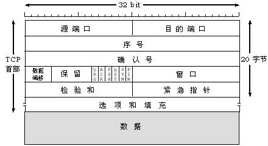
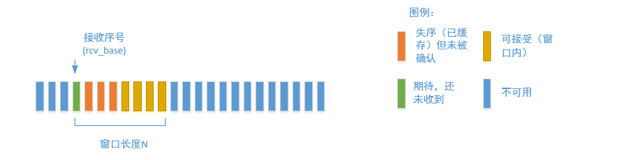

# UDP考点

## 1. UDP的特点

1. UDP只在IP数据报服务的基础上增加了少量的功能：复用与分用、对整个报文的差错检测。

2. UDP是无连接的
通信前不需要建立连接，通信结束也无需释放连接。

3. UDP是不可靠的
它是尽力而为交付，不能确保每一个数据报都送达。

4. UDP是面向报文的
所谓『面向报文』就是指：UDP数据传输的单位是报文，且不会对数据作任何 拆分 和 拼接 操作。
在发送端，应用程序给传输层的UDP什么样的数据，UDP不会对数据进行切分，只增加一个UDP头并交给网络层。
在接收端，UDP收到网络层的数据报后，去除IP数据报头部后遍交给应用层，不会作任何拼接操作。

5. UDP没有拥塞控制
UDP始终以恒定的速率发送数据，并不会根据网络拥塞情况对发送速率作调整。这种方式有利有弊。
弊端：网络拥塞时有些报文可能会丢失，因此UDP不可靠。
优点：有些使用场景允许报文丢失，如：直播、语音通话，但对实时性要求很高，此时UDP还是很有用武之地的。

6. UDP支持一对一、一对多、多对多、多对一通信
而TCP只支持一对一通信。

7. UDP首部开销小，只有8字节。
而TCP头部至少由20字节，相比于TCP要高效很多。

## 2. UDP报文

# TCP考点

## 1. TCP协议的特点

1. 面向连接的
   通信前需要建立连接，通信结束则需要释放连接
2. 提供可靠交付服务
   TCP发送的数据无重复、无丢失、无错误、与发送端顺序一致 
3. 面向字节流的
   TCP以字节为单位。虽然传输过程中数据被划分成了一个个数据报，但这只是为了方便传输，接收端最后收到的数据将与发送端发送的数据一模一样 
4. 提供全双工通信
   TCP连接两端，既可以作为发送端，也可以作为接收端 
5. 一条TCP连接的两端只能有两个端点
   TCP只能提供点到点的通信，而UDP可以提供任意方式的通信 

## 2. TCP报文结构

## 3. TCP协议三次握手的流程以及为什么要用三次而不是两次

TCP三次握手流程：
1. 客户端    ->    服务端：SYN=1,seq=x。
2. 服务端    ->    客户端: SYN=1,ACK=1,seq=y,ack=x+1
3. 客户端    ->    服务端：ACK=1,seq=x+1,ack=y+1

不使用两次握手的原因：

防止出现未处理的建立连接请求发送到服务端的情况。如果客户端需要向服务端建立连接，首先发送请求1进行连接的建立，结果请求1因为超时无法被处理，客户端发送请求2进行连接的建立，这时请求2被正常处理，连接建立，并接受数据，然后连接断开，此时，服务端接收到了请求1，客户端与服务器端又创建了一个连接，但是没有数据发送，导致资源浪费。

## 4. TCP协议四次挥手的流程

客户端    ->    服务端：FIN=1,seq=u
服务端    ->    客户端：ACK=1,seq=v,ack=u+1

服务端    ->    客户端：ACK=1,FIN=1,seq=w,ack=u+1
客户端    ->    服务端：ACK=1,seq=u+1,ack=w+1

## 5. TCP可靠数据传输的实现

TCP协议通过选择重传协议实现可靠数据传输。

## 6. TCP协议流量控制的细节

流量控制是消除发送方使接收方缓存溢出的可能性。

拥塞控制是因为IP网络的拥塞而被遏制。

TCP通过让发送方维护一个称为接受窗口的变量来提供流量控制服务。主机A通过一条TCP连接连接向主机B。主机B为连接分配缓存RcvBuffer。同时考虑如下两个变量：

1. LastByteRead:主机B上的应用进程从缓存中读出的数据流的最后一个字节的编号。
2. LastByteRcvd:从网络中到达的并且已放入主机B接收缓存中的数据的最后字节的编号。
由于TCP不允许已经分配的缓存溢出，因此

        LastByteRcvd - LastByteRead <= RcvBuffer

接收窗口采用rwnd表示，则是

        rwnd = RcvBuffer - [LastByteRcvd - LastByteRead ]

主机B通过把当前的rwnd值放入它发给主机A的报文段的接收窗口字段中，通知主机A该连接的缓存中还有多少可用空间。

于此同时，主机A也必须跟踪两个变量，LastByteSent和LastByteAcked，即最后发送的变量序号和最后确认的变量序号，两者之差便是发送但未确认的数据量。而我们要做的就是将这个值控制在小于等于接收方rwnd的范围内。即

        LastBySent - LastByteAcked <= rwnd

但不得不提的是，一旦rwnd变为0后，将不会产生交互，即使rwnd更改后发送方也得不到信息，因此，当rwnd为0时，主机A会继续发送只有一个字节的报文段。这些报文会被接收方确认，因此rwnd不为0时，发送方能得到通知。

至于UDP嘛，当产生缓存溢出时，UDP直接将报文丢掉，所以不存在流量控制。

## 7. TCP协议拥塞控制的细节

TCP让每一个发送方根据所感知到的网络拥塞程度来限制其能向连接发送流量的速率。

TCP协议中，发送方跟踪一个额外变量，拥塞窗口（cwnd），该变量满足如下公式：

        LastByteSent - LastByteAcked <= min(cwnd,rwnd)

因此该变量限制了发送方向连接发送流量的速率。

发送方通过感知丢包，来进行对拥塞的感知。

TCP如何做到找到适当的发送速率的：

1. 一个丢失的报文段意味着拥塞，此时降低发送方速率
2. 一个确认报文段只是该网络正在向接收方交付发送方的报文段，因此，当现之前未确认的报文段确认到达时，提高发送方速率。
3. 带宽检测。TCP发送方增加它的传输速率，从该速率后退，今儿开始探测，看看拥塞开始速率是否发送变化。

TCP拥塞控制算法包含：慢启动、拥塞避免、快速恢复

慢启动：TCP连接开始时，cwnd的值通常设置为一个MSS的较小值，然后每过一个RTT，将cwnd以2的倍数增长，直到出现拥塞，则将速率降为最终速率的一半，并交给拥塞避免。

拥塞避免:mTCP每过一个RTT将cwnd增加一个MSS，直至出现拥塞。当超时时，将cwnd设置为1个MSS，ssthresh为cwnd的一半，如果是出现3个ACK冗余，则将cwnd减半，ssthresh的值记录为cund值的一半。进入快速恢复状态。

快速恢复：对引起TCP进入快速恢复的缺失报文段，对于收到的每个冗余ACK，cwnd的值增加一个MSS，当对丢失报文段的一个ACK到达时，TCP在降低cwnd后进入拥塞避免状态。如果出现超时，快速恢复在执行如同慢启动和红色避免中相同的动作后，迁移到慢启动状态。即出现丢包事件，cwnd被设置为1个MSS，ssthresh设置为cwnd的一半。

# HTTP考点

## 1. HTTP工作流程：

1. 地址解析，

   如用客户端浏览器请求这个页面：http://localhost.com:8080/index.htm

   从中分解出协议名、主机名、端口、对象路径等部分，对于我们的这个地址，解析得到的结果如下：
   - 协议名：http
   - 主机名：localhost.com
   - 端口：8080
   - 对象路径：/index.htm

   在这一步，需要域名系统DNS解析域名localhost.com,得主机的IP地址。

2. 封装HTTP请求数据包

   把以上部分结合本机自己的信息，封装成一个HTTP请求数据包

3. 封装成TCP包，建立TCP连接（TCP的三次握手）

   在HTTP工作开始之前，客户机（Web浏览器）首先要通过网络与服务器建立连接，该连接是通过TCP来完成的，该协议与IP协议共同构建Internet，即著名的TCP/IP协议族，因此Internet又被称作是TCP/IP网络。HTTP是比TCP更高层次的应用层协议，根据规则，只有低层协议建立之后才能，才能进行更层协议的连接，因此，首先要建立TCP连接，一般TCP连接的端口号是80。这里是8080端口

4. 客户机发送请求命令

   建立连接后，客户机发送一个请求给服务器，请求方式的格式为：统一资源标识符（URL）、协议版本号，后边是MIME信息包括请求修饰符、客户机信息和可内容。

5. 服务器响应

   服务器接到请求后，给予相应的响应信息，其格式为一个状态行，包括信息的协议版本号、一个成功或错误的代码，后边是MIME信息包括服务器信息、实体信息和可能的内容。

   实体消息是服务器向浏览器发送头信息后，它会发送一个空白行来表示头信息的发送到此为结束，接着，它就以Content-Type应答头信息所描述的格式发送用户所请求的实际数据

6. 服务器关闭TCP连接

   一般情况下，一旦Web服务器向浏览器发送了请求数据，它就要关闭TCP连接，然后如果浏览器或者服务器在其头信息加入了这行代码

        Connection:keep-alive

   TCP连接在发送后将仍然保持打开状态，于是，浏览器可以继续通过相同的连接发送请求。保持连接节省了为每个请求建立新连接所需的时间，还节约了网络带宽。

## 2. HTTPS实现原理

HTTPS（全称：Hypertext Transfer Protocol over Secure Socket Layer），是以安全为目标的HTTP通道，简单讲是HTTP的安全版。即HTTP下加入SSL层，HTTPS的安全基础是SSL。其所用的端口号是443。

SSL：安全套接层，是netscape公司设计的主要用于web的安全传输协议。这种协议在WEB上获得了广泛的应用。通过证书认证来确保客户端和网站服务器之间的通信数据是加密安全的。

有两种基本的加解密算法类型：

1. 对称加密（symmetrcic encryption）：密钥只有一个，加密解密为同一个密码，且加解密速度快，典型的对称加密算法有DES、AES，RC5，3DES等；

   对称加密主要问题是共享秘钥，除你的计算机（客户端）知道另外一台计算机（服务器）的私钥秘钥，否则无法对通信流进行加密解密。解决这个问题的方案非对称秘钥。

2. 非对称加密：使用两个秘钥：公共秘钥和私有秘钥。私有秘钥由一方密码保存（一般是服务器保存），另一方任何人都可以获得公共秘钥。

   这种密钥成对出现（且根据公钥无法推知私钥，根据私钥也无法推知公钥），加密解密使用不同密钥（公钥加密需要私钥解密，私钥加密需要公钥解密），相对对称加密速度较慢，典型的非对称加密算法有RSA、DSA等。

过程大致如下：
1. SSL客户端通过TCP和服务器建立连接之后（443端口），并且在一般的tcp连接协商（握手）过程中请求证书。
   即客户端发出一个消息给服务器，这个消息里面包含了自己可实现的算法列表和其它一些需要的消息，SSL的服务器端会回应一个数据包，这里面确定了这次通信所需要的算法，然后服务器向客户端返回证书。（证书里面包含了服务器信息：域名。申请证书的公司，公共秘钥）。                 
2. Client在收到服务器返回的证书后，判断签发这个证书的公共签发机构，并使用这个机构的公共秘钥确认签名是否有效，客户端还会确保证书中列出的域名就是它正在连接的域名。
3. 如果确认证书有效，那么生成对称秘钥并使用服务器的公共秘钥进行加密。然后发送给服务器，服务器使用它的私钥对它进行解密，这样两台计算机可以开始进行对称加密进行通信。

https通信的优点：

1. 客户端产生的密钥只有客户端和服务器端能得到；
2. 加密的数据只有客户端和服务器端才能得到明文；
3. 客户端到服务端的通信是安全的。

## HTTP报文格式

请求报文：

方法| 	作用
--- |---
GET |	请求获取由 Request-URI 所标识的资源
POST |	请求服务器接收在请求中封装的实体，并将其作为由 Request-Line 中的 Request-URI 所标识的资源的一部分
HEAD| 	请求获取由 Request-URI 所标识的资源的响应消息报头
PUT |	请求服务器存储一个资源，并用 Request-URI 作为其标识符
DELETE |	请求服务器删除由 Request-URI 所标识的资源
TRACE |	请求服务器回送到的请求信息，主要用于测试或诊断
CONNECT |	保留将来使用
OPTIONS |	请求查询服务器的性能，或者查询与资源相关的选项和需求

GET与POST方法有以下区别：

      1、  在客户端，Get方式在通过URL提交数据，数据在URL中可以看到；POST方式，数据放在HTTP包的body中。

      2、 GET方式提交的数据大小有限制（因为浏览器对URL的长度有限制），而POST则没有此限制。

      3、安全性问题。正如在（1）中提到，使用 Get 的时候，参数会显示在地址栏上，而 Post 不会。所以，如果这些数据是中文数据而且是非敏感数据，那么使用 get；如果用户输入的数据不是中文字符而且包含敏感数据，那么还是使用 post为好。

      4.、服务器取值方式不一样。GET方式取值，如php可以使用$_GET来取得变量的值，而POST方式通过$_POST来获取变量的值。
HTTP最常见的请求头如下：
Transport 头域

    Connection：

    作用：表示是否需要持久连接。

    如果服务器看到这里的值为“Keep-Alive”，或者看到请求使用的是HTTP 1.1（HTTP 1.1默认进行持久连接）,它就可以利用持久连接的优点，当页面包含多个元素时（例如Applet，图片），显著地减少下载所需要的时间。要实现这一点，服务器需要在应答中发送一个Content-Length头，最简单的实现方法是：先把内容写入 ByteArrayOutputStream，然后在正式写出内容之前计算它的大小；

    例如：　Connection: keep-alive   当一个网页打开完成后，客户端和服务器之间用于传输HTTP数据的TCP连接不会关闭，如果客户端再次访问这个服务器上的  网页，会继续使用这一条已经建立的连接

    例如：  Connection: close  代表一个Request完成后，客户端和服务器之间用于传输HTTP数据的TCP连接会关闭，  当客户端再次发送Request，需要重新建立TCP连接。

    Host（发送请求时，该报头域是必需的）

    Host请求报头域主要用于指定被请求资源的Internet主机和端口号，它通常从HTTP URL中提取出来的。

    eg：http://；localhost/index.html
    浏览器发送的请求消息中，就会包含Host请求报头域，如下：
    Host：localhost

    此处使用缺省端口号80，若指定了端口号8080，则变成：Host：localhost:8080

Client 头域

    Accept：

    作用：浏览器可以接受的媒体类型（MIME类型）,

    例如：  Accept: text/html  代表浏览器可以接受服务器回发的类型为 text/html  也就是我们常说的html文档, 如果服务器无法返回text/html类型的数据，服务器应该返回一个406错误(non acceptable)。

    通配符 * 代表任意类型。例如  Accept: */*  代表浏览器可以处理所有类型，(一般浏览器发给服务器都是发这个)

    Accept-Encoding：

    作用： 浏览器申明自己接收的编码方法，通常指定压缩方法，是否支持压缩，支持什么压缩方法（gzip，deflate），（注意：这不是只字符编码）;

    例如： Accept-Encoding: gzip, deflate。Server能够向支持gzip/deflate的浏览器返回经gzip或者deflate编码的HTML页面。 许多情形下这可以减少5到10倍的下载时间，也节省带宽。

    Accept-Language：

    作用： 浏览器申明自己接收的语言。 

    语言跟字符集的区别：中文是语言，中文有多种字符集，比如big5，gb2312，gbk等等；

    例如： Accept-Language:zh-cn 。如果请求消息中没有设置这个报头域，服务器假定客户端对各种语言都可以接受。

    User-Agent：

    作用：告诉HTTP服务器， 客户端使用的操作系统和浏览器的名称和版本.

    我们上网登陆论坛的时候，往往会看到一些欢迎信息，其中列出了你的操作系统的名称和版本，你所使用的浏览器的名称和版本，这往往让很多人感到很神奇，实际上， 服务器应用程序就是从User-Agent这个请求报头域中获取到这些信息User-Agent请求报头域允许客户端将它的操作系统、浏览器和其它属性告诉服务器。

    例如： User-Agent: Mozilla/4.0 (compatible; MSIE 8.0; Windows NT 5.1; Trident/4.0; CIBA; .NET CLR 2.0.50727; .NET CLR 3.0.4506.2152; .NET CLR 3.5.30729; .NET4.0C; InfoPath.2; .NET4.0E)

    Accept-Charset：

    作用：浏览器申明自己接收的字符集，这就是本文前面介绍的各种字符集和字符编码，如gb2312，utf-8（通常我们说Charset包括了相应的字符编码方案）；

    例如：Accept-Charset:iso-8859-1,gb2312.如果在请求消息中没有设置这个域，缺省是任何字符集都可以接受。

    Authorization：授权信息，通常出现在对服务器发送的WWW-Authenticate头的应答中；

    Authorization请求报头域主要用于证明客户端有权查看某个资源。当浏览器访问一个页面时，如果收到服务器的响应代码为401（未授权），可以发送一个包含Authorization请求报头域的请求，要求服务器对其进行验证。

Cookie/Login 头域

    Cookie:

    作用： 最重要的header, 将cookie的值发送给HTTP 服务器

Entity头域

    Content-Length

    作用：发送给HTTP服务器数据的长度。即请求消息正文的长度；

    例如： Content-Length: 38

    Content-Type：

    作用：

    例如：Content-Type: application/x-www-form-urlencoded

Miscellaneous 头域

    Referer:

    作用： 提供了Request的上下文信息的服务器，告诉服务器我是从哪个链接过来的，比如从我主页上链接到一个朋友那里， 他的服务器就能够从HTTP Referer中统计出每天有多少用户点击我主页上的链接访问    他的网站。

    例如: Referer:http://translate.google.cn/?hl=zh-cn&tab=wT

Cache 头域

    If-Modified-Since：

    作用： 把浏览器端缓存页面的最后修改时间发送到服务器去，服务器会把这个时间与服务器上实际文件的最后修改时间进行对比。如果时间一致，那么返回304，客户端就直接使用本地缓存文件。如果时间不一致，就会返回200和新的文件内容。客户端接到之后，会丢弃旧文件，把新文件缓存起来，并显示在浏览器中。

    例如：If-Modified-Since: Thu, 09 Feb 2012 09:07:57 GMT。

    If-None-Match：

    作用: If-None-Match和ETag一起工作，工作原理是在HTTP Response中添加ETag信息。 当用户再次请求该资源时，将在HTTP Request 中加入If-None-Match信息(ETag的值)。如果服务器验证资源的ETag没有改变（该资源没有更新），将返回一个304状态告诉客户端使用本地缓存文件。否则将返回200状态和新的资源和Etag.  使用这样的机制将提高网站的性能

    例如: If-None-Match: "03f2b33c0bfcc1:0"

    Pragma：

    作用： 防止页面被缓存， 在HTTP/1.1版本中，它和Cache-Control:no-cache作用一模一样

    Pargma只有一个用法， 例如： Pragma: no-cache

    注意: 在HTTP/1.0版本中，只实现了Pragema:no-cache, 没有实现Cache-Control

    Cache-Control：

    作用: 这个是非常重要的规则。 这个用来指定Response-Request遵循的缓存机制。各个指令含义如下

    Cache-Control:Public   可以被任何缓存所缓存（）

    Cache-Control:Private     内容只缓存到私有缓存中

    Cache-Control:no-cache  所有内容都不会被缓存

响应报文：

 状态行由协议版本、数字形式的状态代码，及相应的状态描述组成，各元素之间以空格分隔，结尾时回车换行符，格式如下：

HTTP-Version Status-Code Reason-Phrase CRLF

HTTP-Version 表示服务器 HTTP 协议的版本，Status-Code 表示服务器发回的响应代码，Reason-Phrase 表示状态代码的文本描述，CRLF 表示回车换行。例如：

HTTP/1.1 200 OK (CRLF)

      状态代码与状态描述

      状态代码由 3 位数字组成， 表示请求是否被理解或被满足，状态描述给出了关于状态码的简短的文字描述。状态码的第一个数字定义了响应类别，后面两位数字没有具体分类。第一个数字有 5 种取值，如下所示。

    1xx：指示信息——表示请求已经接受，继续处理
    2xx：成功——表示请求已经被成功接收、理解、接受。
    3xx：重定向——要完成请求必须进行更进一步的操作
    4xx：客户端错误——客户端请求有错误或请求无法实现
    5xx：服务器端错误——服务器未能实现合法的请求。

常见状态代码、状态描述、说明：
200 OK      //客户端请求成功

303：重定向，即从原url重定向到新的url。 例如php 的hear函数header（"localtion:/index.php"）

400 Bad Request  //客户端请求有语法错误，不能被服务器所理解
401 Unauthorized //请求未经授权，这个状态代码必须和WWW-Authenticate报头域一起使用 
403 Forbidden  //服务器收到请求，但是拒绝提供服务，一般是服务器路径没有权限或者是其他权限相关问题
404 Not Found  //请求资源不存在，eg：输入了错误的URL
500 Internal Server Error //服务器发生不可预期的错误：一般来说，这个问题都会在服务器端的源代码出现错误时出现，比如出现死循环。

502 Bad Gateway//作为网关或者代理工作的服务器尝试执行请求时，从上游服务器接收到无效的响应。比如LNMP ,php-fpm没有启动就会报502错误。

503 Server Unavailable  //服务器当前不能处理客户端的请求，一段时间后可能恢复正常，比如java 容器部署war的时候，就出现503,
                                           或者是nginx处理的文件没有权限。

504 Gateway Time-out：作为网关或者代理工作的服务器尝试执行请求时，未能及时从上游服务器（URI标识出的服务器，例如HTTP、FTP、LDAP）或者辅助服务器（例如DNS）收到响应，比如nginx和php-fpm， php设置sleep（200），就会收到504 Gateway Time-out。注意：某些代理服务器在DNS查询超时时会返回400或者500错误

HTTP协议是无状态的和Connection: keep-alive的区别

　　无状态是指协议对于事务处理没有记忆能力，服务器不知道客户端是什么状态。从另一方面讲，打开一个服务器上的网页和你之前打开这个服务器上的网页之间没有任何联系。

　　HTTP是一个无状态的面向连接的协议，无状态不代表HTTP不能保持TCP连接，更不能代表HTTP使用的是UDP协议（无连接）。

　　从HTTP/1.1起，默认都开启了Keep-Alive，保持连接特性，简单地说，当一个网页打开完成后，客户端和服务器之间用于传输HTTP数据的TCP连接不会关闭，如果客户端再次访问这个服务器上的网页，会继续使用这一条已经建立的连接。

　　Keep-Alive不会永久保持连接，它有一个保持时间，可以在不同的服务器软件（如Apache）中设定这个时间。
