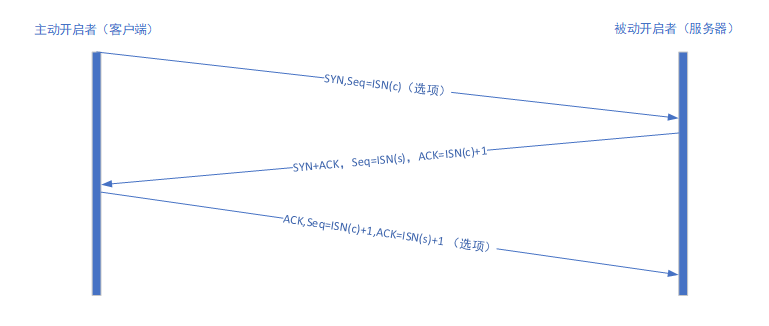
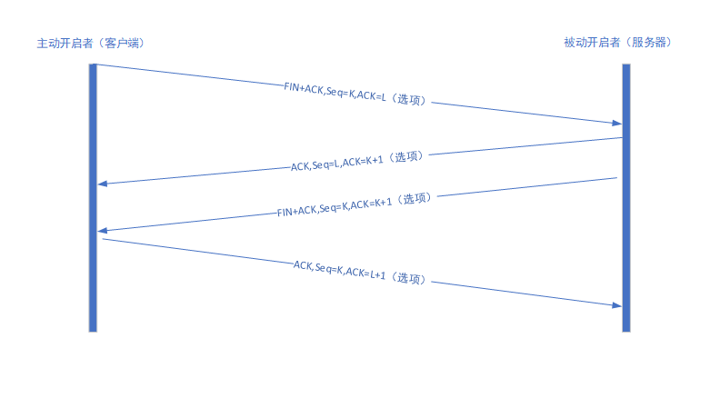
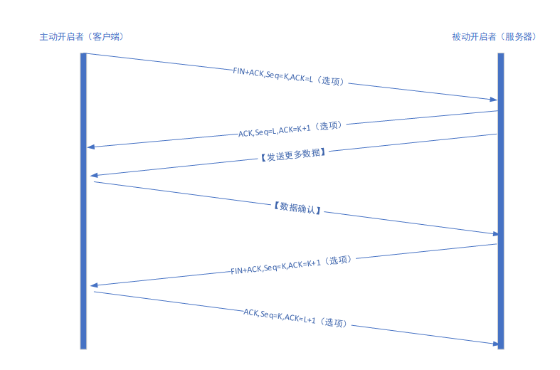
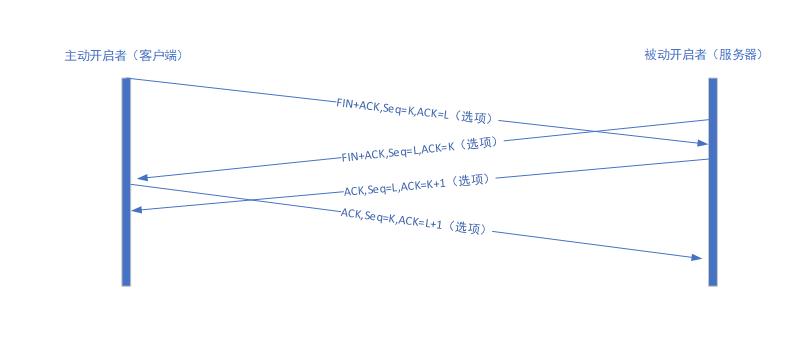
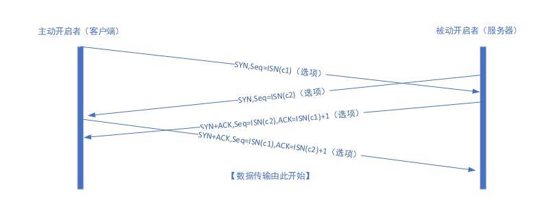

# TCP连接管理

## TCP连接的建立与终止

一个TCP连接由一个四元组构成，它们分别是两个IP地址和两个端口号。更准确地说是一个TCP连接是由一对端点或套接字组成，其中每一端都由一对（IP地址，端口号）所唯一标识。

一个TCP连接通常分为3个阶段：启动、数据传输和退出。

TCP连接建立的过程主要包含如下步骤：

1. 主动开启者发送一个SYN报文段（即一个在TCP头部的SYN为字段置位的TCP/IP数据包），并指明自己想要连接的端口号和他的客户端初始序列号（记为ISN(c)）。通常，客户端还会借此发送一个或多个选项。客户端发送的这个SYN段称为段1。
2. 服务器也发送自己的SYN报文段作为响应，并包含了它的初始序列号（记作ISN(s)）。该段称为段2。为了确认客户端的SYN，服务器将其包含的ISN(c)数值+1后作为返回的ACK数值。因此，每发送一个SYN，序列号就会自动加1。这样如果出现丢失的情况，该SYN也会重传。
3. 为了确认服务器的SYN，客户端将ISN(s)的数值+1后作为返回的ACK数值。这称作段3。

三次握手的目的不仅在于让通信双方了解一个连接正在建立，还在于利用数据包的选项来承载特殊的信息，交换初始序列号。

TCP连接进行关闭的过程包含如下步骤：
1. 连接的主动关闭者发送一个FIN段指明接收者希望看到自己当前的序列号（K），FIN段还包含了一个ACK段用于确认对方最近一次发来的数据（L）。
2. 连接的被动关闭者将K的数值加1作为响应的ACK值，以表明它已经成功接收到主动关闭者发送的FIN。此时，上层应用程序会被告知连接的另一端已经提出了关闭的请求。通常，浙江导致应用程序发起自己的关闭操作。接着被动关闭者的身份转变成主动关闭者，并发送自己的FIN。该报文段序列号为L。
3. 为了完成连接的关闭，最后发送的报文段还包含了一个ACK用于确认上一个FIN。如果出现FIN丢失的情况，那么发送方将重新传输直到接收到一个ACK确认为止。

TCP协议还支持连接处于半开启状态，存在半开启状态的原因在于TCP通信模型是双向的。这也意味着在两个方向中可能会出现只有一个方向正在进行数据传输的情况。TCP半关闭操作是指关闭数据流的一个传输方向，而两个半关闭操作合在一起就能够关闭整个连接。因此TCP协议规定通信的任何一方在完成数据发送任务后都能够发送一个FIN。当通信的另一方接收到这个FIN时，就会告知应用程序对方已经终止了对应方向的数据传输。

### TCP半关闭

半关闭可以允许仅仅关闭一半的连接，关闭一半连接后，另一半连接仍能传输数据。

### 同时打开和关闭

当TCP连接的两端同时关闭的时候，关闭流程与单方向主动关闭类似，只不过交换的报文段顺序是交叉的。

两端同时建立连接则需要4次握手，而不是三次握手，示意图如下：

#### 初始序列号

在发送用于建立连接的SYN之前，通信双方会选择一个初始序列号。初始序列号会随时间而改变，因此每一个连接都拥有不同的初始序列号。指出初始序列号可被视为一个32位的计数器。该计数器的数值每4微秒加1。此举的目的在于为一个连接的报文段安排序列号，以防止出现与其他连接的序列号重叠的情况。尤其对于同一连接的两个不同实例而言，新的序列号也不能出现重叠的情况。