# 设计模式

## 一、设计模式分类

设计模式分为3类：

创建型模式：工厂方法模式、抽象工厂模式、单例模式、建造者模式、原型模式。

结构型模式：适配器模式、装饰者模式、代理模式、外观模式、桥接模式、组合模式、享元模式。

行为型模式：策略模式、模板方法模式、观察者模式、迭代子模式、责任链模式、命令模式、备忘录模式、状态模式、访问者模式、中介者模式、解释器模式。

## 二、设计模式的六大原则

1. 开闭原则：对扩展开放，对修改关闭。
2. 里氏替换原则：任何基类出现的地方，子类一定可以出现。
3. 依赖倒置原则：针对接口编程，依赖于抽象而不依赖于具体。
4. 接口隔离原则：使用多个隔离的接口要比使用单个接口好。
5. 迪米特原则（最少知道原则）：一个实体应当尽量少地与其他实体发生相互作用，使得系统功能模块相互独立。
6. 合成复用原则：尽量使用组合/聚合，而不是继承。

## 三、创建型模式

1. 工厂模式：创建工厂接口，接口中的方法用于创建新的实例，然后让子类实现该接口，将实例化对象放到子类中去执行。

类图如下：

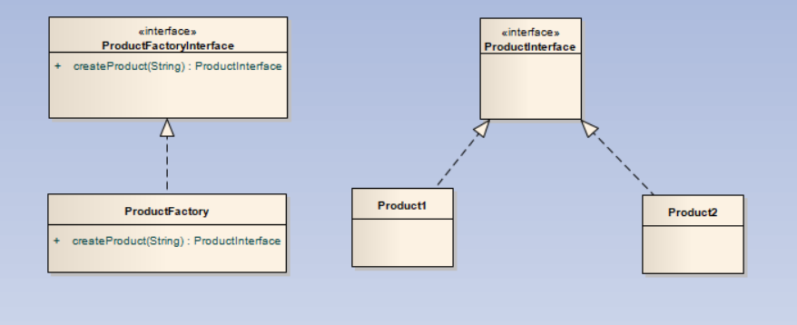

上述的工厂模式通过传入一个字符串类型的style变量来确定创建哪种产品，但是由于字符串可能会输入出错。虽然这种错误可以通过创建枚举进行处理，但是我们可以介绍一下下一种方式：

通过上述的类图可以看出，我们针对于每一种产品都给定一个生产函数，而不是通过传入字符串了。因此，避免了传入字符串参数不符合标准的情况。而且在添加一个新的商品时，我们只需要去添加一个新的函数，而不是再去原函数中进行寻找、添加，降低了耦合。

当然，上述的两种方法中，我们都要创建一个新的工厂实例，我们可以将其中的创建实例方法都设置为静态方法，通过这种方法，我们可以通过类名直接调用创建函数，这样更方便。

但是这样问题又会出现，考虑我们要添加一个新的产品类，我们需要再去修改工厂方法，无论是使用上述的哪种方法都逃不过去修改工厂类的命运，因此，我们通常使每个类对应一个工厂方法，或者我们可以把工厂类作为内部类写在产品类中。

2. 抽象工厂模式：抽象工厂模式是工厂模式的一个小的集合，一个对象可能由多个对象进行组成，那么这么子对象又是怎么生成的呢，答案是通过工厂模式，而我们还要为大的对象创建一个工厂，因此，就出现了如下类图：

3. 单例模式：单例模式用于保证该类对象仅有一个，并且提供一个访问它的全局访问点。

使用情况：控制实例数目，节省系统资源。

单例模式的构造函数一半是私有的。单例模式有4种实现方式，分别如下：

- 懒汉式实现方式，这种方式是线程不安全的，但是相对容易。

    
        public class Singleton {  
            private static Singleton instance;  
            private Singleton (){}  
  
            public static Singleton getInstance() {  
            if (instance == null) {  
            instance = new Singleton();  
            }  
            return instance;  
            }  
        }
- 懒汉式的线程安全的实现方式：

    
        public class Singleton {  
            private static Singleton instance;  
            private Singleton (){}  
            public static synchronized Singleton getInstance() {  
                if (instance == null) {  
                instance = new Singleton();  
                }  
                return instance;  
            }  
        }
这种方式由于要实现同步，所以效率不高。

其实上述两种方式都实现了懒加载，即用到时才进行创建对象。

- 饿汉式实现方式：

        public class Singleton {  
            private static Singleton instance = new Singleton();  
            private Singleton (){}  
            public static Singleton getInstance() {  
            return instance;  
            }  
        }
这种方式是实现最简单的，由于单例对象是static的，在类初始化时就对其进行了实例化。基于 classloader 机制避免了多线程的同步问题。

- 双检锁/双重校验锁：

        public class Singleton {  
            private volatile static Singleton singleton;  
            private Singleton (){}  
            public static Singleton getSingleton() {  
                if (singleton == null) {  
                    synchronized (Singleton.class) {  
                        if (singleton == null) {  
                            singleton = new Singleton();  
                        }  
                    }  
                }  
            return singleton;  
            }  
        }
这种方式实现了懒加载，并且是线程安全的，但是实现方式较复杂。

4. 建造者模式

建造者模式将一个复杂的构建与其表示相分离，使得同样的构建过程可以创建不同的表示。

类图如下：

这里使用Item将所有信息封装起来。所有的组装策略都被封装在Item里，无论ItemImpl有多复杂，Product只取Item中的数据，这样无论如何创建都会按照特定方式创建，因为创建方式根本就没有改变。

5. 原型模式：用于重复拷贝对象，同时可以保证性能。

实现方式如下：

    public class Prototype implements Cloneable {  
  
        public Object clone() throws   CloneNotSupportedException {  
            Prototype proto = (Prototype) super.clone();  
            return proto;  
        }  
    }

由于原型模式用来对对象进行快速拷贝，所以我们只要实现一个如此的接口即可，但是Java中的拷贝分为两种形式：

- 浅拷贝：即仅仅拷贝基本数据类型，而引用类型的都使用原对象的，Object方法提供的clone()就是浅拷贝。
- 深拷贝：即无论基本数据类型，还是引用类型，都创建新的。

对于浅拷贝，可以调用clone()方法，而对于深拷贝，我们可以使用序列化的方法进行。

## 四、 结构模式

1. 适配器模式

适配器模式就像一个转接口，它作为两个不兼容的接口之间的桥梁。

主要在需要的类与现有的类接口不同的情况时使用。

适配器模式有3种实现方式：

- 类适配器模式：

类图如下：

目标接口为上图中的Targetable接口，我们将Source适配成Targetable接口的模样。由于是创建一个新类，并且是继承原类的，所以称这种方式为类适配器方式。

- 对象适配器模式：

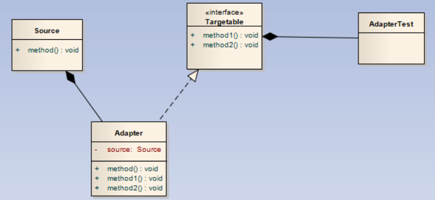

上一种方式中适配器类是继承Source类，而这种方式是将Source类作为一个对象组合到适配器类中。所以称为对象适配器模式。

- 接口适配器模式

当然这里也可以使用如下模式：

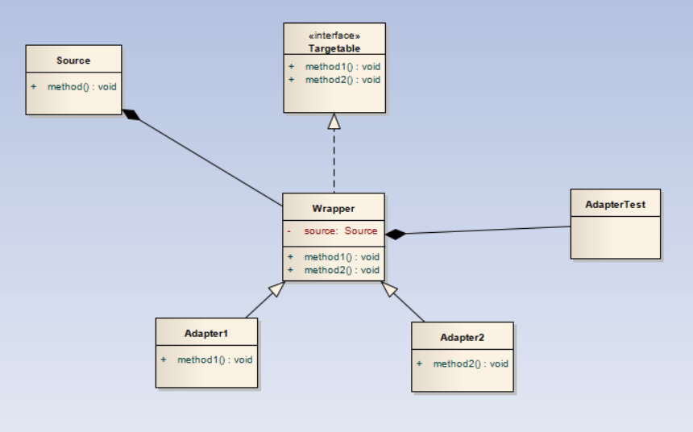

上面两者的区别就是使用类适配和对象适配。接口适配器主要解决的问题是，目标接口要求实现的方法有时是我们不需要的，例如java swing中的很多Listener里一样，很多的实现方法是我们用不到的。例如，MouseMotionListener接口中，提供了如下方法：

但是我们知道很多时候我们只需要监听其中的一个事件，因此Java API给我们提供了MouseMotionAdapter类，这个类就是采用了接口适配器方式实现的。

2. 装饰器模式

装饰器模式允许向一个现有的对象添加新的功能，而又不改变其结构。例如我们使用的Java IO中很多类都是使用的装饰器模式。

下面我们提供类图：

我们看到Decorator和DecorateImpl都实现了Decorated接口，而Decorator的构造需要一个Decorated作为输入，这样就可以让Decorator包装自己，形成一种递归的情况，而递归的最底层就是DecoratedImpl。

下面我们来看以下Java IO库的API，我们经常写出如下代码：

    BufferedReader buff = new BufferedReader(new FileReader(filename));

这里我们来看一下上述提到的BufferedReader和FileReader的目录结构。

首先FileReader如下：

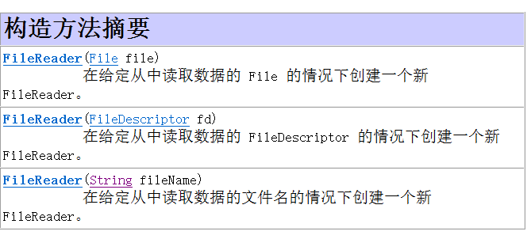

我们看到FileReader继承了java.io.Reader，并且构造函数中没有继承自Reader的参数传入。

下面我们查看BufferedReader：

我们看到BufferedReader继承自java.io.Reader，并且构造函数中具有继承自Reader的参数传入。

最后我们考察java.io.Reader：

这里的Reader是个抽象类。

Reader相当于Decorated接口，BufferedReader相当于Decorator，FileReader相当于DecoratedImpl。

由于我们使用的组合，我们还可以在添加了装饰器后，还能将被装饰器装饰的内核掏出来，只需实现一个getDecorated()方法就行了。

3. 代理模式

代理模式用来使用一个类代表另一个类的功能。考虑生活中的中介，我们直接访问卖房的人可能会有很多繁琐的事宜要去处理，因此我们需要代理帮助我们处理。

类图如下：

这里，我们使Proxy和Source实现相同的接口Targetable，保证了代理能实现Source的开放出来的功能，保证Source的部分功能被封装。Proxy中的method方法可以处理外界对Source的method的访问，进行一系列工作的处理。

4. 外观模式

外观模式降低了类和类之间的耦合度，它将类与类之间的关系全部封装到了另一个类中，使类本身之间关系变得隔离。主要用来为用户提供简单的使用方式。例如，一台电脑开机时，显示屏、CPU、内存等都要进行必要的初始化、启动操作，这对于普通用户来说都是看不到的，但是这些操作确实做了，而且这些操作之间也没有很大联系。外观模式帮我们实现了这样的操作。

类图如下：

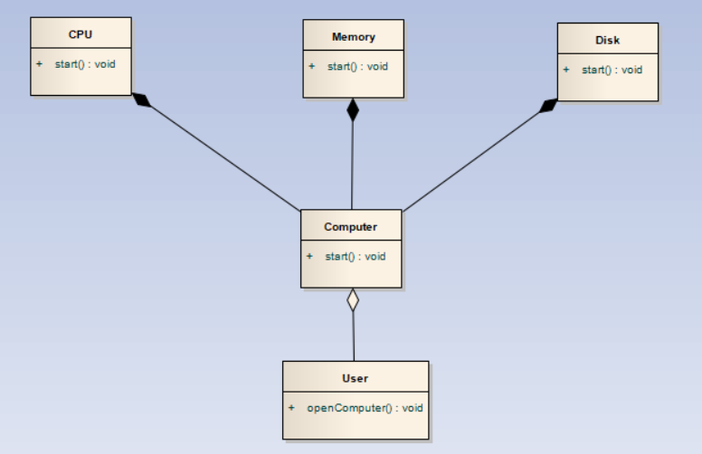

当我们执行openComputer()方法时，会自动调用Computer的start()方法，用户只需要知道这些，而后面启动各种组件的操作都会被包含在这个start方法中，对用户关闭。并且各个组件之间不知道自己与别的组件调用函数的前后关系，做到了松耦合。就和Spring的配置文件一样。

5. 桥接模式

桥接模式可以将抽象和具体化相隔离，这样说起来可能太过抽象，考虑如下场景，一个产品可能对于同一种操作具有不同表现形式，那么这些操作如果和产品绑定，更改就很难了，这种模式就将其区分开。

类图：

桥接模式的思想和策略模式的思想很像，我们后面再介绍策略设计模式。

6. 组合模式

组合模式适用于解决类似树形的问题。话不多说，上类图，一看便知：

TreeNode实现了Node接口，但是TreeNode中还有一个由Node组成的链表，形成了一种树形关系。

7. 享元模式

享元模式，说白了就是资源池。享元模式的主要目的是实现对象的共享，即共享池，当系统中对象多的时候可以减少内存的开销，通常与工厂模式一起使用。

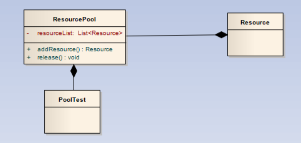

资源池在初始化时，初始化了很多的Resource，当用户要使用的时候，直接从资源池中getResource()。这样有效避免了请求来了再建资源的情况，而且可以有效控制资源的数量。

## 五、行为型模式

上图列出了各种行为型模式的分类。下面我们将对每个模式一一介绍。

1. 策略模式

策略模式通过将操作作为一个类，使其在运行过程中可以动态替换。例如游戏中的人物，装备武器不同可以使用不同的攻击方式，我们就可以将不同武器的攻击设置成不同的类，然后让人物类与攻击类之间使用组合关系，达到动态替换。类图如下：

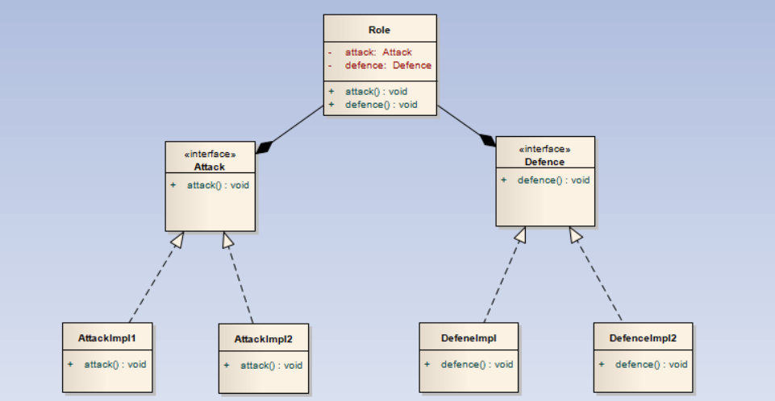

用户可以使用Role中的setAttack()和setDefence()进行动态更改Attack和Defence。

（悄悄说，我觉得和桥接没啥大区别）如果说非要说区别就是桥接模式将实例的Role和操作分离开来，毕竟桥接中将Role继承自一个抽象类，Role是看不到它能使用的方法的。

2. 模板方法模式 

模板定义一个操作中的算法的骨架，而将一些步骤延迟到子类中。模板方法使得子类可以不改变一个算法的结构即可重定义该算法的某些特定步骤。

3. 观察者模式

观察者模式构造了一种类似于博客关注的情况，当你观察的Subject进行更新时，你会收到通知，可以获取到最新数据。观察者模式具有推和拉两种情况，下面我们将分别介绍：

- 推：这种情况下，当Subject更新了数据，Subject会自己将新数据推到Obervable里去。类图如下：

.png)

这种情况下，Subject执行notice()方法时,会遍历observablelist中每个Observable，然后分别执行其中的update()方法。

- 拉：这种情况下，Observer中会放一个变量，用于标识是否有新的消息推送，如果有新的消息推送，就从Subject上获取新的消息。

由于观察者可以取消对Subject的关注，因此要保存Subject对象，这里省略了添加关注的函数。

4.  迭代子模式

迭代子模式，也就是所谓的迭代器。提供一种方法顺序访问一个聚合对象中各个元素, 而又无须暴露该对象的内部表示。但是在使用迭代器的过程中，无法更改被迭代的对象中的数据，否则会出现错误。

类图如下：

迭代子模式一般用于各种容器中，自己实现要实现Iterator接口,一般实现方式如下：

    public Iterator<T> iterator()
    {
        return new Iterator<T>()
        {
            public boolean hasNext()
            {

            }

            public T next()
            {

            }

            public T previous()
            {

            }
        };
    }

一般使用匿名内部类实现迭代器。

5. 责任链模式

责任链模式可以在有多个对象，每个对象持有对下一个对象的引用，这样就会形成一条链，请求在这条链上传递，直到某一对象决定处理该请求。但是发出者并不清楚到底最终那个对象会处理该请求，所以，责任链模式可以实现，在隐瞒客户端的情况下，对系统进行动态的调整。

类图如下：

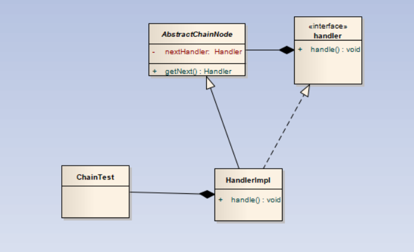

每个HandlerImpl中都有一个nextHandler，如果本HandlerImpl解决不了这个问题，就交给下一个Handler，直到nextHandler为空为止。Spring Security的delegatingProxyChain就是使用的该模式。

6. 命令模式

命令模式（Command Pattern）是一种数据驱动的设计模式，它属于行为型模式。请求以命令的形式包裹在对象中，并传给调用对象。调用对象寻找可以处理该命令的合适的对象，并把该命令传给相应的对象，该对象执行命令。 在软件系统中，行为请求者与行为实现者通常是一种紧耦合的关系，但某些场合，比如需要对行为进行记录、撤销或重做、事务等处理时，这种无法抵御变化的紧耦合的设计就不太合适。

类图如下：

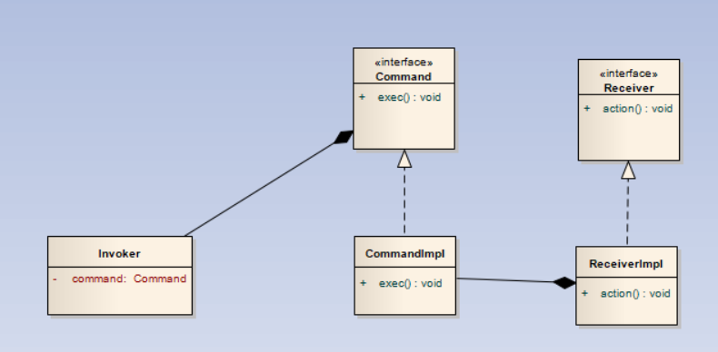

7. 备忘录模式

备忘录模式用来保存一个对象的状态，以便在特定时候恢复。

类图如下：

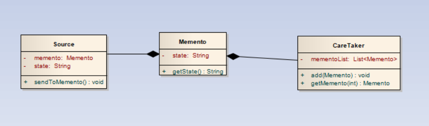

这里Source是要备份的类，Memento是备忘录类，CareTaker是保存备忘录的容器。

8. 状态模式

状态模式就是根据类的不同状态执行不同的命令。具体就像电灯，处于开状态就执行亮操作，处于关状态就执行暗操作。

类图如下：

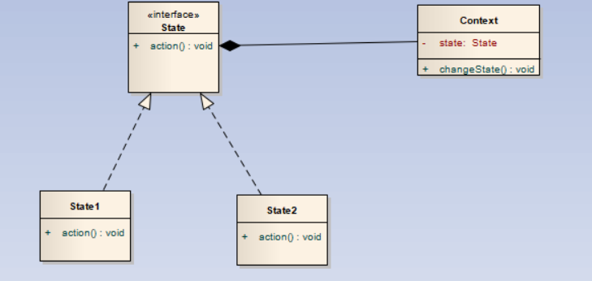

当执行changeState()函数时，调用State的action()函数。

9. 访问者模式

在访问者模式（Visitor Pattern）中，我们使用了一个访问者类，它改变了元素类的执行算法。通过这种方式，元素的执行算法可以随着访问者改变而改变。访问者模式可以防止被访问的类中的数据被污染。

类图如下，之后我们再解释。

当一个访问者需要访问时，会调用visit()方法访问对应的Subject,而Subject会通过getSubject给出需要的数据，注意这里的数据是只读的、或者是原数据的备份。否则，数据会被污染。

10. 中介者模式

中介者模式用一个中介对象来封装一系列的对象交互，中介者使各对象不需要显式地相互引用，从而使其耦合松散，而且可以独立地改变它们之间的交互。

例如：考虑一个聊天室场景，我们使用下面的类图构建聊天室：

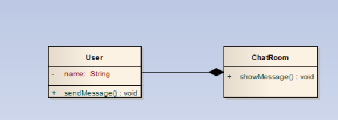

当一个人发消息时，调用User的sendMessage()方法，sendMessage()方法再盗用ChatRoom中的showMessage()方法，这样消息就被显示出来，又保证了两个User之间没有相互引用，有松耦合的特点。

11. 解释器模式

解释器模式主要用于做解释器。定一个语言，定义它的文法表示，并定义一个解释器，这个解释器使用该标识来解释语言中的句子。

类图如下，就不详细说了，不常用：

Expression中的interpret()方法用来对Context进行操作。